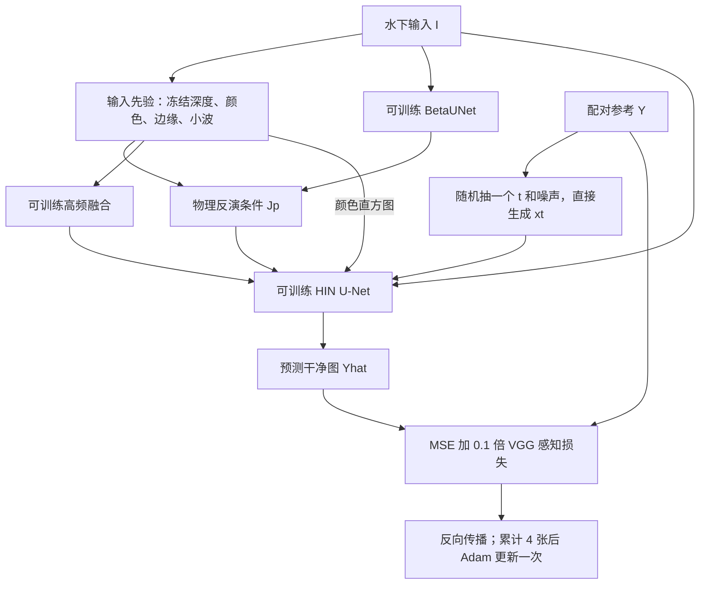

# MPA-Diff-Recon 训练耗时、数学原理、S0–S8 进展与提速分析

记录日期：2026-09-28。运行状态以 **2026-09-28 14:58:55 UTC（北京时间 22:58:55）** 的快照为准；后续训练会继续推进。本文是一次独立的分析记录，不是 S2 完成报告。

项目目录：`/mnt/workspace/uie-prior-utility`。研究需求依据：[CODE_RECONSTRUCTION_ARCHITECTURE.md](/mnt/workspace/CODE_RECONSTRUCTION_ARCHITECTURE.md)。环境依据：[ALIYUN_PPU_SERVER_ENVIRONMENT.md](/mnt/workspace/ALIYUN_PPU_SERVER_ENVIRONMENT.md)。本次分析没有停止训练、改动训练配置、修改模型源代码或替换厂商 PyTorch。

## 1. 先回答你最关心的问题

**目前慢的原因，是较大的训练预算、六次独立训练、频繁且很慢的完整验证，以及尚未充分优化的执行方式共同造成的。约 90 天是现有运行协议的外推结果，不是完成这项研究必然需要的时间。**

| 你的问题 | 根据文档、代码和现场日志得出的回答 |
|---|---|
| 现在训练什么？ | 训练一个把水下退化图像恢复成参考风格图像的条件扩散增强器。更新去噪 U-Net、衰减系数网络和高频融合层，共约 600 万参数。Depth Anything V2 和 VGG19 保持冻结。 |
| UIEB 第一个种子是什么？ | 在固定 UIEB 划分上，使用随机种子 `20260927`，从新初始化的增强器开始进行的第一轮独立训练。后面还有 `20260928`、`20260929` 两轮。数字形似日期，但在程序中只是随机数生成器的整数起点。 |
| 为什么是 400000 步？ | 架构 §2.1 将“Adam、batch4、400000 步”标为论文 p.29 的明确参数；§14.1 将它写入基线配置。它是沿用论文预算，不是根据本机速度、数据规模或收敛实验自动计算出来的。 |
| 必须训练这么久吗？ | 没有证据证明本重建模型必须到 400000 步才有效。保留该预算有助于对齐论文设定；采用更短预算则应建立独立研究配置，并重新设定学习率与比较协议。 |
| 为什么验证这么慢？ | 当前每 5000 次参数更新，对完整验证集逐张执行 1000 次 DDPM 去噪；每个种子共 80 轮。UIEB 一轮约 71 分钟，LSUI 一轮按图数外推约 5.57 小时。 |
| GPU/PPU 不到 50% 是否正常？ | 本次验证阶段的 12 次被动采样平均约 30.7%。batch1、小算子串行和 CPU/设备同步是有代码依据的待验证原因；低利用率不等于没在运行，也不能直接认定硬件性能差。 |
| 能否增大 batch？ | 可以研究。训练优先测试 `micro_batch=4, accumulation=1`，仍保持全局 batch4；验证也应单独实现批量推理。仅修改训练 batch 不会改变当前验证器逐张推理的行为。 |
| S0–S2 完成了吗？ | S0 数据接入和基线数学检查、S1 基线工程验收已有记录；S2 只完成了第一种子的前 10000 次更新，正在第二轮验证。六次正式实验完成数为 **0/6**。 |
| S3–S8 呢？ | 仍是研究计划，A–G 扩展没有完整实现和正式结果。已有数学部件不能等同于完成相关研究方向。 |

对初始实现需要说明：当时优先打通正确的梯度、数据审计和可恢复训练，采用了谨慎的微批大小 1；没有在启动六次长跑前充分优化 PPU 吞吐，也没有把完整验证成本纳入最初的小集计时。**这属于实现和预算评估仍需改进的地方，不能简单归因为“扩散模型本来就要这么久”。**

## 2. 你的研究目标与当前实验的定位

### 2.1 水下图像为什么需要这些先验

水下传播会对不同颜色产生不同程度的吸收和散射。结果常表现为偏蓝偏绿、红色信息衰弱、对比度下降、远处目标模糊；后向散射又会叠加类似雾的低频光。单纯让图像更亮或更锐，并不保证颜色合理，也不保证检测器更容易识别目标。

架构计划先重建 MPA-Diff，再验证 A–G 七个方向：物理场、深度、先验融合、频率表示、采样效率、跨域适配和下游任务。它们对应的研究问题是：**哪些先验在什么场景有用，何时会出错，增强质量是否能转化为更可靠、更高效的视觉任务输入。**

当前运行的 `mpa_diff/` 只建立这个研究的基线。仓库原有的 `uie/` 是其他算法代码，不能把其中的功能算作本次 MPA-Diff-Recon 已交付内容。

### 2.2 为什么叫 Recon，而不是声称严格复现

原始作者测试文件名单、完整训练细节和原模型权重没有全部取得。我们依据架构文件中的论文证据，再补充明确的工程默认值；UIEB/LSUI 采用审计后的内容分组划分。因此，结果应称 **MPA-Diff-Recon**。

本文的来源标签沿用架构文件：

| 标签 | 含义 | 本文如何使用 |
|---|---|---|
| `[T]` | 架构文档标注为原论文明确给出的内容 | 例如 400000 步；本次未重新取得并逐页读取原 PDF，引用的是架构的论文证据表 |
| `[C→D]` | 参考公开实现后采用的重建默认值 | 例如 336×336、1000 个扩散时间点 |
| `[D]` | 为可运行、可复现而选定的设计值 | 例如每 5000 步验证、三个训练种子 |
| `[H]` | 需要实验验证的新假设 | A–G 的收益及组合收益 |
| 实测 / 推算 / 建议 | 本次报告的证据性质 | 日志速度为观测；LSUI 耗时为外推；batch 提速为尚未实测的建议 |

UIEB 的参考图由增强结果筛选得到，并非测量到的“去掉水介质后的真实辐照度”。因此，PSNR/SSIM 上升可以支持“更接近参考”，不能单独证明深度或衰减参数真实，也不能证明检测一定改善。

## 3. 训练到底在训练什么

### 3.1 可训练和冻结的模块

实际参数计数来自 [parameter_groups.json](/mnt/workspace/uie-prior-utility/runs/s2_grouped_v1/uieb/seed_20260927/parameter_groups.json)。

| 模块 | 作用 | 当前可训练参数 |
|---|---|---:|
| `denoiser`：HIN U-Net | 输入带噪图和水下输入条件，预测干净 RGB 图像 | 4,179,843 |
| `beta`：BetaUNet | 由输入图估计每图、每颜色通道的全局有效衰减系数 | 1,803,183 |
| `highfreq`：两层卷积融合 | 将 Sobel 边缘和 Haar 高频转换为可供主干使用的特征 | 12,736 |
| **合计** | Adam 实际更新的参数 | **5,995,762** |
| Depth Anything V2 Small | 提取相对逆深度，提供几何条件 | 0，使用冻结预训练权重 |
| VGG19 特征网络 | 计算输出与参考的感知差异 | 0，使用冻结预训练权重 |
| 直方图、Sobel、Haar、背景光公式、扩散噪声计划 | 固定计算规则 | 0 |

这里的“全局衰减”是**一张图内空间共享的三个值**；不同输入图可以得到不同值。它不是所有训练图共享同一个常数。当前直接光衰减和散射使用同一组三通道系数，后续 A 方向才研究解耦和空间变化。

每个训练种子重新初始化可训练部分。DA/VGG 使用相同的预训练权重，并没有为每个种子重新训练大型深度网络或 VGG。

### 3.2 训练数据如何流动



参考图 `Y` 在训练中用于构造带噪目标和计算损失。**深度、颜色、物理反演等推理条件只读取退化图 `I`，不能读取 `Y`。** 独立推理从随机噪声开始，不需要参考图；评估时参考图仅用于输出完成后的指标计算。

`mpa_diff/priors/provider.py` 将 `xt、I、Jp、插值后的三通道直方图` 拼成 12 通道；Sobel/Haar 经融合后加到主干浅层特征。它目前不是先验注意力路由器，也不是直接预测小波残差的模型。

### 3.3 一个 optimizer step 内部做什么

当前训练器每步执行：

1. 从固定训练名单的打乱顺序中取 1 对图，读取、缩放并送到设备。
2. 读取或生成该输入的深度缓存，计算其他输入先验。
3. 随机抽一个扩散时间点和一个噪声张量，构造带噪参考。
4. 执行一次主去噪器前向，计算像素与感知损失，反向传播 `loss / 4`。
5. 重复上述过程共 4 次，然后进行 **一次 Adam 参数更新**。

所以日志中的 `step=10000` 是 10000 次参数更新，累计消耗约 40000 次训练样本；不是只看了 10000 张不同图，也不是完成了 10000 轮完整数据集遍历。

冻结 VGG 不等于没有 VGG 成本。参考特征不需要反传，但预测图经过 VGG 的分支仍要保留输入梯度，才能把感知误差传回增强器。

主要实现：[训练器](/mnt/workspace/uie-prior-utility/mpa_diff/engine/trainer.py)、[先验与主模型](/mnt/workspace/uie-prior-utility/mpa_diff/priors/provider.py)、[U-Net](/mnt/workspace/uie-prior-utility/mpa_diff/models/unet.py)、[损失](/mnt/workspace/uie-prior-utility/mpa_diff/engine/losses.py)。

## 4. 实验数学原理，以及代码实际采用的近似

### 4.1 物理先验：由退化图构造一个辅助恢复图

一种简化的水下成像模型为：

$$
I_c(x)=J_c(x)t_{D,c}(x)+b_c(x),\qquad
t_{D,c}(x)=e^{-\kappa_{D,c}(x)d(x)},
$$

$$
b_c(x)=A_c(x)\left(1-e^{-\kappa_{B,c}(x)d(x)}\right).
$$

`c` 表示 R/G/B 通道；`d` 是距离或约定的几何坐标；`A` 是背景光；`κD` 控制直接光衰减，`κB` 控制散射增长。给定这些估计量，可构造：

$$
J_p=\operatorname{clip}_{[0,1]}
\left(\frac{I-b}{\max(t_D,10^{-6})}\right).
$$

当前基线选择 `κD=κB=κ(I)`，由 BetaUNet 的 Sigmoid 输出三个值；背景光采用 8bit PIL GaussianBlur，半径为 `(H+W)/2`。`Jp` 是辅助条件，最终输出由扩散模型产生。BetaUNet 通过最终恢复损失联合训练，没有真实衰减标签监督。

必须区分理想物理公式和当前实现：

- DA-V2 输出相对逆深度。当前兼容配置使用其逐图 min-max 归一化值作为物理坐标，即 `thesis_raw_minmax`；它不是米制距离，而且逆深度的方向通常与距离相反。
- 代码另保存 `distance_proxy=1-normalized_inverse_depth`，但当前物理分支默认没有改用这个方向修正字段。B 方向需要独立比较两种选择，不能把现有坐标称为已标定真实深度。
- 当前在 sRGB 上近似使用成像公式；sRGB 不等同于线性辐照度。
- 深度和衰减有尺度歧义，例如 `κd` 不变时透射率不变。单张 RGB 不能唯一确定全部物理量。
- `confidence` 当前主要标记深度数值是否有效，并不是已训练、已校准的不确定性模型。

这些限制不意味着辅助先验完全无用，但意味着不能只凭增强分数就宣称恢复了真实水体参数。实现见 [renderer.py](/mnt/workspace/uie-prior-utility/mpa_diff/physics/renderer.py) 和 [depth.py](/mnt/workspace/uie-prior-utility/mpa_diff/priors/depth.py)。

### 4.2 颜色与高频先验

颜色分支对 RGB 比值取对数，例如 `uR=log(R+ε)-log(G+ε)`、`vR=log(R+ε)-log(B+ε)`，用软核累积三个锚定颜色的二维直方图。默认 64 个 bins、带宽 0.02，归一化后插值成三通道条件。

它描述整图颜色分布。**把颜色直方图插值成 336×336，并不让它具有真实的像素空间对应关系。** 这也是 C 方向需要研究更合适的编码和融合方式的原因之一。

对于一个 `2×2` 块，Haar 变换的约定是：

$$
\begin{bmatrix}a&b\\c&d\end{bmatrix}
\longrightarrow
\left(\frac{a+b+c+d}{2},\frac{a-b+c-d}{2},
\frac{a+b-c-d}{2},\frac{a-b-c+d}{2}\right).
$$

分别得到低频及三个高频子带，逆变换使用同一正交矩阵的转置。基线取 RGB 共 9 个高频通道，加上 3 个 Sobel 边缘通道，经卷积变成 32 通道浅层特征。此时**扩散的目标仍是 RGB 图像**；有 Haar 条件不等于已经实现 S4 的高频残差扩散。

### 4.3 扩散训练：随机抽一个时间点，而不是展开 1000 步

令干净目标 `x0=Y`，扩散时间总数 `T=1000`：

$$
\alpha_t=1-\beta_t^{diff},\qquad
\bar\alpha_t=\prod_{j=1}^{t}\alpha_j,
$$

$$
\epsilon\sim\mathcal N(0,I),\quad t\sim\mathrm{Uniform}\{1,\ldots,T\},\quad
x_t=\sqrt{\bar\alpha_t}Y+\sqrt{1-\bar\alpha_t}\epsilon.
$$

这个公式可以直接生成任意 `t` 的带噪图，无需先从第 1 步逐次加噪到第 `t` 步。模型预测：

$$
\hat Y=f_\theta(x_t,t;\mathcal C(I)),
$$

其中 `C(I)` 是输入图产生的条件。代码数学时间 `t=1…1000` 对应网络索引 `i=t-1`；`t=0` 表示干净边界。

**400000 次训练更新和 1000 个扩散时间点是两种不同的“步”。训练并不是每次更新都进行 1000 次去噪反传。** 多次更新是在不同图像、随机噪声和时间点上学习同一个去噪函数；不是分别训练 1000 个网络。

### 4.4 优化目标：让像素和特征接近参考

当前全有效配对图的损失为：

$$
\mathcal L_{pixel}=\frac1{3HW}\|\hat Y-Y\|_2^2,
$$

$$
\mathcal L_{perceptual}=\frac13\sum_{l\in\{\mathrm{relu1\_2},\mathrm{relu2\_2},\mathrm{relu3\_4}\}}
\operatorname{mean}\left[(\phi_l(\hat Y)-\phi_l(Y))^2\right],
$$

$$
\mathcal L=\mathcal L_{pixel}+0.1\mathcal L_{perceptual}.
$$

VGG 输入经过 ImageNet mean/std 归一化。训练损失前不硬裁剪预测，以免截断越界区域梯度；日志会记录越界比例。训练图无空洞监督，padding 在损失前裁掉。架构计划的任意无效 mask 对应 VGG 感受野腐蚀尚未实现。

Adam 用梯度一阶/二阶移动平均调整参数。当前没有显式物理 cycle 损失、检测损失、路由效用损失或高频残差损失；这些属于后续方向。

### 4.5 推理与验证：1000 次有依赖的串行网络调用

推理从随机 `xT` 开始。每个时间点用同一个网络预测 `x0`，再计算下一状态。DDPM 的均值和方差为：

$$
\mu_t=\frac{\sqrt{\bar\alpha_{t-1}}\beta_t^{diff}}{1-\bar\alpha_t}\hat x_0
+\frac{\sqrt{\alpha_t}(1-\bar\alpha_{t-1})}{1-\bar\alpha_t}x_t,
\qquad
\tilde\beta_t=\frac{1-\bar\alpha_{t-1}}{1-\bar\alpha_t}\beta_t^{diff}.
$$

对 `t>1`，取 `x(t-1)=μt+sqrt(βtilde_t)·z`；最后一步返回预测 `x0`。下一步依赖上一步输出，因此同一张图的 1000 步不能简单一次并行展开；不同图像则可以一起组成 batch。

**先验在每张图推理时计算一次并复用，DA-V2 并没有在这 1000 步中反复运行。** 主要重复部分是去噪 U-Net。验证不反向传播、不更新参数，但仍有大量前向计算。实现见 [diffusion/core.py](/mnt/workspace/uie-prior-utility/mpa_diff/diffusion/core.py)。

## 5. “UIEB 第一个种子”与 step、epoch 的区别

### 5.1 三种随机性要分清

| 名称 | 当前用途 | 是否重新训练模型 |
|---|---|---|
| 数据划分随机种子 | 生成后被冻结为 manifest；当前是内容分组后的划分 | 否；三个训练种子使用同一份划分 |
| 训练随机种子 | 控制新参数初始化、训练图顺序、噪声、时间点和 dropout 等 | 是，每个种子独立训练 |
| 推理采样随机种子 | 控制指定 checkpoint 的初始噪声及 DDPM 逐步噪声 | 否 |

当前队列顺序为 UIEB `20260927 → 20260928 → 20260929`，然后 LSUI 同样三个种子。**第一个 UIEB 种子就是第一轮完整实验，不是第一批图像，也不是 UIEB 的第一个类别。**

三个种子的目的，是估计结果对随机初始化和训练随机性的敏感程度。对三个模型各自的测试集均分 `mi`，汇报：

$$
\bar m=\frac13\sum_{i=1}^{3}m_i,\qquad
s=\sqrt{\frac{\sum_i(m_i-\bar m)^2}{3-1}}.
$$

同一个模型换三个推理噪声种子，不能替代三个独立训练种子。当前实现用对应的 seed 整数也控制验证/测试噪声；将来比较变体应固定对齐的采样策略，不能挑每张图的最佳 seed。设置随机种子和确定性选项有助于复现，但不能自动保证所有厂商算子跨硬件逐位相同。

### 5.2 400000 步对应看了多少数据

全局 batch 为 4，每轮完整实验处理：

$$
400000\times4=1600000\ \text{次训练图像样本}.
$$

| 数据集 | 训练 / 验证 / 测试 | 400000 步的等效训练集遍历次数 |
|---|---|---:|
| UIEB | 702 / 91 / 97 | `1600000 / 702 ≈ 2279.2` |
| LSUI | 3423 / 429 / 427 | `1600000 / 3423 ≈ 467.4` |

这里是“等效 epoch”，代码实际按 step 停止。每遍重新打乱训练顺序，每次可抽到不同的噪声、时间点和 dropout，因此再次看到同一图像也不是完全相同的训练输入。但这不保证不存在过拟合；当前也没有自动早停。

六次实验合计是 240 万次参数更新、960 万次训练样本。虽然 UIEB/LSUI 的每轮更新数相同，UIEB 的每张图被重复使用更多，二者的验证开销也很不同。

## 6. 400000 以及其他关键参数究竟从哪里来

### 6.1 参数溯源

| 参数 | 当前值 | 来源与性质 |
|---|---:|---|
| 总训练更新数 | 400000 / seed / dataset | 架构 §2.1，论文 p.29 `[T]`；§14.1 配置落地 |
| 优化器、全局 batch | Adam、4 | 同上 `[T]` |
| 初始 / 最终学习率 | `1e-4 / 1e-6` | 架构论文证据 `[T]` |
| 衰减从何时开始、如何衰减 | 200000 起，线性下降 | 架构 §4.5 `[D]`，论文只给“后期到 1e-6” |
| 微批 / 累积 | 1 / 4 | 架构 §14.1 `[D]`，实际执行选择，不是论文明确的显存最优方案 |
| 图像尺寸 | 336×336 Resize | SeaDiff 代码参考后作为 `[C→D]` |
| 扩散时间点 | 1000 | SeaDiff 代码参考 `[C→D]`，不是已知 MPA 论文明确值 |
| 噪声计划 | 线性 `1e-6 → 0.02` | 同上 `[C→D]` |
| 主验证采样器 | DDPM、1000 次网络调用 | 重建基准选择 `[D]` |
| 验证频率 | 每 5000 次更新 | 架构 §4.5、§14.1 `[D]` |
| 种子数量 | 每数据集至少 3 个 | 架构 §15.3 `[D]`；不是论文已知要求 |
| UIEB / LSUI 分开训练 | 两套独立模型，每套三次 | 架构 §4.5 重建默认；原论文具体训练组合存在缺失 |
| 精度 / EMA / 图像增强 | float32 / 无 / 无额外增强 | 基线默认；不是 PPU 调优得到的唯一正确值 |

直接证据：[架构论文训练证据](/mnt/workspace/CODE_RECONSTRUCTION_ARCHITECTURE.md:83)、[训练默认](/mnt/workspace/CODE_RECONSTRUCTION_ARCHITECTURE.md:339)、[配置中的预算](/mnt/workspace/CODE_RECONSTRUCTION_ARCHITECTURE.md:1020)、[三种子要求](/mnt/workspace/CODE_RECONSTRUCTION_ARCHITECTURE.md:1111)、[实际解析配置](/mnt/workspace/uie-prior-utility/runs/s2_grouped_v1/uieb/seed_20260927/resolved_config.json)。

### 6.2 能否从数学上推导“必须 400000”

不能。扩散训练是在期望损失上随机优化，公式没有给出“这个数据集恰好需要 400000 次更新”的普适结论。是否足够或过多，取决于模型、数据、学习率、有效 batch、噪声计划及验证曲线。

当前只有一个完成的正式验证点，尚不足以判断质量何时趋稳。因此既不能证明必须跑满 400000，也不能承诺改成 50000 就能达到相同质量。400000 的合理解释是“论文预算对齐的基线设定”，不是“已经在本机验证的最佳预算”。

### 6.3 改成较短预算时要同时改什么

可另设例如 50000 或 100000 步的研究试跑，用固定验证集观察提升趋势。这是建议预算，不是已经验证的收敛点。需要同时规定学习率衰减起点、验证频率、采样器和比较对象。

只把 `total_steps` 改为 50000，而保留 `decay_start=200000`，既不满足当前配置约束，也不会得到预期的后半程衰减。短预算通常需要按选定日程提前衰减，并明确它与论文预算实验不同。

试跑可以先使用一个训练种子筛查实现或候选路线；正式研究结论仍应按预先确定的多种子协议补齐。不要用测试集决定停在哪一步，也不要将短预算结果写成完整 400000 步复现。

## 7. 耗时拆解：时间具体花在哪里

### 7.1 现场观测与推算方法

本次状态快照记录：第一轮 UIEB 训练到第 10000 步，最近 1000 步的日志平均耗时 **0.79736 秒/更新**。第 5000 步的验证已结束，第二轮验证正在进行。

第一轮验证没有独立的计时字段。此前 ETA 记录通过训练起始时间、5000 步 checkpoint 保存时间和累计训练计时，扣除估计的步外开销，得到 **4257.17 秒，约 70.95 分钟**。这一估值仍包含少量保存和报告等开销，不能当作精确独立的模型延迟测量。

按 UIEB 的 91 张验证图折算，约 **46.78 秒/图**。LSUI 暂时没有整轮验证实测，只能在相同尺寸、同一模型和采样协议下按图数外推。以下表格为方便与旧 ETA 核对，统一沿用其约 `0.79773 秒/更新` 的含小量步外开销估计。

### 7.2 每个种子的训练、验证和测试预算

设总更新数为 `S`，每次更新耗时为 `u`，验证间隔为 `K`，验证图数为 `V`，测试图数为 `Q`，等效单图推理时间为 `p`：

$$
T_{run}\approx S u+\frac{S}{K}Vp+Qp+T_{startup/save}.
$$

本次 `S=400000`、`K=5000`，所以每个种子验证 **80 轮**；最终用验证选出的最佳权重测试一次。

| 完整单种子预算 | UIEB | LSUI（验证/测试为外推） |
|---|---:|---:|
| 参数更新 | 400000 | 400000 |
| 纯训练时间 | 88.64 小时 | 88.64 小时 |
| 验证集张数 | 91 | 429 |
| 每轮验证 | 70.95 分钟 | 334.49 分钟，约 5.57 小时 |
| 80 轮累计验证 | 94.60 小时 | 445.99 小时 |
| 最终测试 | 1.26 小时 | 5.55 小时 |
| **总计** | **约 7.69 天** | **约 22.51 天** |

UIEB 每训练约 66.5 分钟，就进入约 71 分钟的验证；LSUI 若保持同样配置，则每训练约 66.5 分钟，就进入约 334.5 分钟的验证。这解释了为什么“训练日志每步不到一秒”，总工期却仍然很长。

### 7.3 六次实验一共要做多少次去噪

验证图像累计处理次数为：

$$
3\times80\times(91+429)=124800.
$$

每张图 1000 次去噪器调用，共 **1.248 亿次验证去噪器调用**。最终测试还有：

$$
3\times(97+427)=1572\ \text{张},
$$

即 157.2 万次去噪器调用。验证与测试合计约 **1.26372 亿次**。这是当前 batch1 下的网络调用计数，不是 FLOPs；训练还有反向传播、VGG 和先验成本，不能直接把调用次数比当作耗时比。

完整六次预算约为：

| 部分 | 时间外推 | 占比 |
|---|---:|---:|
| 训练更新 | 22.16 天 | 24.5% |
| 验证和最终测试 | 68.43 天 | 75.5% |
| 合计 | 90.58 天 | 100% |

这是完整六次从头计算的量。旧 [S2 ETA 报告](/mnt/workspace/uie-prior-utility/docs/experiments/S2_ETA_20260928T140137Z.md) 中的 **90.47 天** 是在 14:01 已跑了一部分之后的剩余时间估计，两者口径不同，数值并不矛盾。75–106 天只是针对速度变化的情景区间，不是统计置信区间，也未覆盖停机或失败重跑。

### 7.4 为什么之前的小集估算只有约 72 小时

S1 的 336×336 小集预检测得 100 个稳定更新平均约 0.65089 秒，计算 `400000×0.65089/3600≈72.32 小时`。该文件明确排除了验证、最终测试和其他种子，而且是在较小、容易命中缓存的数据集上测得。

正式数据当前约 0.797 秒/更新，纯训练本身已接近 88.6 小时；再加完整 DDPM 验证，总时间明显增大。小集速度变化可能与缓存、数据读取和运行条件有关，现有计时没有逐项分解，不能把差异精确归于某一个原因。

架构 §16.4 原本就要求将验证、预处理和其他实验成本纳入预算。初期只用稳定训练步数外推，不能作为正式六次实验的完整工期承诺。

### 7.5 为什么训练加速两倍也可能仍要接近 80 天

若某部分占比为 `f`，加速倍数为 `r`，总体耗时比例约为 `(1-f)+f/r`。以下只是算术情景，**没有实际测出这些提速倍数**：

| 假设的执行优化 | 完整六次预计时间 |
|---|---:|
| 当前估计 | 90.58 天 |
| 仅训练速度提高到 2 倍 | 79.50 天 |
| 仅验证/测试速度提高到 2 倍 | 56.37 天 |
| 两部分均提高到 2 倍 | 45.29 天 |
| 训练 2 倍、验证/测试 4 倍 | 28.19 天 |

这组计算说明应优先关注验证成本，而不是承诺某个 batch 一定达到表中速度。DDIM、降低验证频率等会改变部分协议，不能直接与纯执行优化混为一谈。

## 8. PPU 利用率低于 50%：已知什么，还不知道什么

### 8.1 本次只读采样

硬件是 **PPU-ZW810E**，通过 `torch.cuda` 接口使用；不能因为接口名包含 CUDA，就按普通 NVIDIA 环境替换依赖。厂商 PyTorch 为 `2.0.0a0+nv2303`，NumPy 为 `1.23.5`。

2026-09-28 **14:58:17–14:58:42 UTC**，在第 10000 步后的验证阶段，使用 PPU-SMI 做了 12 次被动采样：

| 观测量 | 结果 | 能说明什么 |
|---|---|---|
| `utilization.ppu` | 20%–52%，均值 30.67% | 该短窗口存在较多没有执行设备 kernel 的时段 |
| 已用显存 | 1730 MiB / 49142 MiB，约 3.52% | 当前验证 batch1 的显存占用较小；不代表训练峰值 |
| `utilization.core` | 2%–100%，波动较大 | 与设备活跃时间不是同一个统计量，不能互换解释 |
| 板卡功耗 | 约 133–139 W | 当前负载观测，不能单独据此推导理论算力利用率 |

PPU-SMI 对 `utilization.ppu` 的定义是采样周期内至少一个 kernel 在运行的时间比例；它不是“已达到峰值 FLOPs 的百分比”。显存使用百分比更不是计算利用率。

本次窗口不覆盖一个完整训练周期，不能据此断言所有训练时段都只有 30.7%。进程当时仍存活、有设备工作；训练 log 不增长是因为验证不增加 optimizer step，而不是已经证明程序卡死。

### 8.2 代码中可确认的潜在瓶颈

| 发现 | 证据与影响 | 当前结论边界 |
|---|---|---|
| 验证固定 batch1 | `evaluate_rows` 对每行单独加载并 `unsqueeze`，然后完整采样 | 明确限制跨图并行；提速倍数待测 |
| 每图 1000 步串行 U-Net | `sample` 是 Python 时间循环，下一状态依赖前一状态 | 明确产生高 NFE 和大量算子调度 |
| 网络由较多小操作组成 | 约 600 万可训练参数；HIN、卷积、激活、跳接等 | batch1 可能难以充分占用设备；需 profiler 定量归因 |
| 训练微批 1、累积 4 次 | 每次更新分四轮前向/反向 | 保持数学 batch 的同时，牺牲了一部分并行机会 |
| 主进程串行加载图像 | 训练循环直接 PIL 读图、缩放、stack、送设备 | 没有 DataLoader 预取或异步数据流水线 |
| 设备与 CPU 往返 | 深度缓存键把图复制回 CPU 计算内容哈希；背景光也回 CPU 用 PIL | 明确存在传输/同步；占比尚未单独计时 |
| 每图读压缩深度缓存 | NPZ 解压后送设备；无内存 LRU | 减少 DA 重算，但引入文件和解压开销 |
| 训练中多次同步 | step 边界同步、`.item()`、loss 有限性判断、逐参数梯度有限性判断 | 减少 CPU 与设备工作的重叠；应测后合并检查 |
| 线程设置较保守 | 启动脚本/运行配置使用 2 个计算线程 | 需要按 CPU、库及设备后端实测，不是线程越多越快 |

这里有两个不同层次的问题：**重复验证次数和 NFE 决定要做多少工作；batch、缓存、同步和数据流水线决定做这些工作的速度。** 两者都需要优化。

缓存目前只保存无损 float32 原始深度和有效 mask，其余静态先验重算，目的是控制磁盘占用。模型推理时也没有在 1000 次循环内重复构造所有先验，因此“深度网络每步跑 1000 次”不是当前慢的原因。

相应源码：[缓存](/mnt/workspace/uie-prior-utility/mpa_diff/data/cache.py)、[背景与先验数学核](/mnt/workspace/uie-prior-utility/mpa_diff/priors/kernels.py)、[评估器](/mnt/workspace/uie-prior-utility/mpa_diff/engine/evaluator.py)。

### 8.3 尚未进行的验证

本次没有占用同一块 PPU 再启动压力测试，因此没有得到训练 batch2/4 的峰值显存和吞吐，也没有得到验证 batch4/8 的质量等价或实际提速数字。报告中的瓶颈判断结合代码和被动观察；若要确认耗时占比，应在独立性能测试窗口分别计时读取、先验、去噪、VGG、反传和同步。

还不能仅凭低利用率确定磁盘是瓶颈、某个厂商算子回退到 CPU，或 AMP 一定可用。这些都需要测量。

## 9. batch 能不能改，怎么改才有意义

### 9.1 先保持全局 batch4，提高单次计算量

单卡情况下：

$$
B_{effective}=B_{micro}\times A_{accumulation}.
$$

| 方案 | micro batch | 累积次数 | 全局 batch | 含义 |
|---|---:|---:|---:|---|
| 当前 | 1 | 4 | 4 | 每张图依次做前向/反向，四张后更新 |
| 候选一 | 2 | 2 | 4 | 两张一起计算，重复两次后更新 |
| 候选二 | 4 | 1 | 4 | 四张一起计算，一次前向/反向后更新 |
| 更大的训练 batch | 8 | 1 | 8 | 改变训练的统计和样本预算 |
| 更大的训练 batch | 16 | 1 | 16 | 同上，不能视为等价加速 |

对于逐样本可分离的损失，在完全相同样本和随机量条件下，四张的平均梯度为：

$$
g=\frac14\sum_{i=1}^{4}\nabla_\theta\mathcal L_i.
$$

一次四张或四次一张累积，在实数算术下可以实现这个相同目标。当前 HIN 使用逐图 InstanceNorm，深度归一化也按图计算，没有 BatchNorm 那样必然依赖同批其他样本的统计，这是尝试此优化的有利条件。

但**不能承诺逐位等价**：浮点归约顺序会变；当前 RNG 调用先后会随微批拆分改变；dropout、噪声及时间点的具体抽样也可能改变。应检查同样随机输入下输出/梯度误差，再跑受控短程，保存新版本和迁移来源。

四张并行通常需要更多激活显存，训练还要保存反传和 VGG 的中间状态。不能从验证只占 1.7 GiB 就直接计算“最大能跑多少 batch”。也不能承诺 micro batch 从 1 到 4 后速度必定提高 4 倍，因为 CPU 先验、文件读取及部分逐图循环仍存在。

### 9.2 直接把全局 batch4 改为 16，会改变什么

若仍跑 400000 更新，训练样本暴露量从 160 万变为 **640 万/种子**，工作总量反而增加。更大 batch 可能降低每图开销，却不自动缩短固定 step 的总耗时。

若为了保持 160 万次样本，把 batch16 的更新数缩短为 100000，则 Adam 更新次数、梯度噪声、学习率日程和验证位置都改变。它不等价于 batch4 的 400000 步；学习率也不能未经验证就机械线性放大。

所以，当前首先值得测试的是 **micro batch2×2 或 4×1**。全局 batch8/16 应单列为训练设置实验，比较固定样本量、固定时间或固定更新预算，明确采用哪一种公平口径。

### 9.3 验证 batch 必须单独实现和测量

当前评估器没有 `eval_batch_size` 的有效批处理实现。修改训练 YAML 的 `micro_batch`，**不会改变验证速度**。

可将不同图像一起送入相同网络，在每个 DDPM 时间点批量计算。例如同时处理 4 张图，仍然执行 1000 个有序时间点，但每个时间点处理 4 张。它改善跨图吞吐，不会让一张图的 1000 个依赖步骤变成并行。

正确实现需要：

1. 保持 resize、padding、逐图先验和指标归约与当前协议一致。
2. 保留逐图输出与 `sample_id` 的对应，处理最后不足整批的图像。
3. 检查输出、PSNR/SSIM、NFE 和显存，并分别报告批吞吐与单图延迟。
4. 保持可比较的随机噪声流。当前 `enhance` 每张图重新用同一 seed 创建 generator；直接对整批随机抽噪声会改变各图的噪声序列。要对照旧结果，须控制每张图初始噪声以及 **每一个 DDPM 时间点的噪声**，仅固定初始噪声还不够。

批量评估不更新权重，通常是优先考虑的执行优化，但如果改变了随机策略和验证排名，就可能改变最终选择的 checkpoint，需要如实记录。

## 10. 其他提速方法及其对实验含义的影响

| 方法 | 主要节省哪里 | 是否影响原协议/数值 | 建议 |
|---|---|---|---|
| 训练 micro4×accum1 | 训练算子利用率与调度 | 目标 batch 不变，随机顺序/浮点可能变 | 优先实测 micro2、micro4 |
| 验证批量推理 | 占比最大的验证和测试 | 控制逐图噪声后可尽量保持语义 | 优先实现、核对和测量 |
| CPU 数据预取、可用时 pinned memory/异步传输 | 读取与传输空隙 | 保持顺序及变换时可作为执行优化 | 厂商后端能力需验证 |
| 内存缓存已解码图和静态先验 | 重复读取、解压、PIL 背景处理 | 缓存键、尺寸、颜色处理必须一致 | 在 RAM 和磁盘预算内选择 |
| 从 CPU 原图计算缓存键 | 避免先上设备再复制回 CPU | 保留等价哈希输入 | 有针对性的工程优化 |
| 合并有限性检查和日志归约 | 减少 CPU/设备同步 | 保留错误检测，不直接删掉检查 | 先 profiler，后等价验证 |
| 更少次完整验证 | 验证总次数 | 改变模型选择候选集合 | 新协议，例如更稀疏完整验证 |
| 固定验证子集作中间观察 | 每轮验证图数 | 排名方差更大，可能偏离全验证 | 子集事先固定，不能事后挑图 |
| DDIM 少步采样 | 去噪 NFE | 改变生成路径，质量和最佳模型可能变化 | 同一 checkpoint 做验证曲线后决定 |
| 更短训练预算 | 更新、验证总量 | 改变训练日程和论文预算对齐 | 独立试跑，保留预算对照 |
| AMP / channels-last / 算子优化 | 单次计算和内存 | 可能改变数值及后端支持 | 需厂商环境实测，保持 torch 不变 |
| 降低分辨率 | 每步计算量 | 改变任务难度、细节与指标条件 | 可作试跑，不冒充 336 基线 |

### 10.1 DDIM50 不等于把训练扩散总步数改为 50

当前代码已经有 DDIM 数学路径，可在训练的 1000 点噪声日程中选一个更稀疏的推理网格。**训练时间点数量 `diffusion.train_steps`、推理调用数 `sampler.steps`、参数更新数 `train.total_steps` 是三个不同参数。**

DDIM100/50/20 可以先在同一 checkpoint 和固定验证样本上比较质量、耗时和失败例。以 50 次代替 1000 次，去噪器调用数减少到 1/20，但端到端还有先验、I/O 和指标开销，不能保证整轮验证加速 20 倍，也不能保证质量相同。

当前 DDPM 实现明确要求遍历完整训练时间点；不能把 DDPM 的 `steps` 直接改成 50 就声称实现少步采样。DPM-Solver++、UniPC 和蒸馏学生尚未实现。

如果用 DDIM 选最佳 checkpoint，再用 DDPM 做最终测试，必须明确这种模型选择协议；不能将其默认为与原 DDPM 验证完全一致。早期 checkpoint 可以用于工程诊断，但不能替代 S5 所要求的已验证教师。

### 10.2 验证频率本身也值得重新设计

每 5000 步完整验证是 `[D]`，不是数学约束。新研究协议可以先定义少量固定样本的快速监测，再在较稀疏的步数或预定候选点完整验证，最终测试一次。

代价是可能错过两个完整验证点之间的最佳权重，快速子集也可能有排名偏差。需要在运行前固定规则、保存可追溯 checkpoint，所有比较方法采用相同选择预算。不能用测试集充当快速验证，也不能事后只补对自己有利的 checkpoint。

### 10.3 为什么本次没有直接改正在运行的 YAML

配置在进程启动时读入，改文件不会自动改变当前内存中的模型或训练循环。队列还冻结了源代码、配置和数据清单；断点恢复会检查训练配置与源代码哈希。

因此，提速落地需要带版本的新运行方案：记录父 checkpoint，验证迁移是否保留 optimizer、学习率、RNG 和数据顺序，并使用新输出目录。不能修改保存的哈希来绕过检查，也不能把改变训练日程的实验接在旧报告里当作同一实验。

这是一项工程实现和实验身份管理工作，不需要替换厂商 PyTorch。本次请求是解释和报告，因此本次只保存分析，未对活跃训练执行上述改动。

## 11. S0 到 S8：每一部分到底要完成什么

S0–S8 是**研究交付阶段**，不是 9 个 epoch，也不是网络的 9 层。当前后台队列只负责 S2 的六次配对基线训练和测试，不会在它们结束后自动生成 A–G 算法。

| 阶段 | 主要问题 | 应交付内容 | 当前状态 |
|---|---|---|---|
| S0 数据与数学基础 | 数据可信、公式实现正确吗？ | 配对清单、分组审计、缓存、数学与协议测试 | 基线核心已完成，扩展所需能力未全部完成 |
| S1 主基线 | 模型是否能训练、推理和恢复？ | MPA-Diff-Recon、真实先验、小集拟合、断点恢复 | 基线工程已验证，有明确功能边界 |
| S2 基线全实验 | 基线质量、稳定性和成本是多少？ | UIEB/LSUI 多种子、逐图指标、失败例、统计与对照 | 第一轮 UIEB 进行中，0/6 完成 |
| S3 A/B/C | 物理、深度和先验融合怎样改进？ | 三个方向分别实现、单因素消融、污染/缺失测试 | 扩展尚未实现 |
| S4 D | 是否应只生成高频残差，是否利用相位？ | coarse、HF 残差扩散、相位分支、低频误差上限 | 尚未实现 |
| S5 E | 怎样减少推理成本？ | 采样曲线、求解器、蒸馏/潜空间等独立路线 | 有基础 DDIM；完整阶段未完成 |
| S6 F | 能否跨域并安全适配？ | DG、UDA、专家、TTA 分开评测及回滚 | 尚未实现 |
| S7 G | 增强是否帮助机器人视觉任务？ | 任务标签/适配器、G0–G4、第二后端、任务指标 | 尚未实现，部分数据已下载 |
| S8 组合 | 独立有效模块组合后仍有效吗？ | 同预算组合、逐项增量、交互和负结果 | 尚未实现 |

以下按照架构 §14.3、§16 和各方向章节展开，不能把“计划中应有”读成“当前代码已有”。

### 11.1 S0：数据与数学内核

**目标：训练前先排除配错图、泄漏和公式错误。**

需要固定输入/参考路径、样本 ID、split、内容哈希和已知场景组；检查文件损坏、尺寸配对、重复与近重复图。相关样本应放在同一划分，不能为了凑论文数量而拆开。缓存必须记录输入变换、权重与坐标语义，条件只来自输入。

数学验收包括 Haar 手算和往返、成像正反演边界及有限梯度、深度方向和常数图处理、扩散参数化转换、独立指标对照、奇数尺寸和 batch1/4。合成样例只验证工程；后续 A/B 还需要带已知参数、有效 mask 和可审计生成过程的完整合成退化能力。

**当前已有：** UIEB/LSUI 全量配对、内容分组名单、无损深度缓存、24 项基线测试及合成 smoke。**当前边界：** 内容分组是基于图像的推断，不保证找出所有未知视频场景；扩展需要的完整模拟器和所有未来测试不在这 24 项内。

### 11.2 S1：重建一个真正能学习的基线

**目标：确认数据、先验、损失和梯度链路都能工作。**

需要冻结合法 DA/VGG 权重，实现 BetaUNet、HIN U-Net、颜色/高频/物理条件、DDPM/DDIM、训练/独立推理/评估入口；在 8–16 张配对小集上明显降低训练误差，证明断点恢复能保留状态，并检查推理不依赖参考图。

**当前已有：** 上述基线路径、小集拟合、CPU 数学测试、PPU 正式尺寸短跑和恢复测试。**不能推出：** 小集误差下降不代表泛化，也不代表原论文绝对数值已复现；任意缺失区域的 VGG mask 传播等完整规格仍缺失。

### 11.3 S2：取得可比较的真实基线

**目标：得到后续 A–G 能够可靠比较的参照。**

需要固定划分、预处理、训练预算、采样、模型选择和种子；分别训练 UIEB/LSUI，每个数据集至少三个独立训练种子。每个模型按验证集选 checkpoint，再对隔离测试集导出逐图指标、失败例和成本，报告种子均值与样本标准差。

全面满足框架的评测与对照还包括：审核所需指标、无参考数据评测、相同协议下的方法对照、场景分组统计，以及 M0/M1 最小消融矩阵。M0 比较无先验/物理/颜色/高频/完整；M1 检查 HIN 范围、VGG、beta 联合或冻结、深度方向等补全选择的敏感性。论文噪声替代式消融须独立命名、逐变体重训；测试时临时拔掉模块不等同于完成训练消融。

**当前六次队列只覆盖完整基线的三种子配对实验。** 它没有包含上述全部消融和指标；目前更没有跑完六次。原作者名单缺失时可以完成重建实验，但不能把它命名为原划分上的严格复现。

### 11.4 S3：A、B、C 分别建立独立证据

这三个方向先分别与基线比较，不应一次全部叠加后只给一个总分。

**A：空间退化场及衰减/散射解耦。** 从 A0 共享全局系数，依次到 A1 分开全局 `κD/κB`、A2 加低分辨率空间残差、A3 再学习空间背景光。使用恢复损失、物理重投影、TV 和残差锚定约束；只有存在合法参数真值时才加入参数监督：

$$
\mathcal L_A=\mathcal L_{base}+\lambda_{phy}\|\mathcal F(\hat Y,d,\kappa_D,\kappa_B,A)-I\|_1
+\lambda_{tv}\mathrm{TV}(\Delta)+\lambda_{anchor}\|\Delta\|_1+\lambda_{sup}\mathcal L_{fieldGT}.
$$

验收不仅看 PSNR，还要看场是否退化成零、cycle 降低是否伴随图像质量下降、有真值时参数是否正确。空间自由度越多不一定越好。当前 renderer 和 A0 类基线存在，但 A1–A3 训练头、对应损失和消融没有实现。

**B：深度方向、适配、标定与可靠性。** 比较 raw min-max、距离代理、水下适配器、合法稀疏测距/传感器标定、不确定性权重和额外真值上限。米制监督下可用对数距离误差的高斯负对数似然：

$$
\mathcal L_{NLL}=\frac12\operatorname{mean}_M\left[(u-u^*)^2e^{-s}+s\right],
\quad u=\log d,\ s=\log\sigma_u^2.
$$

这里必须保留 `+s`，否则模型可无限放大不确定性逃避误差。无深度标签时，翻转/尺度预测分歧只能称代理，不能称已校准概率。需要深度次序/误差、risk-coverage 和增强质量分别验收；不能用测试真值在线校准。

Atlantis/DIODE 等可为适配或几何提供数据，但合成水下外观不等于真实水下米制测量。当前 DA 适配接口、方向字段和有效性 mask 存在；完整 B 适配器与可靠性校准不存在。

**C：能拒绝错误先验的路由。** 对物理、颜色和频率条件分别编码，用时间相关的注意力/门控注入，提供 null 分支。概念形式为：

$$
F'=F+\sum_k g_k A_k,\qquad
g=\operatorname{softmax}(a+\log(q+\epsilon)).
$$

无效分支必须真正屏蔽；全部先验无效时能回退到原特征，不能全 mask 后出现 NaN。比较普通拼接、等参数卷积、注意力、门控、可靠性及 null，测试先验加噪、错配、打乱和缺失。

“可靠”不等于“对增强有用”，门控图也不是因果证明。若用参考图构造效用标签，只能在训练集用冻结教师计算，推理不能读取参考。额外添加路由与替换原拼接应分成两个配置。当前没有 C 的完整编码器、注意力、效用监督和消融。

### 11.5 S4：D1 高频残差扩散与 D2 相位条件

**目标：把整体颜色/亮度恢复与细节生成分开研究。**

D1 先训练确定性的粗增强器 `Jc=fcoarse(I)`，冻结后做 Haar 分解，并在训练集估计高频残差统计：

$$
(L_c,H_c)=W(J_c),\quad(L_Y,H_Y)=W(Y),\quad
r_H=H_Y-H_c,
$$

$$
\hat Y=W^{-1}(L_c,H_c+\hat r_H).
$$

扩散网络此时预测标准化的 9 通道高频残差，不再是基线 3 通道 RGB。它不能直接加载 RGB checkpoint 假装表示兼容；残差也不能按 RGB 的 `[0,1]` 范围裁剪。

架构给的初始预算为 **coarse 100000 步、HF 200000 步、可选联合微调 20000 步**，均为 `[D]`。所以不是 S0–S8 每个阶段都机械训练 400000 步。

正交 Haar 且无最终裁剪时：

$$
\|\hat Y-Y\|_2^2=\|L_c-L_Y\|_2^2+\|H_c+\hat r_H-H_Y\|_2^2.
$$

这说明只改高频不能修复粗恢复的低频偏色。必须比较 coarse-only、确定性 HF、HF 扩散、低频+高频扩散和 RGB 扩散。9 个半分辨率高频通道的元素数是 RGB 的 **3/4**，不是 1/4，端到端速度还要计入 coarse 和逆变换。

D2 单独研究 FFT 单位相位等结构条件，处理相位周期、低幅度不稳定及相位回空间表示，并与普通空间结构特征比较。**当前只实现了基线 Haar/Sobel 条件，D1/D2 都没有完成。**

### 11.6 S5：E 的少步采样、蒸馏与不同表示

**目标：给出经过测量的质量—成本曲线，而不是只报“采样步数更少”。**

需要分别实现和评估：

| 路线 | 需要完成的内容 |
|---|---|
| 不重训的求解器 | 同一 checkpoint 比较 DDPM、DDIM、DPM-Solver++、UniPC；核对 x0/噪声预测转换、时标和实际 NFE，比较 100/50/20/10/4 等预算 |
| Progressive Distillation | 冻结教师，把两步教师轨迹压到一步学生；推导并验证目标、逐级蒸馏并记录教师总成本 |
| Consistency Distillation | 明确 VP/VE 噪声坐标转换、边界条件、目标 EMA 和学生训练；不能只换名字复用普通去噪损失 |
| prior latent | 在先验表示空间生成，说明先验编码/解码目标与推理依赖 |
| image latent | 独立训练/冻结图像 codec，报告压缩重建上限、表示统计和解码成本；AE 不冒称 VAE |
| image residual | 学习相对粗输出的图像残差，明确与 RGB 或小波残差 checkpoint 的不兼容 |

效率验收应包含深度、颜色、物理场、coarse、全部网络调用和解码，而不是只测去噪器。架构 §11.6 规定固定 batch1、256²/512²/原生 1080p、20 次预热和 100 次计时，报告 median/p95、FPS、峰值显存、参数与 MACs/FLOPs 口径；不支持的分辨率诚实记录。

当前 `benchmark.py` 默认只预热 1 次、计时 3 次，主要报告均值和峰值显存，**不满足完整效率规格**。基础 DDIM 可调用，但正式质量—速度对照、DPM/UniPC 和蒸馏/latent 学生未完成。学生少步效果差时应保留负结果，不能用教师质量填学生表。

### 11.7 S6：F 的域泛化、域适应、专家和 TTA

**目标：避免模型只在已见数据分布上有效，同时明确允许使用的信息。**

| 设置 | 可用数据 | 测试时更新 |
|---|---|---|
| DG | 只用源域训练/调参，目标域不可见 | 否 |
| UDA | 源域加独立无标签目标训练池，目标测试隔离 | 通常否 |
| TTA | 当前或历史测试输入，无测试标签 | 是，白名单和边界预先固定 |

F 包括水体条件编码、特征级专家路由、域对抗和对比等独立对照。数据集 ID 只能算域代理，没有海域/水体元数据就不能称真实水体分类。内容表征可做域不变约束，水体 token 则保留域信息，不能对同一向量同时要求两种相反目标。

TTA 应使用已验证的少步可微路径，固定源输出作为锚定，只更新 router/adapter 白名单，支持逐图或逐序列 reset、异常回滚，记录额外 NFE/时间和损害率。RGB 回归不是分类概率，不能直接对 RGB softmax 套分类熵；HIN 也不能冒充有运行统计的 BatchNorm。

验收要证明没有测试标签参与更新或回滚判断，其他参数不变，下一 episode 不受前一张图污染。**当前 F 全部正式路径未实现。**

### 11.8 S7：G 的任务收益与机器人评测

**目标：确认增强是否真正改善检测等下游任务。**

有真实任务标签时，可用 `LUIE + λdet Ldet(D(Yhat), boxes, classes)`；检测器参数冻结时，仍需保留增强图输入的梯度。只对预测图 `detach` 后送检测器，不能训练增强器。AP/NMS 是评测/后处理，不能直接当普通可微损失。

配对增强图和检测图若不是同一图，不能把任意清晰图当检测图的参考。尤其基线随机时间训练要用 `Y` 构造噪声，只有框而没有 `Y` 的图不能直接使用同一训练路径；需要确定性 coarse、已验收的短采样链，或明确的伪参考方案。

| 协议 | 必做比较的含义 |
|---|---|
| G0 | 在 raw 上训练并测试的原视觉系统 |
| G1 | 固定 G0 检测器，仅把测试输入换成增强图，测插件效果 |
| G2 | 各方法增强训练图后，用相同初始化/预算重训检测器，测适配系统收益 |
| G3 | raw 与 enhanced 混合训练，控制总采样预算，测训练扩充收益 |
| G4 | 可选联合训练增强器与检测器，单独命名并独立测试 |

需要 AP50、AP@[0.50:0.95]、每类 AP、小目标召回、误检漏检、框变换校验，以及未参与优化的第二检测器迁移验证。G1/G2 不能混在同一排行榜；漂亮的增强图不能代替 mAP 证据。

分割可作为有标签的可选扩展。视觉里程计/SLAM 需要实际序列、标定和轨迹真值，单图特征匹配数不等于轨迹精度。当前 RUIE 任务数据有 300 张图、299 份 XML，缺的一份不能推断为空背景；下载成功不等于完成 G。

### 11.9 S8：有证据之后再组合

**目标：检验模块之间的相互作用，而不是把所有模块打开就认为更先进。**

架构建议先 B+C，再加入 D1、E，按需后接 F/G。需统一表示、条件接口、冻结顺序、预算和种子；每次只增加清楚的一项，记录增益、失败分组和额外成本。

独立有效的两个模块可能组合后冲突，例如路由拒绝某先验、高频路径受低频误差限制、少步学生改变任务梯度或 TTA 条件。最终选择应依据同预算证据，不要求 A–G 全部进入最终模型。当前没有组合实验。

## 12. 当前 S0–S2 的实际完成情况与证据

### 12.1 S0：数据齐了，基线检查已通过

UIEB 输入和参考各 890 张，LSUI 输入和 GT 各 4279 张，归档完整性与图像配对检查已通过。UIEB 发现 8 个相关图组，其中 3 对输入/参考解码像素完全相同；LSUI 4279 张被归入 4128 个内容组，其中有 32 对完全重复配对。

相关样本全部保留并置于同一 split。分组后的数量恰好符合论文数量，但名单不同，使用 `grouped_v1` 命名；不能称恢复了原作者划分，也不能保证推断分组穷尽所有同场景关系。

历史验收为 **24 项通过、0 失败**，覆盖 Haar、物理边界/梯度、常数图、独立直方图/指标公式、扩散转换、U-Net 形状与梯度、padding、条件不读取参考、数据泄漏拒绝、缓存和恢复等。本次只读核验该记录，未重新占用设备执行训练测试。

证据：[数据接入与分组报告](/mnt/workspace/uie-prior-utility/docs/experiments/S0_DATASETS_REUPLOAD_GROUPED_20260928.md)、[测试结果 XML](/mnt/workspace/uie-prior-utility/runs/data_intake/s0_grouped_tests.xml)、[UIEB manifest](/mnt/workspace/uie-prior-utility/manifests/uieb_recon_grouped_v1.jsonl)、[LSUI manifest](/mnt/workspace/uie-prior-utility/manifests/lsui_recon_grouped_v1.jsonl)。

### 12.2 S1：已经证明模型能学习和运行

| 已有检查 | 实际结果 | 正确解释 |
|---|---|---|
| 合成 smoke，150 步 | MSE 约 `0.50368 → 0.00387` | 使用测试深度替身、无 VGG；只验证优化链路 |
| 真实先验小集，12 训练/2 验证/2 测试，64×64，200 步 | 训练像素 MSE 约 `0.31889 → 0.02016`；两张测试 PSNR 16.3883、SSIM 0.77081 | 用真实 DA/VGG 的工程拟合，不代表全数据集泛化 |
| 336×336 正式宽度预检，110 步 | 稳定 100 步约 0.65089 秒/步 | 确认 PPU 可运行正式尺寸；72.32 小时仅为纯更新外推 |
| 断点恢复测试 | 配置/源代码/数据检查，状态和顺序恢复通过 | 小型验收证据，不代表任意修改后仍可无缝续训 |

对应记录：[合成 smoke](/mnt/workspace/uie-prior-utility/docs/experiments/S0_SYNTHETIC_SMOKE_COMPLETED.md)、[真实先验小集](/mnt/workspace/uie-prior-utility/docs/experiments/S1_REAL_PRIOR_SMALLFIT_COMPLETED.md)、[PPU 正式尺寸预检](/mnt/workspace/uie-prior-utility/docs/experiments/S1_PPU_336_PREFLIGHT_COMPLETED.md)。

### 12.3 S2：已启动，尚未完成任何完整种子

14:58:55 UTC 快照如下：

| 项目 | 状态 |
|---|---|
| 队列 | `runs/s2_grouped_v1`，PID 1423731，0/6 完成 |
| 当前实验 | UIEB、seed 20260927 |
| 已记录参数更新 | 10000 / 400000，当前种子步数进度 2.5% |
| 六次总更新进度 | 10000 / 2400000，约 0.417%；不代表总墙钟进度 |
| 当前阶段 | 第 10000 步后的第二轮验证，根据日志停留位置与活跃进程判断 |
| 已完成正式验证 | 第 5000 步，91 张，PSNR **23.0312**、SSIM **0.91623** |
| 最近训练记录 | loss 0.07504，pixel MSE 0.007342；单批波动不能判断收敛 |
| 最新持久化 checkpoint | 该快照时已完成的 5000 步验证对应 `best.pt` / `last.pt`；10000 步的保存要等验证结束 |
| 正式测试 | 尚未执行 |
| 三种子均值/标准差 | 尚无 |

PSNR 表示输出到参考的像素误差，常用 `10log10(1/MSE)`；SSIM 表示局部结构相似性。这里的 23.0312/0.91623 是当前重建划分和预处理下的 **验证** 数值，不是原论文测试表、最终测试或所有种子的平均。

当前代码会在验证结束后才写出汇总并保存 checkpoint，且 `progress.json` 没有实时 `validating` 状态或已完成验证图数。因此它仍显示 `training`，时间戳停在 14:41:55 UTC。**这是可观测性不足，不应把“日志暂时不动”直接判断为崩溃。** 也意味着中途打断可能回退到上一轮已保存的 checkpoint，而不是日志最后一条 step。

现有测试输出支持逐图 PSNR/SSIM、原图对照、float 与 PNG 量化指标分列、最差样本名单；最终测试保存图像，完整浮点诊断只为预先固定的前 10 张保存。没有把未运行的结果填入最终汇总。

### 12.4 仍未完成的部分，不能被“已实现 S0–S2”一句话掩盖

- 六次正式训练、最佳模型测试和三种子统计尚未完成。
- LPIPS 当前缺少配置完成的预训练度量；UCIQE/UIQM 尚未独立审核；URanker 权重不可用，输出为 null 并说明原因。
- M0/M1 以及论文噪声替代式消融没有在当前队列中执行。
- 同协议下的完整外部方法比较、场景配对 bootstrap 置信区间、完整分组改善/损害分析尚未完成。
- U45/RUIE 的正式增强评测尚未运行，C60 尚未成功下载；后续 B/G 数据依赖仍需分阶段准备。
- 完整效率计量规格、任意 mask 的 VGG 有效区域处理、扩展模拟器和 A–G 验收矩阵尚未全部实现。

部分 benchmark 的下载记录见 [BENCHMARK_ACQUISITION_20260928.md](/mnt/workspace/uie-prior-utility/docs/experiments/BENCHMARK_ACQUISITION_20260928.md)，全实验数据入口见 [BENCHMARK_DOWNLOADS.md](/mnt/workspace/uie-prior-utility/docs/BENCHMARK_DOWNLOADS.md)。这些资源的存在不等于已经参与训练或评测。

## 13. 针对你当前需求的建议执行顺序

**建议先测量并优化验证吞吐，同时保持全局 batch4 测训练执行方式；根据验证曲线再决定新的研究预算。当前证据不支持把 90 天长跑当作唯一可行方案。**

### 13.1 先补充进度和分段计时

在新版本训练器中增加 `training / validating / checkpointing / testing` 状态，记录验证图数、已耗时和每阶段 ETA；保存明确的验证起止时间、数据/先验/主干/VGG/反传耗时。checkpoint 策略应明确训练步完成与验证选择状态，避免只有长验证结束后才有可恢复点。

这样首先解决“到底在做什么、是否卡住、从哪里恢复”的问题，并使后续提速有可比较的计时依据。

### 13.2 安排一次有边界的性能对照

以已保存的 checkpoint 和固定样本建立独立测试目录，不覆盖当前结果。对同一块设备安排独占测试窗口，避免同时长跑造成计时污染。

| 测试 | 固定条件 | 必须记录 |
|---|---|---|
| micro1×4 / micro2×2 / micro4×1 | 相同全局 batch、样本、尺寸、精度；正确控制随机量 | 输出/梯度误差、稳定更新时间、图/秒、峰值显存 |
| eval batch1 / 2 / 4 / 8 | 同一 checkpoint、同一 DDPM 日程、逐图噪声流和名单 | 每图指标差异、整批时间、吞吐、峰值显存、最后不足批处理 |
| 缓存/预取/同步改动 | 相同预处理与先验数值 | 分段耗时与数值等价，确认实际收益来自哪里 |
| DDIM100 / 50 / 20 与 DDPM1000 | 同一 checkpoint 和固定验证输入；明确噪声配对策略 | PSNR/SSIM、失败例、实际 NFE、首次端到端耗时 |

前三项主要验证执行效率，最后一项是采样协议实验。它们要分开命名，不把短跑速度结论写成最终质量结论。当前 5000 步 checkpoint 可以用于性能和实现诊断；成熟教师质量仍需后续验证。

### 13.3 根据结果选择新的运行配置

若 micro4 和批量验证通过检查且有明显收益，就用明确版本和迁移记录继续基线。若 1000-NFE 完整验证仍过贵，再考虑预先固定的稀疏完整验证、少步监测或独立短预算研究配置。

若更短预算的验证曲线已趋稳，可研究提前停止或转向单因素扩展；若仍明显上升，则继续增加预算。不要从单个训练 loss 或一轮验证推导最终步数，也不要为了快速给结论而省掉失败记录。

初步方案筛查可以先用一个种子，但任何最终稳健性结论要补齐预定种子和公平对照。先做性能工程与采样诊断不要求等待全部六次 400000 步结束；它们也不能冒充 S3–S8 研究结果。

### 13.4 持续保留环境与结果身份

全部优化应继续使用当前厂商 PyTorch。AMP、算子格式或编译能力只能在该环境中单独验证，不以升级普通 torch wheel 作为默认解决办法。

每项运行保留配置、源代码哈希、父 checkpoint、数据名单、随机种子和独立结果目录；每次实验和分析在 `docs/experiments/` 新建记录。已有长跑保持可追溯，新的训练预算或评价协议单独命名。

## 14. 记录在哪里，怎样查看当前进度

你此前确认的记录目录就是 **`/mnt/workspace/uie-prior-utility/docs/experiments/`**，本报告也保存在这里。

| 内容 | 地址 |
|---|---|
| 当前 UIEB 第一种子报告 | [s2_grouped_v1__uieb__seed_20260927.md](/mnt/workspace/uie-prior-utility/docs/experiments/s2_grouped_v1__uieb__seed_20260927.md) |
| 其他五次独立报告 | 同目录 `s2_grouped_v1__<dataset>__seed_<seed>.md`，排队中也会有文件，文件存在不表示训练完成 |
| 队列总体状态 | [queue_status.json](/mnt/workspace/uie-prior-utility/runs/s2_grouped_v1/queue_status.json) |
| 总控制台日志 | [queue.log](/mnt/workspace/uie-prior-utility/runs/s2_grouped_v1/queue.log) |
| 当前逐步训练日志 | [train.jsonl](/mnt/workspace/uie-prior-utility/runs/s2_grouped_v1/uieb/seed_20260927/train.jsonl) |
| 第一次正式验证 | [validation_0005000/summary.json](/mnt/workspace/uie-prior-utility/runs/s2_grouped_v1/uieb/seed_20260927/validation_0005000/summary.json) |
| 冻结协议及源码快照 | `runs/s2_grouped_v1/frozen_protocol.json`、`source_snapshot/` |
| 本次状态证据 | [runtime_snapshot.json](/mnt/workspace/uie-prior-utility/runs/analysis/training_explanation_20260928/runtime_snapshot.json) |
| 本次 PPU 被动采样 | [ppu_samples.json](/mnt/workspace/uie-prior-utility/runs/analysis/training_explanation_20260928/ppu_samples.json) |
| 本次耗时分解计算 | [cost_breakdown.json](/mnt/workspace/uie-prior-utility/runs/analysis/training_explanation_20260928/cost_breakdown.json) |

以下命令只读，不启动重复训练：

```bash
cd /mnt/workspace/uie-prior-utility
cat runs/s2_grouped_v1/queue_status.json
tail -n 5 runs/s2_grouped_v1/uieb/seed_20260927/train.jsonl
cat runs/s2_grouped_v1/uieb/seed_20260927/progress.json
```

持续看控制台输出：

```bash
tail -f /mnt/workspace/uie-prior-utility/runs/s2_grouped_v1/queue.log
```

查看设备指标：

```bash
watch -n 2 'ppu-smi --query-ppu=utilization.ppu,utilization.core,memory.used,memory.total,power.draw --format=csv,noheader,nounits'
```

验证期间训练步数不变，当前实现也没有实时验证张数，因此上述日志需要结合进程和设备活动判断。`Ctrl+C` 退出 `tail` 或 `watch` 只结束监控命令，不会停止后台队列。

## 15. 本报告的核验范围

本次核对了用户架构与环境文档、实际解析配置、训练/先验/损失/采样/评估/缓存/恢复/队列代码、历史 S0/S1 验收、S2 日志及第一轮验证、PPU 被动采样和冻结源码哈希，并以保存的 JSON 计算耗时分解。

**未做的测量：** LSUI 完整验证、不同 batch 的吞吐与峰值显存、少步采样的正式质量曲线、AMP 可用性及完整算子 profiler。因此这些部分都保留为外推或待验证方案。

本次新增报告和分析证据，不运行额外长训练，不修改当前冻结实验，不替换服务器专用 PyTorch。报告中的阶段状态以文首快照为准，后续实际进度请查看各实验独立记录。
