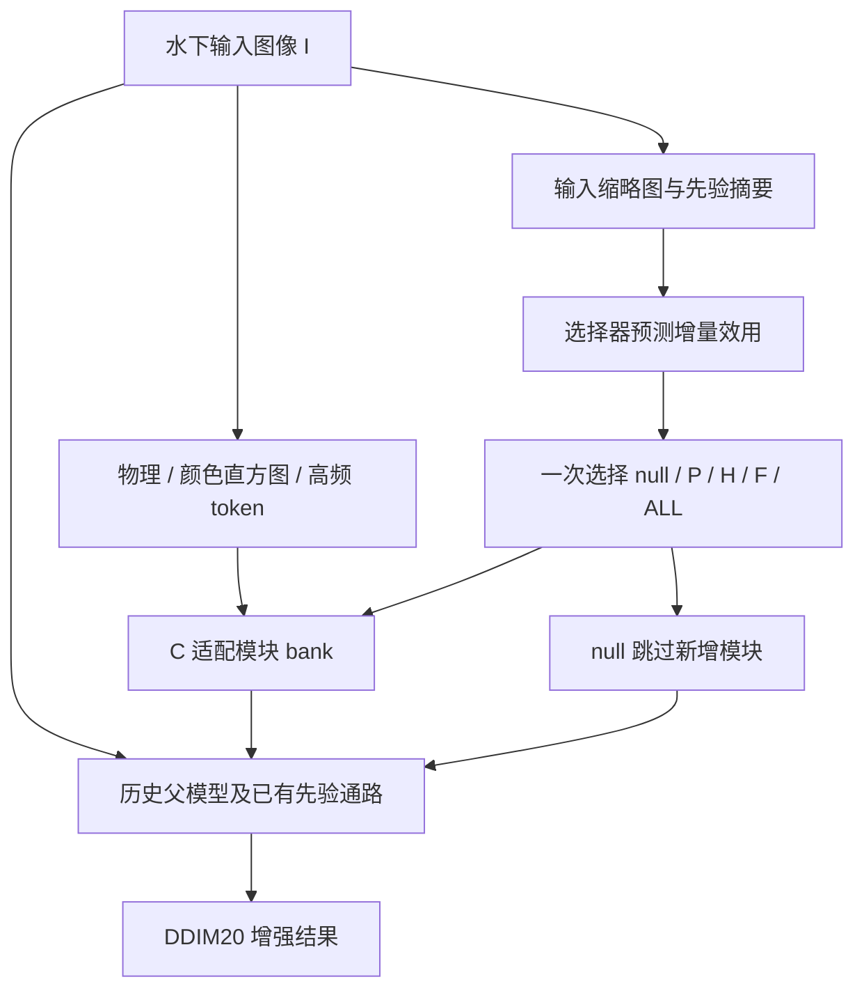

# CDE V3 实验复核、可支持的论文结论与下一步路线

> 对象：`prior_utility_cde_v3_20261004`，服务器于 2026-10-05 收束的单种子实验。目录中的日期是本次证据归档编号。
>
> 本文依据用户提供的两份报告与 `review_bundle_no_weights_no_images.zip`，结合上一轮 A–G 审计。重新核算了包内逐图指标、标签分布、oracle 分解、随机输入日志和哈希；未访问服务器训练，未修改实验源码，未加载未提供的权重，未查看未提供的图片。

## 1. 当前最重要的判断

**本轮没有验证出可作为论文主方法的 C 或 D 算法增益，但已经获得比上一轮更明确、可检验的机制线索。最值得保留的实际收益来自继续训练基线和 E 的少步推理。**

1. **C 的核心问题是无法正确拒绝有害的新增模块。** 完整 oracle 高于父模型 `+0.364630 dB`，但若禁止选择父模型，即使利用参考图完美挑选四个非空模式，平均仍低于父模型 `−0.052222 dB`。不能再把这部分空间主要解释成三类先验的精细互补。
2. **效用标签在不同数据角色之间发生明显的均值反转。** 四个非空模式在 `route_fit` 上平均带来约 `+0.80～+0.85 dB`，在 `route_cal` 上约 `+1.01～+1.03 dB`，在开发集上却全部为负。选择器在开发集依旧预测接近 `+0.9 dB` 的收益。这是值得优先调查的现象；当前还不能证明反转由哪一个因素单独造成。
3. **D 的 softphase 没有超过普通 phase，连新增条件的噪声实验也没有提供 PSNR 优势。** 当前不值得继续堆种子或延长这一配方的训练。
4. **E 有明确工程价值，但建议优先复核两步采样。** 一步平均损失很小，逐图损失却不小；两步在已测开发集上兼顾约 6 倍模型加速和更小的逐图损失。现成 DDIM 的应用不能直接包装成新的扩散算法。
5. **继续训练基线的收益是真实观测，但属于已有模型的训练配方收益。** 391 张 LSUI 候选留出上 `+0.761743 dB` 不能计入 C/D，不能据此认定新模块有效。

现在最不应做的是为了“完成三种子”而重复失败配方。下一步应先把研究问题收窄：**如何在分布变化时识别增量增强的负效用；当前条件扩散究竟需要多少次网络调用。**

## 2. 本次实际核验了什么

### 2.1 文件和工程证据

压缩包包含 424 个文件，解压后约 55 MB。ZIP 的 SHA256 为：

`c4605fa64533a799dc594d0b0490a9ff702c7c5d9f7f7b892aa900ae2e9dc392`

| 事项 | 本地核验结果 | 解释边界 |
|---|---|---|
| 两份外置报告与包内报告 | 字节完全一致 | 使用的是同一版本报告 |
| 原 4406 项 artifact 清单 | 包内存在的 135 项全部匹配 | 4271 项缺失，为 52 个 `.pt` 和 4219 个 `.png`，符合“不含权重和图片”的打包范围 |
| 补充证据清单 | 127/127 项匹配 | 包含逐图结果、日志及 CSV 等 |
| 冻结训练实现 | 7 个核心源文件全部匹配 | 说明被审代码与冻结身份一致 |
| 七个增强器的随机输入 | 全部 5000 步逐步配对 | 数据 ID、扩散时间、噪声哈希、dropout 种子相同；模式使用独立流 |
| 测试回执 | 62 项测试通过；另有 2 项收束测试回执 | 读取并核验服务器回执，未在本地无 PyTorch 环境重跑这些测试 |
| 11 个权重可加载 | 服务器报告有记录 | 本地没有权重，不能独立复验 |
| 视觉效果 | 无法本地检查 | 不把指标提升表述成已经亲眼确认的视觉改善 |

核验入口为同目录 `LOCAL_EVIDENCE_VERIFICATION.json`。工程完成、文件可恢复与科学有效性是不同问题。

### 2.2 成本和执行范围

实际使用 `11.648062/72` 设备小时。设备小时是实验设备被占用的累计时间，不等同于论文有效性的评分，也不要求把上限用满。

| 阶段 | 设备小时 | 完成内容 |
|---|---:|---|
| P0 | 0.155785 | 环境、数学、实现与成本预检 |
| E | 2.811094 | 双权重、少步采样与机制诊断 |
| C | 5.116798 | 4 个增强器训练、bank oracle、3 个选择器及污染比较 |
| D | 3.188144 | Sobel、phase、softphase 三个分支及噪声诊断 |
| FINAL | 0.376242 | 仅父模型和继续训练基线的最终评估 |

实际只有微调种子 `20261004`。推理噪声种子 `101/102/103` 是同一权重的三次推理条件，不是三个训练种子。历史父模型也只有一个预训练初始化。

未运行 `BASE_CONT_DATA_MATCHED`、两个重复种子和 C/D 最终留出评估，是本轮停止规则的正常分支。它们仍是未来成功方法所需的证据，不能写成已经完成。

## 3. 当前框架是什么

父模型是历史 85000 步的条件扩散增强器。**条件扩散**指网络在带噪状态、扩散时间和水下输入图像等条件下预测清晰图像；**先验**是对成像或图像结构的额外约束或表示，例如物理近似、颜色直方图和高频特征。

本轮的 C 不是重新训练完整父模型，而是在冻结父模型中插入小型 **adapter（适配模块）**。冻结意味着不更新父参数，反向传播仍须经过父网络，才能更新插入模块。

**bank** 是共用已训练适配模块、可切换模式的候选集合，不是五个独立预训练模型。**token** 是送入注意力计算的向量单元。**cross-attention（交叉注意力）**用当前图像特征提出查询，再从先验向量中聚合信息。

本轮 C 确实实现了跨 token 的多头交叉注意力、64 维表示、1/4 与 1/8 两尺度注入、无偏置的零初始化输出投影和 null 硬跳过。这与上一轮同位置门控不同，不能再用上一轮的实现问题解释本轮失败。

`null` 只关闭新增 C 模块，父模型内部历史先验仍然存在。因此“拒绝新增先验增量”是准确说法，“摆脱全模型所有错误物理先验”不是本轮已实现的能力。

| 模块 | 可训练参数 | 实际训练 |
|---|---:|---|
| BASE_CONT_V3 | 5,995,762 | 父模型热启动、重置 Adam，5000 更新 |
| C_BANK / C_RGB_CONTROL / C_ALL_ONLY | 各 149,248 | 父模型冻结，新增适配模块 5000 更新 |
| UTILITY / WINNER_CE / SHUFFLED | 各 37,524 | 冻结 bank，选择器各 2000 更新 |
| 三个 D 分支 | 各 10,112 | 父模型冻结，新增适配模块各 5000 更新 |

C_BANK 的 P/H/F/ALL 各被选中 1250 次。其中 ALL 会使用三支路，因此某个先验支路不仅在其单独模式下得到更新。不能简单说“每个支路只训练了 1250 步”；也不能把 bank 与 ALL_ONLY 的总更新数相等当成每个参数所受梯度完全相同。这是预设模式共享训练的实验条件，尚不能单独解释性能差异。

## 4. 先看所有开发结果，避免选错比较对象

**PSNR** 是基于像素均方误差的对数指标，单位 dB，越高越好。**SSIM** 衡量结构相似程度，越高越好。**LPIPS** 利用固定深度特征衡量感知差异，越低越好。这些指标反映与数据集参考图的接近程度，不能单独证明真实水下辐射或颜色已经物理恢复。

下面是 91 张开发图、每图先平均三个推理噪声后的结果。

| 方法 | PSNR | 相对父模型 ΔPSNR | SSIM | LPIPS↓ |
|---|---:|---:|---:|---:|
| PARENT / hard-null | 24.802890 | 0 | 0.929962 | 0.093624 |
| BASE_CONT_V3 | 24.637907 | −0.164984 | 0.929084 | 0.089562 |
| BANK physical | 24.628951 | −0.173939 | 0.929748 | 0.093223 |
| BANK histogram | 24.594158 | −0.208732 | 0.929319 | 0.093039 |
| BANK highfreq | 24.601134 | −0.201756 | 0.929608 | 0.093499 |
| BANK all / C_BEST_FIXED | 24.605860 | −0.197030 | 0.929554 | 0.093292 |
| C_RGB_CONTROL | 24.636863 | −0.166028 | 0.930015 | 0.092507 |
| C_ALL_ONLY | 24.689732 | −0.113158 | 0.929878 | 0.090855 |
| C_WINNER_CE | 24.713107 | −0.089783 | 0.929768 | 0.092757 |
| C_SHUFFLED | 24.669428 | −0.133462 | 0.929656 | 0.093019 |
| C_UTILITY | 24.603132 | −0.199758 | 0.929809 | 0.093242 |
| D_SOBEL_STD | 24.728613 | −0.074277 | 0.929349 | 0.093292 |
| D_PHASE_STD | 24.731435 | −0.071455 | 0.929239 | 0.093242 |
| D_SOFTPHASE_STD | 24.731184 | −0.071706 | 0.929288 | 0.093248 |

**所有实际可部署的新增 C/D 方法，其开发集平均 PSNR 都没有超过父模型。** 这比“未达到 +0.10 dB”更直接。部分方法的 LPIPS 更好，所以也不能把它们说成在所有维度上都变差；只是预设的质量收益主张没有成立。

`+0.10 dB` 是本项目事先约定的实际收益门槛，不是普适的统计显著性标准，更不是论文创新的自动判定标准。

## 5. C 的详细诊断：有 oracle 空间，不等于有可学的先验路由

### 5.1 效用标签与选择器到底在学什么

记输入为 \(I_i\)，参考图为 \(J_i\)，候选模式为 \(a\in\{0,P,H,F,A\}\)。其中 0 是 null，A 是 ALL。每种模式的增强输出为 \(\hat J_{i,a}\)。

\[
\mathrm{PSNR}(\hat J,J)=-10\log_{10}\!\left(\mathrm{MSE}(\hat J,J)\right),
\qquad I,J\in[0,1].
\]

定义 **增量效用**，即新增模式相对父模型究竟提升还是损害图像质量：

\[
u_i(a)=\frac1K\sum_{k=1}^{K}
\left[\mathrm{PSNR}(\hat J_{i,a}^{(k)},J_i)-\mathrm{PSNR}(\hat J_{i,0}^{(k)},J_i)\right],
\qquad u_i(0)=0.
\]

训练选择器时，参考图用于制作监督标签；部署时参考图不可用，选择器只看输入及先验摘要 \(z_i\)，预测 \(\hat u_i(a)\)，执行：

\[
\hat a_i=\arg\max_{a\in\{0,P,H,F,A\}}\hat u_i(a),\qquad \hat u_i(0)=0.
\]

**oracle** 是假设可以查看参考图，再为每张图挑选最好模式的事后上界。它不能部署，也不是一个已经获得该成绩的算法。

### 5.2 完整 oracle 收益主要来自正确回退

从原始逐图记录重新核算：

| 事后 oracle 动作集合 | 相对父模型平均收益 | 含义 |
|---|---:|---|
| C 全部五模式，含 null | +0.364630 dB | 当前有限硬动作集合的理想上界 |
| 仅 physical 与 null | +0.296972 dB | 已覆盖完整 oracle 收益的约 81.4% |
| 完整五模式超过上述二选一的额外收益 | +0.067658 dB | 多先验精细选择的额外开发空间 |
| 仅四个非空模式，不准 null | −0.052222 dB | 即使完美选择，也低于父模型 |
| 仅 PARENT 与 BASE_CONT_V3 两个已有基线 | +0.528420 dB | 普通 checkpoint 间也存在更大的 oracle 空间 |

最后一行不是新方法，也不能部署。它提供一个重要控制：**有 oracle 互补性并不是多物理先验架构所独有的证据。** 若以后一个新路由器有效，还必须比较“只在两个已有基线之间选择”是否同样有效。

完整 C oracle 的赢家分布为 null 47、physical 15、histogram 15、highfreq 14、ALL 0。四个非空模式的逐图效用相关系数为 `0.9667～0.9914`。这里的相关性描述的是质量增减趋势，不代表输出图像逐像素相同；共享父模型作为相减基准、共同的图像难度也可能贡献相关性，不能仅凭该系数认定先验表示冗余。

在 47/91 张图中，所有非空模式都低于父模型。由此可得一个范围很清楚的结论：

> 对当前冻结 bank、当前开发集和“每图选择一个模式”的硬决策而言，若不正确使用 null，仅把三种先验分得更准也无法获得总体正收益。

这不是对软混合、区域路由、新训练 bank 或整个物理先验领域的不可能性证明。

oracle 并非仅由极少数离群图制造：44 张有正增益，41 张超过 0.10 dB，去掉收益最大的 5 张后仍有 `+0.265294 dB`。但前 5 张贡献约 31.2%、前 10 张约 52.9%，收益分布确实集中，应同时报告分布而非只报均值。

### 5.3 真实选择器的错误主要发生在哪里

C_UTILITY 相对各控制：

| 比较 | ΔPSNR |
|---|---:|
| 对 route_cal 预先选出的 BEST_FIXED | −0.002728 dB |
| 对 WINNER_CE | −0.109975 dB |
| 对 SHUFFLED | −0.066296 dB |
| 对 ALL_ONLY | −0.086600 dB |
| 对 PARENT | −0.199758 dB |

**WINNER_CE** 是用“哪种模式最好”的分类标签训练选择器；**SHUFFLED** 将样本与效用标签的对应关系打乱，用来检查输入和真实效用的匹配是否贡献了收益。SHUFFLED 更高不表示随机策略有理论优势，只表示本轮没有观察到正确配对效用监督的增量价值。

UTILITY 选择 null 5、physical 55、histogram 18、highfreq 9、ALL 4。在应当 null 的 47 张图中，只对 2 张正确回退。在 86 张选择了新增模式的图中，44 张实际损失超过 0.10 dB。

定义 **regret（决策遗憾）**为 oracle 相对实际决策多获得的收益：

\[
r_i=\max_a u_i(a)-u_i(\hat a_i).
\]

平均 regret 为 `0.564388 dB`。于是有完全对应的分解：

\[
\underbrace{0.364630}_{\text{理想选择空间}}
-\underbrace{0.564388}_{\text{实际选择损失}}
=\underbrace{-0.199758}_{\text{相对父模型的实际效用}}.
\]

其中约 80.8% 的 regret 来自那些所有新增模式都不如父模型、却没有正确回退的图。应先解决“用不用新增增强”，再讨论更复杂的“用哪种先验”。

本轮报告给出的 UTILITY−BEST_FIXED 场景 bootstrap 95% 区间为 `[−0.042241,+0.036780] dB`。**bootstrap** 指重复抽取场景组来评估当前样本均值的不确定性。它不包含换一个训练种子、换一个父模型的波动，也不证明两个方法严格等价。

### 5.4 最大的新线索：效用分布反转

| 数据角色 | 图数 | P 平均效用 | H 平均效用 | F 平均效用 | ALL 平均效用 | oracle 选择 null |
|---|---:|---:|---:|---:|---:|---:|
| route_fit | 141 | +0.847034 | +0.816672 | +0.795766 | +0.836180 | 34/141，24.1% |
| route_cal | 71 | +1.028690 | +1.008252 | +1.019832 | +1.034839 | 10/71，14.1% |
| source_dev | 91 | −0.173939 | −0.208732 | −0.201756 | −0.197030 | 47/91，51.6% |

在开发集，选择器预测的 P/H/F/ALL 平均效用仍为 `+0.932/+0.894/+0.841/+0.911 dB`。效用均方预测误差为 `2.632153 dB²`，比“所有效用恒预测为零”的 `1.114124 dB²` 更大。后者只是无需学习的诊断对照，不是事后选出的新模型。

四模式真实效用与预测值展开后的相关系数约 0.056；所选动作预测分数与真实效用的相关系数约 0.036。它既明显高估了增益，也没有显示出足够的排序能力。当前结果不支持“只换一个更高阈值就能解决”。

本轮 `route_fit/route_cal` 来自父模型历史训练角色，`source_dev` 是不同的数据角色。新增选择器没有直接用开发参考图训练，但**对选择器无样本泄漏，不等于效用监督来自与部署相同的分布**。

目前证据支持“发生了角色间效用分布变化”，不支持“已证明唯一原因就是父模型记忆训练图”。场景构成、参考图风格、图像难度、适配模块泛化、输入摘要能力和训练目标都可能参与。应当把这个因果问题单独设计成实验。

### 5.5 为什么 oracle 大不保证选择器可学

平方误差回归理想情况下估计训练分布上的条件期望：

\[
g^*_{\rm train}(z,a)=\mathbb E_{\rm train}[u(a)\mid z].
\]

部署最优决策却需要 \(\mathbb E_{\rm deploy}[u(a)\mid z]\)。若二者不同，训练损失下降并不保证部署选得对；本轮训练集上的两个标签噪声也不能提供这个分布转换的保证。

还要区分两种上界：

\[
U_{\rm oracle}=\mathbb E[\max_a u(a)],\qquad
U^*_z=\mathbb E_z[\max_a\mathbb E[u(a)\mid z]],\qquad
U^*_z\le U_{\rm oracle}.
\]

前者利用参考图，后者只能利用部署可见特征。特征摘要丢失的信息、参考图的不确定性、有限样本误差都可能造成差距。因此 `+0.364630 dB` 不是“只要训练好选择器就必定拿到”的承诺。

## 6. D 的结果：有数学定义，但没有可归因的质量优势

**FFT（快速傅里叶变换）**把图像转换到频率域，复数系数可写成 \(Z=|Z|e^{j\phi}\)，其中 \(|Z|\) 是幅值，\(\phi\) 是相位。相位与结构位置有关，但保留相位本身不保证增强后更接近参考图。

本轮比较普通 phase 和：

\[
P_\tau(Z)=\frac{Z}{\sqrt{|Z|^2+\tau^2}},\qquad
\tau=\max(10^{-6},\operatorname{median}_{\rm nonDC}|Z|).
\]

**DC** 是零频率分量，与图像平均亮度有关；本轮将其清零。softphase 平滑了小幅值系数的归一化，但仍没有恢复完整幅值。随后使用训练集上冻结的每表示、每通道 RMS（均方根）尺度进行标准化，没有逐图重新估计。

相对普通 phase，softphase：

- 干净 PSNR：`−0.000251 dB`；45 张改善，46 张下降。
- 场景 bootstrap 区间：`[−0.005052,+0.004711] dB`。
- 相对 Sobel：`+0.002571 dB`，远不足以支持相位软化的特有收益。
- 相对继续训练基线：`+0.093277 dB`，但相对父模型为 `−0.071706 dB`。只挑继续训练控制比较会高估结论。

新增条件噪声诊断中，softphase−phase 的平均 PSNR：

| 噪声标准差 σ | ΔPSNR |
|---|---:|
| 0.005 | −0.001177 dB |
| 0.020 | −0.000694 dB |
| 0.050 | −0.000160 dB |

这些差异很小，但也没有支持 softphase 在该诊断下更稳健。噪声只加到新增 D 条件，父模型的原始条件保持干净，不能将结果解释成真实水下图像整体抗噪性能。

代码及训练 probe 表明 D 不是一条完全没动过的支路。另一方面，现有包没有完整的特征间距离和残差幅度分布，不能直接断言 phase 与 softphase 表示相同、父网络忽略了它们，或冻结 RMS 抹掉了全部差异。

**建议结束当前 softphase 配方，不用额外两种子试图放大接近零的点估计。** 如果以后重新研究 D，必须提出新的可检验机制，而不是继续把 softphase 公式本身当成创新证明。

## 7. E 的结果：两步采样是当前最值得保留的工程点

**DDIM** 是已有的扩散采样方法；**NFE** 是网络函数调用次数。本轮主算法比较仍固定 DDIM20，E 单独比较 1/2/4/8/20 次调用。

以下为同一 91 图、同一权重，相对 DDIM20 的结果；每图先平均三次推理噪声。

| 权重 | NFE | 平均 ΔPSNR | 单图最差 ΔPSNR | 损失超过 0.10 dB | 模型时延加速 |
|---|---:|---:|---:|---:|---:|
| PARENT | 1 | −0.005458 | −0.345081 | 23/91 | 8.668× |
| PARENT | 2 | −0.000071 | −0.006932 | 0/91 | 6.071× |
| V2_BASE_CONT | 1 | −0.006536 | −0.358316 | 10/91 | 8.662× |
| V2_BASE_CONT | 2 | −0.000137 | −0.008224 | 0/91 | 6.134× |

一步损失超过 0.05 dB 的图数分别为 30/91 和 27/91；两步均为 0。均值接近零可能掩盖图像之间的正负抵消，所以“一步几乎逐图无损”不成立。

在已测数据上，两步是更稳妥的质量与时延折中。它还不是所有水下场景上的保证。E 用的是 PARENT 与**上一轮 V2_BASE_CONT**，不能直接宣称本轮 V3_BASE_CONT 或 C/D 也获得相同少步结果；部署哪份权重，就应对那份权重单独验证。

时延口径有两点需要修正：

1. 报告的 `service` 时间包含输入与参考图的读取和传输，后者实际部署不需要。因此其约 5.9 倍一步加速、约 4.6 倍两步加速应称“当前评估流水线时间比”，不能直接当作纯生产服务速度。模型时间的口径更明确，正式部署仍应排除参考图和指标计算，重测 p50/p95（中位数与第 95 百分位）。
2. 24 图的 DDPM1000 轨迹诊断含逐步同步开销，不能把该表的大倍数直接当无插桩部署加速。也不能把不同时代、不同计时口径的速度比相乘。

本轮模型预测清晰图 \(\hat x_0=f_\theta(x_t,t,I)\)。确定性 DDIM 的典型换算为：

\[
\hat\epsilon_t=\frac{x_t-\sqrt{\bar\alpha_t}\hat x_0}{\sqrt{1-\bar\alpha_t}},\qquad
x_s=\sqrt{\bar\alpha_s}\hat x_0+\sqrt{1-\bar\alpha_s}\hat\epsilon_t.
\]

这里 \(\bar\alpha_t\) 是累计信号保留比例，s 是更接近干净图像的时间。若令 \(s=0\)、\(\bar\alpha_0=1\)，一步输出基本就是首次预测的 \(\hat x_0\)。如果网络主要依赖输入图像条件，减少调用可能只有小影响；但这个解释需要机制对照，不能由少步 PSNR 单独证明。

24 图上的初始噪声输出方差很小、状态扰动敏感性较低，与“条件回归占主导”的假设一致。它仍不是严格证明，因为时间/状态替换可能离开训练分布，而且一步逐图损失表明多步纠正对某些图仍有作用。

**论文价值所在**可能是解释和验证这类模型什么时候需要扩散迭代、什么时候可以省略，以及均值指标如何掩盖逐图风险。仅报告“换 DDIM2 更快”通常不足以构成新的算法主张。

## 8. 真正明显的画质收益属于继续训练控制

| 数据角色 | 图数 | PARENT PSNR | BASE_CONT_V3 PSNR | ΔPSNR | PSNR 改善图占比 |
|---|---:|---:|---:|---:|---:|
| LSUI 候选留出 | 391 | 20.986554 | 21.748298 | +0.761743 | 73.15% |
| UIEB 历史暴露回归 | 97 | 24.380012 | 24.921948 | +0.541936 | 61.86% |
| LSUI 历史暴露回归 | 427 | 21.510031 | 22.278600 | +0.768568 | 74.47% |

SSIM 和 LPIPS 的平均值也改善。相应 LPIPS 改善图占比分别为 60.61%、70.10%、58.78%，这里按 LPIPS 下降计为改善，使用已更正的方向。

391 图中仍有 105 张 PSNR 下降，最差约 `−4.729477 dB`；因此“平均有效”不等于“每张都更好”。去掉 PSNR 收益最高的 5 张，平均收益仍为 `+0.684175 dB`，说明均值并非仅靠几个离群样本。

但开发集 BASE_CONT−PARENT 是 `−0.164984 dB`。不同集合的均值方向不一致，需要同时披露，不能只留下正结果。它提示选择集与部署集差异或训练配方影响，尚不足以证明某个单一原因。

`BASE_CONT_V3` 是热启动并重置 Adam 的继续训练，不是完整恢复原优化器状态后仅增加相同训练步数。因此可支持的表述是：

> 当前热启动微调配方在本轮三个最终评估角色上改善平均指标。

不能简化为“纯粹再训练 5000 步必然提升 0.76 dB”，更不能把这 0.76 dB 加到 C/D 名下。缺少 C/D 最终评估也意味着不能推测它们在 LSUI 上一定会与 BASE_CONT 一样改善。

## 9. A–G 方向如何重新排序

| 方向 | 当前证据 | 是否有已验证正收益 | 后续定位 |
|---|---|---|---|
| A，物理参数/耦合与拆分 | V2 当前简化配方未优于匹配控制；V3 未新测 | 无稳定可归因收益 | 暂停；新研究需先解决物理定义与可辨识性 |
| B，深度/距离校正 | V2 proxy 变体未显示收益；V3 未新测 | 无 | 暂停；不能外推真实深度监督无用 |
| C，先验适配与效用选择 | 数学实现更完整，但实际选择器失败；发现回退和效用分布问题 | 仅 oracle 上界有空间，实际算法无 | 保留一次诊断机会，重心转向负效用识别；不追加多先验大训练 |
| D，相位条件 | V2 微小差异，V3 softphase 未过普通 phase 控制 | 无稳健特有收益 | 结束当前配方 |
| E，采样效率 | 双权重 DDIM2 开发集约 6× 模型加速、很小逐图损失 | 有，工程收益最明确 | 第一优先，跨模型与新场景验证 |
| F，专家路由 | V2 增益非常小；V3 未新测 | 尚无稳定可归因收益 | 不因 C 失败就自动转投更复杂专家系统 |
| G，任务驱动增强 | 没有形成真实下游闭环的新增确认 | 无已确认收益 | 只有获得检测/分割等真实标签和冻结协议后再启动 |

继续训练基线不属于 A–G 新模块，但目前是画质方面最清楚的正向对照。

当前不应强行选出“三个正收益算法方向”，因为证据没有三个。若按投入价值排序，应为 **E 工程与机制验证 > C 负效用诊断 > 数据/基线研究**；第三项是完善科学证据，不是另一个已成立的算法创新。

## 10. 哪些结论可以写，哪些不能写

| 可支持的有限结论 | 不能扩展成的主张 |
|---|---|
| 本轮正确执行后，C_UTILITY 未超过配对控制 | 物理先验或所有路由方法都无效 |
| 当前 C bank 的 oracle 收益主要依赖 null | 三种先验已经形成可部署、显著互补的专家系统 |
| 不同数据角色之间效用均值反转 | 已经证明父模型记忆是唯一原因或发生标签泄漏 |
| 现有 utility 回归不能可靠预测开发增量 | 增大模型、改变损失或补种子一定能修好 |
| softphase 未优于 phase/Sobel | 傅里叶相位理论没有价值 |
| 两步在本次双权重开发诊断中取得好折中 | 所有扩散 UIE 都能两步无损；无需扩散训练 |
| BASE_CONT 在最终三个角色上平均改善 | C/D 已通过留出确认，或本系统已达到 SOTA |
| 有可恢复记录、匹配随机流、正常科学停止 | 工程测试通过就等于算法创新成立 |

**SOTA** 指在明确可比较的基准、协议和指标下达到领先水平。当前主要是内部控制实验，不具备这种外部比较依据。

## 11. 能否形成论文创新

### 11.1 现在还不能写成成功的新增强算法

新增结构的数学定义和可运行代码，只说明提出了一个可检验方案。有效算法贡献还需要相对合理强基线的可重复收益、必要机制证据，以及与已有文献可辨别的差异。当前 C/D 缺少第一项，E 的采样方法本身已有先例。

多种子不是创新的替代物。即使三个种子都复现“softphase 与 phase 相同”，它也不会自动成为性能创新；如果目标转为严格的负结果研究，重复实验才有相应价值。

### 11.2 有两个值得继续发展的研究问题

**问题一：先验的事后有益性，为何无法迁移成输入可预测的有益性？**

当前有一条具体证据链：oracle 存在 → 多数空间来自回退 → 训练与开发效用分布反转 → 预测普遍乐观 → 错误接受占主要 regret。它比笼统说“路由失败”更有信息。

潜在贡献可以是暴露角色一致的效用标注、对负效用的可靠拒绝、以及对简单 checkpoint 选择控制仍成立的增量。但这些还只是研究假设。仅把“预测四种效用”换成“预测是否接受”，是常见的选择/拒绝机制，不能仅凭命名认定原创。

**问题二：强条件 UIE 扩散模型中，迭代计算的必要性和逐图风险是什么？**

当前 E 支持少步饱和现象，也揭示“一步均值无损”与“逐图安全”不同。若跨独立公开模型、多个数据域成立，并通过训练匹配的回归控制与状态/时间依赖分析解释机制，可以形成更有说服力的经验研究或系统研究。

当前两份权重共享模型家族和历史父模型，不算跨架构重复。现有证据不能保证该研究一定可发表。

### 11.3 已核实的近邻文献边界

本轮在线核对了以下官方 arXiv 条目的题名、版本和摘要；这是一组针对当前主张的近邻检查，不是完整系统文献综述。

| 文献 | 与当前工作的关系 |
|---|---|
| [Denoising Diffusion Implicit Models](https://arxiv.org/abs/2010.02502) | 少步 DDIM 不是本项目新提出的采样算法 |
| [Phaseformer: Phase-based Attention Mechanism for Underwater Image Restoration and Beyond](https://arxiv.org/abs/2412.01456) | 水下增强中利用相位已有直接先例；本轮浅层 softphase 也不是对其完整架构的严格复现 |
| [Two-Stage Teacher-Student Reliable Prior Learning for Robust Underwater Image Enhancement](https://arxiv.org/abs/2608.00137) | 可靠先验、教师学生差异及残差校准已有近邻；该条目为预印本，不能擅自指定已录用期刊/会议 |
| [CoRe-UIE: Rethinking Coexisting and Region-wise Degradation for Underwater Image Enhancement](https://arxiv.org/abs/2608.08965) | 退化驱动专家、区域路由和冗余约束已有近邻；同样不能将预印本当作已确认录用论文 |

因此未来真正需要比较的是具体机制和证据：效用相对哪个强基线定义、如何处理有害增量、监督分布是否匹配、代价是否更低，而不是宣称“首次使用先验/相位/路由”。

## 12. 上一版框架需要主动修订的地方

本轮反馈也暴露了我上一版框架需要改进的内容，不能把责任全部归到服务器实现。

1. **强基线必须显式包括原父模型。** 旧强控制集合主要是 BASE_CONT/RGB/ALL_ONLY。虽然 BEST_FIXED 的候选含 null，但在校准集选成 ALL 后，不能保证通过这些控制就一定超过父模型。以后主闸门直接比较 `PARENT、BEST_FIXED、BASE_CONT、RGB、ALL_ONLY` 中的强者；路由研究再加简单已有 checkpoint 选择控制。
2. **效用监督需要单独审计父模型暴露角色。** 原划分保证新增模块角色分离，却没有自动保证 parent-seen 标签与 parent-unseen 部署的效用分布一致。不能只做新增 selector 的随机划分就视为问题已解决。
3. **oracle 闸门应拆分“拒绝空间”和“多先验选择空间”。** 同时报完整 oracle、单分支+null oracle、非空 oracle 和已有基线 oracle，避免把常规选择收益归为物理先验特有互补。
4. **E 除平均质量阈值外，应加逐图退化率和低尾指标。** 本轮一步通过均值容差，但有一批图出现明显相对损失。
5. **效用选择器应增加常数预测和简单低容量控制。** 本轮回归预测误差甚至高于恒零，直接上更多门控容量缺乏依据。

这些修订不会改变本轮“不晋级”的结论；它们会使未来的正结论更难被弱控制或均值掩盖。

## 13. 下一步建议：先获得能改变决策的证据

### 阶段 0：本轮已完成的 CPU 复核，不要再付费重做

- 已完成标签分布对比、模式相关性、null/oracle 分解、regret 归因。
- 已完成已有 PARENT/BASE_CONT 二动作 oracle 控制。
- 已完成 E 逐图尾部和两步比较。
- 已完成包内哈希、冻结源文件、全 5000 步公共随机输入核验。

这些结果已随本文保存，不需要服务器再训练来确认同一组统计。

### 阶段 1：优先完成 E 的可部署验证

1. 以两步作为优先候选、20 步作为质量参考，一步只保留为更激进的速度点。
2. 对实际准备部署的权重重新确认，尤其补本轮 V3_BASE_CONT；不混用上一轮权重的 E 成绩。
3. 修正服务计时，排除参考图读取、传输与指标计算；记录模型、先验、输入读取、输出保存的独立耗时及峰值显存。
4. 除均值，报告每图 PSNR/LPIPS 差值、损失超过 0.05/0.10 dB 比例、低 5% 分位和固定失败图像。
5. 用预先登记的新场景集确认；若要形成机制论文，再补至少一个独立公开 UIE 扩散架构或作者权重。

这部分主要是推理，不要求从零训练，也不需要先做蒸馏。**蒸馏**是用教师模型教一个更轻或更快的学生；如果两步已有可接受结果，应先证明学生能额外改善质量、延时或显存，再投入训练。

可增加固定时间、固定零状态、不同初始噪声等受控干预，作为现有模型的机制诊断。若论文进一步声称“扩散训练没有必要”，还必须加入公平训练的直接回归模型；只把训练好的扩散模型改成少步推理，不能证明训练阶段可被省略。

### 阶段 2：给 C 一次有限的诊断机会

目标改为：**在部署相近的数据角色上，是否能可靠判断某个已有增量处理值得使用？**

先不要训练新的三先验 bank。优先使用现成输出/权重，比较：

- 恒选父模型。
- 一个预先固定的新增分支与父模型二选一。
- PARENT 与 BASE_CONT_V3 二选一。
- 简单线性/小容量决策与现有神经选择器。

选择具体候选与超参数必须在新的开发协议中登记。当前审计中的 physical 表现属于已观察结果，可作为下一轮假设来源，不能冒充事前未见的确认选择。

**首先修数据角色，再修模型。** 理想的效用标注集应对冻结父模型和冻结 bank 都未参与训练，同时与目标部署场景相近。使用新取得的、按场景隔离的数据做 route_fit/cal；最终确认集继续单独留存。若只能使用已经观察过的旧开发数据，可以明确改作开发用途，但不能再把同一批数据叫盲测。

若采用交叉拟合，即用若干互斥数据组轮流产生未训练样本的标签，应明确哪一层模型未见该组。只对 selector 或 adapter 做交叉拟合，并不会消除父模型已见图像造成的暴露差异。也不必为了形式完整立即重训多个父模型；获取适量父模型未见的标注数据通常更值得先评估。

二动作选择不能只追求“正负分类准确率”。若一部分错误接受带来很大损害，较高准确率仍可能使平均效用为负。应报告：接受率、错误接受损失、平均增益、regret 和退化尾部。

可研究保守接受规则：

\[
\text{接受增量处理}\iff \text{经独立校准的效用下界}>\tau.
\]

其中 \(\tau\) 是预先确定或只在校准集确定的门槛。若存在分布变化，普通校准区间本身不自动保证安全，因此“下界”必须说明统计方法、覆盖假设和验证范围，不能随意给预测值减一个常数就宣称可靠。

**退出条件**：在一次冻结的小规模试验中，若输入可见的简单决策依然没有超过恒选父模型，或者新效用方案不超过简单 checkpoint 选择，则停止该 C 路线。不要通过反复改阈值、延长训练、切换评价集来追求一个正数。

### 阶段 3：只在候选通过后补确认性实验

候选在新开发协议上产生明确正收益后，再进行同配方多微调种子、数据匹配控制、独立测试和完整视觉分析。若 pilot 后改配方，旧 pilot 不计入同配置的三种子。

三个微调种子主要检查新增训练的随机性；它们共享一个父模型时，仍不能声称覆盖独立预训练差异。三个种子是现实的起点，不是统计充分性的万能保证。

本轮剩余的约 60.35 设备小时只是旧计划的未使用上限。本建议不要求把它花掉。先对下一项短实验测时，单独列出目标、上限和退出条件；无须重新启动六次 400000 步训练。

## 14. 若要投稿，还缺哪些内容

| 缺项 | 对算法论文的意义 | 对经验/机制论文的意义 |
|---|---|---|
| 至少一个有明确增量的主方法或被反复验证的中心发现 | 当前 C/D 未满足 | E/效用分布现象有线索，尚需外部复验 |
| 独立公开模型/作者权重 | 排除只适配本地重建模型 | 尤其关键，否则发现可能是重建或训练配方特例 |
| 与强控制的公平比较 | 必含父模型、继续训练、简单选择等 | 防止把普通微调与选择空间当作新机制 |
| 场景独立的数据和暴露记录 | 控制选模偏差 | 解释效用分布变化的前提 |
| 重复训练与不确定性 | 确认候选稳定性 | 若主张普遍负结果，也需重复而非仅一次失败 |
| 跨数据域及外部方法比较 | 支撑泛化与性能定位 | 支撑现象广度，不必强行声称 SOTA |
| 固定好例、坏例和局部放大 | 解释指标与视觉是否一致 | 特别适合解释一步退化和错误接受 |
| 真实下游指标（若声称机器人价值） | 检测、分割或任务成功率 | 不能用图像指标替代机器人效用 |
| 统一指标、分辨率、训练数据与测速口径 | 可比较性 | 排除实现和评估造成的假现象 |
| 文献机制对照和可恢复材料 | 区分已有方法与贡献 | 让负结果可以被复核和解释 |

数据方面，本轮训练/选择器/校准三角色在包内 ID、图像哈希和已知场景组上无交叉；开发与历史 UIEB 测试仍共享一个已知场景组，因此历史测试继续按回归集解释。场景组大部分由内容筛查构建，缺少完整相机/序列来源，不能承诺绝对场景独立。

391 图 LSUI 候选留出在本轮冻结后评分，其历史基线评估身份可以如实报告。如今分数已被分析，未来不能无条件沿用“完全未触碰”的说法。它也不是新的数据域。深度网络、VGG 和 LPIPS 的上游训练暴露仍应标明未知部分。

不需要为了形式完整把 A–G 全部跑到成功。论文更需要一个清楚的问题、一条解释得通的证据链，以及能排除简单替代解释的实验。

## 15. 建议采用的研究表述

现在可以将工作定位为：

> 对一个重建的水下条件扩散增强系统进行配对控制审计，发现继续训练与少步采样有明确的实用收益；新增先验的 oracle 空间主要来自拒绝有害增量，而输入效用预测在数据角色变化下未能兑现该空间。

这是忠于当前事实的阶段性研究总结。它可以成为技术报告或后续论文的出发点，尚不是“已提出一个有效新算法”的结论。

若继续投入，我建议先完成 **E 两步部署与跨模型验证**；C 仅做一次围绕 **效用分布变化与拒绝** 的有限试验；D 当前配方停止，A/B/F/G 不自动重启。

## 16. 本地证据索引

- 原始材料解压位置：`review_bundle/`。
- 综合核验：`LOCAL_EVIDENCE_VERIFICATION.json`。
- 逐图独立核算：`V3_逐图数值复核.md`、`V3_逐图数值复核.json`。
- 实现与协议：`V3_实现与协议复核.md`。
- 论文路线与文献回执：`V3_论文主张与后续路线.md`、`V3_论文路线补充核算.json`。
- 服务器原始核心指标：`review_bundle/runs/prior_utility_cde_v3_20261004/pilot/20261004/`。
- 服务器勘误后的表格：`review_bundle/runs/prior_utility_cde_v3_20261004/closeout/`。

独立复核的 bootstrap 是描述性补充，抽样次数和随机种子可能与服务器版本不同。本文涉及晋级/停止时使用原冻结协议及服务器决策，不拿重新抽样或事后分析改写历史结果。
