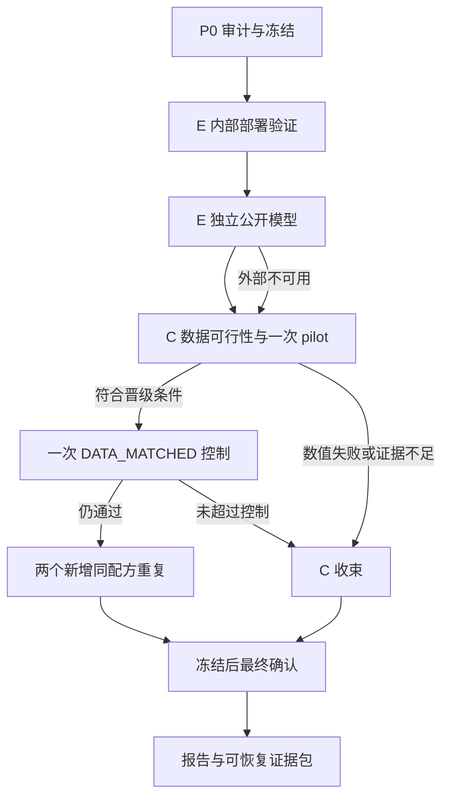

# UIE V4：E 部署与跨模型验证、C 一次有限诊断、成功候选确认

> 文档日期：2026-10-06（Asia/Shanghai）。协议 ID：`uie_ec_v4_20261006`。
>
> 交给服务器 Codex 的可执行研究规格。执行顺序：**E → C 有限诊断 → 仅成功候选进入确认**。
>
> 本文件提出下一轮实验，未宣称下一轮已经运行或已经有效。默认新增设备预算上限 **24 设备小时**；预算是上限，不是消耗目标。上一轮未使用的预算不自动结转。

## 0. 任务目标、边界和成功的定义

完成三个问题的证据化回答：

1. **E：** 上一轮的两步采样收益能否在真正要部署的 `BASE_CONT_V3` 上成立？排除参考图与指标开销后，实际输入到输出的时延如何？一个独立作者模型上是否出现类似现象？
2. **C：** 在与部署更一致的数据角色上，冻结现有恢复器，仅用输入图像可见的信息，能否识别新增处理的负效用？它是否超过简单的“父模型／继续训练模型”选择？
3. **确认：** 如果确有候选通过预注册闸门，是否经得住同配方重复、数据匹配控制和独立场景确认？

本轮完成有三种合法结果：取得受限的正结论；得到有边界的负结论并停止；因权重、数据或预算不足而明确未完成该项。**不要求造出正结果，不把工程通过写成算法创新。**

授权执行范围：读取和审计现有仓库；在新 V4 目录实现必要工具与测试；获取可合法访问的官方代码、权重和已有授权的数据；按本文预算运行推理、有限选择器训练，以及闸门通过后的条件性确认。文档上传不意味着重启 V3 调度器。

明确不做：从零预训练、六次 400000 步训练、蒸馏、新 bank 结构、新先验、新的大型选择器、D 续训、A/B/F/G 自动重启、公开上传数据/权重、自动推送 GitHub。首轮 C 必须冻结现有 bank；确认期允许复跑同一 bank 配方以检查随机性，不能借机搜索新配方。

## 1. 作为起点的已知事实

以下是 V3 已观测结果，不是 V4 的预计收益：

| 事实 | 数值／边界 | 对 V4 的约束 |
|---|---|---|
| C 实际效用选择器对父模型 | −0.199758 dB，91 图 | 不直接扩大训练 |
| C 五动作 oracle 对父模型 | +0.364630 dB | oracle 是用参考图事后选择的上界，不能部署 |
| 仅 null／physical oracle | +0.296972 dB | 固定 physical 为 V4 唯一新增分支候选，不再搜索 P/H/F |
| 禁止 null 的 oracle | −0.052222 dB | 首先研究接受／拒绝 |
| 父模型／BASE_CONT_V3 oracle | +0.528420 dB | 必须加简单检查点选择控制 |
| route_fit/cal 与开发效用 | 前者约 +0.8～+1.0 dB，后者约 −0.2 dB | 分别审计模型训练暴露和分数暴露 |
| D softphase−phase | −0.000251 dB | 本轮不继续 |
| E 两步 | 旧双权重约 6.1× 模型加速，已测单图损失很小 | 验证 V3 权重和新场景，不能直接继承成绩 |
| E 一步 | 父模型 23/91 图损失超过 0.10 dB | 不能仅凭平均质量晋级 |
| BASE_CONT_V3 的 LSUI391 结果 | +0.761743 dB；开发集却 −0.164984 dB | 同时保留正负集合结果，不归因于 C/D |

PSNR 是由像素均方误差得到的对数指标，单位 dB，越高越好；SSIM 衡量结构相似性，越高越好；LPIPS 衡量固定深度特征中的感知差异，越低越好。本文数值闸门是研究资源决策规则，不是公认创新标准。

必须先读服务器 V3 的 `FINAL_REPORT.md`、`CLOSEOUT_REVIEW_20261005.md`、冻结协议、权重清单和本地综合复核。若上传时没有附综合复核，本文已包含执行所需结论，不要求重新付费生成同一批 V3 统计。

## 2. P0：现有仓库、模型身份和实现入口

### 2.1 仓库识别

仓库：`https://github.com/kkkridepig/uie-prior-utility`。服务器目录历史上有两个写法，执行者必须用当前工作目录和 Git 根目录确认实际位置，不能硬编码 Windows 路径或猜 `/mnt/workspace/...`。

读取 `AGENTS.md`、Git 状态、环境信息、活动设备任务；保存当前 commit、未提交 diff 和其哈希。已有任务不得被 V4 覆盖或终止。工作目录不是干净状态时保留已有更改，新增 V4 文件，不 reset/clean。当前 README 还描述更早的 WWE/Flow 流程，**不能用 README 的一键训练命令启动本轮**。

### 2.2 必须精确加载的内部权重

路径相对于仓库根目录。V3 新权重多为 delta（相对于父权重的参数增量），不能当完整模型加载。

| ID | 路径 | SHA256 |
|---|---|---|
| PARENT | `runs/explore_ag_single_seed_v2_20261003/parent_0.pt` | `3f8e7b50834d069d85b4f9b57c964242554aad45f44826ef4fc000491fad4bea` |
| BASE_CONT_V3 | `runs/prior_utility_cde_v3_20261004/pilot/20261004/BASE_CONT_V3/step_05000.pt` | `91a465dac86d81deab918a6595f1d8a81140616766086edca76d81455d6e1fb3` |
| C_BANK | `runs/prior_utility_cde_v3_20261004/pilot/20261004/C_BANK/step_05000.pt` | `643bb9435eea323ddca2282efc5c2338d8d9ea36d63a754c9eefd7f246b43556` |
| C_RGB_CONTROL | `runs/prior_utility_cde_v3_20261004/pilot/20261004/C_RGB_CONTROL/step_05000.pt` | `96a520a124fefd13885c855d4cdbd99291042332976caf8321692eef2e955a02` |
| C_ALL_ONLY | `runs/prior_utility_cde_v3_20261004/pilot/20261004/C_ALL_ONLY/step_05000.pt` | `c783abfc1d3e4e3adc90837520cfad41e942252c04c7e42295916cf59d9ac851` |

先在 CPU 校验身份和张量有限，再在设备上做 3 张固定旧开发图的加载／输出回归。CPU 是主机处理器，设备在本项目可能是 PPU；不能预设 NVIDIA。不得以随机初始化或相近名字的权重替代缺失权重。

### 2.3 优先复用但注意副作用

| 现有源码 | 可复用部分 | 必须防止的误用 |
|---|---|---|
| `scripts/cde_v3/sampling.py` | x0-DDIM 和噪声逻辑 | 中间裁剪、时间索引不能悄悄改变 |
| `mpa_diff/diffusion/core.py` | schedule、`time_grid` | **两步网格为 [1000,1,0]**，不是 [1000,500,0] |
| `scripts/cde_v3/model.py` | V3Model、Selector、token_summary | null 只关闭新增模块；116 是神经头拼接维度，不是原始摘要总维度 |
| `scripts/cde_v3/eval_development.py` | delta 加载和冻结身份检查 | 原角色和输出目录绑定 V3，不能直接用于 V4 数据 |
| `scripts/cde_v3/common.py` | 噪声和哈希函数 | `RUN/DOC` 是 V3 常量，写操作必须隔离 |
| `scripts/cde_v3/metrics.py` | 正确的 LPIPS 权重及归一化 | 构造器会写 V3 `metric_identity.json`，不能直接实例化后污染历史目录 |
| `scripts/cde_v3/diagnose_e.py` | 数值对照参考 | 其 service 含参考图读取，不能沿用作为部署时延 |
| `scripts/cde_v3/train_bank.py` | 确认期原配方重放 | 首轮不得调用；重复期改输出和角色适配，保留数学与优化语义 |

推荐新增 V4 薄包装和可配置输出目录，不改冻结 V3 文件。必要重构须证明 V3 回归不变并另存 diff；不修改旧哈希清单以适应新实现。

## 3. 数据协议：模型未见与分数未见是两个维度

### 3.1 每图的暴露账本

建立 `data/exposure_ledger.jsonl`，至少包含：

```text
sample_id, dataset, image_path, reference_path, image_sha256, reference_sha256,
scene_id, scene_source, sequence_id, camera_id, duplicate_group_id,
parent_train_exposure, bank_train_exposure, base_train_exposure,
rgb_train_exposure, all_only_train_exposure, external_train_exposure,
score_exposure_before_v4, prior_role, v4_role, source_url, license,
exclusion_reason, evidence_paths
```

暴露值使用 `yes/no/unknown`；`no` 必须有可追踪依据。未找到文件名不能自动当未训练；审计输入与参考哈希、近重复、原始序列和场景组。未知场景来源单列；不要仅换图片名后随机拆分。不同数据集的近重复也需要检查。

旧 `source_dev` 的 91 张、LSUI391 和两个旧 test 都已经产生过分数，**不能重新成为 V4 未触碰确认集**。若经审计确实未被 PARENT、C_BANK 和相关控制训练，可以改作 V4 的 route_fit/cal，明确是历史评分数据再利用。

### 3.2 数据角色和访问权限

所有划分先按 scene/sequence/duplicate group 合并后分组；分层条件只能是数据源、已知场景、输入亮度等预先定义属性，不能按候选收益分层。固定 split seed `20261006`。无法精确达到数量时以组完整性优先，登记实际数量。

| 角色 | 用途 | 最低工作规模（图／场景组） | 参考图可用操作 |
|---|---|---:|---|
| E_LEGACY_REGRESSION | 已评分集合回归、确认 V3 权重 | 旧91图及旧915图按各自集合分开 | 质量诊断，不能充当新盲测 |
| E_DEV | E 的新场景开发 | 60／20 | 只评价预设 1/2/20 步 |
| C_ROUTE_FIT | 训练选择器；可以是合格旧评分数据 | 120／20 | 生成固定输出效用标签；条件性 DATA_MATCHED 的例外见 §10 |
| C_ROUTE_CAL | 选择预设阈值及 LINEAR/NN | 50／15 | 校准，不更新选择器参数 |
| C_DEV | C 的一次晋级判断 | 80／20 | 冻结策略后一次批量评估，不回流调参 |
| FINAL_CONFIRM | 成功候选的最终确认 | 120／30 | 最后冻结后一次评估 |

数量是资源规划下限，不是统计功效保证。场景不足时不得把每张图假称独立场景。默认 C_ROUTE_FIT 目标 200 图；不要为了凑目标拆散场景。

E_DEV、C_DEV、FINAL_CONFIRM 在本协议冻结前应无已知结果评分，且与各训练／校准角色场景互斥。E_DEV 与 C_DEV 默认分开；**不得先用 E 查看 C_DEV/FINAL_CONFIRM 的父模型结果，再宣称 C 的确认未曝光**。

若新数据有限，允许两种自动降级，不必把整个任务挂起：

1. 有模型未见、但已评分的图：完成 E 的历史回归和 C 的一次回顾性诊断，明确 `retrospective_only`；不晋级确认、不宣称消除了选模偏差。
2. 无足够模型未见的带参考图：跳过 C 训练，输出 `blocked_data_exposure` 及缺少的图数／场景数；继续完成能做的 E。

可以优先盘点服务器已有合规数据，再从作者官方入口补充。禁止用增强算法生成的“伪清晰图”伪装真实新参考图。无参考新场景可用于 E 视觉与速度，不能填充 PSNR/SSIM/LPIPS 闸门。

FINAL_CONFIRM 可被 E 与 C 在**同一次最终冻结后的批处理**共同评价；不能先公开其 E 分数，再用这些图设计或选择 C。C 科学停止后，仍可冻结 E 再单独释放确认集。

## 4. 冻结、预算、状态机

### 4.1 三次冻结

1. `protocol_frozen.yaml`：代码、数学、权重、数据角色、超参数、预算和所有阈值；P0 后、正式质量计算前生成。
2. `selection_freeze.json`：E 的主候选固定为 NFE2；C 的每个二动作任务只保留在 CAL 选出的一个规则；生成后才允许读取 C_DEV 分数。
3. `final_freeze.json`：确认模型、全部实际种子、图像清单、推理设置、指标和可作主张；生成后才释放 FINAL_CONFIRM。若没有候选通过，只生成含空模型列表和原因的终态冻结，不为填表消耗确认集。

SHA256 是文件内容的哈希，用于确认身份，不证明方法有效。正式运行出现实现 bug 可以修复并更新身份；所有受影响结果失效后全量重算，保留旧结果。不能以“修 bug”为名在看到结果后修改阈值、网格、候选或数据。

### 4.2 默认新增设备预算

| 阶段 | 硬上限（设备小时） | 启动条件 |
|---|---:|---|
| P0 环境、加载、成本抽样 | 1 | 立即 |
| E 内部权重验证 | 2 | 身份和数学测试通过 |
| E 独立公开模型 | 4 | 官方权重与接口可用 |
| C 一次 pilot | 3 | 数据角色可用；bank 固定 |
| C 数据匹配与重复确认 | 12 | §9 闸门通过，先过 DATA_MATCHED 再重复 |
| 最终推理、视觉和收束 | 2 | 保留，训练不得侵占 |
| **总上限** | **24** | 不自动增加 |

多卡消耗按占用设备数乘时间累计；CPU、下载等待、存储另记。PPU/CUDA/CPU 型号记录实际值，不跨设备宣称同一速度。阶段超额不得借其他阶段预算静默续跑；成本预测超过上限则保存计划并标 `budget_insufficient`。

P0 在固定旧数据上测时，使用至少 10 次调用的中位数及 1.3 安全系数，估算每阶段图数×噪声×候选的真实调用量。选择器仅训练几千步不能掩盖效用标签推理成本。最终评估预留不够时，不启动新的重复训练。

`budget.json` 记开始、结束、设备数、真实耗时、任务身份和重试。有效结果完整才可做科学判断。中断只允许同身份续跑；最多一次自动同身份重试，不能重试到结果变正。

### 4.3 状态与顺序



E 数值不通过不自动阻止独立的 C 问题；C 失败不取消 E 已取得的结果。一个分支阻塞时完成独立分支与报告。

## 5. E：同一模型的少步数学与实现契约

### 5.1 内部模型保持 V3 数学身份

扩散带噪状态记为 \(x_t\)，原图条件为 \(I\)，累计信号比例为 \(\bar\alpha_t\)。内部模型预测干净图像：

\[
\hat x_0=f_\theta(x_t,t-1,I),\qquad
\hat\epsilon_t=\frac{x_t-\sqrt{\bar\alpha_t}\hat x_0}{\sqrt{1-\bar\alpha_t}}.
\]

确定性 DDIM（去噪扩散隐式采样，\(\eta=0\)）更新为：

\[
x_s=\sqrt{\bar\alpha_s}\hat x_0+
\sqrt{1-\bar\alpha_s}\hat\epsilon_t,\quad s<t;
\qquad x_0=\hat x_0\text{ 在终点直接赋值}.
\]

保留 T=1000、V3 beta schedule、`time_grid(T,K)=round(linspace(T,1,K))+[0]`、网络索引 `t-1`。因此：

```text
K=1: [1000,0]
K=2: [1000,1,0]
K=20: 使用现有函数生成并逐项记录实际列表
```

**两步含一个接近干净终点的修正，不能悄悄换成等距中点两步。** 不改变中间 x0 裁剪（保持关闭）、最终 `[0,1]` 裁剪、分辨率、颜色空间、padding/crop、精度或 memory format。NFE 指真实去噪网络调用次数，需独立计数，不能只照配置填数字。

### 5.2 随机输入

内部模型沿用 `noise_protocol_v3` 的 `CPU_float32_then_device` 生成方式。键包含 `eval_noise_seed、sample_id、noise_role、timestep`，默认评估种子 `[101,102,103]`。同图、同 seed、不同 NFE／候选共享同一初始噪声；键不能包含候选名或 NFE。

记录初始噪声 SHA256、实际网格、参数化、schedule 哈希。测试不同 seed 确实给出不同噪声，重排数据或断点续跑不改变已定义输入。推理噪声种子不是训练重复。

旧缓存仅在权重、输入与参考哈希、预处理、采样、噪声、指标完全一致时复用。旧计时一律不能当新部署计时。

### 5.3 内部最小实验矩阵

| 阶段 | 权重 | 数据 | 调用次数 |
|---|---|---|---|
| 回归 | PARENT | 固定旧开发子集及完整旧91图 | 2、20；旧结果完整匹配可复用质量分数 |
| 主部署验证 | BASE_CONT_V3 | 旧91图、旧三个最终集合，分开报告 | 2、20 |
| 激进速度点 | BASE_CONT_V3 | 旧91图与 E_DEV | 1，另与20比较 |
| 新场景验证 | PARENT、BASE_CONT_V3 | E_DEV | 2、20 |
| 最终确认 | 冻结的部署权重，默认 BASE_CONT_V3 | FINAL_CONFIRM | 2、20 |

默认部署权重为 BASE_CONT_V3，PARENT 为必要回归控制。若其某一目标域表现更差，诚实报告；不得在最终集按图挑更好的权重。旧915图只作既有集合回归，不称新外部泛化。

NFE4/8 不自动添加。NFE2 失败时保留20步和失败结论，不沿速度曲线继续搜索到一个通过的点。下一轮可另立协议研究折中。

## 6. E：部署计时、指标与闸门

### 6.1 质量与计时分两次执行

**质量运行：** 可以读取参考图和计算指标；记录 float32 预测质量，PNG 量化只用于另列视觉与部署产物。

**计时运行：** 不实例化指标网络、不读取参考图、不包含轨迹记录与每步 `.item()`／设备同步，不复用已缓存的增强输出。通过输入-only 数据接口证明参考路径不可访问。

计时分三个独立口径，不能把分段插桩结果相加冒充原生服务耗时：

| 计时项 | 起点和终点 |
|---|---|
| `sampling_ms` | 条件已在设备；初始状态已备好；只测整个采样循环 |
| `model_ms` | 输入张量已在设备 → padding、先验计算、随机状态准备、采样、裁剪结束；不缓存先验 |
| `service_ms` | 输入文件读取／解码 → 必要 CPU/设备传输、model、输出传回和 PNG 文件写入关闭 |

H2D 指主机到设备传输，D2H 反向。模型时间包含其调用路径中实际发生的噪声准备／传输；不要为了加速分子而预缓存仅某一候选的噪声。

外层开始前和结束后各一次必要设备同步；分段诊断另跑。模型装载和首次编译／初始化不计稳定请求延迟，但单列冷启动；全部占用记预算。文件写入默认不额外 `fsync`，两组一致，明确此口径；OS 读缓存不强行清空，标 `warm_file_cache`。

固定 batch=1、float32、同设备、同分辨率、同布局；至少 5 次每配置完整 warmup，使用 24 张固定开发图、每图 5 次重复，按固定种子打乱配置执行顺序。重复仅用于计时，不当作质量样本。报告 p50（中位数）、p95、峰值显存、原始计时和吞吐；控制同卡并发，不对其他任务做强制终止。

正式端到端计时不得与 LPIPS 网络同驻留设备造成额外内存占用。若实际部署分辨率未知，主结果保持 checkpoint 原预处理；原分辨率只是单独的探索配置，不能替代主表。

### 6.2 逐图质量计算

对图 i 和指标 M，先在配对的 R 个噪声下求差，再逐图平均：

\[
\Delta_i^M=\frac1R\sum_r[M(\hat J^{K=2}_{ir},J_i)-M(\hat J^{K=20}_{ir},J_i)].
\]

不能平均图像后再算指标，不能挑一个最佳噪声。PSNR/SSIM 正值好，LPIPS 负值好。

必须报告每集合的均值、中位数、5% 分位、最差图、PSNR 损失超过 0.05/0.10/0.50 dB 的比例，以及 LPIPS 增加超过0.01/0.02的比例。另报每图最差噪声诊断，避免跨噪声平均掩盖风险，但不替代冻结主指标。

### 6.3 E 的预注册运行闸门

E_DEV 与 FINAL_CONFIRM 分别判断，内部主权重不能靠混入另一集合平均过关：

| 条件 | 通过规则 |
|---|---|
| 平均质量非劣 | ΔPSNR 的场景 bootstrap 95% 区间下端 ≥ −0.05 dB |
| 结构保护 | 平均 ΔSSIM ≥ −0.002 |
| 感知保护 | 平均 ΔLPIPS ≤ +0.01 |
| 逐图尾部 | `P(ΔPSNR < −0.10) ≤ 5%`，且最差 ΔPSNR ≥ −0.50 dB |
| 模型效率 | `p50_model_20 / p50_model_2 ≥ 1.5` |
| 服务效率 | `p50_service_20 / p50_service_2 ≥ 1.2`，服务 p95 不比20步更慢 |
| 完整性 | 全部预设图／噪声记录完整，真实 NFE=2／20，没有非有限输出 |

这些尾部阈值是预先选定的操作性容忍值，不是人眼感知阈值，也不构成“保证每图安全”。同时报告退化率的不确定性；观察零退化也不能报真实风险为零。bootstrap 在全零事件时可能退化，另报“场景内任一图退化”的场景事件数及二项区间，注明组独立假设与组大小影响。

SSIM/LPIPS 也给区间，闸门用上表已冻结规则。服务加速不够时可记 `quality_pass_model_speed_only`，不宣称部署加速通过。NFE1 仅作诊断，不能取代失败的主 NFE2。

## 7. E：一个独立作者模型的验证

### 7.1 本次已核对的公开入口

本文件编写时核验范围为官方仓库 README、配置／采样源码和 GitHub commit；未在本地下载或加载作者权重，未保证服务器下载可达。这不是完整文献新颖性综述。

**首选 DiffWater：**

- 作者仓库：<https://github.com/Guan-MS/DiffWater>。
- 已核对 commit：`7db68f34060bbf1d7c5b8153664fb16a3dcda1ae`；代码许可 Apache-2.0。
- 作者论文入口：<https://ieeexplore.ieee.org/document/10365517>，DOI `10.1109/JSTARS.2023.3344453`。
- README 给出的权重入口：<https://drive.google.com/drive/folders/11T9ao0pmNFv9lVZLcVliNbZ3iJ5F2t7s>；另有作者百度盘入口，见 README。
- 关键源码：`DiffWater/model/ddpm_modules/diffusion.py`、`DiffWater/config/config.yml`、`DiffWater/test.py`。
- 该实现训练目标是噪声 epsilon，原生路径为 DDPM；与本地 x0 模型不同，适合检验现象边界。

**只因技术不可用才启用的备选 DM_underwater：**

- 作者仓库：<https://github.com/piggy2009/DM_underwater>。
- 已核对 commit：`cb7a4a5734b575279c16e52ffd1d3e21dd673fcf`。
- 作者权重入口：<https://drive.google.com/file/d/1As3Pd8W6XmQBU__83iYtBT5vssoZHSqn/view>。
- 已核对 `model/ddpm_trans_modules/diffusion.py` 与 `config/underwater.json`；T=2000、epsilon 预测，原生默认搜索得到的10点网格。
- GitHub API 未识别出许可证；记录原许可状态，不把代码／权重复制再发布。本地研究验证与对外再分发分开处理。

不把同一家族的另一权重当独立模型。PA-Diff 当前 README 权重链接仍为空占位；Reti-Diff 是潜在备选但潜空间与原生流程不同，本轮不自动扩展到第三个模型。

允许首选最多两次下载／兼容排错，再因明确技术阻塞切备选，合计不超过外部阶段上限。**首选两步质量差是有价值的负结果，不能据此换模型寻找正结果。** 未取得可靠作者权重时标 `external_weights_unavailable`，禁止随机权重和自训替代。

### 7.2 官方路径、包装路径和实验路径分开

1. 固定源码 commit、下载来源、checkpoint SHA256、配置、数据预处理和许可；在隔离目录运行，不覆盖系统 PPU torch/torchvision。
2. 先跑 3 张固定非确认图的作者原生推理。若 PPU 不支持必要算子，记录具体错误；不通过安装 NVIDIA CUDA wheel 替换厂商 torch。
3. 包装器在相同权重、同初始噪声、同每步噪声、同时间网格和裁剪下，与原生输出对比，比较同一数值范围内、PNG量化前的float32张量，最大绝对误差默认 ≤1e−5。若原生只暴露PNG，先加只读张量捕获；不能拿8位PNG与float32要求此容差。不同后端导致超差时先解释，不放宽阈值掩盖数学改变。
4. 网络输出为 epsilon 时使用：

\[
\hat x_0=\frac{x_t-\sqrt{1-\bar\alpha_t}\hat\epsilon_\theta(x_t,t,I)}{\sqrt{\bar\alpha_t}}.
\]

不能把 epsilon 直接当图像。原生数值范围可能为 `[-1,1]`，先按作者约定采样，最后只一次转 RGB `[0,1]`。使用权重对应的原始 beta 数组，不能仅把训练总步数 T 改为2后重建 beta。

5. 添加确定性 DDIM1/2/20 包装，数学网格按该权重 T 的同一规则生成，再转换为该仓库零起点网络索引；作者原生网格／采样器保留独立基线。DiffWater当前公开配置为T=2000，必须再与实际下载权重确认，不拿本地T=1000套用。两份外部候选的DDIM1/2/20都使用相同的原生裁剪约定：DiffWater中间x0按原生范围[-1,1]裁剪，DM_underwater的当前DDIM路径不做中间裁剪。若裁剪x0，实验DDIM用裁剪后的x0重新计算epsilon以保持状态分解一致；原生DDPM回归仍保留原生算法。将这一选择写入外部身份，不搜索有／无裁剪哪个成绩更好。不进行进化网格搜索或在测试上调采样日程。
6. 仓库的轨迹数组可能只间隔保存状态。包装器必须返回真正最后的 `x`，不能把最后保存的中间帧当最终图。DM_underwater 内部固定 seed=44444 也须在实验包装中显式处理；原生回归保留它，跨 seed 实验注入已登记的噪声，不能声称默认代码自动提供三噪声。

7. 外部实验使用显式CPU float32初始噪声再传设备，键为 `(external_noise_v4, model_family, eval_seed, sample_id, initial, 0)`；同模型的原生／DDIM1/2/20使用同初始张量，键不含NFE或solver。原生DDPM每步附加噪声使用同结构的 `ddpm_step, network_index` 键；仅原生回归测试使用作者原RNG并注入相同噪声完成等价性检查。把原生原RNG回归和实验用配对RNG明确分开。记录输入缩放、条件预处理、图像尺寸、噪声形状和所有网格；不要求不同模型不同尺寸的噪声张量相同。

### 7.3 最小外部矩阵与解释

- 固定 E_DEV 的24图子集：作者原生采样、DDIM20，各三个噪声；用于判断20步参考是否本身严重退化。作者原生调用量大时先 P0 估算，预算放不下则如实标未完成原生参考验证。
- 完整 E_DEV（至少60图）：DDIM2、20；一步仅24图诊断，控制成本。
- 通过开发后可在 FINAL_CONFIRM 测2/20，使用该外部模型合适的官方分辨率／预处理。不同模型间不能混合绝对 PSNR 排名，只做各自配对的步数差。

20步对原生24图参考也检查 §6.3 的质量条件（不要求加速），其样本较小，只能算参考充分性诊断。若20步明显退化，2vs20仍可描述，但不能称“对作者原质量无损加速”。若原生参考验证未完成，同样限制表述。

只有内部与独立模型均在相应数据上通过，才能写“在两个被测架构中观察到”；即使都通过也不能推广到所有 UIE 扩散。外部失败时报告参数化、条件、网格和误差差别，本轮不额外训练以修好外部模型。

外部训练数据暴露未知要单列：可证明该权重内部步数差，不能据此声明严格未见数据泛化。

## 8. C：固定 bank 的二动作效用诊断

### 8.1 固定候选与公平控制

所有 C 输出保持 **DDIM20、float32、V3 分辨率**。E 的2步不并入本轮 C 训练与质量主表。

定义三个冻结增强输出：

\[
B(I)=\text{PARENT},\quad P(I)=\text{C\_BANK 的 physical 模式},\quad
Q(I)=\text{BASE\_CONT\_V3}.
\]

只比较两个二动作任务：`PRIOR_PAIR={B,P}` 与 `CHECKPOINT_PAIR={B,Q}`。physical 来源于上一轮已观察假设，明确承认这种选择，不宣称它是未看数据预先发现的最优先验。

必须报告：恒 B、恒 P、恒 Q、两个 pair 各自的 LINEAR 与 NN、CAL 选出的 pair 策略、原 V3 四输出 UTILITY 的冻结诊断（只在已有数据，不为它重新调参）、C_RGB_CONTROL、C_ALL_ONLY。

oracle 只为两个 pair 分别统计：先对同图噪声平均，再在动作中取最大。它不能当可部署 baseline，也不能用来选择测试动作。完整五模式 oracle 在 V3 已分析，不自动重新推理五模式。

### 8.2 标签、决策和数学含义

对 \(A\in\{P,Q\}\)：

\[
u_i^A=\frac12\sum_{r\in\{17,29\}}
[\operatorname{PSNR}(A(I_i;r),J_i)-\operatorname{PSNR}(B(I_i;r),J_i)].
\]

同图两个模型共享初始噪声。标签只用 C_ROUTE_FIT，CAL 同样生成效用供校准，DEV/FINAL 的 `[101,102,103]` 只用于评价。冻结增强器和特征产生器，标签 `detach`，不对参考图回传，不更新 bank 或父模型。

标签 PSNR 沿 V3 的 MSE 下限 `1e-10` 防止无限值，记录触发比例；正式指标不静默截断。出现精确零 MSE或非有限值时独立记录并按数据完整性问题处理，不能静默删图。

\[
\hat u_i=g_\phi(z_i),\qquad
\hat J_i=\begin{cases}A(I_i),&\hat u_i>\tau,\\B(I_i),&\text{否则}.\end{cases}
\]

相等时回退；\(\tau=+\infty\) 表示恒 B。部署只计算输入可见特征和选择一次，只运行被选的一个增强器，不能先生成 B/A 两幅图再假装选择器无需额外计算。

二动作 regret：\(r_i=\max(0,u_i)-u_i\mathbf1[\hat u_i>\tau]\)。质量预测 MSE 下降不等于决策收益上升，必须用真实输出计算均值和伤害尾部。

平方回归最优估计的是 \(E_{\mathrm{fit}}[u\mid z]\)，部署需要 \(E_{\mathrm{deploy}}[u\mid z]\)。因此只修训练损失而不修数据角色，没有泛化保证；本轮也不把改变数据角色后的差异直接归因为“记忆消除”的因果证明。

### 8.3 两类选择器：输入契约明确、搜索规模固定

**共同原始输入：** RGB64×64 缩略图、C_BANK 的1/4尺度 pre-LN token 摘要、4个统计量；pre-LN 指 LayerNorm（层归一化）之前。token 是向量单元；每类64维 token 沿有效 token 计算均值和标准差，`correction=0`，得到每类128维，三类共384维。空 mask 摘要置零；不拼1/8尺度。

4个量严格沿 V3 fields 的含义，P0 对源码和一张固定图核对，顺序固定：

- `physical_valid_fraction`：有效深度掩码、全部物理通道有限且每色通道t_D≥1e−6的像素比例。
- `histogram_valid_fraction`：V3实际是图级0／1标志，直方图全部有限、非负且总质量>0才为1；不能误改成颜色bin有效率。
- `highfreq_valid_fraction`：高频所有通道有限的像素比例。
- `physical_clipped_fraction`：未裁剪物理恢复中至少一个通道越出[0,1]且全部通道有限的像素数，除以全部通道有限的像素数；分母至少1。

主C的原始评估张量为336×336，沿V3 fields直接计算，实际不增加padding。以后若独立尺寸诊断需要padding，统计分母只计原图支持域并另记预处理身份，不能改变本轮主特征。空集合为0；非有限原始量按上述mask处理并记录。若服务器实现语义不同，写映射而非猜名字。

**LINEAR：** 将 RGB64 通过固定 adaptive average pooling 成3×4×4，共48维，拼384维摘要和4量为436维。仅用 FIT 拟合均值／标准差，零方差尺度置1。带截距 ridge regression（岭回归）固定：

\[
\min_{w,b}\frac1N\sum_i(w^Tz_i+b-u_i)^2+1.0\|w\|_2^2.
\]

截距不惩罚；用稳定的双精度线性求解，不显式求逆；不搜索正则系数。每个 pair 各一个回归器。另报恒零／FIT均值预测的 MSE 作为诊断，不把其较低 MSE 当路由创新。

**NN：** 复用 V3 Selector 的 CNN（卷积网络）与摘要分支结构；将最后四效用输出改为一个效用标量，其余宽度不变，null=0 显式附加。保持原 CNN64+摘要16×3+统计4=116 维头输入，隐藏64、SiLU激活。不把436直接塞进原116维头。

各 pair 从头初始化选择器（不是重训恢复器），固定 pilot seed `20261004`、Adam lr=0.001、betas=(0.9,0.999)、eps=1e−8、weight_decay=0、batch32、2000次更新、MSE损失、不裁剪效用标签、不做早停选 checkpoint。RGB缩略图保持[0,1]和V3的双线性resize，无随机增强；NN不使用LINEAR的标准化器。按sample_id排序后用独立固定CPU数据流有放回采样batch。中间 checkpoint 只供恢复；正式只用最终2000步。两个 pair 的初始化／batch索引配对，只改变监督目标。

不用原 UTILITY 失败 checkpoint 热启动，以免混入旧角色学习；它只作冻结诊断。LINEAR 与 NN 在输入压缩程度上不同，这是低容量控制，不能将差异全部解释为纯参数量因果。两种 pair 的全部选择器使用相同特征信息与相同搜索机会。

### 8.4 CAL 只能做一次有限选择

每 pair：2种选择器 × 阈值 `{0,0.05,0.10,0.20,0.40,+∞} dB`，最多12条规则；共24条。阈值是预测效用的 dB，不是分类 logit 或概率。本轮不添加 CE、温度或分位数模型。

在 CAL 上保留平均 ΔPSNR≥0、损失超过0.10 dB的图比例≤10%的规则，取平均效用最大者；并列（差≤1e−8）先选较低接受率，再选LINEAR，再较大阈值。恒 B 永远作为回退。每 pair 的 family、阈值、特征尺度、参数哈希写入 `selection_freeze.json`。

这是经验阈值校准，**不是有覆盖保证的效用置信下界，不得称 conformal guarantee 或严格安全保证**。CAL 的区间不能消除多规则选优偏差；独立 DEV 才是晋级证据。

可以报告完整 risk–coverage（接受比例与损失关系）曲线，但 DEV/FINAL 曲线只能描述，不再据此挑阈值或更换LINEAR/NN。

## 9. C 的一次晋级闸门与终止解释

冻结后对 C_DEV 一次性跑完策略及控制。各图都要有 B、P、Q 与需要的结构控制结果，选择器决策只依赖输入；离线拼装已缓存输出的质量等价性应测试，但计时必须真实执行一次选择路径。

定义 `C_PRIOR` 为 CAL 选出的 PRIOR_PAIR 策略，`C_CKPT` 为 CHECKPOINT_PAIR 策略。强控制固定包括：B、P、Q、C_RGB_CONTROL、C_ALL_ONLY、C_CKPT。逐个报告配对差；禁止看到 DEV 后移除最强控制。

| 条件 | 晋级要求 |
|---|---|
| 实际收益 | `C_PRIOR` 对上述**每个**强控制平均 ΔPSNR ≥ +0.10 dB |
| 不确定性 | 对每个强控制的场景 bootstrap 95% 区间下端 >0 |
| 质量保护 | 对每个强控制平均 ΔSSIM≥−0.002，ΔLPIPS≤+0.01 |
| 伤害尾部 | 相对 B，损失超过0.10 dB的图比例≤10%，最差图损失≥−0.50 dB |
| 非退化策略 | 接受率大于0；不能恒 B 也声称拒绝机制有效 |
| 证据完整 | 数据角色、指标、样本数和身份完整；DEV 非 retrospective_only |

这是沿项目 +0.10 dB 资源闸门做的严格有限筛选，不意味着小于0.10必无论文价值。若质量达标但区间太宽，记 `inconclusive_precision` 并结束本次 pilot，不自动加样本或重训。

额外记录：接受率、接受图中负效用率、所有图平均伤害 \(N^{-1}\sum(-u_i)_+\mathbf1[\text{accept}]\)、接受集合平均收益、oracle regret、效用MSE、相关性、分场景结果、去掉最好5图的敏感性。不能只报正负分类准确率。

终态含义：

- `stop_c_no_deployable_gain`：未超过恒父或固定控制。
- `stop_c_no_prior_specific_gain`：一般检查点选择同样好或更好，未支持新增先验的特有收益。
- `inconclusive_precision`：效应或数据精度不足，不能报已经证伪所有路由。
- `retrospective_only`／`blocked_data_exposure`：数据条件不足，不能伪装科学数值失败。
- `pass_c_pilot`：允许进入下一阶段，尚未成立论文创新。

如果 NN 不超过 LINEAR，就选已冻结的简易可用策略并如实说明；不得宣称复杂选择器有独特价值。只有 C_CKPT 成功时，可以保留其工程诊断，**本轮不转投新检查点路由论文并追加实验**。

## 10. 仅通过 C pilot 后运行的确认包

### 10.1 先做一次 DATA_MATCHED，再决定是否重复

数据匹配控制用于排除“新增方法只是额外看到了新参考图”的解释，不等同于参数量或设备成本完全相等。

pilot通过后，从同一PARENT出发训练 `BASE_CONT_DATA_MATCHED_V4`：原 V3 `adapter_fit` 与 V4 `C_ROUTE_FIT` 的场景合格并集；不得使用 CAL/DEV/FINAL。采用 V3 BASE_CONT 的重置Adam、损失、batch4、5000更新、lr1e−5→1e−6、无增强、原分辨率和精度，最终5000步固定，不搜索checkpoint。

**唯一数据权限例外：** C_ROUTE_FIT 的参考图可更新此控制的增强器；普通父模型、bank、选择器以外的模型在 pilot 均不得更新。选择器CAL见过参考用于选规则，DATA_MATCHED不将CAL改作训练；两者调参机会与监督用途另列表披露。

并集按sample_id排序，用独立固定数据流均匀有放回采样，batch4，总5000更新；记录每图实际暴露次数、独特参考图数、损失和成本。模型本来已经学过的父训练数据与V4新增参考分别计数，不把像素监督与效用标量当信息量严格相等。

在同一C_DEV一次评估；C_PRIOR对DATA_MATCHED同样必须满足 +0.10 dB、区间下端>0及质量保护。它是事先规定的第二级控制，不可失败后调参重来。失败记 `stop_c_data_matched_explains_gain`，停止新增重复。

### 10.2 通过后才做两个新增重复

完整C配方的训练随机性不能只靠三个推理噪声或三个选择器初始化覆盖。确认主口径为：

- pilot bundle：原 C_BANK/BASE/RGB/ALL 的训练seed20261004 + V4选择器seed20261004；
- repeat bundle：seed20261007、20261008，从同一历史PARENT分别重放 **相同** bank／BASE／RGB／ALL 配方；
- 每个重复沿用原V3 adapter_fit和V4角色清单，bank仍五模式均衡5000更新，不换结构、不调步数；训练结束后冻结bank，用新bank重生FIT/CAL效用标签与特征，不能复用pilot bank的标签；
- 每个重复重跑对应的选择器及DATA_MATCHED控制，使用同一已选family、同一有限阈值校准算法；阈值允许按各seed的CAL自动重估，但不更换family／候选网格；
- 同一seed的增强器公共数据、扩散t、噪声、dropout流按V3配对，模式使用独立流；不同seed必须真正不同。DATA_MATCHED的并集数据流独立登记，不虚称其与原490图流相同。

原来V3没有运行的20261005/20261006不能写成已有重复。LINEAR虽确定性，bank训练仍有随机性，因此同样需要完整bundle。

若只够做选择器重复，可输出“固定bank条件下选择器稳定性”的探索附件；**不能替代三bundle确认，不能称完成原确认目标**。不为了统计形式重训父模型；全部共享同一父权重，父预训练不确定性仍未覆盖。

### 10.3 最终确认与判断

所有模型完成、控制齐全后，先检查DEV：每seed对每个强控制和DATA_MATCHED的ΔPSNR均>0，三seed均值≥+0.10，质量保护不失败。任一seed失败仍报告其他已完成结果，不再抽第四个seed替换；可停止尚未启动的后续seed以节省成本，记科学停止。

DEV通过后生成 `final_freeze.json`，一次运行FINAL_CONFIRM。主C统计先对每图的推理噪声平均，再对三个bundle平均，再按图／场景汇总；同时逐seed完整展示。平均对每控制≥+0.10、每seed>0、场景bootstrap下端>0，且每seed均满足质量／伤害保护才记 `confirmed_within_shared_parent_scope`。不能用三seed的正负抵消隐藏一个seed的大量有害接受。

以场景为单位重采样时三个seed同一场景一起抽，不把3×图数当独立样本。训练seed只有3个，报告三值、均值和标准差；不能用狭窄的逐图区间冒充覆盖所有训练随机性。

E没有新训练，因此**不要求为E补三个训练seed**。确认E靠独立模型、数据与配对推理噪声；不要为了满足“三seed”模板新增无意义训练。

本轮不自动将成功C与DDIM2组合。组合会改变效用标签和动作效果，需要另做冻结的组合验证，不能把两个独立增益相加。

## 11. 统计、图像案例与主张约束

### 11.1 统一统计

主效应为逐图等权均值，沿V3保证可比；同时报告场景等权和各数据集分层结果。不要让一个大场景制造总正结果。

场景bootstrap固定10000次、seed20261006：按scene有放回抽组，组内图和所有配对方法一起保留；图等权估计每次以抽到的图数为分母。报告场景数、组大小和2.5%／97.5%区间。小场景样本的区间仅是有限样本近似。

全部闸门比较同一预注册候选对每个控制，不以最漂亮的一项代替全条件。探索性分组、相关性和删最好5图均明确标事后诊断，不能反馈改模型。

跨数据集不合并绝对PSNR做排名；不同分辨率／裁剪／度量实现分别成表。与作者论文数值比较须先核对其协议，不能仅复制论文表格当公平SOTA对照。

### 11.2 视觉交付

E：输入、参考、20步、2步、1步（如已测）、2−20差图；C：输入、参考、父、固定physical、BASE_CONT、C_PRIOR、C_CKPT及相关强控制。

每个评估角色保存：按ID哈希固定12图、PSNR损失最大10图、LPIPS退化最大10图、最大收益10图，去重。若不足按实际数量。固定图先登记，失败图是事后诊断，不选择性删掉。

每图保存全图与固定中心局部；另可标注最大误差区域，但明确使用参考选区。统一显示范围，不对不同方法分别拉伸亮度；差图同一比例尺。服务器确实生成并打开检查至少固定图和全部最差案例，日志记录检查对象。

不具备图片时只说指标结果；无参考图只展示视觉，不编造PSNR。不能用UIQM/UCIQE等无参考指标替代失败的配对质量闸门。

### 11.3 论文语言

- E通过：在指定权重、数据和设备上，用已知DDIM降低调用次数得到经过尾部检查的效率折中；不是提出新的DDIM。
- 外部失败：少步现象具有架构／参数化边界；不能声称普遍无损。
- C通过：对固定候选集合学到可部署的增量选择，是否构成原创仍需机制和文献比较。
- C不超检查点选择：未支持先验特有贡献。
- 数据角色修复后改善：与效用监督更匹配一致，不能在未控制场景难度等因素时宣称证明父模型记忆是唯一原因。
- 本轮不训练直接回归控制，不能宣称扩散训练没有必要。

## 12. 工程实现任务和测试

只建设完成本协议所需的薄工具，不把任务扩大为重构全仓库。建议结构如下，可适配现有风格，但输出契约必须完整：

```text
configs/ec_v4/protocol.yaml
scripts/ec_v4/
  preflight.py          # 身份、角色、环境与预算
  data_roles.py         # 暴露账本、scene分组和权限
  loading.py            # 原父+delta加载；无V3写副作用
  sampling.py           # 复用已验证数学，显式外部参数化
  evaluate_e.py         # 配对质量
  benchmark_e.py        # input-only服务与模型计时
  external_model.py     # 固定作者模型包装
  labels_c.py           # 两动作标签／固定特征
  fit_c.py              # LINEAR、NN
  calibrate_c.py        # 固定24规则，冻结
  evaluate_c.py         # 固定策略与强控制
  confirm.py           # 条件性匹配控制、重复、最终冻结
  report.py            # 统计、图像与主张
  dispatch.py          # 闸门、预算与恢复
tests/ec_v4/
```

这些是**待实现接口建议**，不是声称当前仓库已经有这些命令。服务器实现后必须将实际可执行命令写入 RUN_COMMANDS.md，并逐条验证解析与小样本运行。

必要测试集中在会改变结论的契约：

1. x0/epsilon 参数化转换、终点、T索引、网格1/2/20真实NFE；两步明确 [1000,1,0]。
2. noise seed敏感、候选配对、遍历顺序不影响、恢复一致。
3. PARENT与C_BANK null一致，PARENT+V3 delta加载身份正确，不能误装V2 BASE。
4. 运行V4前后V3冻结目录哈希不变；Metrics构造器无历史写副作用。
5. 参考图禁止进入benchmark和部署selector输入；缺参考也能推理。
6. FIT/CAL/DEV/FINAL参考访问角色守卫；DATA_MATCHED唯一例外；跨角色scene冲突被拒绝。
7. oracle先均噪声再选动作；阈值相等回退；+∞恒父；LINEAR特征436、NN头116及掩码正确。
8. 先噪声后图后scene统计；LPIPS负差为改善；候选优于弱控制却不如父时闸门失败。
9. bootstrap配对、完整case数量、复合键重复／缺失检出、NaN/Inf不静默删。
10. 上限耗尽不启动新任务；只在所有前置证据成立后DATA_MATCHED／repeat／FINAL解锁。
11. 外部原生输出与包装器一致；返回最终状态，不误取中间帧；指标正反归一化只做一次。
12. 同身份中断恢复不重算已完成案例，不覆盖不同checkpoint或数据版本的缓存。

按数学小测试 → 小样本端到端 → 冻结前整合三层验收；修复后跑受影响测试。无需机械重复所有测试三遍，更不能把CPU测试通过写成PPU兼容。

## 13. 必须生成的产物与恢复约定

```text
runs/uie_ec_v4_20261006/
  protocol_frozen.yaml
  environment.json
  repository_identity.json
  weight_registry.json
  data/exposure_ledger.jsonl
  data/roles.json
  data/scene_audit.json
  external/registry.json
  costs/profile.json
  budget.json
  dispatch_state.json
  tests/receipts/
  E/internal/{quality,timing}/
  E/external/{native_check,quality,timing}/
  C/pilot/{features,labels,selectors,calibration,evaluation}/
  C/data_matched/
  C/repeats/{20261007,20261008}/
  selection_freeze.json
  final_freeze.json
  final/{metrics,visuals}/
  closeout/{artifact_manifest.json,evidence_inventory.json,verification.json}
docs/experiments/UIE_EC_V4_20261006/
  CURRENT_STATE_DIFF.md
  DATA_AND_EXPOSURE_AUDIT.md
  IMPLEMENTATION_AND_MATH_CHECK.md
  EXTERNAL_MODEL_CARD.md
  E_RESULTS.md
  C_DIAGNOSTIC.md
  CONFIRMATION_REPORT.md
  LIVE_STATUS.md
  RUN_COMMANDS.md
  FINAL_REPORT.md
```

每条质量原始记录含：`protocol_hash, model_id, checkpoint_hash, sample_id, scene_id, role, train_seed/bundle_id, eval_noise_seed, nfe_requested, nfe_measured, time_grid, psnr, ssim, lpips, prediction_hash, preprocess_hash, metric_hash`。C另含`pair, predicted_utility, threshold, decision, realized_utility, regret`；没有训练的E把train_seed填null或历史真实值，不生成“三seed通过”模板。

计时记录独立含：warmup标记、输入尺寸、设备与软件、重复索引、配置顺序、cache口径、全部原始时延、内存，以及是否含prior／传输／保存。预测哈希和指标计算必须在计时段外。

JSONL逐条追加；身份、状态、checkpoint用临时文件+原子改名。done复合键至少含模型／权重、图、噪声、采样器、NFE、角色、预处理身份；checkpoint存在不等于结果完整。状态区分 `blocked_*`、`budget_insufficient`、`scientific_stop` 和 `complete`。

收束包拆分：

- `review_bundle_no_weights_no_images.zip`：V4源码／diff、配置、全部日志、逐图JSONL/CSV、计时、统计、测试回执和完整清单。
- `review_visuals.zip`：固定与失败案例图片／面板，保留用户数据许可范围内本地交付，不公开上传。
- 权重保留服务器并列SHA256、依赖父权重和加载检查；可单独打包新增小权重，不混入审阅包。

清单明确哪些文件在包内、哪些留服务器；分别核验，不能用“小包核验通过”声称所有未提供大文件也已本地核验。

FINAL_REPORT必须回答：实际跑了什么、跳过什么及原因；E内部／外部／真实服务各是否通过；C有无可部署收益、是否超简单checkpoint选择；实际种子层级；完整成本；哪些结论可支持、哪些仍不支持。

所有报告文件即使对应阶段未启动也要生成状态说明，例如CONFIRMATION_REPORT写“C未过pilot，未运行重复；E确认是否完成另列”。只有实际运行的阶段才应有相应指标、checkpoint或数据行，禁止用空壳文件声称执行完成。

## 14. Codex 的执行顺序与最终验收

1. 只读接管现有仓库，核对V3终态、权重、运行任务和环境；生成CURRENT_STATE_DIFF。
2. 盘点数据暴露与新场景、审计角色，确认外部模型可用性；不读取FINAL参考评分。
3. 实现V4薄包装和关键契约测试；P0测时并冻结协议。
4. 完成E内部质量和独立计时；再做一个外部模型，失败也如实记录。
5. 数据允许时跑一次C pilot；按CAL冻结后看DEV，不追结果调参。
6. 严格按闸门决定DATA_MATCHED、两个重复和最终确认；每一层失败都有完整终态报告。
7. 生成指标、失败面板、产物清单、哈希和恢复命令；确认没有遗留活动任务，交付审阅包。

文件创建、必要修复、小测试、预算内已解锁阶段可以直接执行，不要每个步骤重复询问。只有需要突破24小时、使用本协议外新数据权限、改变科学问题等范围变化才另行说明；先完成能做的独立部分。遇到不足不能编造权重、数据或正结果。

本轮的实际目标是用更少资源决定哪些结论成立、哪些方向应结束。**有完整证据的科学停止，与通过闸门后的确认，都是有效完成。**

## 15. 参考与证据定位

- V3服务器报告：`docs/experiments/PRIOR_UTILITY_CDE_V3_20261004/FINAL_REPORT.md`、`CLOSEOUT_REVIEW_20261005.md`。
- 本地综合复核：同目录 `V3本轮实验复核与论文路线建议.md`、`V3_逐图数值复核.md`、`V3_实现与协议复核.md`。
- DDIM：<https://arxiv.org/abs/2010.02502>。本文使用其已知确定性更新，不声称重新提出该方法。
- DiffWater官方仓库与固定源码：<https://github.com/Guan-MS/DiffWater/tree/7db68f34060bbf1d7c5b8153664fb16a3dcda1ae>。
- DM_underwater官方仓库与固定源码：<https://github.com/piggy2009/DM_underwater/tree/cb7a4a5734b575279c16e52ffd1d3e21dd673fcf>。
- 公开仓库核验日期2026-10-06。权重链接存在不等于下载成功或权重可加载；执行时补齐这两层证据。

编写阶段已完成：V3关键接口与五份内部权重身份对照、两个作者仓库的采样源码／配置核验、x0与epsilon及DDIM公式的数值一致性检查、特征维度／校准候选数／预算加和、两份交付文档的中文编码与公式分隔符检查。这里只是方案及契约核验，没有执行V4服务器实验，没有本地加载作者权重。
