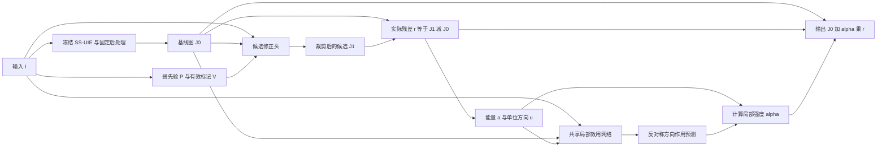

# SS-UIE 底座上的局部修正效用学习：本轮完整执行指南

> 版本：1.1；制定／修订日期：2026-10-07。  
> 执行对象：服务器上的 Codex。本文是本轮实现、验收、训练和评测的主规范。  
> 用户已恢复 `uie-prior-utility` 源码、配置基础环境并准备 LSUI、UIEB；旧 V3 训练权重已经丢失。不要假设旧权重仍然存在。  
> 用户确认的预算：**本轮累计最多 16 个 GPU 设备小时**。一个设备小时等于占用一张 GPU 一小时；使用两张卡一小时计两个设备小时。  
> 本轮默认一个训练种子。GPU 型号、显存与可用数量由服务器自动检测；不根据未提供的硬件信息承诺耗时。  
> 本文件要求实现完整核心机制。预算不足时缩小统一训练规模或如实收尾，不得删除核心机制、削弱对照后仍宣称完成验证。
> 1.1 修订：SS-UIE 指**作者官方公开简化实现**，不等同于论文完整模型；目前权重未取得，允许继续不依赖真实权重的构建和测试，正式训练仍须通过底座验收。详见 §3.5。

## 0. 给执行者的总指令

在现有仓库内新建独立实验模块，接入**SS-UIE 官方公开简化实现及其预训练权重**，冻结其权重，按实际依赖完成：

1. 恢复状态核对、上游模型验收、数据来源与交叉重复审计。
2. 实现本文定义的先验、候选修正头、局部效用网络、干预标签、对照、评测与恢复机制。
3. 完成公式单测、接口测试、数据隔离测试、小样本训练测试和中断恢复测试。
4. 测速、冻结预算及共同训练步数。
5. 训练候选头并检验是否存在可利用的修正空间。
6. 冻结候选头，生成真实效用标签，训练完整方法、关键对照及机制消融。
7. 冻结检查点，在校准集选取有限的部署参数；在开发集执行晋级判断。
8. 符合晋级条件时，解封本轮封存评估集一次，完成质量、压力、时延、视觉案例分析。
9. 无论通过、科学停止或因条件不足退出，都提交完整报告、原始结果、可恢复检查点及备份清单。

**不要停在“代码已经搭好，是否开始训练”的询问。** 用户已经授权按本文完成测试后的训练和评测；通过前置检查后自动推进。真实阻碍应记录、解释并处理，不能伪造完成状态。

**不要承诺算法一定涨点，也不要把计划文件视为已经验证过的算法。** 本文对公式与接口的核对，不等于服务器代码已通过测试，更不等于实验已经成功。

### 0.1 本轮唯一主问题

> 在同一个公开预训练增强底座、同一候选修正、相同可用训练数据下，使用实际修正方向的局部作用监督、同图先验干预和方向／强度一致性，能否比普通门控、已有误差预测融合思路及普通直接修正获得更好的名义部署质量？

“名义部署”指使用正常估计的先验，不人为制造错误。合成错误压力测试是补充证据，不能替代主问题。

### 0.2 本轮范围与禁止项

本轮完成 C 的新机制。A/B 只提供明确可控的先验失配来源；E 体现为复用公开底座、缓存冻结输出和控制预算。D、F、G 不自动重启。

禁止以下行为：

- 重新启动旧 MPA-Diff 的 400,000 步预训练，或六次独立大模型训练。
- 把旧 V3 的整图五分类选择器改名后当成本轮局部作用网络。
- 随机初始化 SS-UIE，却把结果写成公开预训练基线。
- 只比较完整方法与 SS-UIE，不比较同数据的普通修正、门控和误差融合。
- 以先验名称生成正负标签；名义先验不一定有益，扰动先验也不一定有害。
- 让参考图、误差标签、干预类别或数据角色进入部署网络输入。
- 测试集选检查点、选阈值、改损失、改干预幅度或改报告主指标。
- 看结果后提高预算、延长某一组训练、增加网络容量或换底座继续寻找涨点。
- 把只在合成错误上成立的收益写成正常部署收益，或把参考图 PSNR 提升写成恢复了真实物理颜色。
- 将 256×256 实验称作原分辨率部署验证。

### 0.3 术语约定

| 术语 | 本文件中的确切含义 |
|---|---|
| 底座 | 已经训练好的 SS-UIE 增强网络及冻结的输入／输出处理流程 |
| 冻结 | 参数不更新、优化器不包含它，且推理状态与批归一化统计量保持不变 |
| 候选头 | 接收输入、底座输出和先验，产生一张候选增强图的小网络 |
| 残差 | 候选图减底座图，即准备实施的实际改动，不是扩散噪声 |
| 局部效用 | 该改动在某个位置使参考图误差降低或升高的量 |
| 干预 | 固定图像和网络，只修改先验生成字段，然后重新产生候选 |
| 校准 | 在专用数据上选择事先规定的少量部署参数，不更新网络参数 |
| oracle | 使用参考图计算的理想决策，只衡量潜在空间，不能部署 |
| 对照 | 用来解释收益来源的比较方法；数据、候选和预算必须说明 |
| 消融 | 去掉一个规定机制，检查该机制是否有实际增量 |
| 场景组 | 同场景、连续帧或近重复内容构成的不可跨集合拆分单元 |
| 检查点 | 模型状态与训练恢复信息的保存文件，不只是一个网络名称 |
| 封存评估集 | 本轮设计冻结后才评估的数据；历史已经分析过时不能称全新盲测 |

## 1. 研究状态与证据边界

旧 V3 的代码与记录可用，但父模型权重缺失。本轮不依赖旧父模型，也不把新 SS-UIE 数字与旧 V3 数字拼成同一组消融。

本轮要检验三个假设：

- **H1：实际改动有用。** 读取候选实际修正，比只看输入难度和先验摘要更有帮助。这属于必要能力，不能单独视为原创。
- **H2：干预监督有增量。** 在同一图像上改变先验、重新产生候选，并监督真实作用，优于仅增加同样数据的普通门控／融合。
- **H3：一致性有增量。** 与改动方向和尺度一致的结构，能改善质量或错误修正识别；不是仅满足一个漂亮公式。

局部融合、误差估计、残差修正、回退都已有先例。只有 H2/H3 相对强对照的独立增量得到支持，才值得扩大为论文路线。

本轮是**单种子机制小试**。即使通过，也只进入后续确认阶段，不等于已经完成论文证据。至少三个新增模块训练种子、独立来源确认数据、第二底座、普通底座微调的进一步比较仍需后续完成。

## 2. 仓库策略：保留历史，独立实现

### 2.1 开始时记录

读取当前 Git 状态，记录分支、提交、未提交修改、Python/PyTorch/CUDA、GPU、磁盘、数据实际路径。不得清除用户修改。

本地已核对的恢复提交是 `f6921cfd97c969bc29ec77f1aa0fe7285992de13`，但服务器可能不同，以服务器实测为准。不要强行重置到此提交。

若已有合适实验分支，继续使用；否则从当前恢复状态建立 `research/ssuie-local-utility` 分支。这里只要求本地版本记录，不自动强推 GitHub，不覆盖历史。

### 2.2 建议目录和责任边界

以下是要实现的结构，**不是声称仓库已经有这些模块或命令**。允许为兼容现有工程调整文件名，但必须提交逐项映射表。

```text
uie_next/
  __init__.py
  cli.py                         # 本轮唯一命令入口；导入时不训练、不下载
  schema.py                      # 配置、角色、状态验证
  backbones/ssuie.py              # 固定官方模型的加载与接口
  data/manifest.py                # 成对清单、哈希、来源
  data/audit.py                   # 跨数据集重复及场景审计
  data/roles.py                   # 数据权限和角色隔离
  data/cache.py                   # 缓存身份、写入与失效检查
  priors/heuristic.py             # 明确命名的弱物理先验
  priors/interventions.py         # 字段级干预；不调用旧 invert/roll
  models/blocks.py                # 统一小型残差块
  models/candidate.py             # 先验头与 RGB 对照头
  models/utility.py               # 完整局部效用网络
  models/controls.py              # 门控、误差融合、误差投影、消融
  math/utility.py                 # a,b,c,u,v,U,alpha,oracle 的纯函数
  losses.py                      # 精确归一化的训练目标
  training.py                    # 候选阶段和效用阶段；角色不可混用
  calibration.py                 # 固定网格、并列规则
  evaluation.py                  # 同口径评测、逐图与逐组指标
  timing.py                      # 真正包含全部模块的测速
  checkpoint.py                  # 完整恢复、原子写入、哈希
  budget.py                      # 累计设备小时、保留额度
  pipeline.py                    # 状态机、续跑、失败收尾
  reporting.py                   # 表格、失败案例、最终报告
configs/uie_next/protocol.yaml
tests/uie_next/
third_party/ss_uie/               # 固定上游版本，独立检出
docs/experiments/<run_id>/
runs/<run_id>/
```

优先抽取现有数据哈希、指标、记录工具；复用前阅读实现并补充相关测试。`scripts/cde_v3/common.py` 绑定了旧路径、父权重与模式，不可整套照搬。`uie/models.py` 的旧 flow/DDIM 系统也不是本轮新方法。

新模块避免导入旧 `uie` 初始化中不必要的模型依赖。确认包配置实际包含 `uie_next`，并测试从仓库外的工作目录执行安装后的命令。

上游 SS-UIE 独立锁定提交、保留来源。不要为了消除导入问题重写其网络。其 `net` 绝对导入容易与其他包重名，必须验证最终加载文件确实来自锁定的上游目录。

## 3. 上游 SS-UIE 的精确接入

### 3.1 已核对的上游事实

- 官方仓库：<https://github.com/LintaoPeng/SS-UIE>。
- 本次查得提交：`88b23a1247d2d92ee7cf8dcad8f3b5079b6a20df`。
- 论文：Adaptive Dual-domain Learning for Underwater Image Enhancement，AAAI 2025。
- 推理构造为 `SS_UIE_model(in_channels=3, channels=16, num_resblock=4, num_memblock=4)`。
- 构造函数默认部分块数为 6，因此必须显式传入上述 4/4 参数。
- 官方推理使用 `H=W=256`、RGB、float32、输入除以 255。
- 官方模型含与空间尺寸相关的位置编码和频域权重。本轮不擅自改为任意长宽。
- 官方示例用 `DataParallel` 加载状态字典；实际键名以下载文件为准。
- 官方仓库提供预训练权重入口，但本指南制定时尚未下载并验证该文件。
- 2026-10-07 补充核查：作者在官方 Issue #1 说明，公开预训练模型是参数简化版，多尺度循环选择性扫描模块当时未开源。因此本轮底座必须标注为 `SS-UIE official public simplified implementation`，并列出实际源码提交、模型参数和权重哈希，不能声称完整复现 AAAI 论文模型。

作者证据：[简化版权重说明](https://github.com/LintaoPeng/SS-UIE/issues/1#issuecomment-2894406180)、[扫描模块未开源说明](https://github.com/LintaoPeng/SS-UIE/issues/1#issuecomment-2904097810)。这是模型身份修正，不要求猜测或补写未公开模块；本轮研究模块接收底座输出，不依赖该未公开模块的内部功能。

权重入口：

- Google Drive：<https://drive.google.com/file/d/1YxyagMCbApON8dRdiQTaQG65g3tnZkPt/view?usp=sharing>
- 百度：<https://pan.baidu.com/s/1E09432Bi-Fpm6Dv1veUCMQ?pwd=CKPT>，提取码 `CKPT`。

2026-10-07 下载状态：百度入口已返回“链接不存在”；本地与用户服务器访问 Google 发生连接失败，尚不能据此判断 Google 文件已删除，也没有确认新的可下载镜像。以上是来源记录，不是可用性保证；不要持续占用 GPU 等待下载。

服务器先寻找已经存在的官方权重；没有才从官方入口获取。记录实际文件 SHA-256、大小、来源和加载结果，不把下载页面链接当作权重文件。

### 3.2 加载与环境规则

1. 先检查已配置环境，禁止无条件重装全部依赖。
2. 重点验收 `mamba_ssm` 与 `selective_scan` 的 CUDA 前向；常规 PyTorch 能运行不代表该扩展可运行。
3. README 的建议环境与提供的 wheel 文件存在版本组合差别。以实际 Python、PyTorch、CUDA、ABI 匹配为准，不盲装不兼容 wheel。
4. 允许去除一个经过确认的 `module.` 键前缀；去除后必须严格加载，缺失／多余键均视为失败。
5. 不使用 `strict=False` 掩盖结构不一致，不用随机参数填缺口。
6. 加载后调用 `eval()`、关闭所有底座参数梯度；优化器中不得出现底座参数。
7. 新系统的 `train()` 不能把底座切回训练状态。测试前后完整检查底座参数与缓冲区，包括 BatchNorm 的运行统计量。
8. 初版使用 float32，关闭自动混合精度与 `torch.compile`。如扩展存在不可避免的非确定性，记录具体算子，不虚报逐位确定性。
9. 无法取得或运行正式权重时，可完成其余代码的合成测试，但正式训练状态必须为 `BLOCKED_BACKBONE`。不自动改用随机 SS-UIE 或旧 MPA-Diff。

### 3.3 输入与输出处理：先解决基线公平性

正式输入和参考图都按以下确定性流程处理：

1. 读取 8 位三通道图像，显式按成对清单定位，不按目录列表位置配对。
2. 使用 OpenCV `INTER_LINEAR` 统一缩放至 256×256；固定 BGR→RGB 转换及版本。
3. 变为 float32，除以 255，得到 `[3,256,256]` 的 `[0,1]` 数组。
4. 非三通道、损坏图、方向元数据或尺寸不匹配必须单独登记，不偷偷裁切错配图。
5. 本轮不使用随机裁块、翻转、旋转或颜色增强；这样冻结底座缓存与实际前向严格对应。以后增加增强必须重算相应底座输出和先验，不能假设底座等变。

官方 `test.ipynb` 使用 `save_image(..., normalize=True)`，它会按图像数值的最小值、最大值重新拉伸，并在保存时量化。这与直接裁剪到 `[0,1]` 不同。

因此先定义两种**无需参考图**的输出策略：

- `clip01`：`J = raw.clamp(0,1)`。
- `official_minmax_float`：每张图全部 RGB 像素共同取 `lo=raw.min()`、`hi=raw.max()`，`J=(raw-lo)/max(hi-lo,1e-5)`；不能按整个批次共同归一化。

在 §4 的 `model_val` 上比较这两种策略的逐图平均 PSNR，取更高者作为本轮底座输出 `J0`；差值不超过 `1e-8 dB` 时选 `clip01`。此选择只做一次，发生在候选训练之前。记录 `baseline_policy.json`，所有后续方法共用它。

两种策略都要保留在结果表中。若未选策略在后续评估上更强，它仍属于需要报告的强基线，不能隐藏。额外保存少量官方量化／原扩展名输出，仅用于复现检查，不能与浮点主指标混合。

**主指标直接基于统一后处理后的浮点张量计算。** PNG 仅供查看；禁止把 JPEG 再读回计算主结果。局部混合后的最终图不再执行 min–max 拉伸。

### 3.4 基线验收

至少完成：

- 官方裸网络与本轮适配层在同一预处理输入上的原始输出一致，float32 `max_abs_error <= 1e-5`；不通过先定位原因。
- 推理批量 1 和 2 的逐图结果一致到规定容差，排除跨图 min–max 混用。
- 两种后处理的人工小张量测试、常数图测试通过。
- 记录至少 20 张来源可用的开发图的指标、输入／输出与异常，检查通道、范围和颜色。
- 不能仅凭“能加载”和“输出好看”声称复现官方论文分数；分辨率、划分、后处理、指标口径不同必须注明。

### 3.5 缺失权重时如何继续构建（1.1 新增）

**研究模块可以继续实现；正式效果实验尚不能开始。** 本轮数学只要求有一个确定的冻结底座输出 J0，不依赖 SS-UIE 的未公开扫描模块。公开实现与论文完整模型不一致，影响底座身份、论文数字可比性和后续强基线验证，不会使 §7–§10 的局部修正公式失效。

| 当前可推进 | 必须等待正式权重并验收 |
|---|---|
| 仓库独立模块、配置校验、公开源码适配层 | 官方预训练网络实际加载与推理一致性 |
| 先验字段、七视图干预、候选头、局部效用头 | 根据真实底座输出选择后处理与冻结基线 |
| 全部控制、消融、损失、oracle 与校准代码 | 正式候选训练、真实 oracle 空间诊断 |
| 数据配对、重复筛查、角色守卫、暴露台账初稿 | 结合实际检查点来源最终确认暴露状态 |
| CPU 数学、合成张量反向、缓存失效、预算和恢复测试 | 真实效用缓存／标签、正式控制器训练和校准 |
| 评测程序、统计程序、报告模板 | 名义收益与机制归因、封存集评分 |

工程测试可使用人工构造的 I/J0/J1/Y，或仅供测试的确定性 `MockBackbone`。它必须位于测试代码或显式 `purpose=synthetic_debug` 的独立目录；所有产物记录 `is_scientific_result=false`，禁止被正式训练入口接受。不要为这些测试先训练一个替代大模型，也不要把随机 SS-UIE 输出作为真实效用训练数据。

尚未通过真实权重验收的测试标为 `pending_backbone`。合成测试通过不能把 T26、真实底座 T27 或 §17.4 第二／第三层改为正式通过；可以另列这些测试的合成版本。GPU 调试如发生仍计入 16 设备小时，优先使用 CPU 完成不依赖 GPU 的工作。

状态机按依赖调度：S1 中与权重无关的数据审计和 S2 的工程构建可交错推进。`BLOCKED_BACKBONE` 只阻止依赖正式底座的训练与评测，不应使可独立完成的代码工作停止。`state.json` 分别记录 `engineering_status` 和 `scientific_status`；例如前者为 `MODULES_READY_PENDING_BACKBONE_TESTS`，后者为 `BLOCKED_BACKBONE`。不能因此把整个 S2 或 S3 标成已正式验收完成。

正式权重到位后，优先检查用户指定的 `/mnt/workspace/TEMP-FILE-STATION/`，核对来源、文件类型、严格加载和哈希。重新执行真实底座验收、真实小样本训练和吞吐测量；正式配置与缓存仅使用此次确认的身份，随后在剩余预算内推进。合成测试产物绝不转成正式检查点。

如果最终换成另一种公开预训练底座：候选／效用数学、控制组、统计和大部分工程设施可以保留，但必须修订底座适配、预处理、权重来源和暴露审计，并重新生成 J0、候选、标签、校准和全部正式比较。不能只换文件名加载不同权重，也不能继续把结果称为 SS-UIE 实验。本文件未自动授权这种科学配置切换；在明确选定新底座后登记协议修订再运行。

使用公开简化底座得到正收益，首先支持该固定公开底座条件下的方法有效性。它仍有研究意义，但单独超过这一底座不能证明优于论文完整 SS-UIE 或现有最强方法；后续论文确认仍需强对照、独立数据及第二种可复现底座。

## 4. 数据审计与角色：先决定能证明什么

### 4.1 两个数据集存在，不等于标签独立

SS-UIE 官方说明使用 LSUI。先审核下载权重的训练说明、作者划分以及实际数据文件。至少将**全部可获得 LSUI**与 UIEB 做交叉审计，而不只比较本轮候选训练的一个子集。

对每对图记录：来源数据集、原路径、相对 ID、文件哈希、解码 RGB 哈希、尺寸、参考图哈希、来源／场景线索、已知历史用途。

审计应包括输入↔输入、参考↔参考、输入↔参考的完全重复；感知哈希、缩略图、可用场景元数据用于发现近重复候选。近重复阈值不能被描述为已证明场景相同或不同，需保存证据和抽样接触图。

已知同场景和近重复连通分量合并为组，整个组必须放入同一角色。不能仅通过随机划分文件名声称实现了场景隔离。

为避免执行者随意挑阈值，默认近重复筛查固定如下：

1. 对所有输入与参考统一计算解码 RGB 完全哈希；完全重复必连边。
2. 灰度图变成 float32 `[0,1]`，用 `INTER_AREA` 缩到 32×32，做二维 DCT，取左上 8×8 的非 DC 共 63 项，以这 63 项中位数二值化，得到 pHash；Hamming 距离表示不同比特个数。
3. 另把灰度图缩到 16×16、归一到 `[0,1]`，计算缩略图 MSE。
4. `pHash Hamming <= 4` 或 `16×16 MSE <= 1e-5` 的配对列为近重复候选；记录来源、分数和接触图。已知视频／采集场景 ID 即使未过图像阈值也要连边。
5. 本轮对未能排除关系的候选采取保守连边，求连通分量；跨 LSUI/UIEB 连通分量的 UIEB 样本排除出效用池。允许记录“可能过度合并”，不能声称阈值完成了语义场景识别。
6. 图像色彩和尺寸异常、近常数图、对齐错误另列审计问题；不要靠它们产生的相似性证明同一场景，也不要私自给测试样本挑特例。

可采用索引避免全矩阵保存，但最终连边规则不变。不得根据哪个拆分得到更高分来调整审计阈值。

如果没有真实场景标识，报告 `content_group_proxy`，即内容近似分组；不能将它写成已核实的真实场景独立性。

### 4.2 暴露状态必须分层记录

| 状态 | 含义与用途 |
|---|---|
| `known_upstream_train` | 已知底座训练使用；可用于候选头训练，不能用于独立效用标签论证 |
| `documented_nonoverlap` | 上游声明的数据来源与本数据不同，且对可获得上游数据完成交叉审计、未发现重叠；这是一项有范围的证据，不是无限保证 |
| `unknown_upstream_exposure` | 缺乏来源说明或无法完成必要比对；不能当作未见数据 |
| `historically_analyzed` | 旧轮次已经观察过结果；即使不在本次训练中，也不能称新盲测 |

一个样本可同时拥有 `documented_nonoverlap` 和 `historically_analyzed`。前者涉及底座训练，后者涉及研究者选方案的历史，二者不能相互抵消。

### 4.3 默认数据安排

**候选训练池：LSUI。** 优先使用能对应作者清单的训练部分；内部按组分成 `model_fit:85%`、`model_val:15%`。底座见过它们是预期状态，报告为底座暴露数据。

若作者训练清单无法完整对应，但本地 LSUI 配对无误，可以把本地 LSUI 作为“底座暴露的开发／候选训练池”重新按组分配。此时 LSUI 不再充当本轮独立测试，也不报告复现作者 Test-400 的结论。这个降级必须记录，不能伪造作者划分。

**效用研究池：经审计后可用的 UIEB。** 排除与全部可获得 LSUI 重叠的组、无法确认配对的图和来源无法满足标签条件的组。剩余组按固定种子分为：

| 角色 | 组数比例 | 可用操作 | 禁止操作 |
|---|---:|---|---|
| `utility_fit` | 50% | 效用标签、控制器梯度、训练尺度统计；同数据对照继续训练 | 作为最终确认 |
| `utility_val` | 15% | 候选空间诊断、固定检查点选择、开发晋级判断 | 梯度训练、训练尺度估计 |
| `calibration` | 15% | 网络冻结后的有限阈值／固定强度选择 | 选网络检查点、训练网络、改架构 |
| `sealed_eval` | 20% | 所有选择冻结后的最终一次评测 | 用于任何模型／阈值选择 |

算法：先按稳定 `group_id` 排序，再用 `split_seed=20261007` 对组索引作一次随机置换；前三份分别取 `floor(0.50G)`、`floor(0.15G)`、`floor(0.15G)`，其余给封存集。按组数分配，不拆大组补图数。记录各组图数，避免把组比例冒充图像比例。

操作性最低数量预登记为：`utility_fit >= 80 组且 >= 100 对`；`utility_val >= 25 组且 >= 40 对`；`calibration >= 25 组且 >= 40 对`；`sealed_eval >= 40 组且 >= 60 对`。这些不是统计功效保证，只是防止极小数据被包装为完整小试。

如审计后 UIEB 大量与 LSUI 重叠或达不到上述条件，**不能把已知暴露样本塞回效用池**。完成可做的工程测试后以 `BLOCKED_DATA` 收尾，交付缺口清单。下一轮可引入新的成对数据，或另行设计可审计的底座训练；本轮不自动花费预算重训底座。

### 4.4 历史封存边界

此前 UIEB/LSUI 的结果已经用于研究决策。因此默认将 `sealed_eval` 命名为“本轮封存评估”，并记录历史暴露，不能直接称“全新独立盲测”。同一图像只换了文件名或重新划分，不会清除历史暴露。

本轮公开数据上的通过，只能支持进入新的确认实验。论文最终仍应有真正未用于选方案的独立来源或新场景数据。

### 4.5 数据文件合同

至少保存：`all_pairs.jsonl`、`cross_dataset_audit.json`、`groups.json`、`roles.jsonl`、`exposure_ledger.json`、`split_freeze.json`。每条样本必须包含：

```json
{
  "sample_id": "dataset/stable_id",
  "group_id": "stable_group_id",
  "group_quality": "scene_verified_or_content_group_proxy",
  "input_path": "resolved_at_server",
  "reference_path": "resolved_at_server",
  "input_sha256": "computed",
  "reference_sha256": "computed",
  "decoded_input_sha256": "computed",
  "decoded_reference_sha256": "computed",
  "role": "utility_fit",
  "upstream_exposure": "documented_nonoverlap",
  "historically_analyzed": true,
  "source_evidence": ["audit_record_id"]
}
```

不能只生成文档中的角色表而不在数据加载器中检查。训练入口收到校准或封存角色时必须报错；首次解封评估必须检查冻结清单已完整生成。

## 5. 推理计算图与张量合同



| 符号 | 形状 | 含义 | 推理可用 |
|---|---|---|---|
| `I,Y,J0,J1,r,u` | `[B,3,256,256]` | 输入、参考、底座、候选、实际改动、单位方向 | 只有 Y 不可用 |
| `P` | `[B,7,256,256]` | 先验复原 RGB、透射率 RGB、越界比例 | 是 |
| `V` | `[B,1,256,256]` | 先验有效位置 | 是 |
| `a,c,active` | `[B,1,256,256]` | 能量、能量平方根、有效残差掩码 | 是 |
| `b,v,U` | `[B,1,256,256]` | 参考图定义的真实作用与效用 | 否，仅监督／诊断 |
| `v_hat,b_hat,alpha` | `[B,1,256,256]` | 预测作用与部署强度 | 是 |

训练和部署共用同一个 `restore()` 数学实现。部署接口不得要求 `Y`、目标误差、干预编号或数据角色作为网络输入。

## 6. 先验与干预：本轮实现的确切对象

### 6.1 弱先验 P0

本轮使用可审计、无需丢失权重的弱先验。它不是单目深度网络，也不是 A/B 完整物理模型。

令 `blur` 为输入 I 的 9×9 均值滤波，边界使用 replicate padding。定义：

$$
d(x)=\operatorname{clip}\left(0.5+\operatorname{blur}_G(x)-\operatorname{blur}_R(x)-\frac13\sum_c|I_c(x)-\operatorname{blur}_c(x)|,0,1\right).
$$

`d` 只是颜色／局部对比度代理，数值大不等于真实距离大。固定：

$$
k=(2.4,1.2,0.8),\quad \tau_c(x)=k_cd(x),\quad t_c(x)=\max(e^{-\tau_c(x)},0.05),
$$

$$
A_c=\operatorname{clip}\left(\max_x\operatorname{blur}_c(x),0.05,0.95\right),\quad
Q_c^{raw}(x)=\frac{I_c(x)-A_c(1-t_c(x))}{t_c(x)}.
$$

`tau` 是本计算模型的有效光学厚度；A 是背景光代理。它们不代表已经校准的真实水体参数。再定义：

$$
Q=\operatorname{clip}(Q^{raw},0,1),\quad
q(x)=\frac13\sum_c\mathbf1[Q_c^{raw}(x)<0\ \text{或}\ Q_c^{raw}(x)>1],\quad P=\operatorname{concat}(Q,t,q).
$$

名义条件 V=1。所有输入、字段、输出必须有限；非有限原图是数据错误，不能静默替换。干预造成的无效先验位置设 `P=0,V=0`，并记录比例。

不要直接调用旧 `corrupt_prior(invert/shift)`。必须保存并修改生成字段 d、tau、A，重新计算 t、Q、q。先验分支没有训练参数，不反向优化到一个任意可变物理场。

### 6.2 候选训练时的缺失策略

每张候选训练图以概率 0.2 将整张 P 清零、V 设为 0；其余使用名义先验。I 和 J0 不改变。随机流固定并可恢复。

V=0 表示先验缺失，不表示该像素一定要输出 J0。候选头仍可使用 I/J0；真正的回退由后续效用机制决定。

### 6.3 效用训练的七个固定视图

每张效用图构造下表全部视图，始终固定 I、Y、底座和候选头。

| 编号 | 字段变化 | 说明 |
|---|---|---|
| 0 | 无 | 名义部署条件 |
| 1 | `tau = 0.75 * tau0` | 较弱的有效衰减 |
| 2 | `tau = 1.25 * tau0` | 较强的有效衰减 |
| 3 | `A = clip(A0 + [0.04,0,-0.04],0.05,0.95)` | 背景光颜色偏差 |
| 4 | `A = clip(A0 + [-0.04,0,0.04],0.05,0.95)` | 反向背景光颜色偏差 |
| 5 | 将 d 向右平移 2 像素，再算 tau | I 不移动；新暴露边界 V=0 |
| 6 | 将 d 向左平移 2 像素，再算 tau | 不使用环绕平移 |

除指定字段外，其他字段取名义值。尺度操作发生在归一化代理得到之后，不再把缩放后的 d/tau 重新 min–max 归一化，否则尺度干预会被抵消。

空间平移用非环绕采样，平移后的有效掩码决定无效边界；先重算派生字段，最后把无效位置 P 清零。不能把 Q、t、q 直接分别移动后假称物理重计算。

每个视图都重新运行候选头，产生新的 J1，再计算实际 r 和标签。模型输出不随这些输入改变时，必须报告先验未被有效使用，不能仍然宣称识别了先验错误。

### 6.4 预登记的未见压力视图

不用于网络训练、检查点选择或校准，仅在开发诊断／最终压力评估中使用：

1. `tau=0.5*tau0`。
2. `tau=1.5*tau0`。
3. `A=clip(A0+[0,0.06,0],0.05,0.95)`。
4. d 向下平移 4 像素，边界 V=0。
5. d 经 9×9 replicate 均值滤波后重算先验。
6. P/V 中央 64×64 区域设为 0。

这是预先定义的合成压力，不是实测水体错误分布。不得根据哪种错误产生最大收益来选择性报告。

## 7. 候选头与基础网络：不留结构猜测

### 7.1 共用残差块

所有新网络不使用 BatchNorm、Dropout、整图平均池化或隐藏的预训练特征。卷积 stride=1；3×3 卷积 padding=1；激活为 SiLU。

一个宽度 w 的残差块固定为：

```python
def block(x):
    return x + 0.1 * conv3x3_2(silu(conv3x3_1(x)))
```

两层卷积都为 w→w，带偏置。残差系数 0.1 是固定工程参数，不是待搜索的贡献。

未另行指定的卷积初始化采用 PyTorch `Conv2d.reset_parameters()` 对应的 `kaiming_uniform_(a=sqrt(5))` 与偏置均匀初始化，随后覆盖规定的零末层。固定库版本、初始化随机流并记录初始权重哈希。所有 stem 为带偏置 3×3 卷积加 SiLU；最后一层后不再加激活，除非明确规定候选 tanh 或门控 sigmoid。

### 7.2 先验候选头

- 输入 `concat(I,J0,P,V)`，共 14 通道。
- `Conv3x3(14,32) + SiLU`。
- 6 个上述残差块，宽度 32。
- `Conv3x3(32,3)`，末层权重和偏置全零初始化。
- 输出：

$$
J_1=\operatorname{clip}\left(J_0+0.25\tanh\delta_\theta(I,J_0,P,V),0,1\right).
$$

实际残差必须定义为裁剪后的 `r=J1-J0`。不得把裁剪前 `0.25*tanh(delta)` 当作 r 计算标签。

零初始化的验收：初始 J1 与 J0 完全相同。候选训练只用 `model_fit` 的参考图，以 RGB 均方误差训练；检查点在 `model_val` 选择。

### 7.3 RGB 候选对照

与先验头结构、初始化、训练步数、样本顺序相同，使用：

```text
P_rgb = concat(I, ones_like(I), zeros_like(I[:, :1]))
V_rgb = ones_like(I[:, :1])
```

同样按概率 0.2 清零 `P_rgb,V_rgb`。这个对照有相同输入维数和可训练参数，但没有物理先验派生字段。其作用是判断增加一个小修正网络本身能解释多少收益。

先验头和 RGB 头都必须从各自零初始化开始，不能给完整方法更好的热启动。

## 8. 局部效用的数学合同

### 8.1 精确标签和损失变化

对像素的三个 RGB 通道取均值，空间维度不在此处平均。令 `e=Y-J0`：

$$
a=\operatorname{mean}_{RGB}(r^2),\qquad b=\operatorname{mean}_{RGB}(e\,r),\qquad U=2b-a.
$$

U 是**采用完整候选**相对基线的局部 MSE 降低量；U>0 才表示该满强度改动有益。b>0 只表示方向有向参考图靠近的成分，不意味着 alpha=1 一定有益。

对逐像素、三通道共享的标量 `0<=alpha<=1`：

$$
J_\alpha=J_0+\alpha r,\qquad
\ell(J_\alpha,Y)-\ell(J_0,Y)=a\alpha^2-2b\alpha.
$$

等价关系：

$$
2b=\ell(J_0,Y)+a-\ell(J_1,Y).
$$

这说明方向作用与端点误差预测密切相关。公式是平方损失恒等式，不是算法原创本身。

### 8.2 稳定的方向表示

$$
c=\sqrt a,\quad active=(c>10^{-6}),\quad u=r/c,\quad
v=\operatorname{mean}_{RGB}(e\,u),\quad b=cv.
$$

实现时先构造安全分母：inactive 位置用 1，再将 u 设为 0；不能先执行除零再希望 `torch.where` 修复 NaN。

inactive 位置 `v_hat=b_hat=alpha=0`。真实 a/b/U 仍可用于数值审计；投影训练忽略 inactive 位置。a、c、u 都不依赖 Y。

### 8.3 完整效用网络

共享网络 `h_phi`：输入 `concat(I,J0,u)` 为 9 通道；`Conv3x3(9,32)+SiLU`；4 个共用残差块；末层 `Conv3x3(32,1,bias=False)`，权重全零初始化。

$$
\hat v(I,J_0,u)=\frac{h_\phi(I,J_0,u)-h_\phi(I,J_0,-u)}2,\qquad \hat b=c\hat v.
$$

两次前向必须共享同一组参数。可将正负方向合并成一个批次执行，但拆分时不得串错图像／视图。输出是全分辨率单通道有符号图，不可使用 sigmoid/softplus 把它强制为正。

网络 h 内不输入原始残差幅度 c、r、先验 P、干预类别、参考图或组 ID；幅度只在外部乘回 c，并用于决策分母。

在 active 掩码不发生变化、整个残差共同变换的条件下：

$$
\hat b(-r)=-\hat b(r),\qquad \hat b(sr)=s\hat b(r),\quad s>0.
$$

测试该性质时直接改变残差，不对虚拟候选再裁剪。若裁剪改变了实际差分，应重算 r；不能继续要求未裁剪的尺度关系成立。

上述性质不等于逐像素单独翻号的等变性，也不等于最终 alpha 或 J_alpha 对尺度不变。tau、lambda、范围截断和边界都会影响最终决策。

### 8.4 部署决策与训练时决策

$$
\alpha=\operatorname{clip}\left(\frac{\hat b-\tau}{a+\lambda},0,1\right),\qquad \tau\ge0,\ \lambda>0.
$$

训练时固定 `tau=0, lambda=1e-4`。训练结束只在校准阶段搜索 §13 的有限网格，不反向更新参数。

若 J0/J1 都在 `[0,1]`，混合结果天然在范围内。允许为浮点舍入作最终 `clamp(0,1)`，但必须测试它没有实质改变公式；不可随后作亮度拉伸、白平衡或其他未登记处理。

推理主函数参考：

```python
def restore_from_candidates(image, base, candidate, h, tau, lam):
    residual = candidate - base
    a = residual.square().mean(dim=1, keepdim=True)
    c = a.sqrt()
    active = c > 1e-6
    safe_c = torch.where(active, c, torch.ones_like(c))
    u = torch.where(active, residual / safe_c, torch.zeros_like(residual))
    v_hat = 0.5 * (h(torch.cat([image, base, u], 1))
                   - h(torch.cat([image, base, -u], 1)))
    b_hat = torch.where(active, c * v_hat, torch.zeros_like(c))
    alpha = ((b_hat - tau) / (a + lam)).clamp(0.0, 1.0)
    alpha = torch.where(active, alpha, torch.zeros_like(alpha))
    output = base + alpha * residual
    return output, alpha, b_hat
```

这是公式参考，不是已经运行的服务器实现。实现时补充形状、dtype、范围和非有限检查。

### 8.5 不存在自动“不退化保证”

真实 b 可见时，用其正确下界决策可以推导特定 MSE 性质；学习的 b_hat 与校准 tau 没有天然满足下界条件。必须报告真实逐图退化比例和尾部损失。

局部平方损失关系也不直接保证 SSIM、LPIPS、颜色真实性或检测任务收益。

### 8.6 oracle 只能做诊断

像素 oracle：active 位置 `alpha*=clip(b/a,0,1)`，其余 0。

粗区域 oracle：将 256×256 图划成不重叠 32×32 块，共 8×8 块。每块计算 `A=mean_pixels(a)`、`B=mean_pixels(b)`，块内统一 `alpha*=clip(B/A,0,1)`；零 A 块用 0。不得先逐像素求 alpha 再平均，二者一般不同。

硬选择 oracle：每张图比较完整 J0 与 J1，按整图 MSE 选择其一。

三者均要标记 `uses_reference=true`，不进入可部署方法排序、测速优胜列表或主结果最强控制选择。

## 9. 效用标签、缓存及训练损失

### 9.1 冻结后生成标签

候选头选定后，记录其检查点哈希并冻结。对 `utility_fit/utility_val` 生成全部七视图；校准与封存评估的参考标签只能由各自允许的评估过程读取。

效用训练时只允许候选头和底座的前向缓存；二者均不参加反向传播。若候选权重、底座、后处理、尺寸、先验或干预改变，全部受影响的缓存必须失效。

缓存身份至少包括：源图哈希、预处理配置、底座提交与权重哈希、后处理策略、候选权重哈希、先验版本、干预规范、形状和 dtype。加载缓存先检查身份，不能只看文件存在。

首轮缓存统一 float32。可以仅缓存 J0 与各视图 J1，加载后从它们和 Y 计算 r/a/b/v；不要反复保存同样的大张量。实际生成前计算所需磁盘空间，加至少 25% 余量。

不允许把 J1 保存为 JPEG 或 8 位 PNG 再算训练标签。缓存生成使用 `no_grad()`；缓存得到的普通张量可以输入待训练的小网络，不把依赖特殊 inference tensor 语义的对象直接送入反向。

随机抽取 16 个允许角色样本，比较缓存与实时前向：J0/J1 `max_abs <= 1e-5`，公式标签误差按 §17 容差。实际写入采用临时文件后原子替换，保存样本索引和校验值。

### 9.2 训练集尺度统计

只使用 `utility_fit` 的七视图和真实标签计算固定尺度，每张原图、每个视图权重相同：

$$
s_v=\max(\sqrt{\mathbb E[v^2\mid active]},10^{-3}),\quad
s_U=\max(\sqrt{\mathbb E[U^2]},10^{-4}),\quad
s_e^2=\max(\mathbb E[\ell(J_0,Y)],10^{-4}).
$$

`s_e2` 存储的是 MSE 尺度，不要再额外平方。统计应先每图平均，再对图平均；active 的 v 每图仅在 active 位置平均，无 active 的图不贡献投影项。保存有效图数、active 比例、实际尺度与原始分布。

如果几乎所有图无 active，转入候选无效诊断，而不是靠尺度下限掩盖无标签问题。

同一训练种子的完整方法与对照使用同一份尺度文件。校准、开发、封存数据不参与尺度估计。

### 9.3 视图采样和图像权重

每个效用更新使用 **4 张源图 × 每图 2 个视图**。每对视图固定包含名义视图 0，另一视图从 1–6 均匀选择。采样先均匀选组、再在组内选图，避免大连续帧组支配训练。

同一个源图两个视图必须同批可对应；不要把不同图随机配成“同图干预”。每图先对两个视图和像素平均，再对源图平均。梯度累积按源图数量加权，不能把每个像素当作独立样本。

各有干预方法使用相同的源图／视图随机流。无干预消融重复名义视图，以保持源图数量和前向次数；两个名义视图的成对差为零。

### 9.4 三项损失的完整定义

定义 Huber 函数 `rho(z)=0.5*z^2`（|z|<=1），否则 `|z|-0.5`；对应 `smooth_l1_loss(beta=1)`。

投影损失：

$$
L_{proj}=\operatorname{mean}_{image,view,active\ pixel}\rho\left((\hat v-v)/s_v\right).
$$

满强度预测效用 `U_hat=2*c*v_hat-a`。同图名义视图 m=0 与干预视图 n 的成对损失：

$$
L_{pair}=\operatorname{mean}_{image,pixel}\rho\left(\frac{(\hat U_m-\hat U_n)-(U_m-U_n)}{s_U}\right).
$$

成对损失在至少一个视图 active 的像素上计算；两者都 inactive 时不计。inactive 视图预测作用为 0，不能用其他图的标签替代。

部署损失：

$$
L_{dec}=\frac{\operatorname{mean}_{image,view,pixel,RGB}(J_\alpha-Y)^2}{s_e^2},
$$

训练 alpha 使用 `tau=0, lambda=1e-4`，与推理共用函数，不使用 oracle alpha。

完整损失固定为：

$$
L=L_{proj}+0.25L_{pair}+0.1L_{dec}.
$$

首轮不搜索这些权重、不增加未登记的感知／对抗／频域损失。保留每项未归一化与归一化数值，以及梯度范数，防止某项因单位问题完全支配训练。

末层零初始化使初始 b_hat=0，alpha 可能在截断边界上。投影监督必须能提供非零梯度；不能仅看最终重建损失后判断网络无法启动。单测需要覆盖此情形。

## 10. 必做对照与机制消融

### 10.1 完整矩阵

所有方法共用 SS-UIE 权重、输入尺寸、正式后处理、角色清单和评测函数。若方法不使用候选，就不能把候选计算偷偷计入或省略后不说明。

| ID | 方法 | 新训练内容／数据 | 回答的问题 |
|---|---|---|---|
| B0 | 冻结 SS-UIE，两个后处理分别报告 | 无 | 是否超过公开底座 |
| B1 | 恒用先验候选 J1 | 候选头／model_fit | 是否只是候选头产生收益 |
| B2 | 全局固定 alpha | 仅 calibration 选 5 个值 | 是否只需固定减小修正 |
| B3 | 恒用 RGB 候选 | RGB 头／model_fit | 是否只需普通图像修正 |
| B4 | 数据匹配的 RGB 继续训练 | 从 B3 出发，model_fit 与 utility_fit 的参考监督 | 是否只是多看标注数据 |
| G0 | 简单线性局部门控 | utility_fit 七视图 | 简单局部规则是否已足够 |
| G1 | 同参数量级神经门控 | utility_fit 七视图 | 同样干预数据与常规门控是否足够 |
| G2 | 约匹配完整网络计算量的神经门控 | utility_fit 七视图 | 完整方法是否只多做了网络计算 |
| F0 | 误差协方差预测与凸融合 | utility_fit 七视图 | 是否只是已有误差预测融合思想 |
| R0 | 先估计基线误差，再投影到候选 | utility_fit 七视图 | 是否只需预测通常的恢复误差 |
| O | 完整局部效用方法 | utility_fit 七视图 | 本轮待验证方法 |
| O-NI | O 去掉干预训练 | 同源图，只有名义视图 | 干预样本是否有贡献 |
| O-NP | O 去掉成对损失 | 七视图，eta_pair=0 | 成对作用目标是否有贡献 |
| O-NS | O 去掉方向／尺度结构 | 七视图，近似同参数网络 | 结构约束是否有贡献 |
| O-ND | O 去掉部署损失 | 七视图，eta_dec=0 | 决策重建是否必要 |
| Q* | 像素／粗块／硬选择 oracle | 不训练，使用参考图 | 候选的潜在可利用空间 |

表中 B4、G0、G1、G2、F0、R0、O、四个 O 消融共 11 个效用阶段训练作业；另有两个候选训练作业。必须在预算计划中逐项计价，不能漏算。

本轮不全量微调 SS-UIE。B4 是普通轻量修正的数据匹配控制，不能被称作已经排除了所有全底座微调方案。若本轮通过，论文阶段仍需可负担的 SS-UIE 微调／适配比较。

### 10.2 B2：固定强度

在 calibration 名义条件比较 `alpha in {0,0.25,0.5,0.75,1}`。按平均逐图 PSNR 选一个全局值，整个后续集合固定；并列选择较小强度。不得每图看参考图选强度。

### 10.3 B4：数据匹配普通继续训练

从 B3 在 model_val 选择的检查点出发。每更新 8 张图：4 张 model_fit、4 张 utility_fit；分别按组均匀采样。继续用 RGB 候选输入及 MSE，候选幅度仍为 0.25。

不使用 utility_val/calibration/sealed_eval 梯度。效用阶段各方法获得的新增标注来源均为 utility_fit，B4 获得同样的来源。它是否获得更多／更少的重复样本、前向次数和 GPU 时间均要报告，不以“同数据”掩盖训练量差异。

### 10.4 G0/G1/G2：普通门控

共同输入 `concat(I,J0,r)`，9 通道；标签通过实际输出重建给出，不使用干预名称。

- G0：`Conv1x1(9,1)`，零初始化，输出 logit。
- G1：宽 32、4 个 §7 残差块，单次前向，末层 1 通道且零初始化。
- G2：与 G1 同深度，宽 45，单次前向；目的是近似匹配 O 的两次共享前向计算量，不承诺恰好同 FLOPs，实际统计参数／MAC／时延。

训练 `alpha=sigmoid(logit)`，使用 `L_dec`，不使用 oracle 强度。初始 alpha=0.5。校准时按 §13 允许有限缩放／收缩。G1 参数量与 O 接近但计算更少，G2 参数更多，两者共同报告，不能只挑较弱者比较。

### 10.5 F0：强误差预测融合控制

此处实现的是受 CsNet／最优恢复融合启发的**本地适配控制**，不是宣称完整复现了原论文代码或分数。

输入 `concat(I,J0,J1)`，9 通道；宽 32、4 残差块；输出 3 个通道 `z0,z1,zrho`。预测误差二阶矩：

$$
\hat C_{00}=s_e^2\,softplus(z_0)+10^{-8},\quad
\hat C_{11}=s_e^2\,softplus(z_1)+10^{-8},\quad
\hat C_{01}=0.999\tanh(z_\rho)\sqrt{\hat C_{00}\hat C_{11}}.
$$

这样预测的 2×2 矩阵为半正定，避免独立输出任意协方差导致负二次项。目标值为：

$$
C_{00}=\operatorname{mean}_{RGB}(J_0-Y)^2,\quad
C_{11}=\operatorname{mean}_{RGB}(J_1-Y)^2,\quad
C_{01}=\operatorname{mean}_{RGB}[(J_0-Y)(J_1-Y)].
$$

理论上 `a=C00+C11-2*C01`、`b=C00-C01`。推理：

$$
\alpha_F=\operatorname{clip}\left(\frac{\hat C_{00}-\hat C_{01}-\tau}{\hat C_{00}+\hat C_{11}-2\hat C_{01}+\lambda},0,1\right).
$$

F0 使用七视图，同样的图像顺序。损失为三项 C 预测误差除以 `s_e2` 后的平均 Huber，加 `0.25 * L_pair_F + 0.1 * L_dec_F`；其中满强度预测效用 `U_hat_F=C00_hat-C11_hat`，成对目标仍是真实 U 差。

F0 因而同时获得相同干预样本、成对真实作用信息和部署损失，避免故意限制已有融合思路。末层权重零初始化，按下一段固定偏置，测试非饱和梯度。

固定其三个偏置为 `log(expm1(1))`、`log(expm1(1))`、`atanh(0.9/0.999)`；对角项的实际初值为 `s_e2+1e-8`。禁止在不同 seed 中改这个初始化。loss 中三项误差分别除以 `s_e2` 后取 Huber，再先对三项平均、对视图／像素平均，最后对源图平均。

### 10.6 R0：普通误差预测后投影

输入 `concat(I,J0)`，6 通道；宽 32、4 残差块；末层输出三通道 `e_hat`，零初始化，不经过有界激活。这里 `e_hat` 估计 `e=Y-J0`。

对每个候选视图计算 `v_hat=mean_RGB(e_hat*u)`、`b_hat=c*v_hat`，用与 O 相同的决策。误差网络每张源图只需前向一次，再用于两个视图。

损失为 `mean Huber((e_hat-e)/sqrt(s_e2)) + 0.25*L_pair + 0.1*L_dec`。R0 同样满足一些方向／尺度关系；若它达到相同性能，不能把一致性本身当成本方法的排他优势。

### 10.7 O 的四项消融

- O-NI：只用名义视图，重复两份保持计算；成对项恒零，其余与 O 一致。
- O-NP：七视图和结构保留，成对损失权重为 0。
- O-NS：输入 `concat(I,J0,u,c)` 共 10 通道的单次小网络直接预测 v；其余标签、损失与决策不变。无正负共享差分，且输入幅度使正齐次关系不再强制成立。报告轻微参数差别与少一次前向，不能声称计算完全相同。
- O-ND：七视图、结构、投影和成对损失保留，部署损失权重为 0。

O-NS 输出不可强制为正，不能故意选择损害其表达能力的激活。所有消融从同种子初始化，按相同预算规则训练，不能直接沿用完整方法权重后删除模块。

### 10.8 参数计数验收

G1/G2/F0/R0/O-NS 的输出卷积均带偏置；O/O-NI/O-NP/O-ND 的共享 h 输出层不带偏置。按本文准确结构计算，可训练参数应为：

| 网络 | 参数数 |
|---|---:|
| 先验候选头／RGB 候选头／B4 的 RGB 头 | 115,907 |
| O 及保留结构的消融 | 76,896 |
| G0 | 10 |
| G1 | 76,897 |
| G2 | 150,256 |
| F0 | 77,475 |
| R0 | 76,611 |
| O-NS | 77,185 |

上述不包含冻结 SS-UIE。O 的正负两次前向共享参数，不能把参数计成两份；但计算成本必须计两次。参数数不符时先检查实际结构，不直接修改表中期望值让测试通过。

## 11. 训练配方与检查点选择

### 11.1 固定优化配方

| 项目 | 候选头／RGB 头 | 效用方法、对照及消融 |
|---|---|---|
| 精度 | float32 | float32 |
| 优化器 | AdamW | AdamW |
| 初始学习率 | 1e-4 | 1e-4 |
| betas / eps | (0.9,0.999) / 1e-8 | 相同 |
| weight decay | 1e-4 | 1e-4 |
| 梯度裁剪 | 总范数 1.0 | 相同 |
| 学习率计划 | 前 5% 更新线性 warmup，之后 cosine 到 1e-5 | 相同 |
| 有效批量 | 8 张源图 | 4 张源图，每图两视图；B4 为 4+4 张 |
| 数据增广 | 无 | 无；只有规定的先验干预 |
| 更新数 | 吞吐预算确定的 N_candidate | 所有训练方法共用 N_utility |
| 检查点候选 | 0/25%/50%/75%/100% 更新 | 相同 |
| 选择集合 | model_val | utility_val 名义条件 |

不足显存时使用梯度累积维持有效批量。每图两视图允许分次前向，但成对项必须保留正确梯度关系。不能按显存大小偷偷改变学习率或图像尺寸。

初始化种子 `20261007`。为数据、视图、初始化、候选缺失分别建立有名字的独立随机流，保存其状态。不要依赖 Python 进程随机的 `hash()` 产生持久种子。

优化器对所有本轮可训练参数使用相同 weight decay，不另设未登记的偏置／归一化参数组。学习率按将执行的第 j 次更新（j 从 1 开始）确定：`W=max(1,ceil(0.05*N))`；`j<=W` 时 `lr=1e-4*j/W`；其余 `lr=1e-5+0.5*(1e-4-1e-5)*(1+cos(pi*(j-W)/(N-W)))`。先设置该更新学习率，再执行优化器；恢复时使用保存的 global_step，不能重启 warmup。

候选训练也先均匀选 model_fit 组、再在组内选图。B4 的两个数据角色独立采样；其 utility_fit 的 4 张源图顺序与其余效用方法保持对应。每次更新分母始终是规定有效批量，不因最后一个 micro-batch 较小而改变权重。

### 11.2 选择规则

候选阶段按 model_val 的平均逐图 PSNR 选检查点；效用阶段按 utility_val 名义条件、训练默认决策参数下的平均逐图 PSNR 选检查点。`<=1e-8 dB` 并列选较早检查点。

检查点选择时不看 calibration。网络检查点冻结后再校准部署参数。不得在所有“检查点×阈值”组合上反复搜索最优测试分数。

所有方法都保留初始化检查点，允许结果表显示某方法训练后未超过起点。初始化／最后／所选三份状态都需要保存或可明确恢复。

### 11.3 收敛与公平性诊断

记录每 50 更新的各损失、梯度、学习率、速度、有效样本数、GPU 累计用时，每个检查点记录选择集指标。

若关键方法在最后两次验证间仍提升超过 0.05 dB，且最后检查点为最佳，标记 `convergence_unresolved`。此规则不是完整收敛证明，但提醒预算可能不足。

不因某控制暂时落后而提前停止它；不单独给 O 多训练。若共同预算无法保证关键对照得到合理训练，结论为 `INCONCLUSIVE_BUDGET`，不能宣布新机制胜出或失败。

### 11.4 不允许无记录重试搜索

同一配置的工程故障可修复并从保存点恢复；已消耗设备时间仍计入预算。修复前后代码身份与故障说明必须记录。

若修复影响数值输出、标签或数据角色，原结果失效，相关方法需统一重跑；预算不够时收尾，不保留更好的一半结果。改变网络宽度、损失权重、干预幅度属于新科学配方，不是工程重试，本轮不自动执行。

## 12. 候选诊断与第一次科学停止

在两个候选头训练并按 model_val 选择之后，对 utility_val 执行以下名义条件诊断，不使用 calibration/sealed_eval：

1. 评测 J0、J1、RGB 头及预登记固定强度网格。
2. 计算整图硬选择、32×32 粗块连续 oracle、逐像素连续 oracle。
3. 比较同一图不同先验视图的候选差异：每图 `mean(abs(J1_m-J1_0))`，及其分位数。
4. 报告真实 U>0、U<0 的比例、严重错误修正图和干预实际影响。

候选可用条件同时满足：

- 至少一种训练干预使跨图平均候选 MAE 差异达到 `1e-4`；否则记 `prior_sensitivity_low`，检查接线与输入。
- 名义粗块 oracle 相对 J0 的平均逐图 PSNR 至少 `+0.15 dB`。
- 名义粗块 oracle 相对 utility_val 上最优固定强度输出至少 `+0.05 dB`。

上述阈值是本轮操作性筛选线，不是通用论文标准。固定强度在这里使用 utility_val 只作为可利用空间诊断，不作为最终部署参数。

先验不敏感时先跑字段改变、梯度路径、缓存身份与输入通道测试，修复明确实现 bug。没有 bug 且条件不满足时，结束本候选配方，状态为 `STOP_CANDIDATE_NO_HEADROOM` 或 `STOP_PRIOR_UNUSED`。

本指南**不预授权改变候选宽度、强迫依赖先验或增加新深度模型救场**。这使停止结论可解释，并避免 V2 式边做边改。停止只否定本候选与配方的适用性，不证明一般局部效用方法不可能有效。

若先验头无收益而 RGB 头有效，报告普通修正的工程收益；不能把它改写为先验控制机制成功。

## 13. 校准：固定网格与公平搜索

只有网络检查点已经固定后才打开 calibration 的参考图。校准使用名义先验，不使用压力视图。

### 13.1 O/R0/F0 与 O 消融

固定搜索 9 组：

```text
tau    ∈ {0, 1e-5, 1e-4}
lambda ∈ {1e-6, 1e-4, 1e-3}
```

并加入一个无需网络选择的 `return_base` 动作，总计 10 个部署策略。return_base 输出 J0，并在日志中明确覆盖率为零；不能靠全部回退声称优于基线的损害率。

### 13.2 G0/G1/G2

训练得 logit 后，校准 9 组：

```text
temperature ∈ {0.5, 1, 2}
margin      ∈ {0, 0.25, 0.5}
alpha = clip((sigmoid(logit/temperature)-margin)/(1-margin),0,1)
```

同样加入 return_base，均为 10 个策略。B4 使用 B2 的 5 个固定强度；不能在 calibration 上继续训练 B4。

### 13.3 共同选择准则

先过滤相对所选 J0 的平均 SSIM 下降超过 0.001 或 LPIPS 上升超过 0.002 的策略。其余按平均逐图 PSNR 选最大值；分数在 `1e-8 dB` 内并列时按 `calibration_grid.json` 的预先顺序选取，顺序以更小改动优先。

并列顺序精确固定：return_base 首位；O/F0/R0 系列随后按 tau 降序、lambda 降序；门控系列按 margin 降序、temperature 为 `[1,2,0.5]`；固定强度按 alpha 升序。门控温度不保证逐点改动单调，因此这里只是确定性并列规则，不能把其顺序解释成严格风险排序。

return_base 始终是可行策略。若所选为 return_base，报告方法未在校准集证明可部署增量。

保存全部策略的指标、所选索引及校准清单哈希。校准后方法输出必须可以在没有参考图的情况下重现。

## 14. 预算计划：16 设备小时硬上限

### 14.1 分账规则

建议额度是阶段上限，不是耗时保证：

| 阶段 | 建议上限 |
|---|---:|
| GPU 工程验收、基线与吞吐测量 | 1.0 设备小时 |
| 两个候选头训练、候选诊断 | 3.5 设备小时 |
| 冻结输出／七视图缓存 | 1.5 设备小时 |
| 11 个效用阶段训练作业 | 6.5 设备小时 |
| 统一校准、开发与封存评估、测速、案例与收尾 | 3.5 设备小时 |
| 合计 | 16.0 设备小时 |

前段未用额度可流向后段，但必须至少保留 3.5 设备小时给评估／收尾。默认一张 GPU 顺序运行，避免重复争用和账本低估。

以作业占用的 GPU 数量×实际运行壁钟时间累计；共享同一 GPU 的并发进程不能简单重复计入整个 GPU 占用，也不能把多卡算成单卡。最简单实现是禁止本轮作业并发共用 GPU。

预算包括预热、缓存、测试、失败重试和作业中的验证；纯 CPU 数据审计不计 GPU 设备小时，但另记壁钟时间。

### 14.2 测速后一次确定共同步数

在 `model_fit/utility_fit` 的少量允许样本上测量，不接触封存集。用独立临时模型和随机流，测速完销毁临时状态，正式训练从规定初始化开始。

- 底座：预热 10 次，测 30 次前向。
- 新网络：各类作业预热 10 个更新，测 30 个更新，包含真实有效批量、两视图、损失与优化器。
- 验证与缓存：测不少于 16 张图，外推后乘 1.3 时间余量。

步数优先从下列有限集合中选择，不能根据质量结果选择：

```text
N_candidate ∈ {4000, 3000, 2000, 1000}
N_utility   ∈ {3000, 2000, 1500, 1000}
```

先选能在候选预算内完成**两组同更新数训练与规定验证**的最大 N_candidate；再选能在效用预算内完成**全部 11 组同更新数训练与规定验证**的最大 N_utility。每类都按实际测量的各作业速度之和计算，不能用最快网络速度代表全部。

如果任一阶段连 1000 个共同更新加必要评估都不能容纳，不启动不公平的正式比较，记录 `INCONCLUSIVE_BUDGET`；可完成代码与小样本验收并交付实际资源需求。

`budget_plan.json` 固定：每作业更新数、速度、验证成本、缓存成本、保留额度和总估计。执行中时间超出估计时不得突破 16 小时，优先保存并完整收尾。

S3 发生在正式候选训练之前，所以效用吞吐测试使用**独立临时候选权重**产生少量输入，仅估计速度，不检验候选收益，不沿用临时权重／标签／训练统计。正式候选训练后的 S6 必须重新生成全部效用数据。1.3 的外推余量同时用于训练、缓存和评估，而不是只给最便宜的阶段留余量。

基线前向与候选训练共用的 model_fit/model_val J0 缓存也计入缓存成本；S6 额外包括 utility 七视图候选缓存。若 LPIPS 在每个校准网格点重复计算成本过高，可在不改变比较结果的前提下缓存网络输出，但不能删掉校准约束或用有参考图信息选择性跳过差结果。

### 14.3 动态停止和预算守卫

每 50 更新检查累计时间和剩余计划，每作业开始前确认可用额度。剩余 GPU 预算不足一个保存周期时立即保存；不能等超预算后才记录。

预算不足以完成关键对照时，不因 O 已经跑完而宣称成功。可以提交现有结果并明确哪些对照未完成。先验 oracle 不过关时可以提前停止，不需要花满预算。

## 15. 指标、统计与成功判定

### 15.1 主指标与报告口径

主指标为**逐图 RGB PSNR 差值的算术平均**，使用 `[0,1]` 浮点输出与同样预处理的参考图：

$$
MSE_i=\operatorname{mean}_{RGB,H,W}(\hat J_i-Y_i)^2,\qquad PSNR_i=-10\log_{10}(MSE_i).
$$

先逐图取对数，再平均；不能用全数据平均 MSE 的 PSNR 代替。零 MSE 单独报告 `+inf`；若出现导致差值不可定义，标记、人工核查该样本并同时报告 MSE，不静默用任意上限制造有限分数。

同时报告：

- MSE、SSIM：RGB，11×11 Gaussian，sigma=1.5，population covariance，valid border；实现与测试锁定。
- LPIPS：`lpips==0.1.4`、VGG、版本 0.1、输入 `2*RGB01-1`；确认真实预训练骨干和校准权重，记录哈希。不能以随机 VGG 冒充 LPIPS。
- 相对 J0 逐图 PSNR 退化超过 0.10 dB 的比例、改善超过 0.10 dB 的比例、中位数、5/10/90/95 分位数。
- 最差 10% 图像的平均差值，至少一张；以差值排序，不挑视觉上容易解释的样本。
- 图像等权均值与场景组等权均值均报告；主要晋级指标预先固定为图像等权，不看结果切换。
- alpha 均值、alpha>0.05 的像素比例、每图采用覆盖率；不是唯一成功指标。
- 全流水线时延、峰值显存、参数量、可训练参数量、预训练数据来源和新增数据量。

UCIQE/UIQM 如额外报告，必须明确实现版本，只作补充，不用它们推翻 PSNR 主终点失败。

### 15.2 配对统计

同一批图对不同方法配对比较。固定种子 `bootstrap_seed=20261017`，以场景组为重采样单位，有放回抽取同样数量的组 2000 次，每次包含抽中组的全部图片，计算与主终点一致的图像等权差值；给出 2.5%/97.5% 分位区间。

若组只是内容代理，明确区间依赖该分组近似。一个训练种子的区间只反映样本／场景抽样变动，不能代表训练随机性，也不能把图像×种子当独立样本。

开发集用于选择，因此其区间只作探索说明。主确认比较对象必须在封存评估之前由 calibration 固定，禁止看到封存结果后再挑最容易超越的对照。

### 15.3 主控制和消融的冻结

按各方法校准后在 calibration 的 PSNR，从 B0 两策略、B1、B2、B3、B4、G0、G1、G2、F0、R0 中选择最强**可部署**控制 `primary_control`。并列先较低端到端成本，再固定 ID 顺序。

同时从 O-NI/O-NP/O-NS 中选 calibration 最强者为 `primary_mechanism_ablation`。O-ND 用于解释部署损失作用，单独报告，不强行把它写成三个主要原创机制之一。

记录所有方法，不仅记录胜出的一个。确认阶段如果另一个关键控制反而更强，必须报告；不能用预冻结主对照掩盖算法并未全面胜出。

### 15.4 开发晋级线

正式比较只在名义条件进行。O 必须同时满足：

1. 相对所选 J0 的平均逐图 PSNR 至少 `+0.10 dB`。
2. 相对预冻结 primary_control 的平均差值至少 `+0.10 dB`。
3. 同时超过 G1、G2、F0、R0、B4；其中若任何一项均值不低于 O，不能宣称新机制已排除简单解释。
4. 相对 primary_control，SSIM 下降不超过 0.001，LPIPS 上升不超过 0.002。
5. O 相对 primary_mechanism_ablation 至少 `+0.03 dB`；相对 O-NI、O-NP、O-NS 均为正。若某项没有增量，应如实判定相应机制不受支持，不能保留全部创新说法。
6. 相对 J0 的超过 0.10 dB 损害比例不高于 primary_control 的该比例；若 primary_control 本身就是 J0，则该条件要求 O 没有这种严重损害，不能声称基线有负损害率。
7. 关键控制没有未解决的工程问题或明显训练不足，数据角色审计通过。

这些阈值是本轮事先冻结的筛选规则，不是领域统一的论文验收标准。满足后标记 `DEV_PASS`，才进入 §15.5；不满足且训练充分时 `STOP_MECHANISM_NOT_SUPPORTED`。

如果只满足质量但机制消融不满足，标记 `QUALITY_ONLY_NO_MECHANISM_EVIDENCE`，保留实际工程收益，**本轮不以原创验证通过为由解封确认集**。

### 15.5 一次封存评估

生成 `selection_freeze_before_eval.json` 后，对所有已选方法执行一次名义条件评估、统一压力测试、时延和案例导出。不得因中间结果不理想改变任何参数。

本轮确认通过需：

- O 对 primary_control 的平均 PSNR 至少 +0.10 dB，场景组配对 95% 区间下界 >0。
- O 对 J0 仍至少 +0.10 dB，并在 G1/G2/F0/R0/B4 中没有新的均值胜者。
- SSIM、LPIPS 及严重退化比例仍满足开发时预设边界。
- O 对冻结 primary_mechanism_ablation 的均值至少 +0.03 dB，且区间下界 >0；各主要消融的方向仍为正。

通过标记 `CONFIRMATION_PASS_SINGLE_SEED`。均值为正但区间或机制不够时标记 `INCONCLUSIVE_CONFIRMATION`；负收益或主要对照超越时标记 `CONFIRMATION_FAIL`。不立即重划新封存集继续尝试。

若该集合曾被历史分析，则报告“单种子、本轮封存、历史已暴露条件下通过”，不能缩写成“独立盲测证实创新”。

### 15.6 压力和效用预测诊断

每种未见干预分别报告质量差值、退化比例、alpha 覆盖率、b_hat/v_hat 误差、预测效用与真实效用关系及 oracle regret。regret 使用 MSE 定义为实际策略损失减 oracle 损失，不在不同指标间混用。

按**事先规定的顺序**全部报告压力族。若某族相对 J0 平均退化超过 0.10 dB 或相对强控制明显更差，标记 `ROBUSTNESS_CLAIM_FAIL`；名义质量结论单独保留，不能仍宣称一般先验错误鲁棒性。

本轮没有第二候选来源或第二底座的训练验证，不写“跨模型泛化已成立”。固定候选上的未见合成错误不等于跨模型迁移。

## 16. 时延、视觉案例与完整成本

### 16.1 时延必须重新测量

SS-UIE 是前馈模型，本轮没有 DDIM 的两步／20 步对比。旧 E 的速度结论不能挪用。

正式质量评估允许训练缓存，正式部署测速禁止使用底座／候选缓存。统一 batch=1、256×256、同设备、同 float32 精度、同 I/O 范围。

至少区分：

1. `model_only`：输入已在 GPU，包括底座、后处理、先验、候选、控制器和混合。
2. `service_no_save`：CPU 已解码图像开始，包括缩放、传输及全部模型；到输出回 CPU 为止。
3. `service_with_png`：完整服务加输出 PNG 保存。

每方法预热 10 张，随后对固定 100 次调用计时；可循环本轮允许的固定输入集合，报告不同图像数量。GPU 开始／结束必须同步，或使用 CUDA events 正确覆盖 GPU 工作。测量真实完成时间，不能只测异步提交。

报告平均、中位数、P90、P95、峰值 allocated/reserved 显存；保存原始时间样本。单独重复或异常排除必须有明确规则，不能挑最短一次。

O 的两次共享 h 前向必须计入；F0/G2 参数与计算差别必须报告。假如某策略实际校准为 return_base，其服务可以跳过新增模块，同时报告这是退化为基线的策略，不能把这个速度归给完整控制网络。

### 16.2 视觉案例固定规则

封存评估后，按 O-primary_control 的逐图 PSNR 差值选：最好的 5 张、最差的 5 张、接近中位数的 5 张，再按固定 ID 哈希选 5 张；去重并记录选择理由。

每例至少展示：输入、参考图、SS-UIE、J1、最强控制、O、放大区域、绝对误差、r 可视化、alpha、v_hat 与 v。参考图与真实标签只用于离线诊断。

误差和残差图使用统一颜色范围，不按方法单独拉伸制造视觉差异。原始预测图片保持同样保存规则，注明 256×256。失败案例不能删掉；出现拼块边界、色偏、纹理伪影时必须说明。

## 17. 代码验收：进入训练前的硬性测试

不是要求用大量机械测试装饰实现，而是覆盖会改变研究结论的行为。所有新数学和协议测试应先写失败用例，再实现；修复后重复相关测试。不得只测试输出形状后宣布可训练。

### 17.1 公式与边界测试

| 编号 | 测试 | 必须验证的行为 |
|---|---|---|
| T01 | 二次误差恒等式 | 随机 RGB、多 alpha，直接误差差与 `a*alpha^2-2*b*alpha` 一致 |
| T02 | b 与端点误差 | `2*b=L0+a-L1`；RGB 是均值不是求和 |
| T03 | oracle | 解析解优于／等于 1001 点网格；零残差稳定 |
| T04 | 粗块 oracle | 先聚合 a/b 再优化，与每块直接枚举一致 |
| T05 | 裁剪顺序 | 先裁剪候选再计算 r；故意用裁剪前残差时测试应失败 |
| T06 | 零残差／无 active | u、v_hat、b_hat、alpha 有限且回退；无 0/0 |
| T07 | 反号 | 整个 r 反号，O 的 b_hat 反号；不错误要求 alpha 反号 |
| T08 | 正尺度 | active 不变时 r×{0.5,2} 对 b_hat 满足正齐次；u 不变 |
| T09 | 越阈值边界 | active 跨 1e-6 时明确不要求连续齐次，仍不得 NaN |
| T10 | 有符号能力 | 负 v/b 样本可被网络表示，无正值激活限制 |
| T11 | 混合范围 | J0/J1 有界时 alpha 混合仍有界 |
| T12 | 错预测可有害 | 构造错误 b_hat，确实产生退化，防止把经验阈值当定理 |
| T13 | 协方差等价 | 真 C 下的 F0 解析 alpha 与 b/a 相同；预测矩阵半正定 |
| T14 | 同图成对标签 | 干预只改变先验时 U 标签从实际 J1 重算；调换视图符号相反 |
| T15 | 掩码和归一化 | 无 active 时不除零；每图、每视图权重符合定义 |

纯公式使用 float64，误差目标 `<=1e-10`；oracle 网格离散最优允许实际步长造成的差别。真实网络 float32 采用 `atol=1e-5, rtol=1e-4`，有充分依据才调整并记录。

### 17.2 数据与推理隔离测试

| 编号 | 测试 | 必须验证的行为 |
|---|---|---|
| T16 | 角色守卫 | 训练加载 calibration/sealed_eval 会报错 |
| T17 | 跨集合重复 | 构造输入、参考互换重复时也能发现 |
| T18 | 同场景连通组 | A≈B、B≈C 时不能把 A/C 分到不同角色 |
| T19 | 缓存失效 | 改权重、图哈希、后处理、先验或视图 ID 均拒绝旧缓存 |
| T20 | 无参考图推理 | 推理数据只含输入即可；换掉 Y 文件不改变预测 |
| T21 | 不输入元信息 | 网络 forward 不接收 role、sample_id、intervention_id、oracle 字段 |
| T22 | 全图局部性 | 同一图可输出不同空间位置 alpha；不得退化为广播整图分类分数 |
| T23 | 实际候选条件 | 固定 I/J0 更换候选后，r/u/a 按公式更新；无读取旧分支摘要 |
| T24 | 先验重计算 | 改 tau/A/d 后 t/Q/q 一致重算；平移不环绕、掩码正确 |
| T25 | 背景光／尺度实际生效 | 尺度干预未被二次归一化抵消；RGB 通道顺序正确 |

T22/T23 在随机非零权重或手工构造网络上检查数据流，不能要求零初始化网络一开始就对所有输入敏感。

### 17.3 工程与训练测试

| 编号 | 测试 | 必须验证的行为 |
|---|---|---|
| T26 | 官方网络适配一致 | 相同输入下裸网络与封装原始输出一致 |
| T27 | 底座永久冻结 | 调用新系统 train 后底座仍 eval；一次更新前后 state_dict 相同 |
| T28 | 候选冻结 | 控制器更新前后候选参数／缓冲不变，优化器无底座与候选参数 |
| T29 | 梯度方向 | 正／负效用 toy 样本投影 loss 能更新最后一层，梯度有限 |
| T30 | 双前向共享 | h(+u)/h(-u) 共用同一参数对象，不能复制成独立网络 |
| T31 | 梯度累积 | 无随机层时整批更新与分批累积在容差内一致 |
| T32 | 可恢复训练 | 连续 20 更新与 10+恢复+10 更新对应；CPU 应严格／近严格一致，GPU 报告确定性范围 |
| T33 | 原子写入 | 中断临时保存不破坏上一份有效检查点 |
| T34 | 预算守卫 | 模拟额度耗尽时保存并停止，不启动下一作业 |
| T35 | 流程幂等 | 再次 resume 不重复训练、不重复解封测试、不覆盖冻结选择 |
| T36 | 指标参考 | PSNR 手算与 SSIM 独立实现一致；LPIPS 加载真实权重与正确归一化 |
| T37 | 批处理后处理 | 单图／批量处理归一化互不影响，常数图不产生 NaN |
| T38 | 代码安装 | 从仓库外工作目录导入和运行帮助／自检可成功 |

### 17.4 三层实际验收顺序

**第一层：CPU 数学和协议。** 不需要 GPU 或底座权重也能跑多数纯函数、角色、缓存和状态机测试。

**第二层：GPU 集成。** 正式公开权重、真实 256 输入、真实 Mamba 扩展，检查 forward、冻结、保存／加载与单次 backward。

**第三层：小样本训练。** 从允许的训练角色各取 8 对，进行最多 200 更新的 smoke run；验证至少一个候选与 O 的训练损失确实下降、参数更新正确、推理无标签可运行。该检查不是正式性能结果，使用独立随机流与临时目录，计入 GPU 预算；结束后正式实验重新初始化。

要求保存每层的命令、退出码、用例数量、失败原因与修复记录。若暂时没有正式底座权重，可用合成接口测试工程，但不得把这当作第二层已通过。

### 17.5 公式到代码的强制映射表

生成 `IMPLEMENTATION_CONFORMANCE.md`，每项列“本文条款 → 文件与函数 → 测试 → 实际运行证据”：

- 底座与输出策略；7 通道先验与 V；候选 14 通道；候选裁剪位置。
- r/a/b/c/u/v/U；active 阈值；反对称共享网络；alpha 公式。
- 七视图字段干预；真实标签生成；三项损失和尺度来源。
- B4/G/F/R 控制、四项消融；数据权限、检查点选择、校准和解封。
- 预算与恢复、指标、端到端测速和备份。

不存在对应实现的条款标记 `missing`，不能以“近似做了类似功能”改成 `passed`。有未解释偏差时禁止正式训练。

## 18. 可执行配置合同

服务器 Codex 应生成并校验一份真实 YAML；下面给出必须保留的默认配置。路径由已存在的服务器目录解析后填入，不把示例占位词当作有效路径。

```yaml
schema_version: 1
experiment: ssuie_local_utility_v1
seed: 20261007
split_seed: 20261007
bootstrap_seed: 20261017
budget:
  max_device_hours: 16.0
  final_reserved_device_hours: 3.5
  max_gpus: 1
  auto_start_after_preflight: true
  auto_extra_seeds: false
  auto_recipe_search: false
backbone:
  type: ss_uie_official
  commit: 88b23a1247d2d92ee7cf8dcad8f3b5079b6a20df
  checkpoint: null
  checkpoint_sha256: null
  in_channels: 3
  channels: 16
  num_resblock: 4
  num_memblock: 4
  height: 256
  width: 256
  strict_load: true
  frozen: true
  force_eval: true
  output_policy: select_on_model_val
data:
  lsui_root: null
  uieb_root: null
  manifest: null
  exposure_ledger: null
  require_utility_nonoverlap: true
  unknown_exposure_is_unseen: false
  utility_group_ratios: [0.50, 0.15, 0.15, 0.20]
preprocess:
  size: [256, 256]
  decoder: opencv
  interpolation: INTER_LINEAR
  rgb: true
  value_range: [0.0, 1.0]
  augmentation: none
prior:
  type: heuristic_optical_proxy_v1
  blur_kernel: 9
  padding: replicate
  rates: [2.4, 1.2, 0.8]
  transmission_min: 0.05
  ambient_range: [0.05, 0.95]
  train_views: [nominal, tau_075, tau_125, ambient_rb_plus, ambient_rb_minus, shift_right_2, shift_left_2]
candidate:
  input_channels: 14
  width: 32
  blocks: 6
  residual_block_scale: 0.1
  max_residual: 0.25
  zero_init_output: true
  missing_prior_probability: 0.2
utility:
  input_channels: 9
  width: 32
  blocks: 4
  residual_block_scale: 0.1
  shared_odd_difference: true
  output_bias: false
  epsilon_c: 1.0e-6
  train_tau: 0.0
  train_lambda: 1.0e-4
  loss_projection_weight: 1.0
  loss_pair_weight: 0.25
  loss_decision_weight: 0.1
  scale_v_floor: 1.0e-3
  scale_full_utility_floor: 1.0e-4
  scale_e2_floor: 1.0e-4
training:
  precision: float32
  amp: false
  compile: false
  optimizer: AdamW
  learning_rate: 1.0e-4
  final_learning_rate: 1.0e-5
  weight_decay: 1.0e-4
  betas: [0.9, 0.999]
  optimizer_eps: 1.0e-8
  warmup_fraction: 0.05
  gradient_clip_norm: 1.0
  candidate_effective_batch: 8
  utility_source_batch: 4
  utility_views_per_source: 2
  candidate_updates: null
  utility_updates: null
  candidate_update_options: [4000, 3000, 2000, 1000]
  utility_update_options: [3000, 2000, 1500, 1000]
  checkpoint_fractions: [0.0, 0.25, 0.50, 0.75, 1.0]
  log_interval: 50
  resume_checkpoint_interval: 250
calibration:
  tau_grid: [0.0, 1.0e-5, 1.0e-4]
  lambda_grid: [1.0e-6, 1.0e-4, 1.0e-3]
  gate_temperature_grid: [0.5, 1.0, 2.0]
  gate_margin_grid: [0.0, 0.25, 0.5]
  include_return_base: true
  fixed_alpha_grid: [0.0, 0.25, 0.5, 0.75, 1.0]
gates:
  candidate_oracle_vs_base_db: 0.15
  candidate_oracle_vs_fixed_db: 0.05
  minimum_prior_sensitivity_mae: 1.0e-4
  method_vs_base_db: 0.10
  method_vs_primary_control_db: 0.10
  method_vs_primary_ablation_db: 0.03
  maximum_ssim_drop: 0.001
  maximum_lpips_increase: 0.002
  image_harm_threshold_db: 0.10
  bootstrap_draws: 2000
runtime:
  run_id: null
  run_dir: null
  backup_root: null
  allow_reference_at_inference: false
```

配置验证要求：训练前所有所需 null 已由实测值填写；维数必须与模型吻合；`schema_version` 支持；seed、预算、角色清单已冻结；禁止未知键静默忽略。没有 `backup_root` 时必须输出 §21 所述恢复风险和可下载备份包，不伪称独立备份完成。

`scale_full_utility_floor` 对应数学中的大写 U（满强度效用）的尺度下限，不是单位方向张量 u；解析后的配置同时写出 `resolved_scales.s_U`。阶段按依赖检查：inspect 可接受未填路径，verify-backbone 要求真实 checkpoint，正式 run 要求完成预算冻结后的步数；不能因启动模板包含 null 就在所有命令中无条件报同一个错。

网络结构／数据／损失／评价／预算的任何变化都写入 `protocol_amendments.jsonl`。影响科学比较的变化需要新实验身份，不能覆盖旧配置。纯路径修正等不影响算法的调整可自主完成并记录。

## 19. 自动执行状态机与操作步骤

### 19.1 状态与依赖

```text
S0_INTAKE
  -> S1_DATA_AND_BACKBONE_READY
  -> S2_IMPLEMENTED_AND_TESTED
  -> S3_BUDGET_FROZEN
  -> S4_CANDIDATES_TRAINED
  -> S5_CANDIDATE_GATE_PASSED
  -> S6_UTILITY_CACHE_READY
  -> S7_METHODS_TRAINED
  -> S8_CALIBRATION_FROZEN
  -> S9_DEV_GATE_PASSED
  -> S10_SEALED_EVAL_COMPLETE
  -> S11_CLOSEOUT_COMPLETE
```

任意阶段可转入明确停止状态，然后执行 S11 收尾：

- `BLOCKED_BACKBONE`：正式权重或必需扩展不可用。
- `BLOCKED_DATA`：未见数据／配对／分组条件不满足。
- `FAILED_IMPLEMENTATION`：关键验收不能通过。
- `STOP_PRIOR_UNUSED`、`STOP_CANDIDATE_NO_HEADROOM`：候选诊断失败。
- `STOP_MECHANISM_NOT_SUPPORTED`：关键机制／控制比较失败且训练充分。
- `QUALITY_ONLY_NO_MECHANISM_EVIDENCE`：质量涨点但无法归因给新机制。
- `INCONCLUSIVE_BUDGET`：预算导致关键训练／对照未完成或训练不足。
- `INCONCLUSIVE_CONFIRMATION`、`CONFIRMATION_FAIL`、`CONFIRMATION_PASS_SINGLE_SEED`：封存评估结论。

`S11_CLOSEOUT_COMPLETE` 只表示记录和交付完成，不能覆盖 `scientific_status`，更不能把科学停止改成算法成功。

### 19.2 各阶段详细动作

**S0：现场恢复与入场。**

1. 记录 Git、环境、设备、数据路径、剩余磁盘。
2. 阅读已有恢复说明与 V3 结题，确认旧权重确实缺失；不尝试用 delta adapter 冒充完整模型。
3. 检查是否有已完成的同身份新实验，若有先验证后续跑。
4. 保存 `intake.json`、`environment.json`、`source_state.json`。

**S1：数据与底座。**

1. 构建配对和交叉重复清单，冻结数据角色与暴露台账。
2. 获取固定上游源码和权重，验证实际加载、运行环境和预处理。
3. 根据 model_val 一次选择底座后处理，保存双策略基线。
4. 若不具备正式实验条件，仍可继续独立的 CPU 工程工作，但禁止正式训练和创新结论。

**S2：实现与测试。**

1. 实现本轮模块、强对照、数据权限、状态机与恢复。
2. 完成 T01–T38 以及三层实际验收。
3. 输出公式到函数映射表与测试结果；关键项必须全通过。
4. 将已验收源码固定为本地提交或不可变快照，避免训练中无记录变更。

**S3：测速与冻结。**

1. 跑规定的临时吞吐测试，计入预算。
2. 自动选择共同 N_candidate/N_utility，计算全部作业总成本。
3. 冻结 `protocol_resolved.yaml`、`budget_plan.json`、`training_manifest_hashes.json`。
4. 不需要再次询问是否训练；在额度与前置条件满足时推进。

**S4：候选头训练。**

1. 训练先验头和 RGB 头，各相同 N_candidate。
2. 在 model_val 按固定规则选检查点。
3. 保存／备份可部署和可恢复检查点；打印权重身份与状态。

**S5：候选闸门。**

1. 在 utility_val 执行 §12 的诊断。
2. 通过则冻结先验头；不通过按明确原因停止配方。
3. 只有实现 bug 可以修复，不临时改科学配方延续尝试。

**S6：效用数据与标签。**

1. 生成七视图缓存与清单。
2. 计算 utility_fit 的尺度统计和标签分布。
3. 验证缓存实时一致、同图标签、正负混合、无参考图推理隔离。
4. 不为凑正负平衡修改真实标签。

**S7：公平训练矩阵。**

固定作业顺序为 B4、G0、G1、G2、F0、R0、O、O-NI、O-NP、O-NS、O-ND；同一 N_utility，记录实际成本。先完成对照可防止预算到尾只剩完整方法而缺控制。

每个作业结束保存全部规定检查点、训练曲线和检查点选择记录，禁止跑完一组便进入封存评估。

**S8：校准与冻结选择。**

1. 固定所有检查点，按 §13 校准。
2. 固定 primary_control 与 primary_mechanism_ablation。
3. 生成网络、阈值、数据、指标、代码和候选的全身份记录。

**S9：开发判定。**

1. 统一跑 utility_val 名义和预登记压力诊断。
2. 按 §15.4 判定；不以压力收益取代名义收益。
3. 不通过时保留 sealed_eval 不开封，输出停止报告。

**S10：封存评估。**

1. 先写 `selection_freeze_before_eval.json`，确认每个检查点及阈值已有哈希。
2. 所有方法同样本、同指标评测一次；缺失图片或失败不能静默剔除。
3. 执行时延测量、案例导出和配对统计。
4. 评测过程崩溃可从逐图账本续跑；对已完成样本校验输出身份，不将重跑视为新调参机会。

**S11：收尾。**

1. 写最终报告与机器可读状态，不论正负结论。
2. 校验输出、检查点可加载、文件哈希与恢复清单。
3. 建立代码／配置／结果备份与独立权重备份，注明实际位置。
4. 清楚说明“已实现、已运行、通过、失败、未测试”五种状态，不互相代替。

### 19.3 要实现的命令接口

下面命令是**对新 CLI 的实现要求**。服务器 Codex 应先实现并通过 `--help` 与集成测试，再执行；不能直接假设旧仓库已经支持。

```bash
python -m uie_next.cli inspect --config configs/uie_next/protocol.yaml
python -m uie_next.cli audit-data --config configs/uie_next/protocol.yaml
python -m uie_next.cli verify-backbone --config configs/uie_next/protocol.yaml
python -m pytest tests/uie_next -q
python -m uie_next.cli smoke --config configs/uie_next/protocol.yaml
python -m uie_next.cli plan-budget --config configs/uie_next/protocol.yaml
python -m uie_next.cli run --config configs/uie_next/protocol.yaml --resume
python -m uie_next.cli status --config configs/uie_next/protocol.yaml
python -m uie_next.cli closeout --config configs/uie_next/protocol.yaml
```

`run --resume` 负责从最后一个验证完成状态连续推进，不重复消耗预算；不会自动加种子、换数据角色或换底座。`closeout` 幂等，可在任何停止状态执行。

配置中 `run_id` 第一次确定后永久保存，不在每次 resume 时生成新时间戳。运行目录、缓存、冻结清单都使用同一 ID。

每个训练进程都由可恢复的执行方式启动，避免交互会话断开丢任务。服务器若已有调度系统则遵循它；记录进程／作业 ID 和日志路径。不得在没有确认进程已结束时启动同作业第二份。

## 20. 检查点、恢复与文件身份

### 20.1 可恢复检查点必须包含

```text
schema_version, run_id, method_id, scientific_config_hash
source_commit_or_snapshot_hash
backbone_commit, backbone_weight_sha256, baseline_policy_hash
candidate_checkpoint_sha256, prior_spec_hash, intervention_spec_hash
role_manifest_hash, exposure_ledger_hash, normalization_stats_hash
model_state, optimizer_state, scheduler_state, global_step
python_rng_state, numpy_rng_state, torch_cpu_rng_state, torch_cuda_rng_states
data_sampler_state, view_sampler_state, missing_prior_sampler_state
selected_metric_history, elapsed_device_seconds, completed_sample_count
```

每 250 更新保存恢复点，并在正常退出、异常捕获和预算停止时保存。不要每次保存都复制大底座到每个小模块检查点；底座单独备份一次，通过哈希引用。

模型加载必须核对底座／候选／后处理身份，不能拿某个新候选配旧控制器然后称作相同方法。对于可部署导出，保存全部依赖的哈希和获取路径。

### 20.2 断点恢复验收

模拟 10 更新保存、结束进程、新进程恢复再 10 更新，比较连续 20 更新的状态。至少在小网络 CPU 确认随机流和调度器连续；在实际 GPU 记录确定性容差。

如果只保存网络参数、没有优化器和随机状态，标记 `weights_only`，只能称作重新开始微调，不能称完整断点续训。

### 20.3 原子记录和文件完整性

JSON/YAML 使用 UTF-8；数值无 NaN，非有限指标使用明确字符串并保留异常标记。临时文件写完并刷新后替换正式文件；保存文件长度和 SHA-256。

本轮修改不覆盖旧 V3 目录和结题报告。旧数据和用户文件不因本轮任务删除。

## 21. 备份：防止再次只剩源码

GitHub 恢复源码不等于恢复权重。至少保存三类交付：

1. **代码与协议包**：源码版本、上游来源、环境锁定、角色清单、完整配置、执行指南和测试记录。
2. **结果审阅包**：报告、逐图与逐组指标、训练曲线、选择冻结、预算、哈希、必要视觉案例。
3. **权重与恢复包**：SS-UIE 官方权重一次、两个候选头、全部已训练方法的所选权重和最新恢复点。

备份根目录由服务器现有可用位置指定，优先用户已经授权的独立挂载／对象存储。不要自行创建新账号或公开上传数据。服务器同一物理磁盘上的另一个文件夹不算独立备份。

有独立存储时，候选训练完成后、每个控制器完成后、最终收尾时同步，校验目标文件哈希。没有独立存储时仍可运行已授权训练，但每阶段生成可下载权重包，明确提示用户及时下载；最终状态中 `independent_backup_verified=false`，不得写“已经安全备份”。

不要把大检查点和原始数据直接塞进普通 Git 提交。需要公开发布时另按仓库／数据许可和用户指定位置处理。本轮不要求自动推送远端或发送消息。

## 22. 最终交付与报告模板

最低文件集：

```text
docs/experiments/<run_id>/
  FINAL_REPORT.md
  IMPLEMENTATION_CONFORMANCE.md
  DATA_AND_EXPOSURE_AUDIT.md
  BASELINE_VERIFICATION.md
  MATHEMATICAL_TEST_REPORT.md
  TRAINING_AND_CONTROL_MATRIX.md
  FAILURE_CASES.md
  REPRODUCE_AND_RESUME.md
runs/<run_id>/
  protocol_resolved.yaml
  protocol_amendments.jsonl
  state.json
  environment.json
  budget_plan.json
  budget_ledger.jsonl
  baseline_policy.json
  split_freeze.json
  exposure_ledger.json
  training_manifest_hashes.json
  normalization_stats.json
  candidate_diagnostics.json
  calibration_grid.json
  calibration_selection.json
  selection_freeze_before_eval.json
  checkpoint_selection.json
  metrics/per_image.csv
  metrics/per_group.csv
  metrics/paired_comparisons.json
  metrics/stress_by_family.csv
  timing/raw_timings.csv
  checkpoints/
  logs/
  figures/
  closeout/file_manifest_sha256.json
  closeout/backup_status.json
```

某阶段没有运行，其产物不可伪造为空结果来冒充完成；在 `state.json` 与报告标记 `not_run` 及原因。未解封时不应存在伪造的 `selection_freeze_before_eval` 完成记录。

逐图表至少有：run/method/checkpoint/policy/sample/group/role/condition ID、各指标、对 J0 和 primary_control 的差值、alpha 覆盖率、图像路径、错误标记。每行可追溯到确定配置。

最终报告必须按以下顺序回答：

1. **结论**：当前状态是什么，是否通过质量与机制闸门，用一句话明确。
2. **实际做了什么**：底座身份、数据角色、方法矩阵、训练步数和实际设备小时。
3. **实现是否忠实**：公式映射、关键测试与偏差；不能只写“测试通过”。
4. **名义结果表**：所有固定基线、可部署控制、O 和消融；oracle 单列。
5. **效应归因**：是否超过简单修正、同数据训练、门控、误差融合；H1/H2/H3 各支持到何种程度。
6. **不确定性**：场景组区间、单种子、历史暴露、参考图性质、训练是否充分。
7. **失败和压力**：所有预登记错误族、退化图比例、尾部损失及可视化。
8. **成本**：全流水线时延和显存，不能仅报新增小网络成本。
9. **恢复与备份**：代码、配置、权重、日志路径，哈希验证及独立备份是否真的完成。
10. **下一步**：仅当通过才建议多种子／第二底座／独立数据；失败时明确退出当前配方，不自动重启 A–G。

## 23. 本轮完成的三种含义必须分开

### 23.1 工程完成

完整机制和所有规定控制已实现；关键验收通过；真实底座可加载；训练／评测／恢复能运行；源代码和公式一致。没有性能正收益也可以工程完成。

### 23.2 研究流程完成

按前置条件、预算和停止规则到达一个可解释结论，并完成收尾。科学停止是允许的结果；数据阻塞是未完成有效检验，二者不同。

### 23.3 算法证据成立到本轮范围

必须通过质量、强控制、机制消融和本轮封存评估，才可以说“单种子结果支持继续验证该机制”。本轮仍不能证明：

- 独立预训练随机性、所有水体／所有分辨率泛化。
- 真实深度或真实衰减参数恢复。
- 像素／图像级无条件不退化。
- 第二模型零样本迁移、机器人任务性能提升。
- 全球首次、必能发表或达到某期刊录用要求。

如果三个新增模块训练种子将来共用一个官方底座，它们只衡量新增模块训练随机性，不代表独立预训练波动。

## 24. 依据、已验证内容与未验证内容

### 24.1 本次直接核查的实现依据

1. SS-UIE README：<https://github.com/LintaoPeng/SS-UIE/blob/88b23a1247d2d92ee7cf8dcad8f3b5079b6a20df/README.md>。
2. 官方推理：<https://github.com/LintaoPeng/SS-UIE/blob/88b23a1247d2d92ee7cf8dcad8f3b5079b6a20df/test.ipynb>。
3. 网络构造：<https://github.com/LintaoPeng/SS-UIE/blob/88b23a1247d2d92ee7cf8dcad8f3b5079b6a20df/net/model.py>。
4. 空间位置与频域权重：<https://github.com/LintaoPeng/SS-UIE/blob/88b23a1247d2d92ee7cf8dcad8f3b5079b6a20df/net/blocks.py>。
5. 上游训练脚本：<https://github.com/LintaoPeng/SS-UIE/blob/88b23a1247d2d92ee7cf8dcad8f3b5079b6a20df/train.py>。本轮不直接运行它，因为它包含独立的数据路径、多卡设置和从零训练流程。
6. torchvision 保存归一化实现：<https://github.com/pytorch/vision/blob/v0.17.1/torchvision/utils.py>。
7. 作者关于公开权重简化的说明：<https://github.com/LintaoPeng/SS-UIE/issues/1#issuecomment-2894406180>；关于多尺度循环扫描模块未开源的说明：<https://github.com/LintaoPeng/SS-UIE/issues/1#issuecomment-2904097810>。2026-10-07 通过官方 GitHub 评论核查，见 §3.1、§3.5。

### 24.2 方法背景与原创边界

- Peng, Bian. **Adaptive Dual-domain Learning for Underwater Image Enhancement**. AAAI 2025. <https://ojs.aaai.org/index.php/AAAI/article/view/32692>。作为公开底座来源；本指南本次直接核查的是官方实现，不宣称重新完整复现论文所有实验。
- Choi, Elgendy, Chan. **Optimal Combination of Image Denoisers**. IEEE TIP 2019. <https://doi.org/10.1109/TIP.2019.2903321>；<https://arxiv.org/abs/1711.06712>。沿用前轮文献核查，用于约束“误差预测／融合是原创”的说法；F0 是本文明确写出的适配对照。
- Akkaynak, Treibitz. **A Revised Underwater Image Formation Model**. CVPR 2018. <https://openaccess.thecvf.com/content_cvpr_2018/html/Akkaynak_A_Revised_Underwater_CVPR_2018_paper.html>。提醒直接衰减与后向散射机制不能随意混同；本轮弱代理没有复现完整修正物理模型。
- 前序决策文件：`A-G原创算法主线决策与完整验证方案_20261007.md`，包含更广的近邻方法和原创性核查。本执行文件对计算细节、数据、控制与预算作出具体约束；冲突时本轮按此执行文件，并记录差异。

本次没有重新执行穷尽的文献查新，不把此前列出的近期预印本状态直接当作本轮重新验证的事实。正收益出现后，投稿前仍需更新近邻方法检索和代码比较。

### 24.3 制定本文件时完成的数学数值核查

使用固定随机种子 20261007、30,720 个三通道像素向量，核对：

- MSE 二次恒等式最大绝对误差约 `2.78e-16`。
- b 与端点 MSE 等价关系最大误差约 `2.78e-16`。
- 真误差协方差解析融合与 b/a oracle 最大差约 `1.82e-14`。
- 共享差分预测的整图反号误差为 0，正尺度误差约 `8.88e-16`。
- 零残差返回零；真 b 下正则化强度未增加 MSE。
- 粗块解析解相对 1001 点网格最优的最大离散差约 `5.63e-8`。
- 故意构造错误 b_hat，确实得到正的损害，确认公式不提供学习后的自动安全性。

这些是 NumPy 数学核查，没有加载 SS-UIE 权重，没有运行本文新 PyTorch 网络，也没有完成真实数据训练。服务器仍必须执行 §17 的全部相关验收。

## 25. 可直接粘贴给服务器 Codex 的提示词

```text
请先完整阅读我上传的《SSUIE_C局部效用学习_本轮完整执行指南_20261007.md》，将它作为本轮实现、验收、训练和评测的主规范。

背景：我已经从 GitHub 恢复 uie-prior-utility 源码，配置了基础环境和 LSUI/UIEB。旧 V3 的训练权重全部丢失。本轮使用 SS-UIE 官方公开简化实现及其预训练权重作首选底座，不将其视为论文完整模型；在原仓库内独立实现新的局部修正效用学习，不恢复旧 MPA-Diff 大训练，不复用 V3 整图选择器冒充新方法。

如果当前仍缺官方权重，严格按第 3.5 节继续完成不依赖权重的模块、全部对照与消融、数据审计、合成数学／反向／恢复测试。工程进度与正式实验状态分别记录；真实底座相关测试保持 pending_backbone，正式实验保持 BLOCKED_BACKBONE。不得将随机权重或 MockBackbone 用于真实效用训练，不评分封存集，也不猜测补写未开源扫描模块。权重进入 /mnt/workspace/TEMP-FILE-STATION/ 后，核验来源和严格加载，补做真实验收和测速，再自动推进剩余预算内的正式流程。

我授权你在现有服务器环境内完成该指南规定的代码搭建、必要依赖适配、数据审计、公式与代码测试、训练、校准、评测和结果收尾。测试与前置条件通过后自动开始训练，按状态机持续推进，不停在“是否开始训练”的询问。保留用户现有修改和历史实验，不删除旧记录，不强推远端。

硬预算为累计 16 个 GPU 设备小时，默认一张卡、一个训练种子，至少保留 3.5 设备小时用于评估和收尾。请自动检测 GPU 型号、显存、磁盘和软件版本，先测速后按指南一次确定共同步数。禁止追加预算、额外种子、改变网络配方或自动重启 A/B/D/F/G。

实现前先列出本文公式、输入输出、角色与测试的对应清单。重点保证：实际裁剪后残差；逐像素 RGB 共享 alpha；a/b/c/u/v/U 的正确含义；共享正负方向网络；字段级先验干预后重新运行候选并生成真实标签；冻结底座及其 BatchNorm 统计；效用阶段候选也冻结；推理绝不读取参考图；普通门控、同数据 RGB 修正、误差协方差融合、普通误差投影和规定消融全部存在。

先验是颜色／对比度的弱代理，不能称为真实深度。不得将名义先验自动标为正、扰动先验自动标为负。SS-UIE 使用固定上游提交、严格加载官方权重和 256×256 输入；处理官方保存归一化与评测口径的差别，不能随机初始化底座或静默改变其网络。

优先审核 SS-UIE 的训练来源以及 LSUI/UIEB 的输入、参考和近重复场景交叉重叠。utility_fit 等角色必须满足指南的暴露条件；旧数据重新划分仍需登记历史分析暴露。未知不等于未见，不能为了运行而把重叠数据放回独立标签池。

完成 CPU 数学／协议、真实 GPU 集成、小样本训练和恢复验收后，再冻结配置并开展正式训练。按规定的全部控制矩阵、检查点选择、有限校准网格和开发闸门执行。开发未通过时按科学停止规则结束并保留封存集；通过后冻结选择，再完成一次封存评测、压力测试、全流水线测速及固定规则视觉案例。

若发现真正影响方案正确性的矛盾，先记录具体条款和证据，完成不受影响的工作，不自行换成更容易实现的代理方法。区分工程 bug、数据阻塞、预算不足和充分实验后的科学失败。有限预算不足时可以输出未完成有效检验，不能削弱控制后宣布算法创新成立。

训练期间持续记录设备小时、代码身份、数据角色、随机流和可恢复检查点。每阶段准备代码／结果／权重备份；已有独立存储时同步并核验，没有时生成可下载包并明确未完成独立备份，不能只备份 Git 源码。

最终交付 FINAL_REPORT.md、IMPLEMENTATION_CONFORMANCE.md、数据／暴露审计、数学与测试记录、所有实际训练控制和消融结果、逐图／逐组指标、校准与选择冻结、预算账本、失败案例、检查点及恢复说明、文件哈希和备份状态。分别回答：工程是否忠实实现，实验是否有正收益，收益能否归因给新机制，哪些结论仍需多种子和独立数据验证。
```
