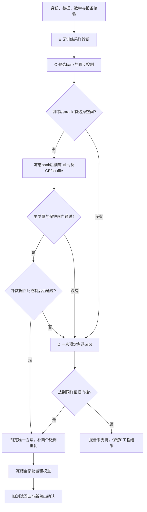

# 下一轮水下图像增强任务框架 V3

方案编号日期 2026-10-04，核验完成日期 2026-10-05（北京时间）。目标仓库 `https://github.com/kkkridepig/uie-prior-utility`。本文件是可独立上传服务器的执行规范，不要求服务器具有本地 Windows 审计目录。随附三份核验材料是设计过程建议；其维度、超参数或日程若与本文件不同，以本文件冻结值为准。

**决策摘要**：推荐研究组合为 **E、D、C**，分别承担无训练采样诊断、频率表示备选、先验效用选择主线。**只推进一条算法主线 C**，先证明其有限候选中存在可利用收益，再训练选择器；C 未过关时只允许启动一次预先规定的 D 备选。E 先执行，但不作为原创算法。保留旧模型和权重，不从零重训所有主干，不叠加 A—G。

本轮成功标准是获得可归因、可复核的结论。没有正收益也是合格结果。代码跑通、数学契约通过、方法有效和原创性成立是四个不同状态，不能相互替代。



图中的否分支只指正确实验的数值不支持。代码/数据/指标/预算阻塞另列状态，不能假装科研阴性。

## 1. 三个方向如何选择

### 1.1 先纠正旧报告的两个过强表述

旧框架是一个有意缩小规模的筛选协议，不是完整版 A—G 的严格实现验收。20261003 七天协议 §5.4 本来就允许浅层 `phase_spatial`，所以 D 没有 Phaseformer 的完整 attention 不能算实现错误；§5.6 允许轻量专家；§5.3 明确允许 C 保留父模型原有先验通路。这些是实验身份的限制。

真正的契约问题包括 C 应有的交叉注意力未实现、C null 可能受末投影 bias 影响，以及 A 的硬裁剪、mask 和损失形式与约定不符。F 路由输入与容量存在解释限制，但“没有复制完整版水域编码器”本身不等于违约。

`+0.10 dB` 是上一轮预设的实际收益门槛，不是论文通用合格线，也不是统计显著性的定义。跨过该门槛不能自动证明创新；没有跨过也不能永久否定某个研究方向。

### 1.2 旧结果与研究投资排序是两件事

下表都是已记录的 PSNR 差，单位 dB；C/D/F 使用各自匹配控制。

| 方向 | 验证差 | UIEB test 差 | LSUI test 差 | 本轮判断 |
|---|---:|---:|---:|---|
| E，DDIM20 对 DDPM1000 | 父模型 +0.000078 | 本轮无对应完整采样比较 | 同左 | 明确工程收益，采样主张限于原验证协议 |
| D，phase 对 Sobel | +0.008533 | +0.007652 | -0.001831 | 小且跨数据集不一致，可低成本检验表示问题 |
| F，routed 对 uniform | +0.001465 | +0.006027 | +0.000162 | 三处均值微正，远未证明路由有效 |
| C，routed 对 fixed | +0.005954 | -0.001613 | -0.001325 | 现有路由没有优势；因实现契约和可检验问题入围 |
| A，split 对 coupled | -0.011508 | 缺少冻结后的 coupled 对照 | 同左 | 暂缓，修正损失不保证提高质量 |
| B，proxy 对继续训练 | -0.045454 | -0.015327 | -0.052720 | 不优先；B_ADAPT 未完成，不能判负 |
| G | 未测 | 未测 | 未测 | 数据和后端阻塞，不优先 |

**若严格只按现有点估计的正号和工程效果挑三个，E、D、F 更靠前；没有统计证据证明唯一前三。** 推荐 E、D、C 是结合证据、修复价值、研究可检验性和成本的投资决策，不能写成“C 已经比 F 好”。F 的收益接近零，路由仍需补容量和输入信息控制；C 则可以把问题收缩成一个可计算收益上限、可明确失败的选择问题。

`C_CONV` 在 LSUI 相对 `BASE_CONT` 的 +0.019563 是卷积容量控制的结果，不能算作 C 路由的正证据。`BASE_CONT` 对父模型的 UIEB +0.573922、LSUI +0.729533 属继续训练对照；其源验证反而低 0.142752，说明不能把 test 上的收益事后改写成验证阶段已确定的稳定优势。

父模型 85000 步上的计时比值应写为 9.881906/0.236457 ≈ **41.79 倍**；“约 41.5 倍”对应另一组 225000 步记录。不要把两个 checkpoint 的时间混用。

### 1.3 明确的研究问题

- **C 主线**：同一冻结增强器上的有限先验注入模式是否存在逐图互补性；只读取输入的选择器，能否利用这种互补性，超过同一候选集合中最好的固定模式和简单选择器？
- **D 备选**：去除数值与尺度混杂后，正则化相位条件是否超过硬相位与 Sobel 条件？不先声称相位对水下退化不变。
- **E 支撑**：当前 x0 预测器对迭代次数、状态和时间是否敏感；更少网络调用是否在预定质量容差内真正缩短模型推理时间？不先启动蒸馏。

## 2. 输入证据、版本和研究边界

可核验旧提交 `cb9b104e724f304053d2e658f54deec8ba115e2f`；旧实现哈希 `983519fc2e1b921ac08b5460b87ebde78dce672fe078f783146d27d6ca643ad2`。服务器当前代码可能已改变，必须现场记录 commit、未提交 diff、环境、设备型号和源码哈希，不能假定当前仍等于快照。

旧记录根目录 `runs/explore_ag_single_seed_v2_20261003/`，关键文件包括 `parent_selection.json`、`selection_freeze_before_test.json`、`dispatch_state.json`、`budget.json`、`benchmark/paired_summary.json`、各分支 `selection.json` 和逐图指标。历史父模型 SHA256 为 `3f8e7b50834d069d85b4f9b57c964242554aad45f44826ef4fc000491fad4bea`，历史训练步数 85000。

新目录使用 `runs/prior_utility_cde_v3_20261004/`，新报告使用 `docs/experiments/PRIOR_UTILITY_CDE_V3_20261004/`。不覆盖 V2 的协议、selection、checkpoint 或指标。路径不存在先记录；本地审计 ZIP 不含权重，不代表服务器没有权重。

范围限于重用现有父模型的有预算微调与评估。原论文严格复现、独立米制深度恢复、完整 A2/A3、B_ADAPT、F 域适配、G 检测器和一致性蒸馏均不在本轮默认范围内。

## 3. 共同数学和术语

输入水下 RGB 为 I∈[0,1]^(3×H×W)，配对参考图为 J。参考图是数据集的增强目标，不自动等同无水场景的辐射真值。PSNR 是峰值信噪比，在动态范围为 1 时为 −10 log10(MSE)；SSIM 衡量局部结构相似性；LPIPS 是用固定感知网络度量的距离，越低越好。

父模型 f_θ 是给定噪声状态 x_t、时间 t 和条件 c(I)，预测清晰图 x0 的网络。冻结是保持参数与运行统计不变；adapter 是插入主干的小型可训练残差模块。matched control 指在关键训练条件相同的情况下，只改变待检验因素的对照。NFE 是真实去噪网络调用次数，不只是配置中的步数。

前向加噪为：

\[
q(x_t\mid J)=\mathcal N(\sqrt{\bar\alpha_t}J,(1-\bar\alpha_t)\mathbf I),\quad
\bar\alpha_t=\prod_{j=1}^t(1-\beta_j),\quad \bar\alpha_0=1.
\]

数学时间 t∈{1,…,T}，源码 index=t−1。本工程预测 `x0`，不能直接当成预测 ε 的接口。

共同基础损失保持现有已核验版本：

\[
\mathcal L_{base}=\operatorname{MSE}(\hat J,J)+0.1\mathcal L_{VGG}(\hat J,J).
\]

VGG 是固定视觉网络，用其中间特征定义感知损失；必须固定权重哈希、预处理和层定义。本轮 C、D 不添加 A 的 cycle loss，也不同时修改损失、色彩空间和先验坐标。

BASE_CONT是从父权重重置Adam与短学习率日程的热启动控制，并非恢复父optimizer的精确续训。其收益包含新增更新与优化配方重启的共同作用；本轮不额外声称已经分离这两者。

后文首次使用的缩写集中解释如下：FFT/IFFT 是快速傅里叶变换及逆变换；RMS 是均方根，用于描述特征能量尺度；DC 是零频均值分量；H2D 是主机内存到加速设备传输；GAP 是全局平均池化；MLP 是多层感知机；CE 是交叉熵分类损失；logit 是未经概率归一化的分类得分；RNG 是伪随机数生成器/随机流；FLOPs 是浮点运算次数；oracle 是看到真实答案的不可部署参照；regret 是实际选择与该参照之间的效用差；bootstrap 是反复重采样估计样本不确定性的方法；pilot 是决定是否继续投资的先导实验；holdout 是不参与训练与选择的留出数据。

## 4. E：先做无需训练的机制诊断

### 4.1 公式核验

由 x0 预测计算：

\[
\hat\epsilon_t=\frac{x_t-\sqrt{\bar\alpha_t}\hat J_t}{\sqrt{1-\bar\alpha_t}},\quad
x_s=\sqrt{\bar\alpha_s}\hat J_t+\sqrt{1-\bar\alpha_s}\hat\epsilon_t,\quad 0<s<t.
\]

这对应 η=0 的确定性 DDIM。最后 s=0 时返回 \(\hat J_t\)，不要对零噪声时间再除以零。裁剪位置沿父模型配置固定；报告裁剪前后差，不能改变 clip 开关后与旧结果直接比较。

本工程网格为 `round(linspace(T,1,N))+[0]`。N=1 得 `[1000,0]`，唯一调用 index=999；N=2 得 `[1000,1,0]`，最后调用 index=0。**20 步≈1000 步不能推出 1 步≈20 步**，因为末次输入和时间不同。

### 4.2 无训练实验矩阵

固定历史父模型和 V2 `BASE_CONT` 5000 步模型，分别测试 NFE∈{1,2,4,8,20}。DDPM1000 先只在按 ID 固定抽出的 24 张开发图上校验，再依据预算确认完整源验证；不要在所有候选、所有数据上重复昂贵 DDPM。

记录每张图的输出哈希、PSNR/SSIM/LPIPS、与 DDIM20 输出的最大/RMS 像素差、网络实测调用数、网格、初始噪声键。先在 24 张图做三组采样噪声，再在完整源验证确认候选；三个噪声不是三个训练种子。

V2 `keyed_noise` 没有外部seed参数，重复调用全局 `manual_seed` 不会改变它。V3必须明确将 `eval_noise_seed` 纳入哈希，例如 `SHA256(noise_protocol_v3, eval_noise_seed, sample_id, role, timestep)`；标签相同地纳入 `label_noise_seed`。主评估键固定为101/102/103，标签键17/29。测试同seed同图跨模式噪声一致，不同seed确实不同，并保存完整噪声协议身份。首次复核旧分数用独立的V2兼容路径，不能改噪声键后要求逐位复现旧分数。

附加状态/时间诊断只在开发数据进行，不用 J 作为可部署推理输入：

1. 相同 I 与同初始噪声，改变 NFE 并保存每一步 x_t 和预测 x0 的范数/相邻差。
2. 在选定轨迹点固定 x_t，分别用正确 t 和几个预定替代 t，度量预测变化。替代 t 是分布外诊断，不当作正式采样器。
3. 固定 t，在 x_t 上加入已知小扰动，估计 \(\|\Delta f\|/\|\Delta x_t\|\)；改变初始噪声测最终输出方差。
4. `f(0,t,c)` 和 `f(I,t,c)` 仅作条件回归依赖诊断，不把它们自动替代正确扩散输入。

若对 t、x_t 都弱敏感，可提出“当前模型主要依赖条件回归”的假设；必须报告这些观测，不能据此宣称扩散已失效或理论上无用。

### 4.3 计时和采用标准

区分：A. 先验计算；B. 去噪采样；C. tensor 已在设备上的 pad+prior+sample+crop+clip；D. 含读盘、解码、H2D、后处理和保存的服务流程。旧约 41.79 倍只接近 C 的定义，不能称 D 的实测加速。缓存冷/热、预热次数、同步、batch=1、精度和分辨率分别固定，峰值显存从 prior 前重置。

默认主算法比较始终使用 DDIM20。选出的更少 NFE 只放效率表，不拿较差/较好的不同 sampler 比较不同方法。如果完整验证对 DDIM20 平均 PSNR 下降≤0.05 dB、SSIM 下降≤0.002、LPIPS 恶化≤0.01，并且模型时间至少缩短 1.5 倍，才作为部署候选；这是新轮工程容差，不是新算法有效性的门槛。报告 p50/p95 时间及全部失败图。

## 5. C 主线：有限模式的先验效用选择

### 5.1 为什么先限定为整图选择

本轮提出一个新而明确的变体 `C_ADD_BANK_SELECT_V3`。它复用原 C-additive 接口和真正交叉注意力，但使用采样前一次性整图硬选择，所选模式贯穿所有扩散步骤。它**不是原计划的空间/时间软路由严格复现**。

这样选择的原因是，训练标签可以来自每一种实际部署模式的最终输出，收益上限可以精确计算。不能用整图 leave-one-out 标签训练空间 gate 后声称已识别每个像素/每一步的因果效用。后续若做空间/时间路由，必须另立协议。

### 5.2 冻结父模型与一致的输入字段

主实验父模型默认使用历史 85000 步 `PARENT_0`，以原源验证选择记录为依据。不能因为看过旧 test 上 `BASE_CONT` 更好就将其提升为唯一父模型。`BASE_CONT` 可作为强基线和第二父权重敏感性检查。

第一阶段冻结父增强器、beta 先验网络、highfreq 网络和所有运行统计，只训练新 adapter。父模型保持 eval 模式；梯度仍须穿过冻结主干的下游算子到达 adapter，不能对整个前向使用 `no_grad()`。仅先验准备和无新参数影响的前缀允许无梯度。

原先物理字段来自：

\[
t_D=\exp(-\kappa_D d_{coord}),\quad b=A(1-\exp(-\kappa_B d_{coord})),\quad J_p=\operatorname{clip}((I-b)/\max(t_D,\epsilon)).
\]

V3 默认继承父模型的颜色空间和 `physical_coordinate`，保持 κ_D=κ_B=旧 k。不要把 `distance_proxy` 与按另一坐标生成的 t/b 混进同一个向量；不要暗中把 sRGB 改为 linear RGB，或改变 κ 的激活。d_coord 只是父模型使用的相对坐标，不声称米制距离。κ 与 d 的缩放歧义 \((d,\kappa)\mapsto(sd,\kappa/s)\) 不改变透射率，因此没有标定就不能推断真实系数。

物理输入 20 通道为 `Jp3,d_coord1,kD3,kB3,A3,tD3,b3,v1`。v 仅表示数值/有效区标志，不是测得的概率置信度；κD/κB 相同必须写进模型身份。该结构复用物理字段，不等于完成 A。

颜色直方图取原始 `PriorBundle.histogram` 的 RGB-uv 数值。它的二维坐标是颜色比值分箱，不是图像 x/y 位置；新分支禁止将其插值成 H×W 图。旧父通路按原定义保留。

频率输入使用冻结父网络的 32 通道 highfreq，记录其来源 Sobel/Haar。C 主实验不同时加 D 相位，以免不能归因。

### 5.3 真正交叉注意力和张量契约

在主干 1/4、1/8 尺度注入。每尺度先将查询特征池化为至多 16×16 的网格，固定嵌入宽度 64、4 个头，每头 d_h=16。物理、高频各池化为至多 256 个空间 token；直方图按颜色分箱做保质量的 16×16 合并形成至多 256 个 token。原 histogram 从 64×64 缩小时应求每块质量和并检查总质量，而不是只平均后忘记恢复尺度。

token 是一条包含特征及位置/分箱编码的向量。物理、高频编码图像位置，直方图编码颜色 bin 位置，不能混用语义。对先验 k：

\[
Q=W_Q\{\operatorname{LN}[W_{in}\operatorname{Pool}(H)+e_{xy}+e_t]\},\quad K_k=W_{K,k}\operatorname{LN}(P_k),\quad V_k=W_{V,k}\operatorname{LN}(P_k),
\]
\[
A_k=\operatorname{softmax}\left(QK_k^\top/\sqrt{d_h}+M_k\right)V_k,\quad
\Delta H_k=\operatorname{Upsample}\left[W_{O,k}\operatorname{ConcatHeads}(A_k)\right].
\]

W_in把当前层C_l通道映射到64维后才能加64维位置/时间编码，LN为按token的层归一化。每类输入用两层Linear(输入维→64→64)+SiLU编码，空间/分箱二维坐标加入输入；W_O将64维映射回C_l通道。M 对无效 key 屏蔽，softmax 沿 key token 轴，注意力确实混合不同 token。全 mask 行必须显式输出零，不能计算全负无穷 softmax；NaN 输入先按有效 mask 清零。W_O 的 weight 初始为零，**bias=False**，投影之后再次施加有效性掩码。这个布局主动限定查询 token 数以控制成本，并非宣称与所有原论文结构一致。

验收不能只查输出 shape。应构造远处 key/value 的改变会影响给定 query 的测试，确认不是同位置点积 sigmoid；检查四头和分箱坐标；改变无效 token 的值不能改变输出；zero-init 必须复现父输出。

### 5.4 五种有限模式和精确 null

候选集合 \(\mathcal A=\{0,P,H,F,ALL\}\)：0 关闭所有新 adapter，P 只用物理，H 只用颜色 histogram，F 只用高频，ALL 用三个有效新分支的等权平均。有效分支数 n>0 时：

\[
H'=H+\frac1n\sum_{k\in a,\ valid}\Delta H_k;\quad a=0\text{ 或 }n=0\Rightarrow H'=H.
\]

该平均规则是 V3 新身份，不能与 V2 三先验加 null 四等分混称同一控制。单分支与 ALL 的尺度规则固定后不可按验证结果重调。

null 在前向直接跳过新模块，冻结父参数保证其整条 DDIM 轨迹与父模型一致。仅设 softmax 的 null logit 很大不能保证严格回退；零初始化不等于训练后仍为零。

**重要范围**：null 保留父模型旧物理、histogram 和 highfreq 通路。它是相对当前父模型的新增分支回退，不是无先验网络，也不保证抵御旧通路污染。`route_only_corruption` 与 `all_condition_corruption` 必须分表；只有前者与主张直接匹配。

### 5.5 训练候选 bank

bank 指同一组共享参数支持的有限模式集合，不是另训五个完整网络。每一步均匀采样四个非空模式，用同一 \(\mathcal L_{base}\) 优化三个 adapter；null 无新参数梯度，不浪费 20% 的步数训练 null。每四步打乱四种模式，保证相同累计暴露；RNG 单独保存。各模式的实际激活次数必须记录。

默认 5000 个新增更新，检查点 0/2000/5000；batch4，adapter Adam lr=1e-4，线性衰减到 1e-5 的终点固定为5000。禁止临时把5000日程改10000再当同一曲线，本轮不自动延长。父参数保持固定，beta 不更新。

完成 bank 后冻结所有 bank 权重及 sampler。之后训练选择器不能改变 bank，否则旧效用标签立刻过期。

### 5.6 真正的效用标签

对训练内专用 `route_fit` 样本 i、候选 a 和采样噪声键 r，用同一个冻结 bank 得最终增强输出 \(\hat J_{ia}^{(r)}\)。效用是相对于 null 的 PSNR 改善：

\[
u_{ia}=\frac1R\sum_{r=1}^{R}\left[S(\hat J_{ia}^{(r)},J_i)-S(\hat J_{i0}^{(r)},J_i)\right],\quad u_{i0}=0.
\]

S 为逐图 PSNR；标签计算为避免无穷，可固定 MSE floor=1e-10，并记录截断次数。正式表仍用原 PSNR 定义。R=2，用两组独立、按样本键控的标签噪声，候选间共享同一噪声。不能用每个候选不同的噪声制造差异。

标签必须来自训练内 `route_fit` 的配对参考，不得来自源验证、旧 test 或新 test。所有标签和输出做 stop-gradient，即当作常量。标签文件带 parent/bank/sampler/preprocess/data 哈希，任何身份改变都失效。

这里的 u 是该冻结计算系统上的干预差异，不是“先验真实物理正确性”，不是自然世界的因果效果。五种模式没有覆盖所有子集，oracle 上限只对这五种模式成立。

### 5.7 输入选择器和损失

选择器只读取部署时可获得的 I 和输入先验。具体默认结构：I 下采样至64×64，三层 stride2 Conv3×3(3→16→32→64)+SiLU，GAP 得64维；固定取**1/4尺度三类pre-LN先验token**各自有效token上的64维均值和64维总体标准差（`correction=0`），分别经过Linear(128→16)+SiLU得到3×16维；再拼接四个标量，总维116，经MLP(116→64→4)输出P/H/F/ALL的效用估计，null分数固定为0。1/8尺度有独立注入编码但不重复拼入selector，空token摘要置零。三类token编码来自同一冻结bank，selector训练不更新它们；推理先计算全部静态token摘要，成本必须计入，再仅运行被选模式的去噪轨迹。这样路由可观察实际先验值的变化，但并不保证学会识别任意污染。

四个标量严格定义为：①未padding原图区域内，depth有效且所有物理字段有限且三通道t_D≥1e-6的像素比例；②histogram所有bin有限且非负、总质量>0时为1，否则0；③原图区域内32通道highfreq均有限的像素比例；④在原图有限反演像素中，任一RGB未裁剪Jp超出[0,1]的像素比例，分母为0时置0并将物理有效率置0。缺失整类先验的摘要与有效率置0，禁用对应单类模式；ALL按剩余有效分支处理，全部无效时仅允许null。任何污染后摘要都须从实际送入新增分支的同一token重算，不能给selector干净摘要却给adapter污染值。不得输入J、实测PSNR、场景ID、数据集标签、污染种类/严重度真标签或输出文件名。

主损失：

\[
\mathcal L_{utility}=\frac1{4N}\sum_{i,a\ne0}(g_\psi(z_i)_a-u_{ia})^2.
\]

平方损失的最优函数为条件期望 \(g^*(z,a)=\mathbb E[u_a\mid z]\)，选最大期望效用的动作才与平均 PSNR 目标一致。这是标准代价敏感选择原理，不是新的定理。Huber 或获胜者交叉熵不具有同一最优目标，若改用必须改解释。

默认 gate Adam lr=1e-3，batch32，2000 updates，固定训练次序和检查点；只训练 gate。对应 `WINNER_CE` 对照使用相同四个logit、null固定0、同样输入/容量/更新，用 train-only argmax效用作为类别标签，比较“选赢家”与“预测损益大小”，不能把 CE 控制称为不使用效用标签。

主归因表所有选择器都不额外调拒绝门槛。UTILITY/SHUFFLED以四个dB预测和null=0直接argmax；WINNER_CE以四个分类logit和null logit=0直接argmax。平局先null，再P/H/F/ALL固定顺序，禁止把CE logit当作dB。`route_cal`只给主表选择一个全局best-fixed模式。

部署拒绝副表可仅为UTILITY从τ∈{0,0.05,0.10,0.20} dB选门槛，按route_cal平均PSNR最大、平局更大τ，低于τ回退null。标记 `C_UTILITY_CALIBRATED`，与未校准主表分开；不把这张副表的更好分数代替主表进入晋级闸门。CE本轮不额外搜索概率门槛。

这些 calibration 结果是小样本经验校准，不保证未知分布上的风险。报告“被接受且实际损失>0.1 dB”的比例、coverage（非null比例）、risk-coverage曲线与样本数；不能称形式化安全保证。

### 5.8 oracle 闸门和为什么它能省钱

oracle 指使用真实参考图为每张图挑最优模式的不可部署参照。主评价先对固定的三个采样噪声平均，再对模式取最大：\(S_{ia}=\frac13\sum_{r\in\{101,102,103\}}PSNR(\hat J_{ia}^{(r)},J_i)\)。selector对同图三种噪声都用同一个输入决定，fixed/oracle与其共享噪声键。不能让oracle逐噪声挑动作，给它比图像选择器更多信息后混为同一上界。

\[
S_{oracle}=\frac1N\sum_i\max_{a\in\mathcal A}S_{ia},\quad
S_{best\ fixed}=\max_a\frac1N\sum_iS_{ia}.
\]

对该集合的任何硬选择器 π，逐图 \(S_{i,\pi(i)}\le\max_a S_{ia}\)，所以平均也成立。式中的best-fixed是当前诊断集事后最优固定均值，记 `DEV_ORACLE_FIXED`；主方法对照 `C_BEST_FIXED` 则必须用route_cal预先选定的模式，两者分列，不在新测试集重选固定模式。这个上界**不约束新 bank、更大模型、连续融合或重新训练**。例如两个候选误差互相抵消，输出平均可能胜过所有单候选。

开发诊断可计算参考 oracle，但参考只能进入诊断表，不能进入部署 gate。必须先完成预定5000步bank训练并确认模式输出有差异；零初始化时算出的零空间是构造必然，不作为否定证据。如果oracle对DEV_ORACLE_FIXED的平均提升<0.10 dB，说明当前bank没有足够选择空间，本轮不训练复杂gate、不做额外C多种子。若oracle相对同轮继续训练强基线也仍低0.10 dB以上，同样停止当前C bank的确认投资。

若到达这些必要条件，也不保证输入 gate 能学会，必须实测其 regret：\(S_{oracle}-S_{selector}\)。不允许用 oracle 分数替代方法分数。

## 6. D 备选：正则化相位，不宣称可靠性已解决

### 6.1 数学问题与候选

旧 D2 使用正交归一 FFT：\(Z=\mathcal F(I)\)，\(P=Z/|Z|\)，小于ε的频点置零，空间特征为 \(\Re\mathcal F^{-1}(P)\)。幅值很小处相位对扰动敏感，近似 \(\delta\phi\approx\Im(\delta Z/Z)\)。只保相位不能使噪声自动消失。

新候选先去 DC（零频、均值项），再用：

\[
P_\tau(\omega)=\frac{Z(\omega)}{\sqrt{|Z(\omega)|^2+\tau^2}},\quad
\tau=\max(10^{-6},\operatorname{median}_{\omega\ne0}|Z(\omega)|),\quad
S_\tau=\Re\mathcal F^{-1}(P_\tau).
\]

τ 按图、按通道计算，其系数固定1；不在验证上搜索阈值。此阈值是相对幅值正则，不是估计噪声方差或概率置信度。固定τ时映射的最大局部导数≤1/τ；但τ随输入变化，后续网络亦会放大误差，不能把这个局部性质写成整网鲁棒性证明。白噪声自身也可能产生很强的该表示。

实图 FFT 有共轭对称；实数偶对称幅值权重保持该性质，IFFT 虚部应只剩浮点误差。不要用独立随机复噪声打破对称后只取 real 来掩盖错误。

### 6.2 消除尺度混杂

当 HW 个频点均有效且使用正交 FFT 时，纯相位空间特征满足 \(\|S_\phi\|_2^2=HW\)，即 RMS 约1。Sobel 幅值通常不同，若不控制输入尺度，就可能比较了优化尺度而非表示。

所有D变体统一先去各通道空间均值，再除以**训练adapter_fit集上按每表示×每通道一次计算并冻结的RMS**，下限1e-3。常值/全零特征单独置零。禁止每图除自己的极小RMS，否则可能额外放大低能量表示。冻结RMS也不能恢复相位归一已丢失的绝对幅值信息：当τ随输入同比缩放且floor未激活时，Pτ(aI)=Pτ(I)，白噪声和缩小千倍的同一白噪声仍可能产生相同相位表示。冻结统计只读取训练图；记录标准化前后分布。旧sobel有sqrt项epsilon，常值图可能返回1e-6，去均值/零图测试必须覆盖。

### 6.3 唯一允许的备选矩阵

`D_SOBEL_STD`、`D_PHASE_STD`、`D_SOFTPHASE_STD` 共用同拓扑3→32→32小adapter，末投影零初始化，父主干冻结，与 C 的冻结身份一致；同一父模型、相同5000更新、损失、图像和噪声流。已有同轮 `BASE_CONT_V3` 为强训练基线。

主问题为 SOFTPHASE 是否超过 PHASE 与 SOBEL；图像幅值-only/随机相位可做无训练表示诊断，不默认加入更多训练分支。先单种子，只有超过预设闸门才补另两个种子。不要增加新相位损失或专属噪声增强后仍声称只有表示不同。

干净指标为主；噪声σ∈{0.005,0.02,0.05}时取I'=clip(I+σz,0,1)，只从I'重算新增Sobel/phase及自适应τ，旧父条件仍由I生成，参考J不变。冻结RMS不重估，三种表示共享相同z及污染seed。全输入污染另表。检查边缘误差、LPIPS、过锐化、噪声增强和纹理幻觉。

## 7. 数据隔离：旧测试已经参与研究决策

### 7.1 不制造新的“盲测”名称

UIEB 97 与 LSUI 427 的结果已经用于讨论方向，后续再测它们应标记 `legacy_exposed_regression`，不能仅改文件名就称新盲测。重划分已被父模型训练过的图，也不能消除历史暴露。

UIEB `61_img_` 与 `356_img_` 为已知同场景关系，旧表保留97图并另报96图敏感性。新开发分组将所有同场景图绑定；exact hash不同不等于场景独立。dHash/pHash候选需结合内容人工或可审计复核，不能把所有候选当泄漏，也不能只做字节去重。

### 7.2 数据角色

| 名称 | 来源及用途 | 允许更新什么 |
|---|---|---|
| `adapter_fit` | 旧UIEB train按场景组约70% | bank/adapter 与所有继续训练对照 |
| `route_fit` | 旧train约20%，与adapter_fit不交叉 | 冻结bank生成效用标签；训练选择器；唯一额外白名单BASE_CONT_DATA_MATCHED可用其参考更新模型 |
| `route_cal` | 旧train约10%，与前两者不交叉 | 固定模式和τ选择，不能反向优化bank/gate |
| `source_dev` | 旧源验证去场景关系后的固定开发集 | go/no-go，不能训练任何模块 |
| `legacy_exposed_regression` | 已看过的UIEB/LSUI test | 最后回归表；不驱动循环调参 |
| `confirm_holdout` | 与已知父模型训练/验证、先验模型已知训练及本轮开发无已知重叠的配对场景 | 全配置冻结后一次正式确认 |

分组比例按组而非按图精确强行截断，保存IDs、哈希、分配种子20261004、图数和场景数。历史父模型已见过旧train的三部分，因此 route_fit/cal 的独立性仅指新adapter/gate阶段，**不是整个模型从未见过这些图**。这限制可支持的泛化主张。

优先从服务器已合法取得、名单与暴露可审计的配对来源构建 `confirm_holdout`。未在本次展示过的文件不自动等于未被旧模型见过；LSUI官方其他划分如完全未被历史训练/选择使用且去重通过，可作新的样本确认，但不得称新的数据域。DA/VGG等通用预训练数据若部分不可核验，单列 `upstream_exposure_unknown`，不能声称绝对从未见过；本轮确认只能限定在可审计暴露范围。没有合格新留出集时继续完成所有开发任务，最终状态 `development_complete_confirmation_blocked`，不能用旧test补名额。

所有阈值和污染组只用训练内/开发集设计。新测试评估只在 `final_freeze.json` 写明源代码、权重、模式、τ、sampler和指标实现哈希后开始；测试输出不能触发自动改方法。

## 8. 公平对照、种子和选择规则

### 8.1 C 的最小矩阵

| 身份 | 作用 | 训练量 |
|---|---|---|
| `ANCHOR` | 冻结父模型/null | 0 |
| `BASE_CONT_V3` | 继续训练强基线，全主干及原启用参数按共同配方 | 5000，adapter_fit |
| `C_RGB_CONTROL` | 同层插入、有实际贡献的等容量RGB/卷积控制 | 5000，adapter_fit |
| `C_BANK` | 真交叉注意力、四非空模式均衡训练 | 5000，adapter_fit |
| `C_ALL_ONLY` | 相同attention bank只训练ALL，区分多模式训练收益 | 5000，adapter_fit |
| `C_BEST_FIXED` | C_BANK在route_cal选出的单个固定模式 | 只读/校准 |
| `C_WINNER_CE` | 同bank、同gate输入/容量，赢家分类 | gate 2000，route_fit |
| `C_UTILITY` | 同bank的损益回归+null | gate 2000，route_fit |
| `C_SHUFFLED` | route_fit中按样本打乱整个效用向量，检验输入效用关联 | gate 2000，route_fit |
| `C_ORACLE` | 真值选模式的诊断上限 | 不可部署，不算方法 |

阶段性成本控制：先完成 ANCHOR、BASE_CONT、C_BANK、C_RGB_CONTROL；oracle通过才补 ALL_ONLY 和 gate 对照，不能在前置失败后把所有分支跑满。C_RGB有效新增参数与BANK差≤5%，不能加闲置参数充数，FLOPs和时间另报。C_RGB与BANK相同update/图像曝光，不声称两者训练浮点操作量严格相等。

这里容量匹配只针对BANK与RGB adapter，完整C还增加selector参数和离线标签成本；全部参数/数据/设备时间另表。损失/选择机制的容量匹配由同结构WINNER_CE与SHUFFLED提供，不宣称整个C与RGB严格等总参数。

对于效用监督的归因，最强控制是同一冻结bank的 BEST_FIXED、WINNER_CE 与SHUFFLED；对attention注入的归因，比较BANK固定模式、RGB_CONTROL和ALL_ONLY；对整个方法的实用价值，必须比较BASE_CONT。三种问题不要用一行表混为一个因果证明。

选择器使用额外route_fit参考标签，必须在训练数据曝光表和总成本中列出。不能宣称与只用adapter_fit的BASE_CONT数据监督量完全相等。初步通过源开发闸门后，确认前必须补 `BASE_CONT_DATA_MATCHED`：相同5000更新，按已冻结70/20比例（归一为7/9、2/9）从adapter_fit+route_fit采样，route_cal仍不训练。它是额外标签可用性对照，不能替换共享data-stream消融；每个seed都要补，纳入最强控制。若无法补齐，状态最多是 `pilot_gain_controls_incomplete`，不得确认全方法有效。

共同训练配方冻结如下，来自旧实现的可复核值与本轮已声明5000步终点，不留给服务器自行猜测：

| 字段 | BASE_CONT / DATA_MATCHED | C_BANK / RGB / ALL_ONLY / 三个D |
|---|---|---|
| 可训练参数 | 现有denoiser、beta和highfreq原requires_grad参数；DA固定 | 仅新增adapter/token/QKV/output；父denoiser、beta、highfreq全冻结 |
| 模式 | 原训练dropout=0.1；评估eval | 父始终eval，新adapter train，attention dropout=0 |
| Adam | betas=(0.9,0.999), eps=1e-8, weight_decay=0 | 相同 |
| LR | 1e-5线性到1e-6，5000步终点 | 1e-4线性到1e-5，5000步终点 |
| 图像与batch | RGB/sRGB、336×336、有效batch4；micro_batch优先4，OOM可2/1并累积 | 相同 |
| 精度与稳定性 | float32，不开AMP/EMA/额外梯度裁剪，检查非有限梯度 | 相同，FFT亦float32 |
| 数据增强 | none，沿旧基础实现，不增加私有增强 | 相同 |
| 损失 | 原图有效区域MSE+0.1×固定VGG特征MSE | 相同 |

VGG沿现有VGG19前三个指定特征索引3/8/17等权MSE，输入按mean=(.485,.456,.406)、std=(.229,.224,.225)处理，参考分支无梯度；权重SHA256 `dcbb9e9dad569fff7a846263a77324fc34978fea2bfb039c012d710e1776ae44`。若现场旧实现与该记录不同，先写差异并冻结新身份，不能静默继承不一致版本。预测训练损失不先clip，评估末输出按旧规则clip[0,1]。所有resize插值、padding及mask复用父版本并保存源码哈希。

selector/CE/shuffle使用同样Adam betas/eps/weight_decay、固定lr1e-3、batch32、2000步；先验和bank始终冻结。根据selector新增参数数目报告成本。旧V2的scheduler终点为10000，本轮终点改5000已构成新配方，不能复用旧5000控制冒充新BASE_CONT。

确认必需的C矩阵对每个seed固定为 `{BASE_CONT, BASE_CONT_DATA_MATCHED, RGB, BANK, ALL_ONLY, BANK上的BEST_FIXED/CE/SHUFFLED/UTILITY}`；所有配置、标签和权重都属于该seed的bank。任一关键控制缺失则降级，不用一个种子的控制配另一个种子的候选。

### 8.2 至少三个真正不同的微调种子

固定三个新种子20261004/20261005/20261006。先20261004探索；方法和超参数冻结后补另两个。默认准确称“一个pilot加两个冻结协议重复，共三个微调种子”，不称三个预先未见结果的独立确认。每个种子同步训练必要的BASE_CONT、BANK/备选D及结构对照，gate跟随该seed的bank重新生成标签。不能只给新方法多种子，而一直使用旧单种子控制。

若pilot后修改了方法或超参数，旧pilot不能计入同配置三seed表。预算允许时重新跑第一个seed及全部对应控制，并标为选择后重复；预算不够则保留缺项。要做真正三个新确认seed，须另立一次预算和预注册，本轮不自动追加。第二、三个seed结果出来后不再调参。

现有 `train.py` 直接从父配置读取seed且无有效独立seed入口，V3必须实现 `finetune_seed`；目录名不同不算种子不同。分别记录 `parent_pretrain_seed=20260927`、`finetune_seed`、`gate_seed`、`eval_noise_seed`。

数据顺序、增强、扩散t、训练噪声、adapter初始化、route模式和dropout使用独立随机数流或按 `(seed,step,microbatch,sample_id,role)` 键控。现有C的额外 `torch.rand` 会消耗全局RNG，同seed并不自动保证其后的t/noise与BASE一致。逐步配对日志应核验这些公共随机量相同。

三个微调种子只验证**同一父权重条件下**的优化稳定性，不等于三个独立从零训练的增强器。若论文要声称跨主干/预训练初始化普适，还需未来第二父模型或独立预训练，本轮不自动启动。

### 8.3 统一停止门槛

单种子pilot只看完整 source_dev 上固定5000步结果；2000步只用于数值/学习信号检查，不因暂时未增益就修改数据或学习率。预算不足5000则只报共同2000，标为不完整筛选，不当正式确认。

C 的多种子晋级要求同时满足：

1. 未额外阈值校准的C_UTILITY相对C_BEST_FIXED平均PSNR≥+0.10 dB；相对WINNER_CE>0；相对SHUFFLED≥+0.05 dB（本轮预设资源闸门，不是通用显著性阈值）。
2. C_UTILITY 相对BASE_CONT、RGB_CONTROL和ALL_ONLY中最好的强基线≥+0.10 dB，SSIM下降不超过0.002，LPIPS恶化不超过0.01。
3. 成绩不能只由少数异常图驱动。报告中位差、改善比例、去掉最大5个改善图的敏感性，后者只诊断不更改主均值。
4. 下述route-only各污染组的平均PSNR不得比同一bank的C_BEST_FIXED在该污染下低超过0.10 dB；全部强度及null率完整报告。任何组超过即标记鲁棒性保护失败，不删除该组。若干净质量未过门槛，不能事后改成鲁棒性论文并称通过。

初筛通过后，在进入额外两个seed前补第一seed的BASE_CONT_DATA_MATCHED；C_UTILITY还必须超过它≥0.10 dB。确认阶段三个seed的最强基线均包含该数据可用性对照。只有LPIPS权重、归一化和设备运行均核验后才可完整晋级；缺失时允许完成数值pilot与资源独立任务，标 `quality_provisional_metrics_missing`，不得以缺指标为由声称非劣或confirmed。

污染清单在P0冻结，主矩阵为全部干净source_dev配对评估，不挑有利24图：物理先验整类missing；histogram整类missing；highfreq整类missing；物理d_coord水平平移图宽2%和5%（右移、边界复制，κ/A仍原值但用移后d重新生成新支路Jp/t/b）；高频特征每通道加独立标准正态乘训练adapter_fit冻结通道RMS的0.1和0.3；histogram在训练route_fit已有hist中用固定键选择另一图作替换。所有案例只改新分支和其selector摘要，父条件保持干净；缺失mask正确传递。噪声键固定包含corruption名/强度/seed401/sample_id，所有比较共享；缺失不是把数据全零却仍标有效。all-condition污染可用同清单另做诊断，不用于主route-only保护闸门。

这些是本轮预算闸门，值是预设的研究选择，不是证明定理。若 C 的bank/oracle存在空间但gate未通过，状态 `utility_not_learned`；若bank无空间，状态 `bank_no_selectable_gain`。两者均不外推为所有可靠性路由无效。

只有C正确执行、指标齐全且pilot数值未通过时，才允许一次D pilot。代码错误、缺依赖、缺指标或预算不足应记录阻塞并做独立工作，不能当作C的科学失败触发D。D_SOFTPHASE须同时超过D_PHASE_STD、D_SOBEL_STD、BASE_CONT中最好者≥+0.10 dB并满足同样SSIM/LPIPS保护才进入三种子；D不使用route_fit额外监督，故无需其专属DATA_MATCHED。否则终止本轮算法确认，保留E工程结果。禁止再回头搜索几十个τ、seed、split来追门槛。

三种子确认的默认要求：对预定主要控制每个seed均值差>0，三seed平均≥0.10 dB；各seed和全部子组都报告。三个样本仍很少，不把3/3正号等同普遍显著。正式新留出测试若未复现，报告未确认，不反复改协议直到通过。

## 9. 统计、指标和视觉交付

对seed s、场景内图像 i，逐图配对差 \(\Delta_{s,i}=S(\hat J^{method}_{s,i},J_i)-S(\hat J^{control}_{s,i},J_i)\)。先报每seed图像加权均值，再等权平均三个seed；场景等权版本作敏感性表。

报告每seed场景组bootstrap区间，以及三seed均值、标准差、最小值/最大值。分层bootstrap可作为探索性附表，但三seed不应包装成可靠的总体训练置信区间。固定预注册主要比较，其余标探索；D只有pilot略正不能因未经校正的多个比较之一为正就称显著。

指标必须固定当前RGB [0,1] PSNR、SSIM窗口/边界，LPIPS模型/版本/[-1,1]归一化、有效mask、resize和是否clip。不能将自定义336×336 split分数直接对照别人论文原尺寸官方split表。UCIQE/UIQM无参考统计偏好可能与视觉质量冲突，辅助使用；URanker缺可靠权重则明确缺失。

LPIPS若PPU算子不支持，可在保存的同一输出上用合法CPU实现离线计算，单列CPU耗时，不能把CPU指标耗时塞进PPU推理速度。PSNR出现Inf时保留逐图MSE与事件，不静默删图或把Inf当零；统计定义需预先明确后才能继续汇总。

视觉交付包括预先按ID选的至少12个固定样例、完整测试最差10个案例、相对强控制退化最大的10例。每张保存输入/参考/null/强控制/最终方法，统一缩放、禁止各自auto-contrast；给出局部细节和差图。无参考图不伪造GT。按算法的失败程度选择的面板必须注明后验失败分析，不能用它替代固定样例。

C额外输出效用预测误差、top1模式分布、null比例、负效用接受率、oracle regret和route-only/all-condition污染分表。D输出FFT虚部误差、τ分布、标准化前后RMS、边缘误差。E输出NFE调用计数、时间/状态敏感性和计时边界。

## 10. 设备预算与调度

建议新轮单设备累计上限 **72小时**，作为本任务框架的默认上限，不是必须用完的训练时长。历史168小时预算不可恢复为新额度；服务器若有更小的用户现行上限则取更小者并优先完成P0/E/pilot。旧分支5000更新纯训练约1.04–1.10小时只用于粗估，新attention必须100步实测。

| 阶段 | 最大设备小时 | 优先交付 |
|---|---:|---|
| P0 身份、数据审计、CPU/PPU契约和profile | 4 | 可运行与正确性证据 |
| E 无训练采样诊断 | 4 | sampler/计时/敏感性 |
| C 单seed bank、对照、oracle与gate pilot | 18 | 是否值得确认 |
| 胜出方法另2个seed及必要控制 | 22 | 条件于同父的稳定性 |
| D 单次备选pilot（仅C未晋级） | 8 | 无赢家时可停止 |
| 最终指标、视觉、留出测试 | 12 | 固定结果包 |
| 保存和失败修复余量 | 4 | 安全恢复与真实缺项 |

72小时按实际所有设备占用累加，包含评估、标签生成、失败重跑和profile；CPU调查与租用墙钟另列。C晋级时不跑D训练，D额度保留而非强行耗尽；C失败后D晋级可使用22小时确认包。并发多卡不自动扩大设备小时。预留最后12小时，不能把对照或指标挤掉只跑新方法。

启动前用 `projected_cost = sum(remaining_steps × measured_sec_per_step + eval + labels)` 估算整组对照成本。无能力完成整组则停止在共同checkpoint，不删对照。标签生成记录 bank候选数×噪声数×图数×NFE 和真实时间，不能隐藏成“无需训练”。

用可恢复状态机与设备锁，保留 `budget.json`、`dispatch_state.json`、原子写checkpoint和已完成IDs。旧目录不是新任务resume源，除读取明确父权重外不得混入旧optimizer状态。失败最多一次有记录的同身份重试；遇PPU不支持算子先CPU数学/梯度验证再寻找等价设备实现，不换掉厂商torch来强装依赖。

## 11. 必须实现的接口与验收

在现有仓库内开新分支/新协议模块，优先复用现有loader和指标。文件名可按现场结构调整，但以下语义不可省略：

```text
configs/cde_v3/protocol.yaml          # 三方向身份、split、seed、预算、固定门槛
scripts/cde_v3/audit.py              # 权重/数据/版本/历史暴露和旧任务检查
scripts/cde_v3/check_contracts.py    # 张量、梯度、路由回退、采样验证
scripts/cde_v3/train_bank.py         # finetune_seed独立，bank/对照训练
scripts/cde_v3/build_utilities.py    # 仅route_fit/cal或开发诊断，数据角色强检查
scripts/cde_v3/train_selector.py     # 冻结bank，效用/CE/shuffle控制
scripts/cde_v3/eval_development.py   # 不允许正式test驱动选择
scripts/cde_v3/freeze_and_test.py    # 权重/协议hash匹配后评估
scripts/cde_v3/dispatch.py           # 预算、依赖和可恢复状态机
```

这些是待创建的接口设计，不是已经存在或已经执行成功的命令；先实现 `--help` 和plan/dry-run，再交付真实命令。

### 第一轮验收：数学和契约

- x0/epsilon转换、时间index、t→0端点正确；NFE=1/2网格不同；网络调用计数独立instrumentation。
- attention远处token干预有效；四头、shape、mask、全无效无NaN；histogram质量保持和bin坐标正确。
- adapter零初始化输出与父模型一致；训练后显式null仍一致；测试给输出bias非零时也不能破坏规范（V3默认无bias）。
- 物理20通道坐标/色彩契约一致，κD=κB如实记录；全invalid输入安全处理。
- D零图/常值图/奇数尺寸/低幅值/共轭对称/标准化检查；不把归一化后噪声变大隐去。

### 第二轮验收：集成与梯度

- CPU小图和真实PPU前向/反向，adapter获得梯度；冻结父参数哈希和运行统计不变。
- 初始零输出头可能使较早adapter层第一步梯度为零，这是结构预期；单元测试固定同一非空模式连续3步检查梯度，集成测试须在每类adapter实际参与至少两次更新后检查，不把从未激活/首步零梯度误判死支路。
- 同seed各控制数据/t/noise完全配对；route/dropout不会改变公共流。
- `route_fit/cal/source_dev/test` 的API访问权限测试；route_fit唯一允许更新增强器的例外是显式白名单BASE_CONT_DATA_MATCHED，BANK/ALL_ONLY/RGB/普通BASE仍只能读adapter_fit做更新；推理selector调用不可能读GT或sample_ID特征。
- 显式构造oracle高但selector不可预测、两个误差互相抵消的反例，防止把oracle当部署性能或混合上界。

### 第三轮验收：小实跑和可恢复

- 100步profiling、0/100输出差与有限loss；保存并恢复20步应与连续20步对照，允许厂商非确定算子容差但须报告。
- checkpoint、标签缓存、参数分组、manifest、采样噪声和版本哈希一致。
- 预算停止能安全落盘，不重复label/eval，不重置计时；实际全组成本允许才到5000。

三轮是验收层次，不要求没有变化时机械重复同一测试。测试失败先修实现，测试通过也不声称质量提升。

## 12. 论文创新边界和文献支持

| 文献 | 已核验的适用支持 | 不支持什么 |
|---|---|---|
| DDIM，Song/Meng/Ermon，arXiv:2010.02502，ICLR2021 | 非马尔可夫前向对应的隐式采样，η=0公式与子采样 | 不证明本模型1步充分，不使调用现成DDIM成为原创 |
| Phaseformer，arXiv:2412.01456v1，WACV2025 | 已有基于相位的恢复机制，必须作为D的直接先例 | 不证明phase对任意水下退化/噪声不变 |
| CoRe-UIE，arXiv:2608.08965v1，按预印本处理 | 已覆盖机制专家和区域自适应路由相关设计 | 不能把一般gate/expert/null作为首次提出 |
| RPL-UIE，arXiv:2608.00137v2，按预印本处理 | 已覆盖教师学生可靠先验与频率门控相关思想 | 不证明本项目效用选择方案已超越它 |

官方链接：

- https://arxiv.org/abs/2010.02502
- https://arxiv.org/abs/2412.01456v1
- https://arxiv.org/abs/2608.08965v1
- https://arxiv.org/abs/2608.00137v2

上面文献是原理和新颖性边界依据，不是提升保证。本轮重新读取上述关键全文并核对元数据；具体版本和全文结束标记保存于随附数学核验记录。最近预印本的身份不等于同行评审通过，引用时核对最终出版信息。代码公开不代表有可复用许可；缺许可时独立实现已公开数学，不直接搬运仓库。

全文覆盖回执为 DDIM v4 `END-OF-PAPER:899f2f16864d`；Phaseformer v1 `END-OF-PAPER:818933c944fb`；CoRe-UIE v1 `END-OF-PAPER:2119289fd726`；RPL-UIE v2 `END-OF-PAPER:ef8aac50039c`。这是阅读记录，不是对其所有作者结论的独立复现。

C潜在论文贡献必须是“可测量的先验选择效用、严格null、真正输入可预测的收益和完整matched controls”这一证据链，而不是仅新增attention。效用回归、有限动作最优选择和oracle本身都是已有通用思想，不宣称数学首创；本轮所查的少数文献不足以证明全领域首次。

若C通过，拟主张为“同一父增强器条件下，输入驱动的有限先验注入选择改善质量/控制额外分支损害”。还需要外部独立确认、强现有方法统一重测、实际时延和新颖性广泛查重，才能进入投稿。若D通过，只能先主张“正则化相位条件在控制尺度后的收益”，要形成独立方法论文还需更强机制解释和先例对比。若都不通过，只报告诊断与E工程结果，不包装成已成功的新算法。

## 13. 本地数学核验已做什么，服务器还要做什么

本轮设计在独立NumPy合成例子上检查了物理尺度歧义、跨token影响、null偏置反例、全invalid零更新、有限动作oracle不等式、混合超出离散oracle的反例、赢家频率与期望效用不同、相位Parseval能量、共轭对称、DDIM换算和随机流隔离。

例如 x0→epsilon误差约1.1e-16，DDIM合成oracle一步更新误差约2.2e-16，奇数尺寸softphase的虚部残差约7.6e-16；这些是浮点恒等式与反例检查，不是增强指标。固定τ=0.01的小幅复数扰动中，硬相位变化约0.765，正则化相位约0.001，**不能把这个局部合成例子当成真实图像鲁棒性提升**。

当前本地没有torch和服务器checkpoint，未跑真实网络前向/训练；服务器必须完成第11节，不得把本文件当成已通过PPU测试或已证实+0.10dB的证明。

## 14. 必交付文件与最终状态

1. `protocol_frozen.yaml`、`code_and_environment.json`、`data_roles.json`、`lineage.json`。
2. `math_contract_tests.json`、`device_preflight.json`、`rng_pairing_audit.json`、恢复测试记录。
3. `E_DIAGNOSTICS.md`及逐图/逐轨迹记录，计时定义完整。
4. `C_BANK_ORACLE.md`、模式清单、标签哈希、selector/CE/shuffle结果；未过oracle也保留结果。
5. `D_FALLBACK.md`，即便没运行也注明 `not_triggered`，不写已验证。
6. 三种子逐图指标、每seed对应控制、模型权重、清晰的缺项与原因。
7. `final_freeze.json`、新留出集覆盖状态、旧测试回归表、指标权重与版本、视觉面板。
8. `budget.json`、调度状态、复现命令、`FINAL_REPORT.md`及一个便于导出的结果目录。

最终状态只能是具体事实，例如 `candidate_confirmed_on_available_holdout`、`pilot_no_supported_gain`、`utility_not_learned`、`development_complete_confirmation_blocked` 或 `budget_stopped_with_checkpoints`。不能用“完成创新”或“论文级SOTA”作为没有对应证据的状态名。

本轮任务收束条件是预算、对照和证据闭环，不是耗尽72小时，也不是把每个模块都做得更复杂。
