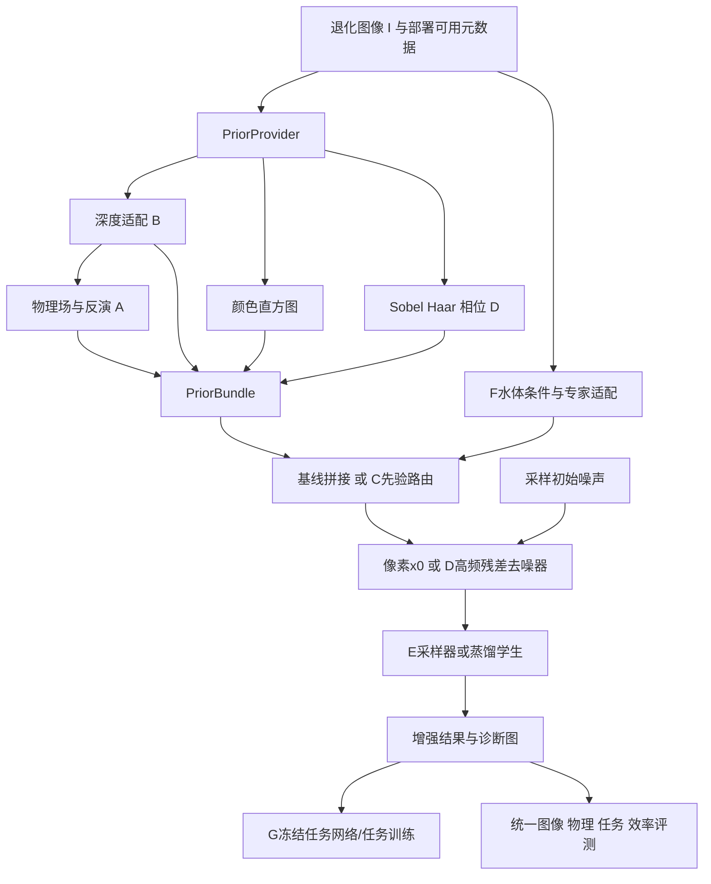

# MPA-Diff 代码重建与 A–G 研究扩展：可执行架构规格

> 版本：1.0；证据核验日期：2026-09-27至2026-09-28。当前仓库阶段：**架构设计，尚无模型实现或训练结果**。
>
> 使用者：后续负责实现、测试和实验的 Codex，以及研究者本人。目标是使代码、公式、数据与实验声明能够一一对应，而不是把缺失细节包装成“原作者配置”。
>
> 范围：重建《多维物理先验的水下机器人图像增强》的主要方法；完整规划研究全景文件第11章 **A、B、C、D、E、F、G**。H不作为新增算法方向，但其公平评价思想纳入公共评测层。

## 0. 如何使用本规格

### 0.1 输入证据与优先级

1. 用户论文：`../多维物理先验的水下机器人图像增强.pdf`，2026年武汉大学本科毕业论文，作者许璐燕。本文引用的“PDF p.”指文件页序，从1开始；正文印刷页码通常为PDF页码减7。
2. 用户研究全景：`../UIE_研究全景_算法_Benchmark_仿真_SOTA_MPA-Diff创新路线_2026.md`，重点第11章；其2026-09-26更新提示也要保留。
3. 原作者公开论文、官方仓库、代码文件。论文提供思想依据；代码提供实际实现证据；两者冲突必须记录，不能任意合并。
4. 本文提出的实现补全与新实验假设。

用户研究全景是研究材料，其中的“最有价值”“更容易得到强结果”“证明”等措辞不构成已验证结论。七方向均应实现为可检验假设，不能预设一定提高指标或具有独占新颖性。

### 0.2 四类来源标签

| 标签 | 含义 | 后续代码要求 |
|---|---|---|
| **[T]** | 用户论文明确写出，或附录直接显示 | 在配置溯源中标出PDF页码/公式 |
| **[C]** | 本次核验的公开代码实际行为 | 记录仓库、提交、文件；不得冒充[T] |
| **[D]** | 为使工程确定、可运行而选择的设计默认值 | 可复现且可消融；报告中称“重建配置” |
| **[H]** | 新研究假设，包括A–G扩展 | 有独立开关、失败条件和验证实验 |

凡未标为[T]的默认参数，都不应在文章中称为“MPA-Diff原参数”。原始测试名单、作者权重、完整训练程序缺失时，结果名称使用 **MPA-Diff-Recon**。

### 0.3 实现交付约束

- 先完成基线和评测，再分别实现A–G，最后研究组合；禁止一次性叠加所有模块后只与旧模型比较。
- 保留一个可靠的小型CPU测试入口和单GPU运行入口；多GPU是可选加速，不是启动条件。
- 不以返回全零、恒等输出、无效门控、随机深度、虚构指标作为功能完成。无数据/权重时输出明确的依赖错误或标记为测试替身；替身不能进入正式结果。
- 训练标签只能进入损失和有明示监督的教师分支；推理条件必须全部由退化输入及部署时真实可用的信息产生。
- 每次实验保存解析后的完整配置、数据清单哈希、Git版本、权重来源及哈希、环境、随机种子和逐图结果。
- 完成代码不等于完成论文复现；对原表的比较必须说明测试划分、图像处理和指标是否一致。

## 1. 术语、符号和单位

| 符号/术语 | 本文定义 |
|---|---|
| UIE | Underwater Image Enhancement，水下图像增强 |
| 先验 prior | 关于成像或图像结构的预先假设/额外信息；不保证每个场景都正确 |
| $I,Y,\hat Y$ | 退化输入、配对参考、模型增强输出；避免用同一个J同时表示参考与物理先验 |
| $J_p$ | 物理反演得到的条件图，不是参考真值 |
| $N,C,H,W$ | 批大小、通道数、高、宽；张量统一NCHW；背景光不再记作批大小B |
| $d,r,z$ | 相机到点的距离、相对深度/逆深度原始输出、可选潜变量；必须有单位和方向元数据 |
| κD,κB | 直接光衰减与后向散射增长的有效系数；避免与扩散噪声方差混用β |
| $A,t_D,b$ | 背景光渐近值/低频场、直接透射率、后向散射项 |
| βdiff_t,α_t,αbar_t | 扩散噪声方差、(1-βdiff_t)、累计乘积；均无空间单位 |
| DWT / IDWT | 离散小波变换及其逆变换；本项目先使用可精确逆的单层Haar变换 |
| FFT / phase | 快速傅里叶变换/复数频谱的相位；相位角有周期性，不能直接普通相减 |
| U-Net / HIN | 编码器与解码器通过跳跃连接传递特征的网络；HIN为一半通道做实例归一化 |
| token / attention | token为特征向量；注意力按查询与键的相似度对值向量加权 |
| gate / router / MoE | 门控权重/路由器/混合专家，用于按输入选择特征或处理分支 |
| stopgrad / freeze | 阻断指定计算路径梯度/冻结参数更新；冻结参数不必阻断输入梯度 |
| EMA | 指数移动平均，以平滑权重作为可选评测模型；不是额外训练数据 |
| NFE | 网络函数评估次数，比“采样步数”更准确地描述多阶段求解器开销 |
| TTA | Test-Time Adaptation，在无测试标签的情况下更新少量模型参数 |
| 消融 | 只改变一个模块或受控因素的对照实验；需要重新训练的变体不能只在测试时拔模块 |
| 可辨识性 | 不同未知参数是否会产生同样观测；单幅RGB一般无法唯一确定所有物理场 |
| mAP / mIoU | 检测平均精度的均值/分割交并比的均值；均需要任务标注和固定评测定义 |

默认文件输入为sRGB三通道、值域[0,1]。sRGB是非线性显示编码；物理成像方程理想上作用于线性辐照度。基线为对齐论文使用sRGB近似；A方向另外提供线性RGB模式。线性化不能逆转未知相机白平衡、色调映射和饱和裁剪，所以不能把其输出直接称为测量到的真实辐照度。

## 2. 原论文可以确定什么，不能确定什么

### 2.1 证据定位表

| 部件 | 已知[T] | 缺失/歧义 |
|---|---|---|
| 总体 | p.21图3.1，物理/颜色/高频条件扩散 | “多层注入”概述与具体段落不同；以p.25和附录的浅层相加为准 |
| 深度 | p.22式3.1，Depth Anything V2 + min-max | 模型规格、权重、原始输出方向、计算/存储精度 |
| 衰减 | p.22、p.49–51，全局池化128维→128→3→3、Sigmoid | 网络通道配置；正文“解耦训练”与附录可联合反传的关系 |
| 背景光 | p.23，半径为图像高宽均值的高斯模糊 | 边界、是否量化、具体滤波库 |
| 颜色 | p.24软log-chroma直方图；p.25插值为3通道 | 坐标定义、bins、带宽、3个通道的准确含义 |
| 高频 | p.17–19 Haar/Sobel；p.24–25融合并浅层相加 | 子带选择、卷积层、尺度与归一化 |
| 主干 | p.47–49 U-Net结构，输入12输出3，HIN见p.25 | 基础block实现、通道数、HIN位置；附录中间块is_noise=False |
| 扩散 | p.26，直接预测x0 | 噪声计划、总步数、采样器、终点处理 |
| 损失 | p.26–27，像素MSE + 0.1×VGG19感知损失 | VGG层、预处理、范数归约方式 |
| 训练 | p.29，Adam、batch4、400000步，lr1e-4后期到1e-6 | 分辨率、衰减起点、增强、EMA、模型选择、种子 |
| 数据 | p.28 UIEB 702/91/97；LSUI 3423/429/427 | 文件名单、是否分开训练、U45/U60使用哪一个模型 |
| 消融 | p.33–34，以同尺寸高斯噪声替代被去除先验 | 分支替换位置/尺度、是否固定噪声、是否每组重训 |

论文中UIEB参考图是挑选的增强结果，不是严格的水下无介质辐照度观测；因此配对像素监督与物理场“真实性”需要分开验证。

### 2.2 SeaDiff代码核验及不能照搬的差异

本次读取官方声明仓库 [Henry-Bi/SeaDiff](https://github.com/Henry-Bi/SeaDiff)，提交 **623d823ee49bab21c5ce3db00aa67d28ffde82df**，包括 `conf.yml`、`model/DocDiff.py`、训练/采样/直方图/感知损失/数据模块。

| 项目 | SeaDiff公开代码[C] | MPA-Diff重建处理 |
|---|---|---|
| 主干 | base32、mults[1,2,3,4]、每级1个resblock；beta末层128 | 可作缺失配置的可追溯候选[D] |
| 输入 | conf尺寸336×336；data.py实际Resize，注释虽写crop | 不依据注释虚构随机裁剪 |
| 噪声 | 1000步；线性1e-6到0.02 | 作为重建默认[D]，不是论文已知 |
| 优化 | AdamW、weight_decay1e-4 | 论文优先：MPA重建用Adam；SeaDiff行为单独profile |
| 感知 | VGG16前三组选层均值，直接与MSE相加 | 论文优先：VGG19、0.1；不能混称原版 |
| HIN | 该提交ResidualBlock没有实例归一化 | MPA重建按正文增加HIN，位置是[D] |
| 背景光 | 转8bit PIL、GaussianBlur((H+W)/2)、转tensor | legacy配置可保留；改为可微浮点滤波是独立变化 |
| 深度 | 全批次min/max，未加epsilon | safe配置按图处理；batch耦合仅作显式兼容选项 |
| 高阶采样 | DPM wrapper写model_type="noise" | x0预测必须使用x_start或明确转换；不能沿用错误类型 |
| 随机性 | 使用torch.random.seed()等行为 | 新工程显式generator与固定种子，不沿用不可追踪随机状态 |
| 许可 | README有MIT徽章，API license=null；根目录树未见LICENSE | 不以徽章认定所有文件获MIT授权；数学独立实现，第三方片段追溯原出处 |

附录的 `DocDiff` 名称沿用可以解释代码接口，但新包命名 `mpa_diff`，避免用户误以为研究对象是文档图像恢复。相似结构是实现参考证据，不足以断言论文完整实现等同SeaDiff。

### 2.3 三套明确分开的实验配置

1. `seadiff_code_audit`：用于核对该公开提交的可观测行为；不是MPA复现。不能默认宣称可加载全部官方权重，须先验证参数键与预处理。
2. `mpa_recon_v1`：尽量遵从[T]，其余使用本文明确的[D]；修复设备绑定、batch维丢失、除零、数据泄漏等工程问题。主基线。
3. `research_*`：A–G变体，以`mpa_recon_v1`或明示的D1/E教师为起点。必须记录父配置和父权重。

## 3. 总体架构与模块边界



上图表示职责关系，不表示循环中反复运行深度网络。部署时先验、粗恢复及静态token计算一次并缓存；只有明确依赖当前时间步/去噪状态的部分进入采样循环。

### 3.1 计划目录（本阶段仅本规格已创建）

```text
mpa-diff-reconstruction/
  CODE_RECONSTRUCTION_ARCHITECTURE.md
  pyproject.toml                 # 后续锁定Python/PyTorch等兼容版本
  configs/
    base/{mpa_recon_v1,seadiff_code_audit}.yaml
    data/{uieb_recon,lsui_recon,ruie,atlantis,task}.yaml
    experiments/{a,b,c,d1,d2,e,f,g}/
    protocols/{paired,cross_domain,tta,task,efficiency}.yaml
  src/mpa_diff/
    contracts.py                # 数据对象、枚举、形状/单位验证
    config.py                   # 严格配置解析，未知字段报错
    data/{manifest,dataset,transforms,synthetic,cache}.py
    priors/{depth,histogram,sobel,haar,background,provider}.py
    physics/{renderer,inversion,fields,calibration}.py
    models/{blocks,unet,beta_unet,coarse,encoders}.py
    routing/{prior_router,utility,water_experts}.py
    diffusion/{schedule,parameterization,objectives}.py
    diffusion/samplers/{ddpm,ddim,dpm_solver,unipc}.py
    frequency/{residual,phase,codec}.py
    distillation/{progressive,consistency,prior_latent,image_latent}.py
    adaptation/{domain,tta,anchor}.py
    tasks/{adapters,detection,segmentation,feature_loss}.py
    losses/{reconstruction,perceptual,physics,depth,routing,task}.py
    engine/{trainer,stages,checkpoint,inference,distributed}.py
    metrics/{image,underwater,depth,task,efficiency,registry}.py
    cli/{prepare,cache,train,enhance,evaluate,benchmark,ablate}.py
    utils/{seed,provenance,color,padding,logging}.py
  tests/{unit,integration,numerical,protocol}/
  docs/{decisions,source_ledger,experiments}/
  manifests/                    # 文本清单，不放图像
  scripts/                      # 跨平台薄入口，不复制算法逻辑
  data/ weights/ runs/ outputs/ third_party/  # 不提交大文件
```

每个目录职责应保持稳定；允许因实际依赖整合小文件，不允许把A–G的核心实现压入一个不可审计的`train.py`。

### 3.2 数据对象与接口

```python
@dataclass
class UIEBatch:
    image: Tensor          # [N,3,H,W], float32, sRGB [0,1]
    sample_ids: list[str]
    reference: Tensor | None = None
    valid_mask: Tensor | None = None  # [N,1,H,W], 不含padding/无效观测
    depth_target: Tensor | None = None
    task_targets: object | None = None
    metadata: list[dict] | None = None

@dataclass
class DepthPrior:
    raw: Tensor            # [N,1,H,W]
    distance_proxy: Tensor # [N,1,H,W], 值随距离增大；单位见metadata
    physical_coordinate: Tensor # legacy模式可近大远小，不冒充distance_proxy
    confidence: Tensor     # [N,1,H,W], [0,1]
    log_variance: Tensor | None
    valid_mask: Tensor
    metadata: dict         # units/orientation/coordinate_kind/variance_space/calibration/checkpoint_hash

@dataclass
class PriorBundle:
    image: Tensor
    depth: DepthPrior
    physical_image: Tensor       # [N,3,H,W]
    histogram: Tensor            # [N,3,K,K], 色度坐标，不是图像坐标
    edges: Tensor                # [N,3,H,W]
    wavelet_high: Tensor         # [N,9,H/2,W/2]
    fields: dict[str, Tensor]    # kappa_D,kappa_B,A,t_D,b及validity
    metadata: dict

class Denoiser(Protocol):
    def forward(self, state, time, condition) -> Tensor: ...

class Sampler(Protocol):
    def sample(self, denoiser, condition, shape, generator, config) -> Tensor: ...

class TaskAdapter(Protocol):
    def differentiable_loss(self, enhanced, targets) -> dict[str, Tensor]: ...
    def predict_for_evaluation(self, enhanced) -> object: ...
```

`PriorProvider.build(image, metadata)`签名不接受reference，训练/测试共用。教师或诊断oracle（使用额外真值的理想对照）使用独立命名接口，输出不得进入可部署条件缓存。推理方法`enhance(image, metadata, seed)`不得要求GT、GT深度、GT直方图或测试标签。

## 4. MPA-Diff-Recon基线的确定实现

### 4.1 物理条件与深度契约

[T] 简化模型及反演：

$$
t_c=\exp(-\kappa_c d),\qquad I_c=J_{p,c}t_c+A_c(1-t_c),\qquad
J_{p,c}=\operatorname{clip}_{[0,1]}\frac{I_c-A_c(1-t_c)}{t_c}.
$$

注意这里的反演表达式是构造条件图，不是对真实清晰图的保证。论文将$κ\in(0,1)$、归一化$d\in[0,1]$，故$t\ge e^{-1}\approx0.368$。不能把此特定配置描述为`t→0`的极端反演；其明显数值风险首先是深度min-max分母。

[D] `DepthAnythingV2Provider`冻结参数并设eval。优先Small以降低成本，权重路径和SHA256必填。用官方预处理和浮点输出，不用彩色可视化图作为深度。记录`raw_kind={relative_inverse,relative_distance,metric_z,metric_range}`；min-max本身不会纠正方向。

两种独立选项：

- `thesis_raw_minmax`：按论文字面归一化原始输出；若原始输出为逆深度，明确标记“非距离代理”，仅作为兼容消融。
- `distance_proxy`：[D] 对经验证为近大远小的输出，先按图min-max得到$r_n$，再取$d=1-r_n$；这是无单位的排序代理，不是米。

主重建profile为保持论文行为使用`thesis_raw_minmax`，B方向比较修正的距离代理；无论哪种均按单张图、有效区域计算min/max，分母至少1e-6，常数图返回零代理并置信度置零。有效性不能默认为真。

`physical_coordinate`仅在基线兼容模式保存raw归一化值，`coordinate_kind=legacy_inverse_normalized`；`distance_proxy`始终存方向修正的代理。基线反演读取前者，A/B物理研究配置校验方向修正的后者。C-only沿用父基线的Jp、t、b和深度处理，不顺带改深度方向；其token字段保留coordinate_kind。方向修正属于B或B+C独立因素。禁止同名字段随profile暗中反转含义。

`BetaUNet`遵从附录：编码器→中间块→全局平均池化→`Linear(128,3)`→SiLU→`Linear(3,3)`→Sigmoid，输出严格[N,3,1,1]。使用`flatten(1)`而非无参数`squeeze()`；当最后通道不是128时，显式投影或拒绝配置，不能静默改变参数形状。

`BackgroundEstimator(mode="pil_gaussian_legacy")`复核[C]量化与PIL半径；在CPU预计算输入条件，保持原始大小/resize顺序一致。可微、浮点、可分离高斯版本命名`float_gaussian`，不是同一个profile。

`Jp`保存裁剪前版本、裁剪比例和有效性mask；训练主网络条件使用裁剪后版本[T]。默认[D]衰减网络与去噪网络联合更新，因为附录路径允许这样做；这并非证明原论文如此训练。另设`beta_pretrain_then_freeze`对照，预训练目标使用配对Jp误差，其数值不能当物理参数真值。

### 4.2 颜色直方图：必须定义“3通道”是什么

论文简略表述与HistoGAN代码并不完全等价，提供两种模式，不能混用已有权重：

**`histogan_rgbuv` [C→D，主重建默认]**：对三个锚定通道分别取对数比值：

$$
(u_R,v_R)=(\log(R+\epsilon)-\log(G+\epsilon),\log(R+\epsilon)-\log(B+\epsilon)),
$$
$$
(u_G,v_G)=(\log(G+\epsilon)-\log(R+\epsilon),\log(G+\epsilon)-\log(B+\epsilon)),
$$
$$
(u_B,v_B)=(\log(B+\epsilon)-\log(R+\epsilon),\log(B+\epsilon)-\log(G+\epsilon)).
$$

设$w(x)=\sqrt{R^2+G^2+B^2+\epsilon}$，bins中心$q_i\in[-3,3]$，

$$
K_\tau(a)=\frac1{1+(a/\tau)^2},\quad
h_{cij}=\sum_x w(x)K_\tau(u_c(x)-q_i)K_\tau(v_c(x)-q_j),\quad
H_{cij}=\frac{h_{cij}}{\sum_{cij}h_{cij}+\epsilon}.
$$

默认K=64、$τ=0.02$、epsilon=1e-6，输入超过150任一边时缩放到150×150；上述参数来自公开RGBuvHistBlock默认值[C]，尚不能确认MPA作者实际预处理配置。

**`thesis_shared_uv_rgb_weight` [D]**：共享$(u,v)=(\log(R/G),\log(B/G))$，三张直方图分别用R/G/B强度加权；提供为论文公式另一种可检验解释。其归一化范围须同样明确。

基线将[N,3,K,K]双线性插值到[N,3,H,W]并直接拼接[T]。**直方图网格是色度坐标，把它resize到图像大小不产生像素空间对应关系。**方向C用全局token解决这一表示问题，不能把直方图做普通空间翻转/裁剪后称为同步图像增强。

新代码保存`.npy/.pt`浮点直方图；若复查旧代码的PNG存储则作为单独量化协议。黑图输出必须有限；数学核按分块矩阵乘法计算，禁止分配[N,H×W,K,K]的大中间量。

### 4.3 Haar与Sobel高频分支

[D] 每个RGB通道独立应用Sobel，核除以8，反射填充；梯度幅值$E=\sqrt{G_x^2+G_y^2+10^{-12}}$，输出3通道。明确图像坐标：x为列、y为行。

对2×2块 $\begin{bmatrix}a&b\\c&d\end{bmatrix}$，本工程正交Haar约定：

$$
L=(a+b+c+d)/2,\quad H_x=(a-b+c-d)/2,\quad
H_y=(a+b-c-d)/2,\quad H_{xy}=(a-b-c+d)/2.
$$

逆变换用同一正交矩阵转置；不要凭LH/HL命名猜方向。代码命名`low,horizontal_difference,vertical_difference,diagonal_difference`，导出图再标注惯例。RGB低频3通道，高频9通道，空间大小减半；系数**不限制在[0,1]**。

[D] 主高频条件：高频9通道双线性上采样→与Sobel3通道拼接→Conv3×3(12→32)→SiLU→Conv3×3(32→32)。无BatchNorm；不加独立频率损失。保留`include_LL`和`one_conv`为结构消融，不默认打开。

`F0 = Conv3x3(concat(xt,I,Jp,Hresize)) + Fhf`。仅浅层注入，采样时预计算Fhf。[T] shape与位置；上述具体卷积层和子带选择是[D]。

### 4.4 主干拓扑与基础block

| 项目 | mpa_recon_v1默认 |
|---|---|
| 输入/输出 | 12/3通道 |
| 级数与宽度 | [32,64,96,128]，来自SeaDiff缺失项候选[C→D] |
| 分辨率 | H,W；H/2,W/2；H/4,W/4；H/8,W/8 |
| 编码层 | 每级1个resblock；前三级stride2的3×3卷积下采样 |
| 中间块 | 2个resblock之间依次dilation2/4/8/16的3×3卷积[C→D]；无时间嵌入[T附录] |
| 解码层 | 按附录skip栈，每级2个resblock；级间4×4 stride2转置卷积 |
| 时间编码 | 正弦/余弦32维→Linear128→SiLU→Linear128 |
| 激活/Dropout | SiLU；dropout0.1[C→D] |
| 输出头 | SiLU→Conv3×3→3；无Sigmoid，无训练时硬裁剪 |

实现时先用显式`skip_channels`栈构造解码器，以`in_channels=current+skip`设置每个block，避免误读附录UpBlock参数意义。4级、每级1个编码block时，初始投影+4个block+3次下采样共有8个skip；解码消耗8个。至少测试n_blocks=1和2，不凭单个配置碰巧跑通。

[D] `HINResidualBlock`规范：`h=conv1(SiLU(x))`；将h前半通道做InstanceNorm2d(affine=True,eps=1e-5)，后半直通；拼回；若is_noise则加投影后的时间向量；`h=conv2(dropout(SiLU(h)))`；加identity或1×1投影的shortcut。宽度必须为偶数。该HIN位置是本项目补全，不能声称已从附录恢复。

输入统一先pad到8的倍数；Haar路径pad到同时满足主干/小波要求的倍数；输出裁回原尺寸。奇数图像、窄图像的padding策略须覆盖，反射padding不合法时回退replicate并记录。禁止靠任意resize修补skip尺寸错误。

HIN还要求归一化层至少有两个空间元素：基线pad到8倍数且每边至少16；D1先Haar再三级下采样，所以小波前必须pad到16倍数且每边至少32。A四级stride2的field头若要精确H/16，则入口也pad到16倍数；主干消费同一pad信息。正式指标不纳入padding区域。

### 4.5 损失与训练默认

$$
\mathcal L_{base}=\operatorname{mean}_{M}[(\hat Y-Y)^2]+
0.1\frac1{|S|}\sum_{l\in S}\operatorname{mean}_{M_l}[(\phi_l(\hat Y)-\phi_l(Y))^2].
$$

VGG19、权重0.1为[T]；[D]选`relu1_2,relu2_2,relu3_4`，采用torchvision官方ImageNet预训练权重的标准mean/std输入归一化，VGG设eval并冻结参数。GT特征可no_grad；增强图支路必须保留输入梯度。默认预测直接进入归一化，不在损失前硬clip以免截断梯度；记录越界率。

上式mean仅在有效参考元素上归约。训练无空洞时VGG处理未padding的有效crop；存在任意mask时，将mask按各层感受野保守腐蚀并缩放，排除接触无效区的特征。有效数为0时跳过该样本该损失并记录，不伪造有效监督。

[D] Adam betas=(0.9,0.999)、eps=1e-8、weight_decay=0；总400000步，前200000步lr1e-4，后200000步线性到1e-6；batch全局4。上述衰减起点和Adam细节非[T]。Windows单卡不足时微批×梯度累积达到4，日志记录effective_batch；不能声称两张8GB自动等于单张16GB。

主重建默认336×336双线性Resize、无额外色彩扰动、无EMA；这是最少变化的[C→D]选择。另开`crop256`、翻转增强、EMA0.9999实验，不能静默改变基线。UIEB/LSUI先分别训练，混合训练另设profile。

验证每5000步[D]，用固定验证名单和固定采样随机数；最佳权重按验证PSNR选择，平局按更早步数。测试集不得参与模型选择。训练状态保存模型/optimizer/scheduler/scaler/RNG/sampler/config/step；恢复后不得重置学习率和数据顺序。

## 5. 扩散数学与采样接口

### 5.1 统一参数化

数学索引t=1…T；网络时间索引i=0…T-1，对应t=i+1。唯一存储规范：`alpha_bar_math`长度T+1，`alpha_bar_math[0]=1`；q_sample读取`alpha_bar_math[i+1]`，前一步读取`alpha_bar_math[i]`。训练为每张样本独立均匀抽i；数学s=0是干净边界，不向网络传i=-1。

$$
\alpha_t=1-\beta^{diff}_t,\quad \bar\alpha_t=\prod_{i=1}^{t}\alpha_i,
\quad x_t=\sqrt{\bar\alpha_t}x_0+\sqrt{1-\bar\alpha_t}\epsilon.
$$

基线$x_0=Y\in[0,1]$，$ε\sim\mathcal N(0,I)$，网络预测$\hat x_0$。扩散状态不限制在[0,1]，不能在q_sample中clip。默认T=1000、线性βdiff从1e-6到0.02[C→D]，预先以float64计算schedule再用float32 buffer存储。

$$
\hat\epsilon=\frac{x_t-\sqrt{\bar\alpha_t}\hat x_0}{\sqrt{1-\bar\alpha_t}},\qquad
v=\sqrt{\bar\alpha_t}\epsilon-\sqrt{1-\bar\alpha_t}x_0,
$$
$$
\hat x_0=\sqrt{\bar\alpha_t}x_t-\sqrt{1-\bar\alpha_t}\hat v.
$$

转换由统一`ModelPredictionAdapter`负责；低噪声端只作必要数值保护，禁止用大epsilon改变方程。不同prediction_type的MSE损失对应不同时间步权重，表达可转换不代表训练目标等价；epsilon/v对照必须记录权重策略。

### 5.2 DDPM基准采样

$$
\tilde\beta_t=\beta^{diff}_t\frac{1-\bar\alpha_{t-1}}{1-\bar\alpha_t},\qquad
\mu_t=\frac{\sqrt{\bar\alpha_{t-1}}\beta^{diff}_t}{1-\bar\alpha_t}\hat x_0+
\frac{\sqrt{\alpha_t}(1-\bar\alpha_{t-1})}{1-\bar\alpha_t}x_t,
$$
$$
x_{t-1}=\mu_t+\sqrt{\tilde\beta_t}z,\quad z\sim\mathcal N(0,I),\quad z=0\text{ at }t=1.
$$

主重建用`variance=fixed_small`[D]。SeaDiff代码在多数步使用βt即`fixed_large`式的方差，另设兼容配置，不与此式混称。初始化$x_T\sim N(0,I)$，仅最终RGB输出裁剪；是否对中间x0裁剪为显式配置，默认关闭。

### 5.3 DDIM及少步采样

对选中时间$t>s\ge0$：

$$
\sigma_{t\to s}=\eta\sqrt{\frac{1-\bar\alpha_s}{1-\bar\alpha_t}}
\sqrt{1-\bar\alpha_t/\bar\alpha_s},
$$
$$
x_s=\sqrt{\bar\alpha_s}\hat x_0+
\sqrt{1-\bar\alpha_s-\sigma_{t\to s}^{2}}\hat\epsilon+\sigma_{t\to s}z.
$$

默认eta=0，固定初始噪声时确定；s=0时输出预测x0。时间表严格递减、无重复，保存实际索引列表。少步不是把训练T改为20；训练schedule和推理选点分开。DDIM的1步实验不等于一致性蒸馏学生。

DPM-Solver/UniPC适配器必须使用对应库的离散VP噪声计划和模型时间映射。预测x0时选`x_start`，或先显式转换epsilon再声明`noise`，禁止重复转换。关闭生成任务常用的dynamic thresholding，除非作为专门消融；尤其不对小波残差/潜变量使用RGB阈值。

记录`solver,order,steps,nfe,time_spacing,eta,prediction_type,variance,clipping,seed`。用固定解析oracle去噪器检验转换、终点和步进，测试不能仅对照自身实现。

## 6. 数据、缓存和实验身份

### 6.1 Manifest规范

一行一个样本的JSONL至少包含：`sample_id,dataset,split,image_path,reference_path,scene_id,sequence_id,camera_id,domain_id,depth_path,depth_units,depth_kind,task_annotation_path,source_url,license,image_sha256,reference_sha256`。未知字段为null，不能臆造相机/海域标签。路径相对配置指定的data_root，支持中文和空格。

- 按sample_id/文件名匹配配对文件，不能分别os.listdir后按顺序配对。
- 验证train/val/test无相同文件哈希，近重复图像与同视频帧按场景分组检查。
- 重建UIEB/LSUI划分使用种子20260927[D]并保存文件名单，命名`uieb_recon_702_91_97_v1`与`lsui_recon_3423_429_427_v1`；不得叫“原论文官方split”。
- 若存在可靠scene_id，优先分组隔离，允许数量与原表不同但必须另命名；不能为了凑数量拆同一场景。
- U45/U60不能用于有监督调参；TTA若使用它们，结果独立标为“目标域适配协议”。
- Atlantis等合成数据按原始陆地场景ID隔离，不能将同一原图不同水体渲染跨训练与测试。

### 6.2 几何、颜色和缓存

裁剪/翻转必须同步作用于I、Y、真实深度、有效mask、框/分割标注。mask最近邻，RGB双线性；无效深度先mask再插值。直方图在图像变换后重新计算，不能按空间坐标变换直方图。

深度插值使用`interpolate(d*mask)/clamp_min(interpolate(mask),eps)`，按有效权重生成新mask，避免零填充污染边缘；先处理NaN，不能依赖NaN×0自动变零。

深度缓存键至少含：输入内容哈希、预处理版本、模型/权重哈希、输出方向、尺寸、标定版本；训练做颜色增强后若深度来自原图，应明确“固定几何代理”协议，不能隐含假设等价。

先验缓存存浮点，诊断图另存PNG；不让伪彩色、8bit min-max图进入物理renderer。静态缓存仅限冻结模块；可训练field/router不读过期的前向结果。teacher输出只对训练/蒸馏数据缓存。

### 6.3 合成数据能力

`SyntheticRenderer`输入清晰线性RGB、已知距离、物理参数和随机种子；输出退化图、全部参数真值、有效mask及渲染元数据。先实现与第7节A一致的模型，再独立加入散粒/读出噪声、模糊、曝光、白平衡、饱和与压缩扰动。分别记录in-model与out-of-model测试；用同一公式合成并反演成功只证明实现闭环，不证明真实水下物理正确。

### 6.4 尚待作者补充的材料

原测试文件名单、MPA权重、缺失priors.py/block实现、深度生成脚本、直方图存储方式、采样设置、VGG19选层、beta分支训练方式、指标脚本。缺失这些材料不阻断工程重建，但阻断“严格复现原表”的声明。

## 7. 方向A：空间退化场与分离的衰减/散射

### 7.1 研究问题与依据

[H] 同一个全局RGB系数是否不足以描述局部浑浊、照明和距离变化？将直接光衰减与后向散射增长分开，能否在相同训练预算下改善跨场景恢复？

Revised Underwater Image Formation Model（CVPR2018）支持两类有效系数不必相同；Sea-thru（CVPR2019）支持利用距离信息估计散射和衰减。这些工作**不证明**仅一张RGB就能无约束估计所有逐像素参数，也不证明任意dense field有物理唯一性。文献访问深度见第17节。

### 7.2 数学与实现

$$
t_D=\exp(-\kappa^D d),\quad b=A\left(1-\exp(-\kappa^B d)\right),\quad
\mathcal F(J,d,\kappa^D,\kappa^B,A)=Jt_D+b.
$$

这是忽略显式前向散射模糊的近似模型；RGB为宽波段有效通道，不能称为已恢复连续光谱。米制range模式下d单位m，κ单位m⁻¹；相对代理模式下两者仅构成无量纲光学厚度，不能报告为水体真实衰减常数。

分四级实现，保持深度固定以减少自由度：

| 模式 | 可学习量 | 目的 |
|---|---|---|
| A0 | 全局共享κ，固定高斯A | 原论文近似 |
| A1 | 全局κD、κB，固定A | 单独验证系数分离 |
| A2 | 全局系数+低分辨率残差场，固定A | 验证空间变化 |
| A3 | A2+低分辨率A | 最后才增加空间照明自由度 |

[D] `PhysicalFieldHead`：拼接I三通道、distance_proxy一通道、confidence一通道，共5通道；4级stride2 Conv3×3+SiLU，宽度32/48/64/64，得到H/16×W/16特征。全局平均池化→Linear6给κD/κB基础值；1×1 Conv6给空间残差；A3再有Conv3输出背景光。初始化残差头为零，A头偏置为输入低频背景光的估计可通过残差logit实现。

$$
\kappa^{D/B}=\operatorname{softplus}(b^{D/B}_{global}+0.1\tanh(\operatorname{up}(\Delta^{D/B})))+10^{-6}.
$$

A3使用$A=\operatorname{sigmoid}(\operatorname{logit}(A_0)+0.1\operatorname{up}(\Delta_A))$，A0裁剪到[1e-4,1-1e-4]再取logit。以上分辨率、宽度、0.1尺度均为[D]，不是物理常数。

`renderer`用float32；计算$b=-A\operatorname{expm1}(-\kappa^B d)$减少小数相减误差。反演分母`clamp_min(t_D,1e-3)`，输出`J_raw`、显示/条件用`J_clipped`、`ill_conditioned_mask`和裁剪比例。前向重投影损失不先裁剪renderer输出。

sRGB线性化：

$$
\operatorname{lin}(u)=\begin{cases}u/12.92,&u\le0.04045\\((u+0.055)/1.055)^{2.4},&u>0.04045.\end{cases}
$$

逆转换同样独立测试。`physics.color_space`在配置中固定为`srgb_approx`或`linear_rgb_approx`；不允许训练与推理不同。

无界预测在[0,1]外按端点切线线性延拓[D]，避免硬裁剪丢梯度。分段幂运算使用安全底数或分段索引，不能让`torch.where`未选中分支计算负数的非整数次幂并污染梯度。检查负值、超过1、分界点的前向/反向有限性。

线性模式保存`J_raw_linear`供诊断；条件图经`clip[0,1]→linear_to_srgb`才写入`PriorBundle.physical_image`，保证主干图像条件统一sRGB。renderer/cycle使用线性量；field记录color_space。

### 7.3 可辨识性与损失

d→sd、κ→κ/s产生相同透射率；κD=κB=0、J=I也可让物理闭环损失接近零。由此，单独最小化cycle不能证明恢复正确。

$$
\mathcal L_A=\mathcal L_{base}+\lambda_{phy}\|\mathcal F(\hat Y_{lin},d,\kappa^D,\kappa^B,A)-I_{lin}\|_{1,M}
+\lambda_{tv}\operatorname{TV}(\Delta)+\lambda_{anchor}\|\Delta\|_1
+\lambda_{sup}\mathcal L_{fieldGT}.
$$

$M$排除饱和、无效range、padding；mask来自观测和传感器有效性，不能由自由学习的置信度任意缩成零。TV为相邻水平/垂直差绝对值均值。合成真值可监督κ、A和t；相对深度真实图没有参数真值时禁用fieldGT，不虚构标签。

[D] 初始候选`lambda_phy=0.05,lambda_tv=1e-3,lambda_anchor=1e-3`，只在验证集调整；先合成预训练物理头20000步，再真实配对微调，深度冻结；联合训练时物理头lr为去噪器0.1倍。训练时只根据随机时间步的x0预测计算上述损失，不默认展开完整采样链。

### 7.4 验收与否证

- 已知参数、无噪声、无裁剪情况下forward/inverse误差应在float32数值容差内；d=0时tD=1、b=0。
- 固定非负系数时，tD随d不增、b随d不减；不要对随深度变化的自由κ场错误要求此单参数性质。
- 展示A0/A1/A2/A3质量、成本、物理误差、参数场总变差；有标定真值才评价参数准确性。
- 若cycle下降而独立参考质量/深度一致性下降，则不能声称物理更真实；回退到自由度较小的A1/A2。

## 8. 方向B：水下深度适配、标定和可靠性

### 8.1 精确语义

Depth Anything V2基础模型的论文§5.2/§7.2说明其输出为 **affine-invariant inverse depth**，即存在尺度和偏移歧义的逆深度。单独取倒数不能恢复米制深度；min-max也不能恢复尺度。

官方`infer_image`接收BGR数组后内部转RGB；本工程入口RGB时必须只转换一次。默认518、保持比例并满足14倍数、官方归一化及恢复原分辨率；缓存记录这些过程。

`DepthCalibration`支持：

1. `relative_proxy`：有效区域q02/q98鲁棒归一化ρ，再取`1-normalized_rho`[D]；结果截[0,1]，单位无量纲。与基线min-max是独立因素。
2. `metric_calibrated`：用训练/校准集或部署可用稀疏测距，约束拟合$ρ_m=a\rho+b>\epsilon,a>0$，再$z=1/\rho_m$。拟合数据与参数写入元数据。
3. `sensor_range`：优先使用已标定传感器的实际range及有效mask；这属于额外传感器设定，不与纯RGB公平混报。

轴向深度z到针孔range的转换：

$$
d=z\sqrt{1+((u-c_x)/f_x)^2+((v-c_y)/f_y)^2}.
$$

水下折射和舷窗会破坏简单针孔假设；有实际相机标定时使用对应射线模型。测试dense GT不能用于暗中对齐后再声称部署可用的米制误差。

### 8.2 适配模块与监督

[D] 第一阶段冻结DA编码器，用输出ρ、输入I和可选冻结特征训练小适配器；首版`DepthAdapter`输入4通道，Conv3×3(4→32)→2个32通道残差块→Conv3×3(32→2)，输出逆深度修正与log variance。先限制修正幅度0.1×tanh，随后才研究部分解冻编码器。官方深度权重及许可证分型号记录。

ρ先按每图规范归一化；0.1残差作用于归一化逆深度，不作用于任意尺度raw值。米制模式第二输出明确为`log_variance_log_metric_range`，监督最终log range误差；relative模式使用匹配其坐标的variance，不能代入σlog d。只有分歧监督时不声称概率方差。

全局训练得到的a,b不能自动消除每图独立仿射歧义；区分每图合法稀疏测距拟合与统计标定头，二者在未见场景验证。无合法标定证据时降级relative_proxy。

Atlantis生成水下外观但依赖陆地几何条件，不等于真实水下米制测量，也不保证生成过程绝对保持每个像素几何。按原始场景隔离后用于适配；在真实有标定水下数据上独立验证。

相对模式使用合法mask内的尺度偏移对齐逆深度误差及梯度误差；米制模式预测$u=\log d$，若同时输出$s=\log\sigma_u^2$，采用：

$$
\mathcal L_{NLL}=\frac12\operatorname{mean}_M\left[(u-u^*)^2e^{-s}+s\right].
$$

这里NLL为负对数似然，约束预测误差和所声称的不确定性。s限制[-8,4][D]；不能只用误差乘(e^{-s})而省略s项，否则模型可放大不确定性逃避惩罚。

### 8.3 无深度真值时的可靠性

使用原图与水平翻转图的预测，翻转还原并先对齐逆深度的尺度/偏移，计算分歧图。Atlantis已有翻转方差/有效性掩膜先例；此处不是新发现。可以加尺度变换作为消融。

分歧只标为`disagreement_proxy`，不能称为已校准概率。若缺少监督，不启用没有训练目标的sigma头。带监督时定义：

$$
q_d=\exp(-\sigma_{\log d}/\tau),\qquad
F'=q_dF_{phy}+(1-q_d)F_{data}.
$$

τ在独立校准集确定，首个测试默认τ=1[D]；置信度detach后进入主增强训练，或设独立监督，防止增强损失操纵sigma以拒绝全部物理信息。Fphy与Fdata必须经过投影达到同一shape。

若传播至透射率，可报告一阶近似

$$
\operatorname{Var}(\log t_D)\approx\kappa_D^2\operatorname{Var}(d)+d^2\operatorname{Var}(\kappa_D)+2\kappa_Dd\operatorname{Cov}(d,\kappa_D).
$$

默认缺少协方差信息时不伪造精确概率；可只用经验分歧控制路由。

### 8.4 验收

近大远小语义测试、单位转换、batch独立性、常数图/空mask/NaN处理、缓存精度；真实米制数据报告AbsRel、RMSE与阈值准确率，relative数据报告次序或公开对齐后的误差。置信度必须做误差分箱与risk-coverage曲线——依次丢弃低置信区域后，剩余区域误差是否比随机丢弃更低。只展示热图不算校准证据。

消融：原raw min-max；反向distance proxy；水下适配；分歧权重；监督不确定性；oracle真实深度（单独标注额外信息上限）。若增强提升但深度变差，结论限定为任务条件学习，不能称为深度估计改进。

## 9. 方向C：具有回退能力的自适应先验路由

### 9.1 原则与结构

[H] 先验在不同位置和噪声时间步的效用不同。路由器应能拒绝错误先验，而不是只能在三种错误先验之间强制选择。

`PriorEncoder`输出物理/颜色/频率三组token，通道d=128[D]：

- 物理输入`Jp(3),d(1),kappaD(3),kappaB(3),A(3),tD(3),b(3),q(1)`共20通道，卷积编码并自适应池化到16×16；256个带图像坐标编码的token。
- 颜色输入[N,3,64,64]，Conv/SiLU降至16×16，256个token，位置编码表示色度bins；不用图像坐标编码。
- 频率输入Sobel/Haar融合特征，降至16×16形成256个空间token；可独立加入第10节相位重建特征。

在主干1/4、1/8分辨率上使用4头交叉注意力；每头维度32，输出投影回该层通道。满分辨率上不使用全局平方复杂度的自注意力。静态K/V可缓存一次；训练可学习token编码时不能缓存跨更新的梯度结果。

$$
A_{lk}=\operatorname{ConcatHeads}\left[\operatorname{softmax}\left(\frac{Q_l(F_l)K_{lk}(P_k)^\top}{\sqrt{d_h}}+M_k\right)V_{lk}(P_k)\right]W^O_{lk}.
$$

门控输入为该层特征、时间嵌入、图像退化描述及可靠性；Conv1×1/SiLU/Conv1×1输出每位置4个logit，含null分支：

$$
g=\operatorname{softmax}(a+\log(q+\epsilon)),\quad q_{null}=1,
\qquad F'_l=F_l+\sum_{k\in\{phy,color,freq\}}g_k A_{lk}.
$$

完全无效分支直接mask为负无穷，不用小epsilon残留权重；null更新为零。全部先验无效时必须精确返回F。不同分支的置信度可以只有物理分支有已校准值，其他取1，不能编造颜色/频率不确定性。

Q为[N,4,Lq,32]，K/V为[N,4,256,32]；拼接结果[N,Lq,128]右乘128×Cl矩阵后还原空间。全局κ/A显式broadcast后编码，confidence按有效面积缩放。

某样本某分支无有效token时，注意力前跳过该分支，或用合法零值dummy token并将输出硬置零；禁止全负无穷softmax后期望`0*NaN`消失。覆盖混合batch中部分样本无效的测试。

### 9.2 两种比较方式必须分开

- `c_additive`：保留基线12通道与浅层高频，额外加入router，回答“新增路由是否有用”；含重复先验通路，不能解释为替换拼接。
- `c_replacement`：输入只拼xt与I共6通道，物理/颜色/频率仅经router注入，关闭原浅层Fhf路径；回答“显式路由能否代替原融合”。重新训练，不能直接加载12通道首层后静默裁权重。

输出投影零初始化使新增残差初始为零；验证初始化后router内部参数除末投影外可能首步梯度为零，后续应恢复，不把此现象误判为永久断梯度。

### 9.3 从注意力权重到可检验效用

默认仅用增强损失训练，训练时按p=0.1[D]随机禁用各先验；不默认强制平均gate，因为最优模型可能理应拒绝某一先验。gate图不是因果解释。

提供`utility_supervised`研究配置：只在训练集，固定教师、固定同一输入噪声，比较保留/屏蔽某先验的局部参考损失，得到

$$
u_k(p)=\ell_p(\hat Y_{-k},Y)-\ell_p(\hat Y_{all},Y).
$$

效用标签stopgrad并缓存教师版本；正值表示在该教师与该干预条件下有帮助，不是绝对真值。可用Huber回归训练独立效用头后校准门控。测试不能用参考图计算在线路由。此额外路线用于检验“可靠”与“有用”的区别，不预设新颖性。

### 9.4 验收和消融

concat、等参数普通卷积、无gate注意力、gate无可靠性、gate+null、gate+可靠性分别比较。对depth/hist/freq做逐级噪声、错配、打乱、缺失；报告性能退化与null响应。关闭全部先验仍应可推理；门控总和为1且无NaN；显存与token数量可预测；证明router使用了正确的条件样本而非batch广播。

TAFormer、GuidedHybSensUIR、WWE-UIE及2026路由工作是扩展检索线索；没有逐篇核验的内容不作为本方案有效性的已证实依据。通用attention/gating已有大量先例，发表时需按实际差异重新审查新颖性。

## 10. 方向D：小波残差扩散与相位结构条件

### 10.1 D1：只对高频残差扩散

[H] 先用确定性网络修正整体颜色/亮度，再用扩散修正残余高频。确定性指固定输入与权重时不需要随机采样。

$$
J_c=f_{coarse}(I),\quad (L_c,H_c)=W(J_c),\quad (L_Y,H_Y)=W(Y),
$$
$$
r_H=H_Y-H_c,\quad \hat Y=W^{-1}(L_c,H_c+\hat r_H).
$$

WF-Diff提供频域残差扩散先例，但原方法分别处理低频和高频残差；**本D1仅高频是新实验变体，不是WF-Diff忠实复现**。其当前公开代码README也注明与论文有差异，且核验文件存在未在目录中找到的依赖，不能保证直接运行。

模块契约：

| 模块 | 输入 | 输出/要求 |
|---|---|---|
| `CoarseEnhancer` | I[N,3,H,W] | Jc同shape；先使用与基线相同级宽的无时间U-Net，去掉扩散和先验附加路径[D] |
| `HaarCodec` | Jc/Y | L[N,3,H/2,W/2]；H[N,9,H/2,W/2]；记录padding |
| `ResidualNormalizer` | rH | 按训练集每高频通道均值/标准差归一化；std至少1e-3[D] |
| `HFResidualDenoiser` | noisy_rH、时间、I/Jc/Lc/Hc条件 | 预测标准化rH，9通道，无Sigmoid |
| `WaveletComposer` | Lc,Hc,rH | 逆标准化后加回Hc，IDWT，最后按输出协议clip |

[D] 高频去噪器输入为9通道噪声、下采样I三通道、Jc三通道、Lc三通道、Hc九通道，共27通道；输出9通道。主干宽度32/64/96/128；C/A/B条件后续通过router接入，不强行凑原12通道。

**训练顺序必须固定**：

1. coarse用(L_{base})配对训练并按验证集选权重，初始预算100000步[D]。
2. 冻结coarse，计算训练集残差统计；训练HF扩散，初始预算200000步[D]。
3. 可选以0.1倍学习率联合微调20000步[D]，标记为新变体；若coarse变化，残差缓存立即失效。标准化统计保持固定以防目标漂移，日志记录该选择。

$$
\mathcal L_{D1}=\operatorname{MSE}(\hat r_{H,n},r_{H,n})+
\lambda_{img}\operatorname{MSE}(W^{-1}(L_c,H_c+\hat r_H),Y)+
\lambda_{perc}\mathcal L_{perc}(\hat Y,Y).
$$

[D] 初始lambda_img=1、lambda_perc=0.1；训练仍对随机时间步的残差预测构造图像，不展开全采样链。单位和标准化不能混用；图像损失不作用于标准化残差本身。

**理论上限与成本**：正交Haar、无最终clip时，

$$
\|\hat Y-Y\|_2^2=\|L_c-L_Y\|_2^2+\|H_c+\hat r_H-H_Y\|_2^2.
$$

因此只高频不能修正coarse的低频偏色。9×H/2×W/2=2.25HW个变量，是原RGB 3HW的3/4，**不是1/4**；降低空间尺寸不等于端到端自动更快。必须计入coarse、先验和逆变换成本。

必做coarse-only、等参数确定性HF残差、HF扩散、LL+HF双分支扩散、完整像素扩散对照。LL+HF版本需单独3通道低频目标和独立采样/损失，参数预算单列；不能把H-only失败藏在总分里。

### 10.2 D2：相位结构条件

对每通道归一化FFT：

$$
Z=\operatorname{FFT2}(I;norm=ortho),\quad A_f=|Z|,\quad
P=\begin{cases}Z/|Z|,&|Z|>\epsilon_f\\0,&\text{otherwise}.\end{cases}
$$

不把angle的-π/π跳变当普通误差。选择两种清楚区分的接口：

- `phase_spatial`：$S_\phi=\Re(\operatorname{IFFT2}(P))$，再卷积编码为空间结构特征，接C的频率分支或浅层残差；Phaseformer公开实现有相位逆变换先例。
- `phase_spectral_tokens`：保留Re(P)、Im(P)、log(1+Af)、有效幅值mask为频域token；位置编码是频率坐标，经明确模块映射到空间query，禁止简单resize频谱当空间图。

[D] 首版使用phase_spatial；epsilon_f按float32固定1e-6并记录，零幅置零；不对输入暗噪声的全部相位盲目强化。若用幅值门控，输出仍保持复共轭对称；`rfft2/irfft2`须显式传原尺寸，奇数宽测试不可省略。

可选监督相位损失：

$$
\mathcal L_\phi=\operatorname{mean}_{M_f}
\left[1-\Re\left(P_{\hat Y}\overline{P_Y}\right)\right].
$$

频率mask由参考幅值和固定阈值生成并stopgrad；低幅值处相位不稳定，不参与。它是新的监督损失[D/H]，不是原MPA损失；默认关闭，另与输入相位先验单独消融。严重散射、噪声和几何错位也会破坏相位，不能将“相位较稳定”当作绝对不变性。

验收：DWT/IDWT双向误差、能量守恒、水平/垂直条纹子带方向；零图/冲激图/棋盘图FFT有限性与逆变换；同一图幅值缩放时单位相位性质；相位平移行为符合傅里叶移位关系。最终无高频幻觉的证据应包含目标边缘误差与下游任务，不以“更锐”主观替代。

## 11. 方向E：少步采样、蒸馏和潜空间

### 11.1 先实现无需重训的采样加速

E0按第5节依次支持DDIM、DPM-Solver++、UniPC；同一冻结教师、同一初始噪声、同一图像处理，比较100/50/20/10/4步。1步仅作失败分析，不预设可用。记录NFE而不只写steps。

UniPC依据原论文附录F.1，在到达终点的最后一次predictor之后省略corrector，避免额外一次网络求值。验收时直接统计模型实际调用次数，覆盖初始化、末步及可选终点去噪；不得仅用配置中的steps推算NFE。

**时间映射特别约束**：核验的DPM-Solver/UniPC离散VP封装含默认$(t-1/N)\times1000$的网络时间映射。它不能在训练T任意变化时直接视为`T*t-1`；封装中显式适配网络使用的离散时间/连续embedding。用解析模型和T=1000、T=100两组测试，保证不是只有一个T碰巧对齐。

本基线没有无条件分支训练，默认禁止classifier-free guidance——需要有/无条件联合训练后才合法使用的引导方法。

### 11.2 Progressive Distillation：两步教师到一步学生

依据Salimans与Ho的Progressive Distillation。先训练并冻结一个确定性DDIM教师，学生复制网络结构；每一轮将步数减半，例64→32→16→8→4，不直接把1000硬除到非整数时间表。

令$a_t=\sqrt{\bar\alpha_t},s_t=\sqrt{1-\bar\alpha_t}$。在训练时间格点t，教师执行t→u→v两步得到$x_v^T$。希望学生一次t→v匹配教师，解析x0目标为：

$$
x_{0,target}=\frac{x_v^T-(s_v/s_t)x_t}{a_v-(s_v/s_t)a_t}.
$$

学生目标$L_{PD}=\operatorname{MSE}(D_\theta(x_t,t,c),\operatorname{stopgrad}(x_{0,target}))$。分母过小时拒绝重复/过密格点，不用任意epsilon掩盖病态目标。教师两个前向都no_grad；条件c两次相同。每轮通过验证后才能将学生提升为下一轮教师；保存每轮schedule和教师哈希。

适用于像素、高频残差或合法潜变量，但三种状态的标准化与clip规则不同。可选加入配对图像损失，标明偏离原蒸馏目标。蒸馏成本必须计入总训练预算；不能只比较学生推理而隐藏教师训练。

### 11.3 Consistency Distillation：保持噪声坐标一致

Consistency模型学习同一概率流轨迹不同噪声点到近清晰终点的一致映射。OpenAI公开实现使用加性噪声/EDM式坐标$y=x_0+\sigma\epsilon$，不能直接把VP的xt与整数t原样传入。

由现有VP教师转换：

$$
y_t=x_t/a_t,\qquad \sigma_t=s_t/a_t,
\quad D_{VE}(y_t,\sigma_t,c)=D_{VP}(a_ty_t,t,c).
$$

在有限非零a_t区间映射noise level；不能跨越a=0端点。教师ODE更新和student噪声embedding都在同一坐标中。`ConsistencyAdapter`定义noise_to_vp_time及其数值逆，保存插值方案。

定义学生映射$f_\theta(y,\sigma,c)=c_{skip}(\sigma)y+c_{out}(\sigma)F_\theta(y,\sigma,c)$，边界要求$c_{skip}(\sigma_{min})=1,c_{out}(\sigma_{min})=0$。优先采用已核验官方边界缩放，不任意混用VP公式；σdata和噪声网格记录在配置中。

完整的输入预调节也必须实现：将上述F的输入替换为$c_{in}y$。公开代码边界缩放为：

$$
c_{skip}=\frac{\sigma_{data}^2}{(\sigma-\sigma_{min})^2+\sigma_{data}^2},\qquad
c_{out}=\frac{(\sigma-\sigma_{min})\sigma_{data}}{\sqrt{\sigma^2+\sigma_{data}^2}},\qquad
c_{in}=\frac1{\sqrt{\sigma^2+\sigma_{data}^2}}.
$$

sigma_data依据训练表示的尺度固定在配置中；标准化高频残差不能直接照抄自然图像数值。首个研究配置[D]使用教师覆盖内的50个对数间隔noise levels、均匀抽相邻一对、Euler教师步进、L2距离、每步EMA0.999；额外比较Heun。加性噪声概率流方向为$dy/d\sigma=(y-D_{VE}(y,\sigma,c))/\sigma$，更新从大σ到小σ，避免符号反转。噪声时间embedding直接编码log sigma并用单独student time adapter，不能沿用未经转换的整数time。

初始权重$w(\sigma_i,\sigma_j)=1$[D]。配置分开`ema_target_decay=0.999`和可选`ema_eval_decay`，避免把训练目标EMA与评测权重EMA混淆。学生F默认独立初始化；若复制VP教师权重，必须通过输入/输出预调节的显式热身蒸馏验证，不能声称加上c_skip/c_out后仍与原教师函数等价。Consistency原文CD使用Heun和图像LPIPS等设置，本项目Euler/L2/50级不是原参数复刻。

教师ODE从较高σj走到σi得到$y_i^T$，

CD训练起点明确为$y_j=u_0+\sigma_j\epsilon$，u0为当前表示的训练目标，epsilon为独立标准高斯。教师推进不接收GT条件，只接该噪声状态和输入条件。推理起点为$y_{start}=\sigma_{max}z$，而不是未缩放的单位高斯；sigma_min/max取实际VP训练schedule映射覆盖内的有限端点，不能随意照搬0.002/80等其他模型的默认值。

$$
\mathcal L_{CD}=\mathbb E\,w(\sigma_i,\sigma_j)
\rho\left(f_\theta(y_j,\sigma_j,c),\operatorname{stopgrad}(f_{\theta^-}(y_i^T,\sigma_i,c))\right).
$$

θ⁻为EMA目标学生，教师固定；ρ首版为均方误差[D]，可另试感知距离。重建明确噪声边界、教师Euler/Heun步进、EMA更新频率与权重；不能只把同一输入跑两遍一致损失就称Consistency。推理支持1/2/4步；条件随图像固定，多步再加噪方式必须遵从同一个噪声模型。

多步初版遵从近零端点约定：每次f输出后，按下一预设噪声级添加$\sqrt{\sigma_{next}^2-\sigma_{min}^2}z$再调用f，最后返回末次f结果。初始噪声尺度、各调用σ和实际NFE一并记录；1步输出和多步链不能套用DDIM循环名称。

先在低分辨率少量数据上验证轨迹对应与边界，再全数据蒸馏。若仅通过VP→VE包装不能稳定复用教师，使用单独兼容教师并报告额外训练，不伪装无代价转换。

### 11.4 E-Latent必须分成两条不同路线

**E-LP：紧凑先验潜变量（参考Reti-Diff思想）**。

Reti-Diff使用紧凑反射/照明先验扩散，引导图像恢复网络；已核验v2给出$Z_R\in\mathbb R^{3C'},Z_L\in\mathbb R^{C'},C'=64$以及4步设定。不能据此称其是在图像VAE潜空间直接重建整图。

本项目可执行变体[D/H]：

1. `PriorTeacherEncoder(I,Y)`通过6通道CNN和池化产生256维目标先验z*；若使用Retinex分量必须另实现/验证其监督分解，不将任意256维向量自动命名反射/照明。
2. `ConditionalPriorDenoiser(z_t,t,Encoder(I))`在256维标准化先验上扩散；MLP宽256、4个残差层[D]，预测z0。
3. `PriorConditionedRestorer(I,z)`使用FiLM或C路由；FiLM为由条件生成的逐通道缩放/偏移。先用z*训练恢复器，随后在训练集上用生成z微调，消除训练/推理条件差异。
4. 推理只有I→先验采样→恢复；teacher编码器绝不接收测试Y。比较direct-regression prior与diffusion prior，防止把编码瓶颈收益误归因扩散。

**E-LI：图像自编码器潜空间（单独研究方案）**。

先训练/选择有清晰许可的编码器E和解码器D，使$Y\approx D(E(Y))$。使用缩放因子s：$z_0=sE(Y)$，训练条件扩散后$\hat Y=D(\hat z_0/s)$。首版可设4通道、8倍下采样[D]，但这只是设计目标，需先验证codec对水下小目标/颜色的重建误差。

codec冻结、仅用训练集确定缩放统计；评测先给出`D(E(Y))`的重建上限。物理/感知/任务损失须解码到图像域，不能对z直接使用RGB物理方程或RGB指标。tile推理、边界拼接、编码/解码开销计入延迟。E-LP与E-LI配置互斥，不能用一个`latent=true`掩盖差别。

[D] 图像codec首版为确定性AE：四级宽度32/64/128/128，三级stride2降采样，输出4通道，镜像解码器；训练目标L1+0.1×VGG19感知损失，无GAN无KL。若扩展VAE（输出潜分布并含KL散度正则的变分自编码器），必须另设配置明确采样/均值、KL权重和推理随机性；不能把确定性AE写成VAE。

### 11.5 E-Residual：图像残差

与D1独立：$r=Y-I$或$Y-J_c$，3通道全分辨率；按训练集统计归一化，扩散预测r，再加回明确的条件基准图。其状态空间并没有因“残差”二字自动减少，只可能使分布更易学习；与D1的9通道半分辨率目标区分。

### 11.6 端到端效率验收

端到端时间包含深度、直方图、field、coarse、token编码、全部NFE和解码/逆小波。另报告仅denoiser时间用于分析，不能用缓存先验速度冒充首次图像部署速度。输入256²/512²/1920×1080，固定batch1，warmup20次、计时100次[D]，显卡同步；报告median/p95、FPS、峰值allocated显存、参数量、MACs及FLOPs约定（常按1MAC=2FLOPs）。报告超显存/不支持，不把缩图后输出插值称原生1080p。

Jetson等设备只有真实测量才能填数字；没有硬件就保留协议和缺测原因。验收是代码正确且形成质量/速度曲线，不是预设“1步必实时且质量不降”。

## 12. 方向F：水体条件专家、域适应与测试时适配

### 12.1 三种实验设定

| 设定 | 训练可见数据 | 测试是否更新 |
|---|---|---|
| 域泛化DG | 源域，目标域训练/调参均不可见 | 否 |
| 无监督域适应UDA | 源域配对+独立目标域无标签训练池 | 通常否，目标测试池独立 |
| 测试时适配TTA | 允许当前/历史测试输入，无测试标签 | 是，参数/步数/重置规则预先固定 |

UIEB/LSUI的数据集ID最多是域代理标签；没有真实海域/水体测量元数据，不能把按数据集划分称为“按真实水体分类”。域对抗用于UIE已有CVPR Workshops2019先例，不是本项目原创。

### 12.2 水体条件与专家接口

[D] `WaterConditionEncoder`从I的CNN全局特征、直方图描述、深度统计及availability标志产生[N,64] token。`WaterRouter`每注入层输出K+1概率，K=4、温度1；四个学习专家和一个零更新专家。

$$
\pi^{(l)}=\operatorname{softmax}(r_l(z_w)/T_r),\quad
h'_l=h_l+\sum_{k=1}^{4}\pi_k^{(l)}A_{lk}(h_l),\quad A_{l0}=0.
$$

首版是**特征级混合**：在1/4和1/8层，每专家`Conv1x1(Cl→Cl/4)→SiLU→Conv3x3→SiLU→Conv1x1(Cl/4→Cl)`，末层零初始化；共享完整扩散主干。不是复制四套U-Net，也不是四张输出图的凸组合。

保留原提案的像素级多专家作为独立慢对照，其K次完整输出成本必须计入。先dense soft routing，再研究稀疏top-k；训练中直接argmax会阻断普通路由梯度，不能称已实现可学习稀疏专家。

### 12.3 域对抗与对比学习

用独立内容投影$z_c$做域对抗，water token $z_w$保留水体差异；不要对同一个向量既要求抹除域信息又要求按域路由。

$$
\mathcal L_d=-\frac1N\sum_i\log D_\omega(z_{c,i})_{domain_i}.
$$

域分类器最小化CE（交叉熵）；内容编码器通过GRL（前向恒等、反向乘负权重的梯度反转层）最大化它。使用GRL时loss前不再加负号。默认lambda_domain由0线性增加到0.01，前10000步完成[D]。water encoder不接GRL。

这里是标准GRL方案[D/H]；2019 UIE-DAL实际使用分类CE与编码器负熵的分步目标，不能称逐行复现其训练。`domain_objective=negative_entropy`可独立实现为历史对照。

有同一场景两种合法退化时，内容表示作对比：

$$
\mathcal L_{con}=-\frac1N\sum_i\log\frac{\exp(q_i^Tk_i/\tau_c)}{\sum_j\exp(q_i^Tk_j/\tau_c)}.
$$

q、k为归一化向量，tau_c=0.1[D]；同场景相邻帧不得作负样本。无合成同场景数据时用温和视图扰动作研究替代，不称HCLR原目标。初始lambda_con=0.05[D]。路由负载平衡默认关闭，避免强迫真实不均衡域均匀分配。

### 12.4 可检验的TTA实现

**纠正原路线的两个风险**：RGB回归不是类别概率，不能对RGB softmax后做Tent类别熵最小化；HIN/InstanceNorm不是BatchNorm，没有运行均值时不能宣称做了BN统计适配。Tent仅提供“测试时更新部分参数”的方法先例，不证明本项目TTA有效。

默认TTA关闭。首版只更新router bias和小型专家adapter，冻结主干、深度和物理参数；保存源参数/优化器状态。设冻结源模型$G_0$，更新模型$G_\phi$，g为翻转或90°旋转，ε为固定采样噪声：

$$
L_{eq}=\|G_\phi(gI;g\epsilon)-g\,\operatorname{sg}(G_0(I;\epsilon))\|_{1,M},
$$
$$
L_{anchor}=\|G_\phi(I;\epsilon)-\operatorname{sg}(G_0(I;\epsilon))\|_{1,M},\quad
L_{param}=\|\phi-\phi_0\|_2^2,
$$
$$
L_{TTA}=L_{eq}+\lambda_a L_{anchor}+\lambda_p L_{param}.
$$

空间先验随g同步变换，直方图按变换后图重算；噪声同步变换以免采样随机性污染等变约束。sg表示停止梯度。lambda_a=1、lambda_p=1e-3、lr1e-5、更新1步为首个[D]配置；1/3/5步与lr1e-5/1e-4只在独立验证域选。

TTA默认选择已经验证的少步可微采样器；不能在`inference_mode/no_grad`内更新参数。`adapt`显式enable_grad，冻结源输出可缓存，梯度检查点控制显存。若只有完整1000步模型，先禁用正式TTA而不是隐藏巨额反向成本。

首版TTA只支持RGB/像素残差表示。D1高频状态在翻转/旋转下需要子带符号和方向置换，不能只翻转9通道空间噪声；必须先实现并测试Haar诱导的变换。图像潜变量不保证几何等变，未定义合法潜变量变换前禁用该TTA配置。

`episodic`每张图开始恢复参数和优化器；`online`在序列边界恢复，只用当前/历史帧，不看未来帧。非有限值、预注册梯度上限或输出偏移上限触发回滚；**不能用测试PSNR/mAP决定接受更新**。记录所有更新、回滚、实际NFE、时延。

### 12.5 验收与对照

检查只更新白名单参数、episodic完整恢复、关闭F得到基线、缺深度可用null分支、门控和为1。比较源模型、风格随机化、域对抗、固定/均匀/随机专家、学习专家、专家+对比、TTA、仅等变输出平均（无参数更新）。报告每域及最差域、相对源模型损害率、额外耗时；跨海域结论要求真实海域元数据。

## 13. 方向G：任务驱动增强与机器人评测

### 13.1 三种监督模式

**真实任务标签**：用训练集预训练并冻结检测器$D_\psi$，优化增强器：

$$
L_G=L_{UIE}+\lambda_{det}L_{det}(D_\psi(\hat Y),boxes,classes).
$$

检测器adapter沿用具体后端的分类/框回归等原生可微loss。不同架构不一定有相同objectness项，不能写一个虚假的通用loss。首个后端选择torchvision Faster R-CNN接口[D，后续实施时固定版本/权重来源]；先提供可微训练loss接口与原图基线，不宣称它是水下最佳检测器。

若检测数据没有清晰参考Y，使用配对增强数据流提供L_UIE、带框检测数据流提供L_det，按固定比例交替/联合更新；不得为检测图匹配另一张“相似清晰图”当GT。任务适配器只做一次表示→RGB[0,1]与后端归一化，禁止输入反复标准化；图像/框使用同一几何变换。

**有配对图而无框**：冻结特征网络，

$$
L_{feat}=\sum_l w_l\operatorname{mean}|\psi_l(\hat Y)-\operatorname{sg}(\psi_l(Y))|.
$$

这是任务相关特征一致性，不能称检测标签监督。初始等层权重，lambda_feat=0.05[D]；选择的特征层、预处理和权重哈希固定。

**无配对图也无框**：仅在训练无标签池用冻结教师生成经过校验的伪标签，置信阈值和稳定性规则由有标签验证集确定；没有可靠伪框时跳过该图任务损失，不能将无标签当全背景。若没有可靠教师，禁用任务训练、保留任务评测入口。

### 13.2 冻结与梯度

冻结检测器参数用`requires_grad_(False)`，保持BN/dropout状态固定；增强图输入路径必须可微。禁止给`D(enhanced)`加no_grad或detach后声称端到端训练。只给参考/伪标签教师分支no_grad。

训练使用NMS前输出；NMS是去除重复框的后处理，AP是排序评测，均不直接当普通可微loss。`TaskAdapter`分开`loss/features/predict`方法；需要train模式返回loss的后端，要单独冻结其统计层，不能简单调用train使BN统计漂移。

扩散首版`task_mode=denoised_x0`：对随机时间训练中的x0预测施加任务loss，仅在数学t/T≤0.25启用[D]。lambda_det初始0.01，在任务验证集调整；基础图像损失保留。待E少步学生通过验收，再支持实际短采样链的可微任务训练，报告展开步数及成本。禁止把带no_grad的常规sampler接检测器就当作已训练增强器。

`denoised_x0`要求同一图像同时有Y和任务标签（或任务特征参考）。仅有框、没有Y的检测图不能构造GT前向噪声：其任务数据流必须走可微确定性coarse或已验收的少步真实采样，并保留全链梯度；若使用截断反传，另立配置说明偏差。没有这些路径时拒绝该训练配置。用冻结教师产伪Y是可选独立方案，必须明示伪参考来源，不能当真实配对监督。

任务梯度可能制造对单个检测器有利、视觉不自然的纹理；必须使用第二个未参与训练的检测器作迁移验证，并保留原图旁路。

### 13.3 评测协议必须分列

| 协议 | 训练 | 测试 | 解释 |
|---|---|---|---|
| G0 | 检测器在raw训练图训练 | raw | 原视觉系统 |
| G1 | 固定同一G0检测器 | 各方法增强后的同一测试集 | 插入增强模块是否直接有益 |
| G2 | 每种方法各自增强训练集，检测器同初始化/预算重训 | 对应增强测试图 | 适配后的系统收益 |
| G3 | raw与增强视图混合作训练扩充 | raw/enhanced分列 | 增强是否改善检测训练鲁棒性 |
| G4 | 明示联合更新增强器与检测器 | 冻结后独立测试 | 联合系统效果 |

G1与G2不能混作同一排行榜。G3记录混合概率，初始p=0.5[D]，保持优化步数和采样预算可比，不靠翻倍训练量冒充增强收益。

检测指标分别给AP50、AP@[0.50:0.95]、每类AP、小目标召回、误检/漏检；注明IoU、面积范围、maxDet、NMS阈值、类别映射和坐标变换。mAP跨数据集预测排序计算，不能平均每图AP冒充数据集结果。

分割扩展使用同一TaskAdapter思想，明确逐像素交叉熵/类别mask与mIoU协议；视觉里程计/SLAM需要实际序列、相机标定与轨迹真值，当前只保留扩展接口，不把单图特征匹配次数称为SLAM精度。

### 13.4 数据与文献边界

RUIE已读v2中UHTS300图有海胆/海参/扇贝任务比较，另述1800张浅水训练图；实际使用前核对可获取标注与训练来源，不能把300图既调参又测试。UCCS的300图来自UIQS，不能把各子集数量简单相加成互不重复独立样本。

FUnIE-GAN支持增强后检测/姿态/显著性评测的价值，但其训练目标不是检测联合损失。Enhancement as Augmentation准确出版入口是 **WACV 2026 Workshops / WVAQ**，非主会。它与RUIE都提醒：感知质量提高不保证mAP提高。没有框标注的数据不输出mAP；没有配对参考的数据不输出PSNR/SSIM。

### 13.5 验收

- 验证增强器/增强图梯度有限且非零，冻结检测器参数无梯度且state_dict不变。
- resize/letterbox/flip/crop后框坐标正确，空标注图可处理，阈值不会在测试集调优。
- 关闭增强等于G0，同一预测文件重复计算AP一致；训练loader拒绝test partition。
- 至少3个训练种子，按场景/序列统计不确定性；报告失败场景与增强+检测端到端时延。任务指标没有改善时如实保留负结果。

## 14. 配置、训练阶段与可组合性

### 14.1 基线配置模板

以下是后续代码应支持的**设计配置**，当前不是可运行程序。数值来源以第2–5节为准；权重/数据路径必须在实施时明确填写，不能联网静默下载不明权重或偷偷退回随机初始化。

```yaml
schema_version: 1
experiment:
  name: mpa_recon_v1
  evidence_profile: reconstruction
  seed: 20260927
  parent_checkpoint: null
data:
  manifest: manifests/uieb_recon_702_91_97_v1.jsonl
  resize_hw: [336, 336]
  input_color: srgb
  value_range: [0.0, 1.0]
  augmentation: none
  split_policy: fixed_manifest
depth:
  provider: depth_anything_v2
  encoder: vits
  checkpoint: null            # 启动前必须填入，缺失即报错
  checkpoint_sha256: null
  frozen: true
  input_size: 518
  raw_kind: relative_inverse
  physics_coordinate: thesis_raw_minmax
  normalization: per_image_minmax
  epsilon: 1.0e-6
physics:
  mode: shared_global
  color_space: srgb_approx
  beta_activation: sigmoid
  background: pil_gaussian_legacy
  joint_beta_training: true
histogram:
  mode: histogan_rgbuv
  bins: 64
  boundary: [-3.0, 3.0]
  kernel: inverse_quadratic
  bandwidth: 0.02
  max_input_size: 150
  normalization: global_three_planes
  storage: float32
frequency:
  shallow_prior: sobel_haar
  haar_levels: 1
  include_low: false
  phase: disabled
model:
  input_channels: 12
  output_channels: 3
  base_channels: 32
  channel_mult: [1, 2, 3, 4]
  residual_blocks: 1
  hin_scope: encoder_middle_decoder
  middle_time_embedding: false
  dropout: 0.1
diffusion:
  representation: rgb01
  prediction_type: x0
  train_steps: 1000
  schedule: linear
  beta_start: 1.0e-6
  beta_end: 0.02
  variance: fixed_small
  timestep_sampling: per_sample_uniform
loss:
  pixel: masked_mse
  perceptual_backbone: vgg19
  perceptual_layers: [relu1_2, relu2_2, relu3_4]
  perceptual_weight: 0.1
  vgg_input_normalization: imagenet
  prediction_clip_before_loss: false
train:
  optimizer: adam
  learning_rate: 1.0e-4
  betas: [0.9, 0.999]
  weight_decay: 0.0
  total_steps: 400000
  decay_start: 200000
  final_learning_rate: 1.0e-6
  effective_batch: 4
  micro_batch: 1
  gradient_accumulation: 4
  precision: float32
  ema: false
  validation_every: 5000
  checkpoint_metric: val_psnr
sampler:
  name: ddpm
  steps: 1000
  clip_intermediate_x0: false
  dynamic_thresholding: false
  fixed_eval_noise: true
extensions:
  A: disabled
  B: disabled
  C: disabled
  D: disabled
  E: disabled
  F: disabled
  G: disabled
```

`hin_scope`是[D]；增加encoder_only对照，因为HINet原文在其架构中并未证明编码器+解码器全加更优。float32用于先建立数值基准，后续AMP混合精度（部分算子低精度）单独比较；指数/FFT/直方图/损失归约保留float32。配置的全局batch必须满足`micro_batch × world_size × accumulation`，配置解析自动校验。

### 14.2 必须拒绝的配置组合

- A的metric物理声明+relative逆深度且无标定；B监督NLL却没有对应深度真值/合法mask。
- C replacement仍保留12通道首层或浅层高频重复注入；全无效prior没有null策略。
- 高频残差/图像残差/潜变量加载rgb01 checkpoint，或用RGB clamp裁残差。
- image_latent与prior_latent同时开却没有明确分层结构；Reti启发先验teacher在推理要求Y。
- sampler声明noise预测而模型输出x0；推理schedule哈希与checkpoint不一致；蒸馏学生使用未训练的时间网格。
- F同时令water token域不变和域可识别；TTA启用但更新参数列表为空/禁用梯度。
- G检测监督无框标注、读取test标签或检测器增强图支路no_grad。
- 使用测试集选择loss权重、步数、最佳seed或最佳checkpoint；缓存字段来自reference但标作input prior。

### 14.3 阶段与产物

| 阶段 | 前置条件 | 产物 | 完成判据 |
|---|---|---|---|
| S0 数据/数学内核 | 清单与小型合成样例 | manifest、数据审计、纯函数测试 | 配对正确、无泄漏、数值通过 |
| S1 主基线 | DA/VGG合法权重 | mpa_recon_v1、训练/推理/指标入口 | 小集拟合、独立推理、断点恢复 |
| S2 基线全实验 | 冻结协议和原始样本名单 | UIEB/LSUI分开训练报告 | 3种子、逐图结果、失败例 |
| S3 A/B/C | S1及按需深度监督 | A0–A3、B校准、C路由 | 每方向独立消融与污染测试 |
| S4 D | coarse权重及残差统计 | D1/D2、低频上限报告 | codec/目标/条件无泄漏 |
| S5 E | 已验证教师 | sampler曲线、PD/CD/latent学生 | 表示匹配、教师固定、质量效率记录 |
| S6 F | 域清单，TTA需少步可微路径 | DG/UDA/TTA独立配置 | 目标信息边界明确、回滚/reset通过 |
| S7 G | 任务标签/权重或明示特征监督 | G0–G4适用协议 | 梯度、坐标、独立任务评测通过 |
| S8 组合 | 每项独立证据 | B+C+D1+E等组合 | 同预算、逐项增量、负交互记录 |

A–G代码均应有完整计划与入口，但缺少真实深度/任务标签时，相应训练实验诚实标“条件不足”，不能随机生成伪真值填表。

### 14.4 梯度与阶段冻结矩阵

| 阶段 | 可训练 | 必须冻结/隔离 |
|---|---|---|
| 基线 | beta、denoiser、highfreq fusion | DA、VGG、输入直方图/背景处理 |
| A合成预训练 | field head | depth；renderer本身无参数 |
| B适配 | adapter、监督uncertainty head | DA backbone首阶段冻结；相对/米制标定分开 |
| C | encoders、attention、gate，必要时主干 | 可靠性监督目标stopgrad；utility教师冻结 |
| D1残差训练 | HF denoiser | coarse/残差统计/固定prior extractor |
| PD/CD | 学生 | 教师、CD目标EMA反传隔离、表示统计 |
| F-TTA | 白名单adapter/router | 其余模型、源输出teacher |
| G冻结任务模式 | 增强器 | 检测器参数冻结，但增强输入梯度保留 |

共享训练器由`StageController`管理优化参数组，启动时打印可训练参数数量及每组名称；空参数组、重复参数、应冻结模块梯度非零均视为错误。

## 15. 公共Benchmark与结果解释

### 15.1 图像指标协议

- PSNR：RGB float[0,1]，先按协议clip一次，逐图MSE→PSNR后对图平均；不把全数据拼成一个MSE替代逐图平均。完美重建为+inf，导出明确处理，不能悄悄截到100dB。
- SSIM：窗口11、Gaussian sigma1.5、K1=.01、K2=.03、data_range=1、RGB逐通道平均、总体使用人口方差[D]；明确边界crop策略，并与独立实现的fixture对照。不要混用灰度、Y通道、不同窗口版本。
- LPIPS：学习式感知距离，固定网络/权重/版本，输入映射[-1,1]；越低越好。GT并非测量真值的限制仍在。
- UCIQE/UIQM：固定一份审核过的实现及颜色空间尺度、通道顺序、trim/块大小；保留公式来源、单元样例和代码哈希。不同实现不混表，未核验的库不得只凭同名使用。
- URanker：学习式无参考评分，权重/预处理/方向固定；权重不可用就缺测，禁止用其他分数更名。
- 所有指标使用相同输出图与尺寸协议；float评测和8bit PNG往返评测分两列，PNG不能混JPEG。

不因原论文某无参考分数异常就直接判其错误；先查实现、取值范围和输入保存方式。也不以UIQM更高直接判物理/感知更真实。

### 15.2 可解释诊断与结构保真

输出原图/参考/增强/Jp，深度原始值与distance proxy，tD/b/A/κ场，depth confidence，C门控/null比例，F专家负载，Sobel/小波频率误差，采样中间x0及失败mask。热图统一固定色标，不能每张自适应min-max后伪造一致趋势。

有标定数据验证深度/物理参数；无标定时仅声明有效退化场。小目标、红色物体、浑浊、灯光热点、近黑区域单独分组评测；组标签在看方法结果前定义，不事后挑有利样本。

### 15.3 统计与公平对照

至少3个独立训练种子[D]，主报告均值±标准差；同一checkpoint的多个采样seed只估计推理随机性，不代替训练种子。比较方法使用相同split、预处理、预算和初始噪声策略，不挑每图最优seed。

置信区间用配对bootstrap，按场景/序列重采样；相邻视频帧不是独立样本。记录单图改善/损害率和最差分组。采样预算与训练预算都要报告，参数/算力不匹配的模型增加容量匹配对照。

论文相对SeaDiff的PSNR提升只有U97 0.24dB、L427 0.19dB；在不同split上相差0.5dB以内不能证明这些增益。先重现基线相对关系，再讨论绝对数值。

### 15.4 最小实验矩阵

| 组 | 必须对照 | 核心问题 |
|---|---|---|
| M0 | 无先验条件扩散 / 物理 / 颜色 / 高频 / 完整 | 各先验贡献 |
| M1 | HIN scope / VGG有无 / beta联合与冻结 / 深度方向 | 重建补全敏感性 |
| A | A0/A1/A2/A3；有无cycle；srgb/linear | 自由度与物理监督 |
| B | raw/proxy/adapt/uncertainty/oracle | 深度方向、可靠性与额外信息上限 |
| C | concat/等参数conv/attention/gate/null/污染 | 融合与拒绝错误先验 |
| D | coarse/确定性HF/HF diffusion/LL+HF/phase | 高频贡献与低频瓶颈 |
| E | DDPM/DDIM/DPM/UniPC/PD/CD/latent/residual | 质量-速度与教师成本 |
| F | source/DG/UDA/MoE/TTA/等变平均 | 跨域与适配真实收益 |
| G | G0/G1/G2/G3，G4可选；第二检测器 | 插件收益、训练扩充、任务投机 |
| 组合 | B+C，再+D，再+E；F/G后接 | 模块交互和成本叠加 |

论文噪声替代式消融保留独立`legacy_noise_replacement`：匹配shape、显式N(0,1)噪声和seed，每次前向重抽[D]，逐变体重训。同时提供zero/null移除和统计匹配噪声对照，因为强噪声造成的退化不等于某先验本身的正贡献。

## 16. 实施顺序、测试与停止条件

### 16.1 给后续Codex的实施任务清单

1. 创建Python包和严格配置模型，锁定依赖；先实现manifest、seed、checkpoint/provenance、颜色转换及mask归约。
2. 实现Haar/Sobel/soft histogram/renderer/深度适配器，先跑纯数学与形状测试；DA权重用显式路径载入。
3. 实现HIN block、skip栈U-Net、BetaUNet、PriorProvider；完成第4节基线和DDPM/DDIM端到端。
4. 实现训练/验证/推理CLI、恢复训练、指标、逐图导出与CPU smoke。数据不足时只使用明确的合成测试fixture。
5. 按S2建立真实基线后分别实现A/B/C，单分支可关闭且日志可审计。
6. 实现D1/D2和E的各个独立表示/训练器，先确定性codec与sampler，再教师蒸馏。
7. 实现F的DG/UDA/TTA和G的任务adapter/评测协议，缺标签不伪造。
8. 运行组合、论文消融、性能测试，输出结果报告与失败清单；未经真实运行的表格保持空值并说明原因。

“完成某方向”至少意味着可调用入口、数学目标、数据依赖、训练与推理路径、checkpoint兼容检查、关闭/缺失处理及验收测试均存在，不仅是配置枚举或空类。

### 16.2 验收测试矩阵

| 层级 | 测试 | 预期 |
|---|---|---|
| 数学 | Haar手算2×2及随机张量roundtrip | float32误差≤1e-6量级，按尺寸设容差 |
| 数学 | Renderer在已知场无噪声反演、d=0 | 正确边界、梯度有限；floor激活另测 |
| 数学 | x0/epsilon/v往返、DDIM oracle、PD解析目标 | 与独立公式一致；t边界无除零 |
| 数学 | Consistency边界与VP/VE往返 | f(y,sigma_min)=y；映射误差在容差内 |
| 采样 | 求解器实际网络调用计数、UniPC末步 | NFE与实测一致；末步不多调用corrector |
| 数值 | 黑/白/常数图、极小图、奇数图、batch1/4 | 无NaN，无batch维丢失，shape一致 |
| 梯度 | beta/field/router/学生/增强图任务梯度 | 该有梯度的路径存在；冻结参数不变 |
| 先验 | 改GT而I不变 | PriorBundle完全不变；推理可删除reference字段 |
| 数据 | 文件错配、重复、同场景跨split、缓存过期 | fail-fast并定位sample_id |
| 训练 | 8–16张固定配对小集拟合 | 明显降低训练误差，保存曲线；不能据此称泛化 |
| 恢复 | 连续训练与中断恢复短跑 | 同seed下状态/学习率一致，数值差异可解释 |
| 路由 | 一路/全部无效，混合batch | null回退，无全mask softmax NaN |
| 任务 | bbox变换闭环，冻结检测器输入梯度 | 坐标对齐、非零有效反传 |
| TTA | 白名单、reset、rollback、在线边界 | 无测试标签使用，无参数污染下一episode |
| 指标 | 与独立库/固定样例对照 | 协议一致，同结果文件重复可重现 |
| 部署 | CPU导入、单GPU、无网权重缺失 | 明确错误，不在模块import时调用cuda |

这些测试用于算法数值与协议正确性，不以镜像实现写“自己证明自己”的测试。每次修改只运行受影响检查及必要集成，不机械重复长训练三次。

### 16.3 CLI期望（实施后才可运行）

```text
python -m mpa_diff.cli.prepare --config configs/data/uieb_recon.yaml
python -m mpa_diff.cli.cache --config configs/base/mpa_recon_v1.yaml
python -m mpa_diff.cli.train --config configs/base/mpa_recon_v1.yaml
python -m mpa_diff.cli.enhance --checkpoint <path> --input <path> --output <path>
python -m mpa_diff.cli.evaluate --predictions <manifest> --protocol <yaml>
python -m mpa_diff.cli.benchmark --checkpoint <path> --sizes 256 512 1080p
```

CLI路径参数支持中文和空格；不把开发者本机绝对路径写死在源代码。Windows入口放main guard，DataLoader初始workers=0；分布式/AMP按平台验证后开启。建立环境时选择官方兼容的Python/PyTorch/torchvision/CUDA组合，不能照抄论文表里不清晰的旧版本组合而称已验证。

### 16.4 何时应停止扩大训练

- 小集都不能拟合、梯度断路、采样参数化错误：先修实现，不扩大训练步数。
- 物理cycle改善但参考/任务变差：检查退化解和权重，不以cycle替代成功。
- D1低频误差占主导：改善coarse或单列LL分支，不能用高频锐化掩盖。
- 高置信区域误差反而高：可靠性未校准，关闭B权重或重新标定。
- 蒸馏学生少步无明显质量/成本优势：保留负结果，不能用教师分数填学生表。
- TTA或任务微调只对某一后端/海域有效：限定结论，保留冻结基线与回退。

训练预算先测100个稳定step的平均耗时，再估计总预算。400000×单步秒数/3600只是小时估算，额外加验证、深度预处理、蒸馏与消融；未测不承诺训练天数。

## 17. 文献、代码与证据台账

### 17.1 本地输入版本

- 原论文SHA256：`57e9d1ffd1c8e1f1dc1e4c7b82a1c242e429c6854a1ac0bdfc6a3f0ce607d47c`。
- 用户全景MD SHA256：`b4f016157f181447e116f1d4fb0ba704793567d31c9e33789b8dafb21d31bf3c`。
- 本次未改动两个来源文件，也未改动已有`uie-prior-utility`项目。原论文架构图3.1已结合PDF渲染图核对；正文/附录代码以文本与页面证据交叉读取。

### 17.2 论文清单与能够支持的内容

“全文”指本次研究已读取该明确版本正文、方法、实验及参考文献；不意味着已复现结果。预印本与最终会议版分开标识。“源码”表示工程接口结论来自实际代码，不冒充完整理论证明。

| 编号 | 来源与稳定入口 | 本次证据深度 | 用于本设计/不能推出什么 |
|---|---|---|---|
| R01 | 用户MPA-Diff论文，2026，见本地路径 | 正文关键章节、全部附录，图3.1视觉核对；先前带读已覆盖实验 | 第2–5节依据；缺失项不自动成为已知 |
| R02 | Bi等，[SeaDiff: Underwater Image Enhancement with Degradation-Aware Diffusion Model](https://doi.org/10.1109/TCSVT.2025.3585429)，TCSVT2025 | 官方README/论文元数据及完整关键源代码；论文全文未取得 | 基础block、配置、物理/颜色实现候选；不能断言等同MPA训练 |
| R03 | Akkaynak、Treibitz，[A Revised Underwater Image Formation Model](https://openaccess.thecvf.com/content_cvpr_2018/html/Akkaynak_A_Revised_Underwater_CVPR_2018_paper.html)，CVPR2018 | 官方摘要/出版页；PDF多次传输中断，未完成全文 | 直接衰减/后向散射系数区分；不支持任意逐像素自由估计的唯一性 |
| R04 | Akkaynak、Treibitz，[Sea-thru: A Method for Removing Water From Underwater Images](https://openaccess.thecvf.com/content_CVPR_2019/html/Akkaynak_Sea-Thru_A_Method_for_Removing_Water_From_Underwater_Images_CVPR_2019_paper.html)，CVPR2019 | 官方摘要/出版页；PDF传输中断 | range信息与物理恢复；未在本文声称逐式复现其完整估计算法 |
| R05 | Yang等，[Depth Anything V2](https://arxiv.org/abs/2406.09414)，NeurIPS2024 | 全文及官方推理/metric说明 | §5.2/7.2逆深度语义；水下次序基准不等于水下米制准确 |
| R06 | [Atlantis](https://arxiv.org/abs/2312.12471v1)，CVPR2024相关工作，读取2023预印本v1 | 全文、官方仓库 | 合成水下深度适配，§3.3翻转分歧；不混用Atlantis++及最终版数量 |
| R07 | Afifi、Brubaker、Brown，[HistoGAN: Controlling Colors of GAN-Generated and Real Images via Color Histograms](https://arxiv.org/abs/2011.11731v2)，CVPR2021 | 全文含补充材料；官方RGBuv代码 | 式1–3三组对数比、逆二次核、整体归一化；不是空间位置先验 |
| R08 | Chen等，[HINet: Half Instance Normalization Network for Image Restoration](https://arxiv.org/abs/2105.06086)，CVPR Workshops2021 | 全文及官方HIN block | 半通道InstanceNorm；本项目time block是新补全，不是两级HINet复现 |
| R09 | Zhao等，[Wavelet-based Fourier Information Interaction with Frequency Diffusion Adjustment for Underwater Image Enhancement（WF-Diff）](https://arxiv.org/abs/2311.16845v1)，CVPR2024 | 预印本全文、出版元数据、关键源码 | §3.5式17–26低/高频双扩散；Table5已有单高频对照，不能把概念本身称原创 |
| R10 | Khan等，[Phaseformer: Phase-Based Attention Mechanism for Underwater Image Restoration and Beyond](https://arxiv.org/abs/2412.01456v1)，WACV2025 | 预印本全文、出版页、phase代码 | 相位提取后回空间；相位并非严格不变 |
| R11 | [Reti-Diff: Illumination Degradation Image Restoration with Retinex-based Latent Diffusion Model](https://arxiv.org/abs/2311.11638v2)，ICLR2025相关版本 | v2全文、官方UIE配置；本地带读有最终会议记录 | 紧凑反射/照明先验扩散；不等于通用整图VAE潜空间 |
| R12 | Song、Meng、Ermon，[Denoising Diffusion Implicit Models](https://arxiv.org/abs/2010.02502)，ICLR2021 | 全文及官方实现 | DDIM跨步采样；少步收益需当前模型实测 |
| R13 | Lu等，[DPM-Solver](https://arxiv.org/abs/2206.00927)，NeurIPS2022；[++扩展](https://arxiv.org/abs/2211.01095) | DPM-Solver全文含附录及官方time wrapper源码；++全文未单独精读 | prediction_type和时标适配；不据此宣称已验证水下质量或本工程高阶收敛 |
| R14 | Zhao等，[UniPC: A Unified Predictor-Corrector Framework for Fast Sampling of Diffusion Models](https://arxiv.org/abs/2302.04867)，ICLR2023 | 全文含附录及官方源码 | 条件wrapper、时间映射、NFE；算法名称不是部署速度保证 |
| R15 | Salimans、Ho，[Progressive Distillation for Fast Sampling of Diffusion Models](https://arxiv.org/abs/2202.00512v2)，ICLR2022 | 全文 | Algorithm2、附录G的两步教师→一步解析目标 |
| R16 | Song等，[Consistency Models](https://arxiv.org/abs/2303.01469)，ICML2023 | 全文含附录及官方边界/损失/采样源码 | 一致性映射与EMA；水下VP→VE适配是本项目设计 |
| R17 | Liu等，[Real-world Underwater Enhancement: Challenges, Benchmarks, and Solutions（RUIE）](https://arxiv.org/abs/1901.05320v2)，TCSVT2020相关预印本 | v2全文 | 数据子集重叠、UHTS与检测评测，质量指标与mAP不一致 |
| R18 | Islam、Xia、Sattar，[Fast Underwater Image Enhancement for Improved Visual Perception（FUnIE-GAN）](https://arxiv.org/abs/1903.09766v3)，RA-L2020 | 全文、官方代码/许可 | 增强后的任务测试；不能当作检测loss联合训练先例 |
| R19 | Wang等，[Tent: Fully Test-Time Adaptation by Entropy Minimization](https://arxiv.org/abs/2006.10726v3)，[ICLR2021](https://openreview.net/forum?id=uXl3bZLkr3c) | 全文含附录；tent.py | 类别概率熵、BN affine更新；不能直接套RGB回归和HIN |
| R20 | Uplavikar、Wu、Wang，[All-In-One Underwater Image Enhancement using Domain-Adversarial Learning](https://openaccess.thecvf.com/content_CVPRW_2019/papers/UG2+%20Prize%20Challenge/Uplavikar_All-in-One_Underwater_Image_Enhancement_Using_Domain-Adversarial_Learning_CVPRW_2019_paper.pdf)，CVPR Workshops2019 | 全文 | 域对抗UIE已有先例；本项目GRL与其负熵分步目标不同 |
| R21 | Zhou等，[HCLR-Net](https://doi.org/10.1007/s11263-024-01987-y)，IJCV132:4132–4156，2024 | 出版社订阅预览/摘要+官方仓库；并非全文 | 混合对比/局部扰动的概念先例；不引用未读精确loss |
| R22 | Saleem等，[Enhancement as Augmentation: Improving Detection in Highly Degraded Underwater Images Through Mixed-Domain Training](https://openaccess.thecvf.com/content/WACV2026W/WVAQ/html/Saleem_Enhancement_as_Augmentation_Improving_Detection_in_Highly_Degraded_Underwater_Images_WACVW_2026_paper.html)，WACV2026 Workshops/WVAQ，pp.1096–1105 | 官方完整摘要/出版元数据；PDF多次下载及浏览器尝试失败，非全文 | raw+enhanced混合域检测训练；非WACV主会，不移植其数字到本项目 |

本次没有把源全景中笼统的“2026 Information Fusion meta-gated/domain adaptation”、未完整核验的RPL-UIE/CoRe-UIE/PROTEUS等当作精确实现依据。它们仍是投稿前必须核验的新颖性线索。DiffColor、WWE-UIE、TAFormer等亦不因在源文档出现，就自动证明本项目组合有效。

### 17.3 仓库快照、文件用途与许可

| 公开仓库 | 本次核验提交 | 关键用途 | 许可与运行状态 |
|---|---|---|---|
| [SeaDiff](https://github.com/Henry-Bi/SeaDiff) | `623d823ee49bab21c5ce3db00aa67d28ffde82df` | conf、DocDiff、RGBuvHistBlock、schedule、trainer | 徽章MIT但未见根LICENSE；只读核验，未运行训练 |
| [Depth Anything V2](https://github.com/DepthAnything/Depth-Anything-V2) | `a561b849ebae10a6f5ef49e26c83cbbcd36c71bf` | dpt.py、metric_depth说明 | Small权重Apache-2.0；Base/Large/Giant权重CC-BY-NC-4.0；分别登记 |
| [Atlantis](https://github.com/zkawfanx/Atlantis) | `bd6928abaf7c64bd3efe8c6adf3afeda1f04f6fc` | 数据生成/深度适配入口 | 代码MIT，依赖权重和数据许可另核验；不混Atlantis++ |
| [HistoGAN](https://github.com/mahmoudnafifi/HistoGAN) | `37fe53c496a34e7ee3182d008ef61f858ccd5215` | histogram_classes/RGBuvHistBlock.py | MIT；重用保留来源/声明 |
| [HINet](https://github.com/megvii-model/HINet) | `4e7231543090e6280d03fac22b3bb6869a25dfad` | basicsr/models/archs/hinet_arch.py | 实际LICENSE为MIT及所含BasicSR Apache-2.0；API NOASSERTION不代表无许可 |
| [WF-Diff](https://github.com/ChenzhaoNju/WF-Diff) | `a7f6ab0cc3f863f47bfdc12942eae8a4b56036ac` | wfdiffx2_arch.py、README | 未确认明确license；README声明与论文有差异；依赖完整性仍待运行验证 |
| [Phaseformer](https://github.com/Mdraqibkhan/Phaseformer) | `6e759dc782e514c985672c545205dea86a3d21b5` | model_with_eca.py / inv_mag | MIT；源码核验 |
| [Reti-Diff](https://github.com/ChunmingHe/Reti-Diff) | `ff3a1381b705cb0350959f1c06ee20b7f23be2a9` | UIE stage2配置、T=4 | 本次未确认明确license；不默认允许整库复制 |
| [DDIM](https://github.com/ermongroup/ddim) | `e8df66cf02e457719930748b5c26e37e3126dfdd` | 采样参考 | MIT |
| [DPM-Solver](https://github.com/LuChengTHU/dpm-solver) | `52bc3fbcd5de56d60917b826b15d2b69460fc2fa` | dpm_solver_pytorch.py | MIT；必须适配x0/time |
| [UniPC](https://github.com/wl-zhao/UniPC) | `cf9de85bf2ed68137e6fba5f165f451677b174c4` | uni_pc.py | MIT；必须适配x0/time |
| [Consistency Models](https://github.com/openai/consistency_models) | `e32b69ee436d518377db86fb2127a3972d0d8716` | cm/karras_diffusion.py | MIT；VE/EDM坐标不能直接套VP |
| [Progressive Distillation](https://github.com/google-research/google-research/tree/master/diffusion_distillation) | 本次API限流，子目录提交未锁定 | 论文官方实现入口 | 根仓库Apache-2.0，实施时固定子目录来源/声明 |
| [FUnIE-GAN](https://github.com/xahidbuffon/FUnIE-GAN) | `8f934c834c94e007b00866186b9ee624dc2b7b69` | PyTorch/TensorFlow基线与任务说明 | 实际LICENSE为MIT；以文本为准 |
| [Tent](https://github.com/DequanWang/tent) | `e9e926a668d85244c66a6d5c006efbd2b82e83e8` | tent.py | MIT；仅用作方法/接口依据 |
| [HCLR-Net](https://github.com/zhoujingchun03/HCLR-Net) | `0ed82e0208d8763916ada66c46c20c035fa181cf` | README和源码包入口 | 未见明确license；论文只有预览 |
| [RUIE Benchmark](https://github.com/dlut-dimt/Realworld-Underwater-Image-Enhancement-RUIE-Benchmark) | 本次API限流，未锁定 | 数据入口 | 数据许可、标注与split需下载前核验 |
| [UIE-DAL](https://github.com/TAMU-VITA/All-In-One-Underwater-Image-Enhancement-using-Domain-Adversarial-Learning) | 本次API限流，未锁定 | 原论文链接代码 | 未确认许可与可运行性 |

Sea-thru的`hainh/sea-thru`在Atlantis引用中明确为非官方实现；不要列成Sea-thru作者官方代码。公开可读不等于可任意复制。默认独立实现论文数学，明确许可的组件才按许可复用；数据/模型权重与代码许可分开记录。不为整个新仓库提前指定会覆盖第三方内容的统一许可证。

### 17.4 阅读完整性与访问限制

使用research-papers的全文获取与解析工具，并人工检查方法、结果、附录/参考文献是否实际存在。下列末尾标记用于审计本次读取，不替代论文版本号或文件SHA256：

| 论文 | 已读到的末尾标记 |
|---|---|
| HistoGAN v2 | `END-OF-PAPER:99d065943132` |
| HINet | `END-OF-PAPER:4b9db87438bc` |
| Depth Anything V2 | `END-OF-PAPER:2cc8921e8e24` |
| Atlantis v1 | `END-OF-PAPER:b725dd4640fc` |
| WF-Diff v1 | `END-OF-PAPER:ca30c2b370ae` |
| Phaseformer v1 | `END-OF-PAPER:818933c944fb` |
| Reti-Diff v2 | `END-OF-PAPER:6008f6dbafe8` |
| Progressive Distillation v2 | `END-OF-PAPER:f5b70dad30a0` |
| DDIM v4 | `END-OF-PAPER:899f2f16864d` |
| DPM-Solver v3 | `END-OF-PAPER:d77986cf1068` |
| UniPC v4 | `END-OF-PAPER:afc723d29bb0` |
| Consistency Models v2 | `END-OF-PAPER:faa1b9f37c92` |
| RUIE v2 | `END-OF-PAPER:b54e31a301af` |
| FUnIE-GAN v3 | `END-OF-PAPER:0552f4cb799e` |
| Tent v3 | `END-OF-PAPER:c691e92464cc` |
| UIE-DAL | `END-OF-PAPER:3f88000f5e1e` |

访问限制：CVF部分PDF传输中断；可用时转arXiv全文；HCLR获取工具虽返回ok，实际只有订阅预览，所以人工降级。部分Windows图片路径替换失败影响图片提取，未据此声称完成所有论文架构图的视觉核验。GitHub匿名API后期限流403不代表仓库不存在；已成功获取的提交记录保留，未取得的明确留空。未使用虚构联系邮箱或凭证。

## 18. 后续代码生成的完成定义

后续Codex应把本文件当作实现规格和证据边界，不把“建议默认值”当作原作者事实。最终交付必须包括：

1. 可运行的MPA-Diff-Recon训练与无GT推理；全部缺失基础模块的独立实现。
2. A–G及D1/D2、E各路线、F三协议、G各适用协议的真实功能代码；不以空类/开关代替实现。
3. 固定配置、数据/权重来源、严格表示与时间适配、检查点恢复、诊断输出。
4. 数学、梯度、数据协议及集成验收；真实实验与未运行项目分开报告。
5. 对原论文数值的比较边界、消融/种子波动、失败例、总成本和许可说明。

推荐首先完成S0–S2，再推进有证据支持的单方向实验。完成全部设计不意味着七方向都应进入最后一篇论文；最终方案由可重复的质量、结构、任务和成本证据决定。
